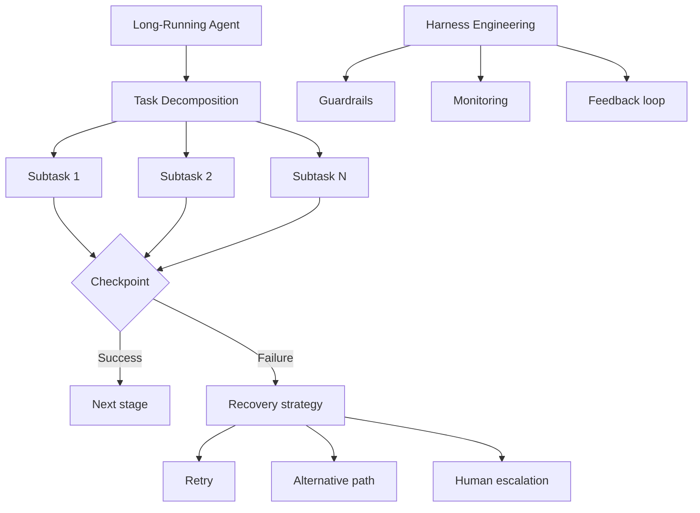

## Overview

I analyzed two YouTube videos on AI agent architecture and quality management. The first covers Anthropic's long-running agent blueprint — a design guide for agents that autonomously execute complex tasks spanning hours or even days. The second covers harness engineering — a methodology for systematically managing agent quality. Related posts: [The Rise of Sub-Agents](/posts/2026-03-20-subagent-era/), [HarnessKit Dev Log #3](/posts/2026-03-25-harnesskit-dev3/)

<!--more-->

---

## Anthropic's Long-Running Agent Blueprint

The video [Anthropic Just Dropped the New Blueprint for Long-Running AI Agents](https://www.youtube.com/watch?v=9d5bzxVsocw) takes a deep look at the long-running agent design guide Anthropic published.

### One-Shot vs. Long-Running

Most AI agents today are one-shot — receive a question, give an answer, done. But real-world work looks like "refactor this entire codebase" or "build this data pipeline" — **multi-hour or multi-day compound tasks**.

Long-running agents must handle these autonomously and be able to recover when they fail or lose direction mid-task. Anthropic's blueprint provides the design principles to make this happen.

### Core Design Principles

**1. Task Decomposition**

Break complex tasks into independent subtasks. Each subtask should:
- Have clearly defined inputs and outputs
- Be independently executable and verifiable
- Fail without cascading to other subtasks

**2. Checkpoints and State Management**

In long-running execution, losing intermediate results is the biggest risk. Saving a checkpoint on each subtask completion enables:
- Resuming from the last checkpoint on failure
- Preserving critical state when compressing the context window
- Providing human review points

**3. Failure Recovery Strategy**

Three-level recovery:
1. **Retry** — Automatic retry for transient errors (API timeouts, etc.)
2. **Alternative path** — Achieve the same goal via a different method (similar to Deterministic Fallback)
3. **Human escalation** — Defer to a human when the agent can't resolve the issue itself

**4. Progress Reporting and Transparency**

During long-running tasks, users need to know "what's happening right now." Provide periodic progress updates, current stage indication, and estimated completion time.

### Real-World Application

Claude Code itself is an implementation of this blueprint. During large-scale refactoring or feature work:
- Tasks decompose into subtasks (Plan mode)
- Each file modification is a checkpoint (git commit)
- Failures are recoverable via rewind
- Progress is reported to the user

---

## Harness Engineering — Quality Management for Agents

The video [Harness Engineering in Practice](https://www.youtube.com/watch?v=kSlYNeEkdAM) explains the harness engineering methodology for systematically managing AI agent quality from a practitioner's perspective.

### What Is a Harness?

A harness originally refers to the gear used to control and direct a horse's strength. By analogy, a harness for AI agents is a system that controls agent output and guarantees quality. The stronger the agent, the more robust the harness needs to be.

### The 3 Components of a Harness

**1. Guardrails**

Define what the agent must not do:
- Protected directories — no deletions allowed
- Conditions for automatic commits
- External API call limits
- Cost caps

**2. Monitoring**

Track agent behavior in real time:
- Tool call patterns
- Error rates
- Token usage
- Task completion rates

**3. Feedback Loop**

Evaluate agent output and improve it:
- Collect automated test results
- Incorporate user feedback
- Learn from failure patterns
- Auto-adjust settings

### The Management Perspective

The video addresses more than technical implementation — it covers the management angle too. Managing a team of agents has parallels with managing a human team:
- Clear role and responsibility definitions
- Regular performance reviews (evals)
- Escalation paths when problems occur
- Continuous training (prompt refinement)

---

## Where the Two Approaches Intersect

The long-running agent blueprint and harness engineering look at the same problem from different angles:

| Perspective | Long-Running Agent | Harness Engineering |
|-------------|-------------------|---------------------|
| Focus | Internal agent design | External agent control |
| Goal | Autonomous task completion | Quality assurance |
| Failure response | Self-recovery strategy | Guardrails + escalation |
| Improvement method | Checkpoint-based | Feedback loop-based |

Combine them and you get: the agent internally equipped with checkpoints and recovery strategies, while the harness externally enforces quality through guardrails and monitoring — a **two-layer safety structure**.

The HarnessKit project sits precisely at this intersection — it implements an external harness for Claude Code agents as a plugin, automating guardrails and monitoring.

---

## Insight

As AI agents evolve from one-shot to long-running, "trustworthy agents" are becoming more important than "smart agents." Anthropic's blueprint builds that trustworthiness from the inside through internal design; harness engineering builds it from the outside through external control. The two-layer safety structure combining both approaches looks set to become the standard for production agents. This perspective also connects to the [AI App Production Design Patterns](/posts/2026-03-25-ai-app-production-patterns/) post — Deterministic Fallback, HITL — it all comes back to the same core idea: **design for failure from the start**.
