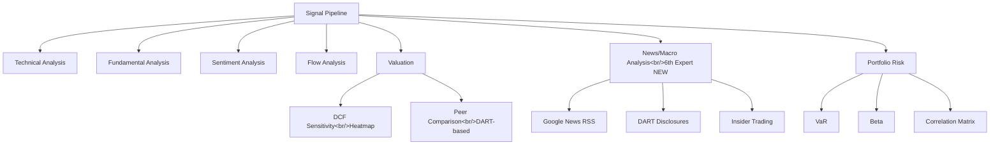

## Overview

[Previous: #6](/posts/2026-03-25-trading-agent-dev6/)

In #7, the trading agent's analytical capabilities were significantly expanded across 34 commits. Work included: DCF valuation with sensitivity heatmap, portfolio risk analysis (VaR, beta, sector concentration), adding the 6th expert (news/macro analyst) to the signal pipeline, DART disclosure integration, and investment memo export.

<!--more-->

---

## DCF Valuation and Sensitivity Analysis

### Background

The existing signal pipeline had no quantitative valuation model. DCF (Discounted Cash Flow) is essential for estimating fair value, and showing sensitivity across scenarios — rather than a single point estimate — is what makes it useful for investment decisions.

### Implementation

A DCF valuation service was implemented and a sensitivity heatmap table showing outcomes across WACC and growth rate combinations was added to `ValuationView`. The frontend visualizes this as a heatmap, making it immediately clear under which assumptions the current price looks undervalued or overvalued.

Peer comparison was also added — pulling valuation data for same-sector companies from DART so relative positioning can be assessed.

Unit tests were added to verify the core logic of the DCF valuation and portfolio risk services.

---

## Portfolio Risk Analysis

### VaR, Beta, and Sector Concentration

Portfolio-level risk analysis was implemented:

- **VaR (Value at Risk)**: Maximum expected loss at a given confidence interval
- **Beta**: Calculated from actual portfolio data
- **Sector concentration**: Detects overexposure to any one sector
- **Correlation matrix heatmap**: Visualizes pairwise correlation across holdings

KOSPI200 constituent sector data was collected from NAVER Finance for sector classification.

---

## Signal Pipeline Expansion

### The 6th Expert: News/Macro Analyst

A news/macro analyst was added alongside the existing five experts (technical, fundamental, sentiment, flow, and valuation). This expert analyzes macroeconomic news and stock-specific events and incorporates them into the signal.

**Google News RSS fallback** — To improve news collection reliability, Google News RSS was added as a fallback. When the primary news source is unstable, it switches automatically.

### DART Integration

- **Catalyst Calendar**: DART disclosure schedule displayed as a timeline UI for a quick view of upcoming material events
- **Insider Trading**: DART insider trading data integrated into the signal pipeline
- **Foreign/institutional investor flows**: Foreign and institutional buying/selling data added to the flow analysis expert

### DB Schema Expansion

8 new tables, the ANALYST role, and metadata initialization were added — all data models for the new features defined in a single pass.

---

## Signal History and Comparison

Signal history snapshots and timeline comparison were added. Past signals can now be compared against the current signal to track how views have changed over time — useful for post-hoc evaluation of signal consistency and predictive power.

---

## Frontend UI Improvements

- **SignalCard expansion**: Expert opinion expansion display, `risk_notes` rendering, compact/expanded view toggle
- **SignalDetailModal**: Drilldown into related order history
- **ReportViewer**: Trade PnL column and `rr_score` color coding added
- **ScheduleManager**: Cron editing and run-now button; agent names and friendly task labels displayed
- **DashboardView**: `report.generated` event handling, performance endpoint with period selector

---

## Investment Memo Export

A feature was added to export investment memos in HTML and DOCX formats based on signal data. Word documents are generated using `python-docx`.

---

## Server Stability

MCP (Model Context Protocol) connection stability was improved:
- Fixed missing `await` on async MCP context methods
- Added auto-reconnect logic on connection failure

Server logs were monitored periodically. `websockets` library deprecated API warnings and other runtime errors were classified, and only codebase-level issues were selected for fixing.

---

## Configuration Expansion

- `initial_capital` and `min_rr_score` added to settings and the risk-config API
- New components aligned with the existing design system
- Vite ESM resolution error fixed (using `import type`)
- Lint errors (unused vars) cleaned up

---

## Commit Log

| Message | Scope |
|---------|-------|
| feat: show agent name and friendly task labels in ScheduleManager | frontend |
| style: align new components with existing design system | frontend |
| fix: use import type for ScheduledTask to fix Vite ESM resolution | frontend |
| feat: add Google News RSS fallback for news collection stability | backend |
| feat: add compact/expanded view toggle to SignalCard | frontend |
| feat: add DOCX investment memo export with python-docx | backend |
| feat: add real portfolio beta calculation and correlation matrix heatmap | backend + frontend |
| feat: add DCF sensitivity heatmap table to ValuationView | frontend |
| test: add unit tests for DCF valuation and portfolio risk services | test |
| feat: populate kospi200_components sector data from NAVER Finance | backend |
| fix: await async MCP context methods and add auto-reconnect on failure | backend |
| fix: replace explicit any types with proper interfaces in SignalCard | frontend |
| feat: add investment memo HTML export from signal data | backend |
| feat: add VaR, beta, sector concentration risk analysis | backend |
| feat: add DCF valuation with sensitivity table | backend |
| feat: add signal history snapshots and timeline comparison | full-stack |
| feat: add peer comparison with sector-based DART valuation | backend |
| feat: add news/macro analyst as 6th expert in signal pipeline | backend |
| feat: add catalyst calendar with DART disclosures and timeline UI | full-stack |
| feat: add DART insider trading data to signal pipeline | backend |
| feat: add foreign/institutional investor trend to signal pipeline | backend |
| feat: add 8 new DB tables, ANALYST role, and metadata init | backend |
| fix: resolve lint errors (unused vars) in DashboardView and SignalCard | frontend |
| feat: add report.generated event handling in DashboardView | frontend |
| feat: add initial_capital and min_rr_score to settings and risk-config API | full-stack |
| feat: add ScheduleManager with cron editing and run-now button | frontend |
| feat: add trade PnL column and rr_score color coding to ReportViewer | frontend |
| feat: add SignalDetailModal with related orders drilldown | frontend |
| feat: add expert opinion expansion and risk_notes display to SignalCard | frontend |
| feat: use correct performance endpoint with period selector and metrics | frontend |

---

## Insight

34 commits is the highest count in the series so far. The trading agent is evolving from a simple signal generator into a comprehensive analysis platform covering portfolio risk management, valuation analysis, and disclosure monitoring. The addition of the 6th expert (news/macro) and the DART integration are particularly significant — they actively leverage Korea-specific data sources. The DCF sensitivity heatmap and portfolio correlation matrix are good examples of conveying complex data intuitively through visualization. On the stability front, the MCP auto-reconnect and periodic log monitoring pattern is now established — a meaningful step toward production-grade reliability.
