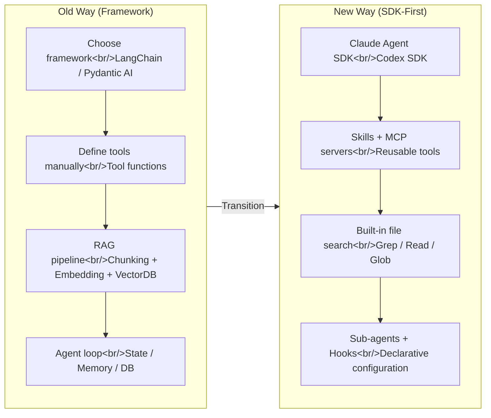

Through 2024 and 2025, building an AI agent meant making choices from scratch: which framework to use, how to set up the RAG pipeline, how to manage state. In 2026, "batteries-included" SDKs like the Claude Agent SDK and Codex SDK have arrived and shifted the starting point entirely. This post analyzes the Old vs New paradigm shift in agent architecture and how RAG's role is changing. Related posts: [Excalidraw Diagram Skill](/posts/2026-04-01-excalidraw-skill/), [NotebookLM Practical Guide](/posts/2026-04-01-notebooklm-guide/)

<!--more-->

## 1. Old vs New: The Paradigm Shift in Agent Architecture

### The Old Way (2024–2025)

Traditional agent development followed this flow:

1. **Choose a framework** — Pick one from LangChain, LangGraph, Pydantic AI, N8N, etc.
2. **Define tools** — Implement agent capabilities (filesystem access, email retrieval, etc.) from scratch
3. **Set up RAG** — Design chunking, embedding, and retrieval strategies; wire up a vector DB
4. **Build the agent loop** — Hand-wire state management, conversation history storage, and a memory system

The core problem with this approach: **too much glue code**. DB table design, session management, ingestion pipelines — infrastructure code unrelated to the agent's actual intelligence occupied a significant portion of the codebase.

### The New Way: SDK-First

Building on the Claude Agent SDK or Codex SDK changes everything:

- **Conversation history management** is built into the SDK — no separate DB needed
- **File search tools** (Grep, Read, etc.) are already included — no RAG needed for small knowledge bases
- **Skills** and **MCP servers** let you add tools in a reusable form
- **Sub-agents**, **Hooks**, and **permission settings** are all declared in a single TypeScript/Python file

In practice, the Claude Agent SDK lets you implement **more features with less code**. Systems like Second Brain — memory building, daily reflection, integrated management — all run on top of one SDK.

### Architecture Comparison

### When Do You Still Need a Framework?

SDK-First isn't a universal answer. Three clear limitations remain:

| Criterion | SDK (Claude Agent SDK, etc.) | Framework (Pydantic AI, etc.) |
|-----------|------------------------------|-------------------------------|
| **Speed** | Inference overhead makes it slow (10s+) | Sub-second response possible |
| **Cost** | Heavy token use; API costs explode with many users | Direct control enables cost optimization |
| **Control** | Limited visibility into conversation history and observability | Full control over everything |

**Two questions to guide the decision:**

1. **Who's using it?** — If it's just you, SDK. If it's many users in production, framework.
2. **What are the speed/scale requirements?** — If latency is acceptable, SDK. If fast response is essential, framework.

In practice, the most realistic pattern is **prototyping with an SDK**, then **porting proven workflows to a framework**. Skills and MCP servers are reusable on both sides, so migration cost is low.

### Is RAG Dead?

The short answer: **no** — but its role has changed.

- **Small code/doc bases**: File search (Grep) has been shown to outperform semantic search (LlamaIndex research)
- **Large knowledge bases**: Vector DB-based RAG is still necessary — searching thousands of documents with Grep isn't realistic
- **Where Skills replace RAG**: For code context tasks, `skill.md` replaces chunking + embedding. The agent loads a skill when needed — that's enough

The key isn't "RAG or not" — it's **choosing the search strategy that fits the scale and access pattern of your knowledge**.

## Insight

**The essence of agent development is changing.** The question has shifted from "which framework should I use?" to "what Skills should I give my agent?" As SDKs abstract away the infrastructure, developers can spend their time on **designing the agent's capabilities** instead of glue code.

1. **Declarative tool composition wins** — Skills and MCP servers both work by declaring "here's what I can do." We're moving away from procedurally coding agent loops.
2. **SDK for prototyping, framework for production** — This pattern is the most realistic approach. Since Skills and MCP are reusable on both sides, migration cost stays low.
3. **RAG isn't disappearing — it's democratizing** — Developers replace RAG with file search and Skills; non-developers get the same effect without code using [NotebookLM](/posts/2026-04-01-notebooklm-guide/).

Practical applications of this topic are covered in separate posts:
- [Excalidraw Diagram Skill — Visual Reasoning for Coding Agents](/posts/2026-04-01-excalidraw-skill/)
- [12 Ways to Use NotebookLM in Practice](/posts/2026-04-01-notebooklm-guide/)

---

**Reference video:**
- [Everything You Thought About Building AI Agents is Wrong](https://www.youtube.com/watch?v=gmaHRwijOXs) — Cole Medin
