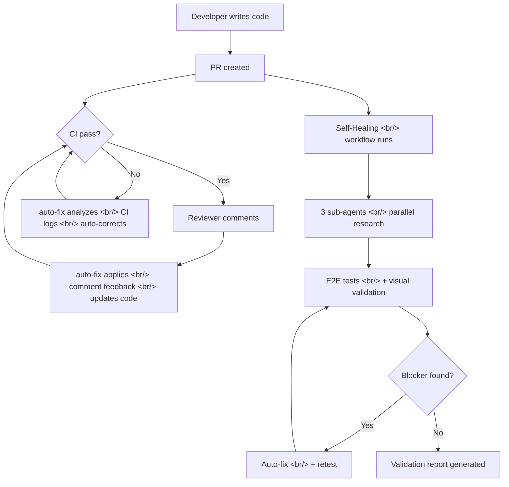

## Overview

This is the fourth post in the [Claude Code Practical Guide](https://ice-ice-bear.github.io/categories/tech-log/) series. Previous entries covered context management and workflows ([Part 1](https://ice-ice-bear.github.io/p/claude-code-실전-가이드-컨텍스트-관리부터-워크플로우까지/)), new features from the last two months ([Part 2](https://ice-ice-bear.github.io/p/claude-code-실전-가이드-2-최근-2개월-신기능-완전-정복/)), and 27 tips from 500 hours of use ([Part 3](https://ice-ice-bear.github.io/p/claude-code-실전-가이드-3-500시간-사용자의-27가지-팁/)).

This edition covers two core topics. First, **Claude Code auto-fix** — Anthropic's officially released feature that automates PR creation, CI failure resolution, and reviewer comment incorporation. Second, **Cole Medin's Self-Healing AI Coding Workflow** — a process where the coding agent visually validates its own work and self-corrects bugs.

<!--more-->

## Workflow Overview

The diagram below shows how auto-fix and the Self-Healing workflow connect within the development cycle.



## 1. Claude Code auto-fix: Remote Automated Corrections

### Automated PR Tracking and CI Failure Resolution

Claude Code auto-fix automatically tracks Pull Requests from a web or mobile environment, detects CI failures, and resolves them on its own. The key is that **everything happens remotely**. A developer can open a PR, step away, and come back to find the CI passing.

Here's how it works: auto-fix fetches GitHub Actions logs and precisely diagnoses the failure — distinguishing build errors from lint errors, and code issues from infrastructure issues. For common infrastructure errors like PHP memory exhaustion, it has pre-built resolution templates to avoid unnecessary code changes.

### Three Ways to Use It

There are three concrete ways to use auto-fix:

1. **Web version**: In the Claude Code web interface, select `auto-fix` from the CI menu of a generated PR
2. **Mobile**: Directly instruct the AI agent to auto-fix (a quick-launch button for mobile is coming)
3. **Paste a PR link**: Copy any PR link you want monitored and ask the agent to auto-fix it

To get started, the **Claude GitHub App** must be installed, and auto-fix must be enabled in the repository settings.

### Security System

Autonomous code modification requires strong security. auto-fix uses an independent **safety classifier** based on Claude Sonnet 4.6. What makes it distinctive: the classifier inspects the *request* without looking at the AI's internal reasoning. This means even if prompt injection bypasses the internal logic, the actual actions being executed are separately verified. Actions exceeding granted permissions and sensitive data exfiltration are blocked at the source.

```yaml
# .github/settings.yml example — enabling auto-fix
claude_code:
  auto_fix:
    enabled: true
    on_ci_failure: true        # Auto-fix on CI failure
    on_review_comment: true    # Apply review comments
    allowed_branches:
      - "feature/*"
      - "fix/*"
```

## 2. Self-Healing Workflow: Agents That Validate Their Own Work

### Cole Medin's Approach

In "This One Command Makes Coding Agents Find All Their Mistakes," Cole Medin pinpoints the core problem precisely: **coding agents generate code quickly, but they're terrible at validating their own work.** Without a framework provided by the developer, they either rush through validation or skip it entirely.

This workflow is packaged as a Claude Code skill (slash command). One `/e2e-test` command kicks off a 6-phase process. It works immediately on almost any codebase with a frontend.

### The 6-Phase Validation Process

**Phase 0 — Pre-check**: Verifies Vercel Agent Browser CLI is installed, checks OS environment (Windows requires WSL), etc.

**Phase 1 — Research**: Three sub-agents run **in parallel**:
- Map codebase structure + identify user journeys
- Analyze database schema
- Code review (hunt for logic errors)

**Phase 2 — Test Planning**: Define a task list based on research results. Each task is one user journey.

**Phase 3 — E2E Test Loop**: Execute each user journey in sequence, navigating pages with Agent Browser CLI and verifying backend state with DB queries.

```bash
# Vercel Agent Browser CLI usage examples
npx @anthropic-ai/agent-browser snapshot   # Capture current page state
npx @anthropic-ai/agent-browser click "Sign In"
npx @anthropic-ai/agent-browser screenshot ./screenshots/login.png
```

**Phase 4 — Self-correction**: Only blocker issues are automatically fixed and retested. The important design philosophy: **don't fix everything**. Fix only the major blockers so testing can continue; leave the rest in the report for the developer to evaluate.

**Phase 5 — Report**: Output results in a structured format — what was fixed, remaining issues, all test paths. Reviewing with screenshots lets you quickly see what paths the agent actually tested.

### The Power of Visual Validation

The most impressive part of this workflow is **screenshot-based visual validation**. The agent takes screenshots at each step and uses the AI's image analysis capability to determine whether the UI looks correct. This goes beyond "pass if no errors" — it verifies that the actual screen users see is rendering as intended.

Responsive validation is also included: a lightweight check that pages render properly on mobile, tablet, and desktop viewports. This is the kind of "look and judge" validation that's hard to implement with traditional E2E frameworks like Cypress or Playwright — and AI does it instead.

### Practical Usage Tips

The workflow can be used in two ways:

1. **Standalone**: Run a full E2E test suite at any point in time
2. **Integrated into the feature implementation pipeline**: Automatically run regression testing right after the agent implements a feature

Since this expands the context window significantly, it's recommended to **pass the report to a new session** for follow-up work after testing completes.

## Insight

**auto-fix and Self-Healing point in the same direction.** In an era where code generation speed far outpaces verification speed, automating the verification itself is the core challenge. auto-fix layers AI on top of existing CI/review infrastructure; Self-Healing extends verification to the user's perspective via browser automation.

Using both together in practice is powerful. Run the Self-Healing workflow locally to validate before pushing, then let auto-fix handle CI failures and review comments after the PR is up. The developer just reviews the final report and screenshots.

One important caveat: **the developer remains responsible for AI-generated code.** As Cole Medin himself emphasized, this workflow isn't about "vibe coding" — it's about reducing the burden of verification. Auto-correction isn't a silver bullet, and final judgment stays with the human.

## Quick Links

| Topic | Link |
|-------|------|
| Claude Code auto-fix video | [Nova AI Daily - auto-fix launch](https://www.youtube.com/watch?v=6aqUUr4mKsQ) |
| Self-Healing workflow video | [Cole Medin - Find All Mistakes](https://www.youtube.com/watch?v=YeCHI1dmpZY) |
| Claude Code official docs | [docs.anthropic.com](https://docs.anthropic.com/en/docs/claude-code) |
| Vercel Agent Browser CLI | [npmjs.com/@anthropic-ai/agent-browser](https://www.npmjs.com/package/@anthropic-ai/agent-browser) |
| Series Part 1 - Context management | [Claude Code Practical Guide 1](https://ice-ice-bear.github.io/p/claude-code-실전-가이드-컨텍스트-관리부터-워크플로우까지/) |
| Series Part 2 - New features | [Claude Code Practical Guide 2](https://ice-ice-bear.github.io/p/claude-code-실전-가이드-2-최근-2개월-신기능-완전-정복/) |
| Series Part 3 - 27 tips | [Claude Code Practical Guide 3](https://ice-ice-bear.github.io/p/claude-code-실전-가이드-3-500시간-사용자의-27가지-팁/) |
