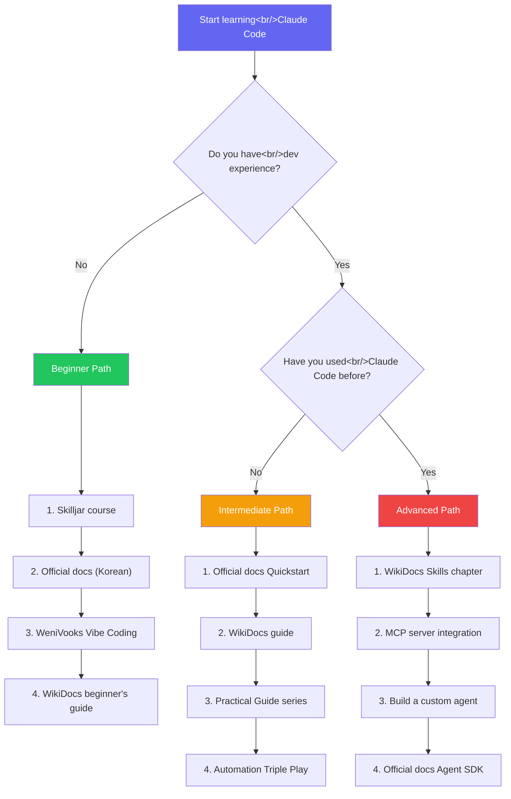

## Overview

Claude Code adoption is growing quickly, but learning resources are concentrated in English official documentation, creating a barrier for Korean-speaking users. Recently, Korean resources like the WikiDocs community guide and WeniVooks' Vibe Coding Essential have emerged, changing the picture.

This post compares and analyzes the four available Claude Code learning resources and maps out recommended learning paths by experience level. If you've already read the [Claude Code Practical Guide series #1–#5](/tags/claude-code/) and the [Claude Code Automation Triple Play](/posts/2026-03-06-claude-code-harness/) post, this roadmap will help you fill the remaining gaps.

<!--more-->

## 1. Official Documentation — code.claude.com/docs

The first place to check is [Anthropic's official documentation](https://code.claude.com/docs/ko/overview). The flow: Overview to understand what Claude Code is, Quickstart for your first hands-on session, then the Reference docs to dig into specific features.

### What's Covered

- **Overview**: What Claude Code is, what it can do, installation guides by environment
- **Quickstart**: Your first real task — from exploring a codebase to committing a change
- **Core Concepts**: How it works, Context Window, permission modes
- **Workflows and Best Practices**: CLAUDE.md setup, common patterns
- **Platforms and Integrations**: VS Code, JetBrains, Slack, GitHub Actions, etc.

### Korean Version

The official documentation has a Korean version at `/docs/ko/`. Translation quality is solid and it's updated nearly in sync with the English original. If English feels like a barrier, starting with the Korean docs is perfectly reasonable.

### Pros and Cons

| Pros | Cons |
|------|------|
| Always up to date | Lacks real-world examples |
| Managed by Anthropic directly — most accurate | Feature-list heavy; doesn't explain "why" |
| Korean version available | Information overload for beginners |
| Free | No community discussion or Q&A |

> **Best for**: Your first stop when a new feature drops. Less useful for learning from scratch — more useful for existing users asking "how exactly does this work?"

## 2. Anthropic Skilljar — Claude Code in Action

[Claude Code in Action](https://anthropic.skilljar.com/claude-code-in-action) is a free online course Anthropic offers on the Skilljar platform. It starts from the fundamental question — "What is a coding assistant?" — and progresses step by step through live demos.

### Course Highlights

- **Free**: All content available with just an account
- **Structured**: Concept → demo → hands-on, in that order
- **Official curriculum**: Designed directly by Anthropic
- **Progress tracking**: Skilljar LMS tracks your completion

### Pros and Cons

| Pros | Cons |
|------|------|
| Free, official training material | English only |
| Structured curriculum | Stays at an introductory level |
| Interactive learning experience | Doesn't cover advanced topics (Skills, MCP) |
| Certificate available | Updates slower than the docs |

> **Best for**: Someone encountering Claude Code for the first time who needs to understand "what this is and why it matters." If you're comfortable with English, take this course before diving into the docs.

## 3. WikiDocs Claude Code Guide

The [WikiDocs Claude Code Guide](https://wikidocs.net/book/19104) is a practice-oriented guide created by the Korean community. It includes practical chapters on Skills development and MCP server integration that the official docs don't cover in depth — making it especially valuable for intermediate and advanced users.

### Key Topics

- Claude Code installation and initial configuration
- **Skills development**: Writing, testing, and deploying custom skills
- **MCP server integration**: Connecting external tools
- CLAUDE.md strategies for different project types
- Real-world troubleshooting cases

### Companion Beginner's Guide

WikiDocs also has a [Claude Code Beginner's Guide](https://wikidocs.net/book/19202). Complete beginners should start with the beginner's guide (19202) before moving to the main guide (19104).

### Pros and Cons

| Pros | Cons |
|------|------|
| Korean — no language barrier | Community-written, accuracy varies |
| Practice and real-world focused | May update slower than official docs |
| Covers advanced topics like Skills and MCP | Structure is looser than the official course |
| Free, open access | Writing depth varies by contributor |

> **Best for**: After learning the basics and wanting to go deeper into Skills or MCP integration in Korean. A natural next step after the Practical Guide series.

## 4. Vibe Coding Essential with Claude Code (WeniVooks)

[WeniVooks](https://www.books.weniv.co.kr/essentials-vibecoding) offers a Claude Code guide **aimed at non-developers**. True to its "vibe coding" branding, the goal is for people with zero coding experience to build something with Claude Code.

### Chapter Structure

| Chapter | Content | Audience |
|---------|---------|---------|
| Ch 0 | WeniVooks service intro | All |
| Ch 1–2 | Claude Code installation, basic usage | Beginners |
| Ch 3–4 | Hands-on projects (website, automation) | Beginner–Intermediate |
| Ch 5 | Advanced usage (extensions, customization) | Intermediate |

### Pros and Cons

| Pros | Cons |
|------|------|
| Korean, non-developer friendly | Some content may be paid |
| Progressive structure: basics → hands-on → advanced | May be too shallow for experienced developers |
| Project-based learning | Limited advanced topics (MCP, Skills) |
| WeniVooks community support | Update cadence uncertain |

> **Best for**: Someone with no development background who wants to build something with Claude Code. Ideal for PMs, designers, and planners entering AI coding tools.

## Comprehensive Comparison

| | Official Docs | Skilljar | WikiDocs | WeniVooks |
|-|--------------|---------|---------|----------|
| **Language** | English + Korean | English | Korean | Korean |
| **Cost** | Free | Free | Free | Free / partly paid |
| **Audience** | All levels | Beginners | Intermediate–Advanced | Non-dev / Beginner |
| **Strength** | Accuracy, currency | Structured education | Real-world, advanced topics | Non-developer friendly |
| **Weakness** | Lacks real examples | Stays basic | Accuracy varies | Limited depth |
| **Covers Skills** | Yes (Reference) | No | Yes (practical) | Limited |
| **Covers MCP** | Yes (Reference) | No | Yes (practical) | Limited |
| **Format** | Web docs | Online course | Wiki | eBook |

## Recommended Learning Paths

Here's how to sequence your learning based on experience level.

### Beginner (Non-developer / Coding novice)

1. **Skilljar** — Understand "what is a coding assistant" from the ground up
2. **Official docs (Korean)** — Installation and core concepts
3. **WeniVooks Vibe Coding** — Build something real with project-based learning
4. **WikiDocs Beginner's Guide** — Additional practice and community Q&A

### Intermediate (Has dev experience, new to Claude Code)

1. **Official docs Quickstart** — Install quickly and complete the first task
2. **WikiDocs Guide** — Real-world techniques and CLAUDE.md strategies
3. **Practical Guide series** — Context management, workflow patterns
4. **Automation Triple Play** — Skills, scheduling, and Dispatch

### Advanced (Already using Claude Code, wants to go deeper)

1. **WikiDocs Skills chapter** — Custom skill development in practice
2. **MCP server integration** — External tool connectivity
3. **Custom agent development** — Agent SDK usage
4. **Official docs Reference** — Detailed API reference

## Insight

Looking at the Claude Code learning ecosystem, a few interesting things stand out.

**Korean resources are growing fast.** A few months ago, English official docs were the only option. Now there's the WikiDocs guide, WeniVooks, and the official docs' Korean translation. This reflects rapid Claude Code adoption in Korea.

**"Official docs = best" doesn't always hold.** Official docs are accurate and current, but they don't explain "why you'd want this" or "how to combine things in practice." Community guides like WikiDocs fill that gap. The ideal approach is to use both in parallel.

**The non-developer market is opening up.** WeniVooks' "Vibe Coding Essential" directly targets non-developers. It's a signal that Claude Code is being positioned not just as a dev tool but as "a tool that lets anyone code." The era of PMs building their own prototypes and marketers writing data analysis scripts is coming.

**Account for the lifecycle of learning materials.** AI tools change fast. A guide that's accurate today may be outdated in a month. Official docs always stay current, but community guides and eBooks may not. Make it a habit to always ask yourself: "Does this apply to the current version?"

---

**Related posts:**
- [Claude Code Practical Guide series](/tags/claude-code/) — Context management to workflows
- [Claude Code Automation Triple Play — Skills, Scheduling, and Dispatch](/posts/2026-03-06-claude-code-harness/) — Skills and automation deep dive
