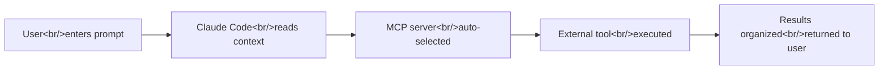
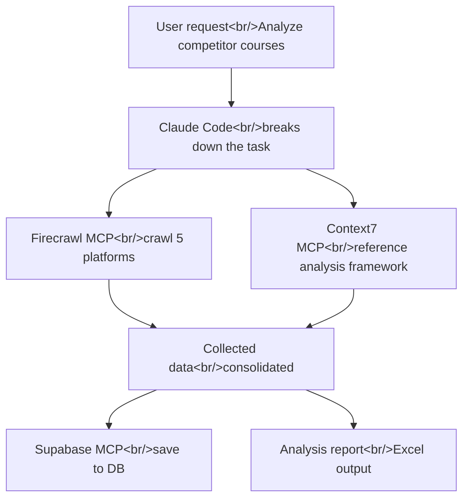
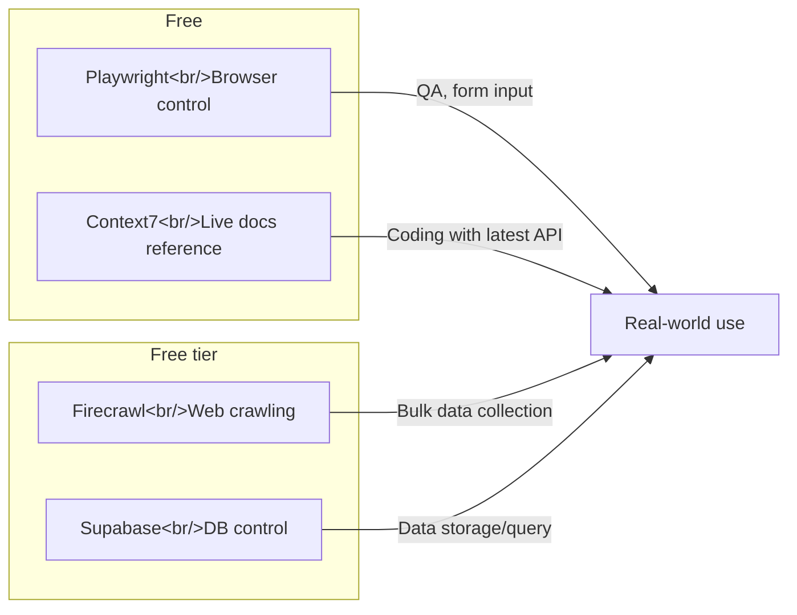

Claude Code is powerful on its own, but connecting MCP servers unlocks browser control, web crawling, live documentation lookups, and database manipulation. This post covers four MCP servers you can put to use in real work immediately — including installation and ready-to-use prompts. Reference: [AI Usability Research Lab](https://www.youtube.com/@Theuxlabs) video "[4 MCP Servers That Claude Code Power Users Already Use | EP.02](https://www.youtube.com/watch?v=Pbtp17aZ7k4)."

<!--more-->

## What Is MCP — The Smartphone Analogy

The easiest way to understand MCP (Model Context Protocol) is the **smartphone analogy**.

Think back to when you first got a smartphone. The hardware was great, but before installing apps, all it could do was make calls and send texts — no messaging apps, no maps, no video. **Installing apps is what makes a smartphone actually "smart."**

Claude Code works the same way.

| Analogy | Reality |
|---------|---------|
| Smartphone | Claude Code |
| Installing apps from the app store | Connecting MCP servers |
| USB-C cable (standard connector) | MCP (standard protocol) |
| Apps send notifications automatically | Claude auto-selects the right MCP from context |

MCP is **the standard protocol that connects external tools to Claude Code**. Like a USB-C cable, one protocol lets you connect hundreds of different tools.

### How It Works



The key is that **users don't need to explicitly call MCP**. Just as a messaging app auto-notifies you when a message arrives after you install it, once MCP is installed, Claude figures out "this task needs a browser" and uses Playwright on its own.

> That said, if you want to **force** a specific MCP, stating it explicitly in the prompt is more reliable.

### Restart Required After MCP Installation

After installing any MCP, you must **restart Claude Code**. Run `/exit`, then launch `claude` again.

---

## 1. Playwright MCP — Hands and Feet for Controlling the Browser

### What It Does

Playwright MCP enables Claude to **open a browser, click, and type directly**. Visiting sites, clicking buttons, filling forms, taking screenshots — everything you normally do in a browser, Claude can do for you.

### Installation

Install via natural language inside Claude Code:

```
Install the Playwright MCP
```

Or directly from the terminal:

```bash
claude mcp add playwright -- npx @anthropic-ai/mcp-playwright
```

### Use Cases

- **QA testing**: Claude opens your website in a real browser and tests it
- **Data collection**: Search for restaurants on a map and organize results in a spreadsheet
- **API key setup assistance**: Opens a service's website and guides you through getting an API key
- **Visual validation**: Takes screenshots and judges whether the layout looks correct

### Real-World Prompts

```
Using the Playwright MCP, search "Gangnam station restaurants" on Naver Maps
and organize the top 10 highest-rated places into a Google Sheet.
Fields: name, rating, number of reviews, address
```

```
Open my website at http://localhost:3000 using Playwright
and QA test that all page links work correctly.
If any links are broken, list them.
```

> Playwright navigates one page at a time with full interaction support — it's best suited for **precise interactions**, not bulk crawling.

---

## 2. Firecrawl MCP — The Ultimate Tool for Large-Scale Web Crawling

### What It Does

While Playwright clicks through pages one by one, Firecrawl **crawls an entire website at once**. It converts scraped content into clean structured formats like Markdown or JSON, and includes built-in AI-powered analysis.

### Installation

Firecrawl requires an API key. The free tier gives you roughly 2,000 crawls.

```bash
# Get an API key: sign up at https://firecrawl.dev
claude mcp add firecrawl -- npx firecrawl-mcp --api-key YOUR_API_KEY
```

Or inside Claude Code:

```
Install the Firecrawl MCP
```

If getting the API key is tricky, you can delegate the task to Playwright MCP:

```
Use Playwright to go to firecrawl.dev and walk me through getting an API key.
Go ahead and handle it yourself.
```

### Playwright vs. Firecrawl

| | Playwright | Firecrawl |
|-|-----------|-----------|
| Approach | Direct page-by-page control | Bulk crawl of entire sites |
| Speed | Slow (includes interaction) | Fast (optimized for volume) |
| Output | Screenshots, DOM access | Markdown, JSON, CSV |
| Best for | QA testing, form input | Data collection, competitive analysis |
| Cost | Free | Free tier (2,000 crawls) |

### Real-World Prompts

```
Use the Firecrawl MCP to collect the 10 most recent articles from the toss.tech blog.
Fields: title, author, category, summary, URL
Sort by newest first and output as a CSV file.
```

```
Crawl the Musinsa ranking page (https://www.musinsa.com/ranking)
for ranks 1 through 50.
Fields: rank, brand, product name, discount rate, sale price, product URL
Organize into an Excel file and include image URLs.
```

A deeper analysis of Firecrawl is covered in a separate post: [Firecrawl — The Definitive Web Scraping Tool for the AI Era](/posts/2026-04-01-firecrawl-web-scraping/).

---

## 3. Context7 MCP — Real-Time Access to the Latest Official Documentation

### What It Does

Sometimes when you ask AI to write code, it invents functions that don't exist. That's because AI training data has **an expiration date**. For example, Claude might write Next.js 13 syntax when you're on version 15.

Context7 MCP **solves this problem at the root**. When you enter a prompt, it fetches the **current live official documentation** for the relevant library and shows it to Claude — making Claude write code based on **actual documentation**, not stale training data.

### Installation

Free, no API key required.

```bash
claude mcp add context7 -- npx @context7/mcp
```

Or:

```
Install the Context7 MCP
```

### Real-World Prompts

```
Create a server component for a blog list page using Next.js App Router.
use context7
```

```
Write code to connect to PostgreSQL with Prisma ORM.
use context7 with the latest docs
```

```
Implement dark mode using Tailwind CSS v4's new configuration approach.
use context7
```

> Add "use Context7 MCP and reference the latest docs" to your `CLAUDE.md` and you won't need to specify it every time — Claude will automatically consult live documentation.

---

## 4. Supabase MCP — Control Your Database with Natural Language

### What It Does

Supabase MCP lets Claude **directly manipulate a database**. Table creation, data insertion, query execution, schema changes — even without knowing SQL, you can work with the database in plain language.

### Installation

You'll need your Supabase project connection details.

```bash
claude mcp add supabase -- npx @supabase/mcp-server \
  --supabase-url https://YOUR_PROJECT.supabase.co \
  --supabase-key YOUR_SERVICE_ROLE_KEY
```

Or:

```
Install the Supabase MCP. My project URL is https://xxx.supabase.co
and my service role key is eyJ...
```

### Use Cases

- **Table design**: "Create users, orders, and products tables with relationships."
- **Data migration**: Bulk insert CSV data into a Supabase table
- **RLS policy setup**: Configure Row Level Security in plain language
- **Crawl → save to DB**: Store Firecrawl-collected data directly in the database

### Real-World Prompts

```
Create tables for a blog system in Supabase.
- posts: id, title, content, author_id, created_at, published
- comments: id, post_id, user_id, body, created_at
- users: id, email, display_name, avatar_url
Set up the foreign key relationships and add RLS policies.
```

```
Bulk insert the products.csv I crawled into the Supabase products table.
Skip duplicate product names and only add new entries.
```

---

## The Real Power: Combining MCP Servers

The true value of MCP shows up **when you combine multiple servers**. Connect several MCPs to Claude Code, and Claude automatically selects the right one for each situation.



### Combination Example: Competitor Course Analysis

```
Step 1 — Data collection (Firecrawl):
Crawl the following education platforms for courses related to "Claude Code."
- Inflearn, FastCampus, Class101, Coloso, LearningSpooons
Fields: course title, instructor, price, enrollment count, review count, rating, URL

Step 2 — Analysis:
Based on the collected data, run a step-by-step analysis:
- Strengths/weaknesses comparison
- Price-tier positioning
- Gaps in the market

Final output: Excel file.
```

---

## Recommended MCP Setup Summary



| MCP | Use | Cost | API Key |
|-----|-----|------|---------|
| Playwright | Browser control, QA | Free | Not required |
| Firecrawl | Web crawling, data collection | Free (2,000 crawls) | Required |
| Context7 | Live official docs reference | Free | Not required |
| Supabase | Database manipulation | Free tier | Required |

---

## Insight

**MCP is Claude Code's app ecosystem.** Just as a smartphone without apps is just a phone, Claude Code without MCP is just a text generator. Connect MCP and Claude becomes a **true agent** — controlling browsers, crawling the web, reading current documentation, and manipulating databases.

What's especially impressive is the **low barrier to entry**. "Install the Playwright MCP" is all it takes. And once installed, Claude auto-selects the appropriate MCP from context without you having to invoke it explicitly. Non-developers can do browser automation, web crawling, and database manipulation through natural language alone.

One practical tip: if you want to force a specific MCP, naming it in the prompt is the reliable approach. "Using Playwright," "with Firecrawl," "use context7" — explicitly naming the tool ensures the intended MCP gets invoked.

As more MCPs join the ecosystem — Notion MCP, Figma MCP, Linear MCP, and beyond — Claude Code will evolve from a simple coding tool into a **general-purpose work automation platform**.
