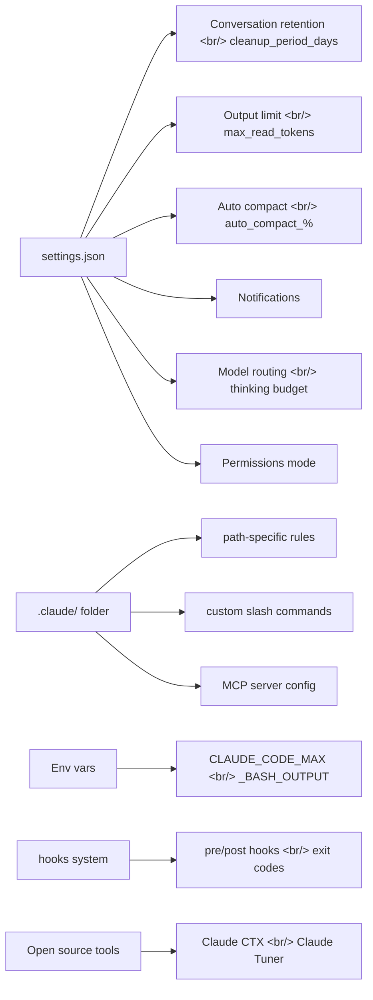

## Overview

This is the fifth post in the Claude Code Practical Guide series.
Previous posts covered: context management (#1, 03/19), recent new features (#2, 03/24), 27 tips from a 500-hour user (#3, 03/30), and auto-fix with self-healing workflows (#4, 04/01).

This post is based on the AI LABS video [12 Hidden Settings To Enable In Your Claude Code Setup](https://www.youtube.com/watch?v=pDoBe4qbFPE). We'll walk through 12 settings buried in `settings.json` and environment variables that most users never touch — but enabling them makes a noticeable difference in both performance and daily experience.

<!--more-->

## Settings Architecture Overview

The diagram below shows which area of Claude Code each of the 12 settings belongs to.



---

## 1. cleanup_period_days — Conversation Retention Period

When using `/insights` or the `--resume` flag, only the last **30 days** of conversations are shown by default. Claude Code deletes older data from the system.

If you want to analyze longer-term insights using Opus 4.6's 1M token context window, you need to change this setting.

**Location**: `~/.claude/settings.json`

```json
{
  "cleanup_period_days": 365
}
```

| Value | Behavior |
|---|---|
| `365` | Retain one year of conversations |
| `90` | Retain three months (recommended middle ground) |
| `0` | Do not retain conversations — insights/resume disabled |

> **Note**: Setting this too high can make the `~/.claude/` folder quite large. Check your available disk space.

---

## 2. Path-Specific Rules

Inside your project's `.claude/` folder, you can create **rule files that load based on path patterns**. When the agent reads or modifies a file, only the rules matching that path pattern are loaded into context.

### Why This Matters

Many people dump all their instructions into a single `CLAUDE.md`. As projects grow, this file becomes unwieldy and Claude starts losing track of which rules apply when. There is no reason to load backend rules while working on frontend code.

### Configuration Example

Separate rules by file type under `.claude/rules/`:

```
.claude/
  rules/
    react-components.md    # matches src/components/**
    api-routes.md          # matches src/api/**
    database.md            # matches prisma/** or drizzle/**
```

Each rule file is injected into context only when working on files under the matching path. This naturally achieves:

- **Separation of concerns** at the instruction level
- **Focus** — the agent only sees rules relevant to the current task
- **Efficient** use of the context window

---

## 3. Output Token Limits and Large File Reading

### Bash Output Limit

When Claude Code reads bash command output, the default cap is **30,000 characters**. Commands that produce large output — test suites, build logs, database migrations — get truncated.

```json
{
  "max_output_chars": 150000
}
```

With a 1M token context window, the 30K limit is a legacy of the 200K era. Raising it to around 150K lets Claude read the full output.

### File Read Token Limit

By default, Claude reads only **25K tokens** from a file. For larger files you can set this higher:

```json
{
  "max_read_file_tokens": 100000
}
```

### Bypassing the 2,000-Line Limit

There is an important gotcha here. No matter how high you set the token limit, Claude reads at most **2,000 lines** at a time and has no idea the rest of the file exists. Anthropic provides no setting to change this limit.

**Workaround**: Add the following instruction to your `CLAUDE.md`:

```markdown
## Large File Reading Rule
Before reading any file, check its line count. For files exceeding 2,000 lines,
use the offset and limit parameters to read the entire file in sections.
```

You can also set up a hook that fires on every `Read` tool invocation to check the line count and force chunked reading when it exceeds 2,000 lines.

---

## 4. CLAUDE_CODE_MAX_BASH_OUTPUT — Dedicated Bash Output Limit

Setting the `CLAUDE_CODE_MAX_BASH_OUTPUT` environment variable gives you separate control over the maximum character count for bash command output.

```bash
# Add to ~/.zshrc or ~/.bashrc
export CLAUDE_CODE_MAX_BASH_OUTPUT=150000
```

This works alongside the `settings.json` configuration and is especially useful in CI/CD pipelines or when dealing with large logs. The default 30K value often shows only the beginning of test results, truncating the actual errors at the end.

```json
// Can also be set in settings.json
{
  "env": {
    "CLAUDE_CODE_MAX_BASH_OUTPUT": "150000"
  }
}
```

---

## 5. Auto-Compact and Context Management

Claude Code automatically runs compact when the context window hits **95%**. But even with a 1M token window, **output quality starts degrading after 70%**.

### Optimal Setting

```json
{
  "auto_compact_percentage_override": 75
}
```

Triggering compact at 75% ensures the agent always has ample headroom. If you wait until 95%, compact fires after quality has already dropped — meaning the code generated in that late window cannot be trusted.

> **Tip**: Unless you specifically need the full 1M context for large codebase analysis, the 70–80% range is recommended.

---

## 6. Notification Settings

When Claude Code runs long tasks, it's easy to miss the completion signal. You can control notification behavior in `settings.json`.

```json
{
  "notifications": {
    "enabled": true,
    "sound": true,
    "on_complete": true
  }
}
```

### Telemetry and Privacy

By default, Claude Code sends usage data to Statsig (usage patterns and latency) and Sentry (error logging). To opt out:

```json
{
  "disable_telemetry": true,
  "disable_error_reporting": true,
  "disable_feedback_display": true
}
```

> **Note**: The CLI flag `--disable-non-essential-traffic` looks similar but also **blocks automatic updates**. Using the three individual settings above is safer.

---

## 7. Model Routing and Thinking Budget

### The effort Parameter

When running sub-agents, the `--effort` flag controls the thinking level. Not every task needs maximum thinking.

```bash
# Low effort for lightweight tasks
claude --agent formatter --effort low

# High effort for complex architectural decisions
claude --agent architect --effort high
```

### Advanced Sub-agent Configuration

Sub-agents can be configured beyond just model and MCP tools:

```json
{
  "agents": {
    "formatter": {
      "model": "claude-sonnet-4-20250514",
      "effort": "low",
      "background": true,
      "skills": ["lint-fix"],
      "hooks": {
        "post_tool_use": "./hooks/format-check.sh"
      }
    },
    "architect": {
      "model": "claude-opus-4-20250514",
      "effort": "high",
      "isolation": true,
      "permitted_agent_names": ["formatter", "tester"]
    }
  }
}
```

| Option | Description |
|---|---|
| `skill` | Inherit a specific skill into the sub-agent |
| `effort` | Control thinking token usage |
| `background` | Whether to run in the background |
| `isolation` | Run in isolation in a separate worktree |
| `permitted_agent_names` | Limit which child agents can be spawned |

### Agent Teams (Experimental)

Unlike sub-agents, members of Agent Teams can **communicate with each other**. A team leader coordinates work while each member operates as an independent Claude session but shares information.

---

## 8. Permissions Mode and Auto-Accept

Claude Code's permission system requires user approval for every file modification, bash execution, and similar action. In trusted projects you can automate this.

```json
{
  "permissions": {
    "allow": [
      "Read",
      "Glob",
      "Grep",
      "Bash(git *)",
      "Bash(npm test)",
      "Bash(npx prettier *)"
    ],
    "deny": [
      "Bash(rm -rf *)",
      "Bash(git push --force *)"
    ]
  }
}
```

### Per-Profile Permission Management — Claude CTX

If you need different permission settings across multiple projects, the open-source tool **Claude CTX** is worth a look:

```bash
# Install (macOS)
brew install claude-ctx

# Check current profile
claude ctx -c

# Switch profiles
claude ctx work        # Switch to work settings
claude ctx personal    # Switch to personal project settings
```

Claude CTX manages per-profile `settings.json` and `CLAUDE.md` files under `~/.claude/profiles/`. It automatically backs up the current state on switch so settings never bleed into each other.

---

## 9. MCP Server Configuration

MCP (Model Context Protocol) servers can be configured directly in `settings.json`. You can also assign different MCP tools to different sub-agents.

```json
{
  "mcpServers": {
    "filesystem": {
      "command": "npx",
      "args": ["-y", "@modelcontextprotocol/server-filesystem", "/path/to/project"]
    },
    "github": {
      "command": "npx",
      "args": ["-y", "@modelcontextprotocol/server-github"],
      "env": {
        "GITHUB_PERSONAL_ACCESS_TOKEN": "${GITHUB_TOKEN}"
      }
    },
    "postgres": {
      "command": "npx",
      "args": ["-y", "@modelcontextprotocol/server-postgres"],
      "env": {
        "DATABASE_URL": "${DATABASE_URL}"
      }
    }
  }
}
```

Configuration can be placed at project level (`.claude/settings.json`) or global level (`~/.claude/settings.json`), with project level taking priority.

---

## 10. Custom Slash Commands

Create markdown files in `.claude/commands/` to define custom slash commands.

```
.claude/
  commands/
    review.md      → invoked as /review
    deploy.md      → invoked as /deploy
    e2e-test.md    → invoked as /e2e-test
```

### Example: /review Command

```markdown
# Code Review

Review currently staged changes:
1. Check changes with `git diff --cached`
2. Check for security vulnerabilities
3. Check for performance issues
4. Review code style
5. Output results in a structured format
```

No registration is required. Simply placing the file in the directory is enough for Claude Code to pick it up automatically. Unlike skills, these act as simple prompt templates — useful for collapsing repetitive workflows into a single command.

---

## 11. Pre/Post Hooks and Exit Codes

Hooks run custom scripts before or after Claude Code's tool calls. The critical behavior is that the **exit code determines what happens next**.

### Exit Code Behavior

| Exit Code | Behavior | Use Case |
|---|---|---|
| `0` | Success, not inserted into context | Confirm normal completion |
| `2` | **Blocking** — error message is fed back to Claude | Block forbidden commands |
| Other | Non-blocking, shown only in verbose mode | Warning messages |

### Real Example: Enforcing a Package Manager

A hook to force `uv` when Claude tries to use `pip` due to training data patterns:

```json
{
  "hooks": {
    "pre_tool_use": [
      {
        "tool": "Bash",
        "command": "./hooks/enforce-uv.sh"
      }
    ]
  }
}
```

```bash
#!/bin/bash
# hooks/enforce-uv.sh
if echo "$CLAUDE_TOOL_INPUT" | grep -q "pip install"; then
  echo "ERROR: Use uv instead of pip. Please use 'uv pip install' or 'uv add'."
  exit 2  # Blocking — Claude reads this message and corrects the command
fi
exit 0
```

### Forced Large File Reading Hook

```json
{
  "hooks": {
    "pre_tool_use": [
      {
        "tool": "Read",
        "command": "./hooks/check-file-lines.sh"
      }
    ]
  }
}
```

This hook checks the line count every time the `Read` tool runs and forces chunked reading via exit code 2 when the file exceeds 2,000 lines.

---

## 12. Open Source Companion Tools

### Claude CTX — Profile Manager

As mentioned in the permissions section, Claude CTX manages multiple configuration profiles:

```
~/.claude/
  profiles/
    work/
      settings.json
      CLAUDE.md
    personal/
      settings.json
      CLAUDE.md
    client-a/
      settings.json
      CLAUDE.md
  backups/
    2026-04-01T10:00:00/
```

### Customizing Attribution

If you find it annoying that Claude automatically adds a co-author to GitHub commits:

```json
{
  "attribution": {
    "commit": "",
    "pr": ""
  }
}
```

Setting these to empty strings prevents co-author tags from being added. You can also set a custom string to display a specific name.

### Other Useful Tips

- **Prompt Stashing**: Press `Ctrl+S` to temporarily save the current prompt, handle other work first, then have it automatically restored
- **Direct Sub-agent Invocation**: Use the `claude --agent <name>` flag to call a specific sub-agent directly and eliminate the loading overhead

---

## My Combined settings.json

A practical `settings.json` combining everything above:

```json
{
  "cleanup_period_days": 90,
  "max_read_file_tokens": 100000,
  "auto_compact_percentage_override": 75,

  "notifications": {
    "enabled": true,
    "on_complete": true
  },

  "permissions": {
    "allow": [
      "Read", "Glob", "Grep",
      "Bash(git *)",
      "Bash(uv *)",
      "Bash(npm test)"
    ],
    "deny": [
      "Bash(rm -rf *)",
      "Bash(git push --force *)"
    ]
  },

  "attribution": {
    "commit": "",
    "pr": ""
  },

  "disable_telemetry": true,
  "disable_error_reporting": true,

  "hooks": {
    "pre_tool_use": [
      {
        "tool": "Bash",
        "command": "./hooks/enforce-uv.sh"
      }
    ]
  }
}
```

---

## Key Takeaways

1. **Understand the settings hierarchy**: `~/.claude/settings.json` (global) → `.claude/settings.json` (project) → environment variables, in increasing priority order. Separating settings by project reduces conflicts.

2. **The 30K default limit is legacy baggage**: That conservative default was set in the 200K context era. In the 1M token world, you need to actively raise output and file read limits to get real value from Claude.

3. **Auto-compact at 75% is quality insurance**: The 95% default says "remember as much as possible," but given that quality degrades after 70%, 75% is a practical balance.

4. **Exit code 2 is the heart of hooks**: This is not just pre/post processing — it is a mechanism for **actively correcting** Claude's behavior. Enforcing team coding standards through hooks significantly improves consistency in AI-generated code.

5. **Path-specific rules are a future investment**: They may feel like over-engineering early on, but as codebases grow, a single `CLAUDE.md` becomes a bottleneck. Splitting early pays off significantly later.

---

## References

- [12 Hidden Settings To Enable In Your Claude Code Setup](https://www.youtube.com/watch?v=pDoBe4qbFPE) — AI LABS
- [Claude Code Official Documentation](https://docs.anthropic.com/en/docs/claude-code)
- [Claude CTX GitHub](https://github.com/anthropics/claude-ctx)
