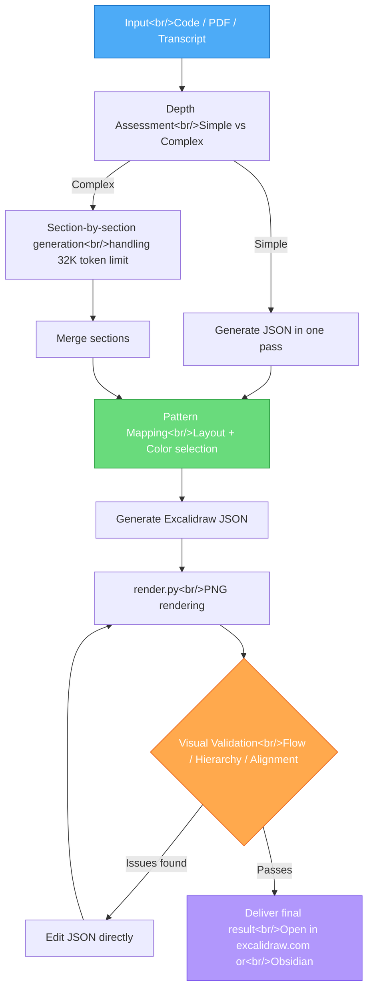

Coding agents excel at text but struggle with visual expression. Claude Code's Skills system is a framework designed to systematically overcome this limitation. Using the Excalidraw diagram skill as a case study, we will go deep on Skills architecture and the philosophy of "visual argumentation."

<!--more-->

## Overview of Claude Code Skills

### What Are Skills?

Skills are **reusable prompt and resource packages** — instruction sets bundled into a directory that teach a coding agent how to perform a specific task.

The core is the `skill.md` file. This markdown file defines the agent's behavior: what input it accepts, what steps it follows, and what quality criteria it uses to validate output.

```
.claude/skills/
├── excalidraw-diagram/
│   ├── skill.md              # Core instruction set
│   ├── reference/            # Reference resources
│   │   ├── color-palette.json
│   │   └── element-templates/
│   └── render.py             # Helper script
├── code-review/
│   └── skill.md
└── documentation/
    └── skill.md
```

Skills are invoked via slash commands (e.g., `/diagram`). When Claude Code recognizes the intent of a prompt, it automatically loads the relevant `skill.md` and follows the workflow defined there.

### Skills vs MCP vs CLAUDE.md — When to Use Which

All three extend agent behavior, but they serve different purposes.

| | Purpose | Scope | Example |
|------|------|------|------|
| **CLAUDE.md** | Rules that apply to the entire project | Always loaded | Coding conventions, build commands |
| **Skills** | Systematic workflow for a specific task | Loaded on demand | Diagram creation, code review |
| **MCP** | Integration with external services (API calls) | Tool level | Sending Slack messages, DB queries |

**CLAUDE.md** says "always do it this way in this project." **Skills** say "follow this procedure when doing this task." **MCP** says "communicate with this external system like this."

The advantages of Skills are clear:
- **Context efficiency** — loaded only when needed, no wasted tokens
- **Reusability** — build once, use across any project
- **Shareable** — distribute via a GitHub repo for anyone to clone and use

## Deep Analysis: The Excalidraw Diagram Skill

### The Problem: LLM Visual Limitations

What happens when you ask a coding agent to "draw an architecture diagram" without a skill?

The result is a generic arrangement of boxes and arrows. Color choices are nearly random, there is no information hierarchy in the layout, and almost every diagram looks the same. LLMs are optimized for generating text tokens — **visual decision-making** (color combinations, spatial arrangement, visual flow) requires systematic guidance.

The Excalidraw skill solves this. It codifies "which colors to use," "which layout patterns to apply," and "how to validate the result" into `skill.md`.

### Directory Structure

```
.claude/skills/excalidraw-diagram/
├── skill.md                    # Full workflow definition
├── reference/
│   ├── color-palette.json      # Brand color system
│   └── element-templates/      # Reusable shape templates
└── render.py                   # PNG rendering script (for validation)
```

The role of each file:

- **`skill.md`** — Instructs the agent through the full diagram creation process, from input analysis to the validation loop
- **`color-palette.json`** — Consistent color system with primary, secondary, and background colors defined as hex codes
- **`element-templates/`** — JSON snippets for frequently used visual patterns (flow diagrams, architecture maps, etc.)
- **`render.py`** — Converts Excalidraw JSON to PNG for agent self-validation

### Breaking Down skill.md

Let's walk through the core workflow of `skill.md` step by step.

#### Step 1: Input Processing

The skill handles diverse input types:

```markdown
## Input Processing
- **Code file** → Extract architecture, data flow, class relationships
- **PDF document** → Identify core concepts and relationship structure
- **YouTube transcript** → Convert explanatory flow into visual structure
- **Raw text/notes** → Map relationships between concepts
```

For a code file, it visualizes function call graphs or module dependencies. For a YouTube transcript, it visualizes the logical flow of the explanation.

#### Step 2: Depth Assessment

This step exists for a practical reason. Claude Code has a **32K token output limit**. The Excalidraw JSON for a complex diagram can easily exceed this.

```markdown
## Depth Assessment
IF simple diagram (single concept, few elements):
  → Build entire JSON in one pass
IF complex diagram (multiple sections, many relationships):
  → Build section by section, merging incrementally
```

Simple diagrams are generated in one pass; complex ones are built in sections and then merged.

#### Step 3: Pattern Mapping

This is the key step that prevents the agent from "repeating boxes and arrows":

```markdown
## Pattern Mapping
Choose a visual pattern based on the nature of the input:
- System architecture → Layered hierarchy diagram
- Data flow → Directed pipeline
- Decision process → Branching tree
- Comparison → Parallel layout with contrasting colors
- Timeline → Horizontal or vertical time axis
```

This also includes design principles like "avoid repetitive boxes" and "use multi-zoom architecture."

#### Step 4: JSON Generation

Excalidraw's native format is JSON. `skill.md` specifies the rules to follow when generating it:

```json
{
  "type": "excalidraw",
  "version": 2,
  "elements": [
    {
      "type": "rectangle",
      "x": 100,
      "y": 200,
      "width": 240,
      "height": 80,
      "backgroundColor": "#a5d8ff",
      "strokeColor": "#1971c2",
      "roundness": { "type": 3 },
      "boundElements": [],
      "label": {
        "text": "Content Fetcher"
      }
    }
  ]
}
```

Colors are drawn from the palette, spacing and alignment rules are followed, and arrow connection start and end points are calculated precisely.

#### Step 5: Validation Loop (Self-Validation)

This is the most powerful part of the skill:

```markdown
## Validation Loop (2-4 iterations)
1. Render JSON → PNG via render.py
2. Directly inspect the generated PNG screenshot
3. Evaluate against criteria:
   - Is the visual flow natural?
   - Is the information hierarchy clear?
   - Are arrow connections accurate?
   - Is color contrast sufficient?
   - Is any text clipped?
4. If issues found, edit the JSON directly (not regenerate)
5. Repeat 2-4 times
```

The agent "sees" its own work and revises it. `render.py` generates the PNG, and Claude Code's multimodal capability analyzes the image to find improvements. Crucially, it **edits the existing JSON directly** rather than starting over each time.

### Full Workflow Visualization



## The Philosophy of Visual Argumentation

The core philosophy of the Excalidraw skill is "visual argumentation." This is not about making pretty pictures — the structure of the diagram itself must carry the argument.

### Two Core Questions

`skill.md` instructs the agent to ask two questions at every step:

1. **"Does the visual structure mirror the concept's behavior?"**
2. **"Could someone learn something concrete from this diagram?"**

The first question is about **structural coherence**. For example, using a circular layout to explain a pipeline creates a mismatch between the concept and the visual. If data flows from A to B, the diagram should flow left-to-right (or top-to-bottom) as well.

The second question is about **educational value**. The diagram should not be mere decoration — it should genuinely help readers understand the concept.

### The Text Removal Test

This is the most impressive validation technique:

> Remove all descriptive text from the diagram. **The structure and layout alone must still communicate the argument.**

Even with all the labels stripped out, the direction of arrows, differences in element size, color distinctions, and spatial arrangement should still reveal "what matters and what is secondary," and "where data flows from and to."

This is the essence of visual argumentation. Text is supplementary — the visual structure itself must carry the claim.

### Application Examples

| Subject | What the structure must convey | Bad example |
|------------|---------------------|---------|
| Microservices architecture | Independence of services, communication paths | All services as equal-sized boxes in a row |
| Data pipeline | Unidirectional flow, order of transformation stages | Bidirectional arrows, random placement |
| Decision tree | Branch conditions, differences in outcomes per path | All branches represented identically |
| Hierarchical system | Superior/subordinate relationships, dependency direction | Flat enumeration |

## Practical Demo Walkthrough

Let's follow the actual steps for using this skill.

### Step 1: Enter the Prompt

In Claude Code, make a request like this:

```
Create a diagram of this file's architecture
/path/to/content_fetcher.py
```

Or more specifically:

```
Create a data pipeline diagram based on this YouTube transcript.
Focus on the relationships between core concepts.
```

### Step 2: Load skill.md

Claude Code recognizes the intent and automatically loads `.claude/skills/excalidraw-diagram/skill.md`. From this moment, the agent's behavior changes completely — it begins following the workflow defined in `skill.md` step by step.

### Step 3: Generate and Validate JSON

The agent analyzes the input, assesses depth, selects a pattern, and generates the Excalidraw JSON. It then runs `render.py` to produce a PNG and validates its own output.

```bash
# What the agent runs internally
python render.py output.excalidraw --output preview.png
# → Generates PNG, analyzes image
# → "Arrow spacing is too tight" → Edit JSON
# → Re-render → Re-validate
# → Repeat 2-4 times
```

### Step 4: Render the Result

The final JSON can be opened in two ways:

1. **excalidraw.com** — Open directly in a browser. Free. "Open" → Select the local `.excalidraw` file
2. **Obsidian Excalidraw plugin** — Integrated with your note system. Drop the `.excalidraw` file in your Vault and it renders immediately

### Step 5: Iterate

The first output will not be perfect. This is **intentional**. Consider the number of micro-decisions needed to produce a single diagram:

- x, y coordinates for every element
- Every color choice
- Start and end points for every arrow
- Text size and placement
- Spacing between elements

All of these decisions cannot be perfect simultaneously. But if the **starting point is 80% complete**, the remaining 20% can be reached with 2-3 instructions:

```
- The arrows are too short, spread them out
- Increase the color contrast, the text is hard to read against the background
- Make the "Data Layer" section larger to emphasize its importance
```

The key point is the **dramatic time savings compared to drawing from scratch**. In a workflow that produces dozens of diagrams every week, this difference adds up to hours.

## Guide to Building Your Own Skills

Once you understand the structure of the Excalidraw skill, you can build your own.

### Tips for Writing skill.md

```markdown
# My Custom Skill

## Purpose
Define the problem this skill solves in one sentence

## Inputs
- What kinds of input does it accept
- Format and constraints on the input

## Workflow
1. Analysis phase — how to interpret the input
2. Generation phase — what to produce and in what order
3. Validation phase — how to verify the result

## Quality Criteria
- Specific, measurable quality standards
- A definition of what "good output" looks like

## Anti-patterns
- Common traps the agent falls into
- Concrete examples of "do not do this"
```

The key principle is **specificity**. Not "create a good diagram" but "if the information hierarchy is three levels or fewer, generate in a single pass; pull colors from color-palette.json; and the result must pass the text removal test."

### Using the reference Directory

Put information that does not fit in `skill.md` into the reference directory:

```
reference/
├── color-palette.json    # Color code definitions
├── element-templates/    # Reusable patterns
├── examples/             # Examples of good output
└── anti-patterns/        # Examples of bad output
```

**Examples** are especially powerful. Showing an actual JSON or markdown example of "produce output like this" guides the agent far more precisely than a written description.

### Principles for Designing the Validation Loop

The most instructive aspect of the Excalidraw skill is its **self-validation loop**. This pattern can be applied to any skill:

1. **Run or render the output externally** — parse JSON, execute code, render images
2. **Have the agent inspect the result directly** — read error messages or analyze screenshots
3. **Fix the existing output when problems are found** — do not start over from scratch
4. **Cap the number of iterations** — prevent infinite loops. 2-4 iterations is appropriate

### Practical Skill Ideas

| Skill name | Purpose | Validation method |
|----------|------|----------|
| Code Review | Structurally analyze a PR diff | Verify evidence for each checklist item |
| Documentation | Generate API docs from code | Execute generated example code |
| Test Generator | Generate tests from function signatures | Run generated tests |
| Commit Message | Generate meaningful commit messages from a diff | Validate against conventional commits spec |
| Architecture Audit | Analyze codebase dependencies | Run circular dependency detection script |

## Takeaways

**The essence of the Skills system is "compensating for agent weaknesses with structure."** LLMs have high general capability but cannot deliver consistent quality in specific domains without systematic guidance. Skills package that structure for reuse.

The most noteworthy aspect of the Excalidraw skill is its **validation loop**. Instead of "make it and ship it," the flow is "make it → check it → fix it" — all automated. This pattern is not limited to diagrams. It applies to code generation, documentation, data analysis, and almost any agent task. Designing an external feedback loop where the agent can validate its own work is the core of skill creation.

The concept of "visual argumentation" extends beyond diagrams as well. The principle that **structure itself must carry the message** applies equally to code architecture, document structure, and API design. Just as the directory structure alone should reveal a project's separation of concerns, the diagram layout alone should reveal the core flow of a system.

Finally, the act of building skills is itself a process of **codifying your own expertise**. Converting the tacit knowledge of "this is how I create diagrams" into an explicit workflow makes that knowledge scalable through agents. This is the core value of agentic engineering — not automating an expert's judgment, but automating an expert's process.

---

> **Source**: [Build BEAUTIFUL Diagrams with Claude Code (Full Workflow)](https://www.youtube.com/watch?v=m3fqyXZ4k4I) — Cole Medin
