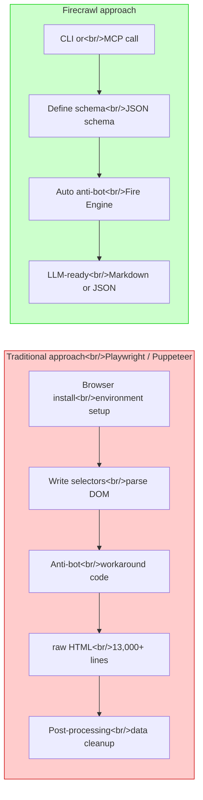

## Overview

In the age of AI coding agents, web scraping has evolved from simple data collection into critical infrastructure for competitive analysis, lead enrichment, and market research. But Claude Code's built-in `web fetch` cannot properly handle JavaScript-rendered sites or pages protected by anti-bot systems. Firecrawl confronts this problem head-on. It converts web data into LLM-ready markdown and structured JSON, and integrates seamlessly with Claude Code through an MCP server.

<!--more-->

## Where Claude Code's web fetch Falls Short

Claude Code's built-in `web fetch` works by fetching raw HTML directly. This approach has three clear limitations.

1. **JavaScript rendering failure** — On SPAs (Single Page Applications) or dynamically loaded sites, it retrieves only an empty shell. Tools like SimilarWeb render their statistics client-side, so `web fetch` cannot read any of the numbers.
2. **Anti-bot blocking** — Sites with bot detection like Yellow Pages and Booking.com return repeated 403 errors. In real tests, scraping Yellow Pages plumber listings with `web fetch` produced nothing but a stream of 403s.
3. **Speed and token inefficiency** — When scraping four Amazon product pages, `web fetch` took 5 minutes 30 seconds while Firecrawl completed the same work in 45 seconds. Dumping 13,000 lines of raw HTML into an LLM is a waste of tokens.

## What Is Firecrawl?

[Firecrawl](https://www.firecrawl.dev/) is a web scraping platform that converts web data into LLM-friendly formats. Its key characteristics:

- **Markdown conversion**: Extracts web pages as clean markdown
- **Schema support**: Define only the fields you want and receive structured JSON
- **Anti-bot bypass**: Its proprietary Fire Engine passes through bot detection systems
- **Token efficiency**: Saves to the local filesystem and extracts only needed data to minimize token usage
- **Open source**: Self-hosting is possible (but anti-bot bypass and agent features are paid-only)

## Firecrawl vs Traditional Scraping



| | Playwright / Puppeteer | Firecrawl |
|------|----------------------|-----------|
| Setup complexity | Browser binary + driver config | `npx firecrawl` one-liner |
| Anti-bot | Must implement yourself | Fire Engine built-in |
| JS rendering | Yes (headless browser) | Yes (managed sandbox) |
| Output format | Raw HTML / DOM objects | Markdown / structured JSON |
| LLM integration | Requires separate pipeline | Direct MCP server connection |
| Token efficiency | Low (full HTML) | High (schema-based extraction) |
| Large-scale crawling | Must implement yourself | Built in via crawl / map commands |

## 5 Core Commands

Firecrawl CLI offers five main commands.

### 1. `scrape` — Single Page Extraction

The most basic command. Specify a URL and retrieve that page's content as markdown.

```bash
npx firecrawl scrape https://www.amazon.com/dp/B0CZJR9KCZ
```

### 2. `search` — Web Search + Scraping

Use this when you do not know the URL. Search by keyword and automatically scrape the result pages.

```bash
npx firecrawl search "2026 best noise cancelling headphones review"
```

### 3. `browse` — Cloud Browser Interaction

Opens a cloud browser session to perform clicks, form input, snapshots, and more. Think of it as Playwright managed by Firecrawl.

```bash
npx firecrawl browse https://example.com --action "click login button"
```

### 4. `crawl` — Full Site Crawling

Starting from a URL, follows links and systematically scrapes an entire site.

```bash
npx firecrawl crawl https://docs.example.com --limit 100
```

### 5. `map` — Domain URL Discovery

Discovers all URLs within a domain to generate a sitemap. Useful for understanding site structure before crawling.

```bash
npx firecrawl map https://example.com
```

## MCP Server Integration with Claude Code

The most powerful way to use Firecrawl with Claude Code is via an MCP (Model Context Protocol) server. Setup is straightforward.

### Installation

```bash
# Install Firecrawl CLI
npx firecrawl setup

# Add MCP server in Claude Code
claude mcp add firecrawl -- npx -y firecrawl-mcp
```

### Usage Example

Once connected via MCP, you can use it with natural language.

```
# Natural language request in Claude Code
"Pull product name, price, rating, and review count from these 5 Amazon product pages and organize them in a table"

# Claude Code automatically selects the Firecrawl scrape tool and runs it
```

### Schema-Based Extraction Example

Define the data fields you want as a JSON schema and get exactly those fields back.

```json
{
  "type": "object",
  "properties": {
    "product_name": { "type": "string" },
    "price": { "type": "string" },
    "rating": { "type": "number" },
    "review_count": { "type": "integer" },
    "seller": { "type": "string" }
  },
  "required": ["product_name", "price", "rating"]
}
```

Applying this schema to an Amazon product page returns clean 5-line JSON instead of 13,000 lines of HTML.

```json
{
  "product_name": "Sony WH-1000XM5 Wireless Headphones",
  "price": "$278.00",
  "rating": 4.5,
  "review_count": 12847,
  "seller": "Amazon.com"
}
```

## Real-World Demo: Amazon Product Scraping

Let's compare actual test results.

**Test conditions**: Extract product information from 4 Amazon product pages

| | Claude Code (web fetch) | Claude Code + Firecrawl |
|------|------------------------|------------------------|
| Time | ~5 min 30 sec | ~45 sec |
| Success rate | Partial (unstable HTML parsing) | 100% |
| Token usage | High (full raw HTML) | Low (schema fields only) |
| Output format | Unstructured text | Structured JSON |

**SimilarWeb test** (JavaScript-rendered site):
- web fetch: timed out after 4 min 30 sec, collected only empty shells
- Firecrawl: 42 seconds, fully captured traffic metrics, geographic breakdown, and social media share

**Yellow Pages test** (anti-bot protection):
- web fetch: continuous 403 errors, 0 results
- Firecrawl: 53 seconds, 16 business listings collected

## Pricing

| Plan | Credits | Price | Notes |
|------|--------|------|------|
| **Free** | 500 | Free | One-time, trial use |
| **Hobby** | 3,000/mo | $16/mo | Personal projects |
| **Standard** | 100,000/mo | $83/mo | Startups |
| **Growth** | 500,000/mo | $333/mo | Large-scale operations |

Open-source self-hosting is available, but the following features are paid-only:
- Fire Engine (anti-bot bypass)
- Agent mode
- Browser Interact
- Requires Docker environment setup

## Practical Use Cases

### Competitive Analysis
Periodically collect competitor traffic data from SimilarWeb to build a dashboard. Impossible with `web fetch` due to JavaScript rendering, but Firecrawl finishes in 42 seconds.

### Lead Enrichment
Crawl company websites to extract decision-maker information, tech stacks, and job listings as structured data. Can process 50 company sites at once.

### Market Research
Use schema-based collection to gather competitor product prices, ratings, and reviews from Amazon and other e-commerce platforms. Run on a schedule to track price trends.

### Content Collection
Crawl technical blogs and documentation sites to build knowledge bases for RAG (Retrieval-Augmented Generation) pipelines.

## Takeaways

Looking at Firecrawl, the paradigm of web scraping is shifting — from "directly manipulating the browser" to "declaring the schema of the data you want."

Writing selectors with Playwright or Puppeteer, bypassing anti-bot systems, parsing HTML — all of that was ultimately just a **means to get the data you wanted**. Firecrawl abstracts away those means so the developer only needs to declare **what they want**, and the rest is handled automatically. This is analogous to how SQL replaced direct filesystem access.

That said, the free tier is capped at 500 requests, and the core differentiator — anti-bot bypass — is paid-only. The self-hosted open-source version lacks anti-bot, which means Firecrawl's real value lies in its proprietary Fire Engine technology. It will be worth watching how the pricing model evolves over the long term.

Still, the ability to instruct web scraping in natural language from within Claude Code via MCP integration has genuine potential to change development workflows — especially for projects that need large-scale data collection, where the time savings relative to the cost are clear.

---

**Reference Videos**
- [Claude Code + Firecrawl = UNLIMITED Web Scraping](https://www.youtube.com/watch?v=phuyYL0L7AA) — Chase AI
- [퍼페티어는 이제 그만! AI 웹 스크래핑 끝판왕 Firecrawl CLI 등장](https://www.youtube.com/watch?v=PHHPJaWbK8Q) — Nova AI Daily
