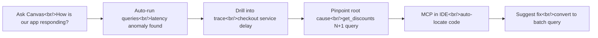

## Overview

Previous posts in this series covered [Observability vs Monitoring](/p/observability-vs-monitoring-honeycomb-vs-grafana-비교-분석/) and [Honeycomb and Observability Fundamentals](/p/honeycomb과-observability-입문-오픈소스-대안-비교/). This post takes it a step further. With Honeycomb's MCP (Model Context Protocol) Server now GA, there is a new workflow for connecting observability data directly to AI tools. Add Canvas (the in-app AI assistant) and IDE integration, and the loop from "spot an anomaly" to "fix the code" becomes a single continuous flow.

<!--more-->

## Honeycomb MCP Server GA — Bridging AI and Observability

Honeycomb's MCP Server has reached General Availability. Austin Parker (Honeycomb MCP product lead) described the core concept simply: **bring observability data to where your AI tools live.**

MCP (Model Context Protocol) is the standard protocol for AI agents to communicate with external tools. Once you configure the Honeycomb MCP Server, you can access production data directly from Claude Desktop, Cursor, VS Code Copilot, Claude Code, and other AI environments.

Key capabilities the MCP Server provides:

- **Environment information**: Service maps, dataset details, environment overview
- **Query execution**: Generate and run Honeycomb queries from natural language
- **SLO monitoring**: Check SLO status and view Boards
- **Trace exploration**: Inspect detailed trace waterfalls by trace ID
- **OpenTelemetry guidance**: Access up-to-date instrumentation information

## Canvas: The In-App AI Assistant

Canvas is an AI assistant built directly into Honeycomb. It lets you explore observability data through a conversational interface.

### How It Works

1. Open Canvas and ask a question in natural language: "How is our app responding?"
2. Canvas identifies the relevant environment and service
3. It automatically generates and executes the necessary queries
4. Result graphs appear side by side with the conversation
5. The AI narrates what the data shows — for example, "latency is trending up"

A principle Honeycomb has held since its founding in 2016 shines here: **any query, against any attribute, must execute fast.** AI can fire dozens of queries per minute in sequence, and Honeycomb's fast query engine backs that up.

### The Importance of Validating AI Results

Every graph Canvas provides is clickable. You can verify that the query is correct, and drill down into trace waterfalls to inspect the raw data. The key is not blindly trusting the AI's conclusions but validating the reasoning behind them.

## IDE Integration: VS Code/Cursor + Copilot

The real strength of Honeycomb MCP is having production data and code visible on the same screen inside your IDE.

### Custom Slash Commands

With the MCP Server configured, Honeycomb-specific slash commands become available in your IDE:

- **`/otel-analysis`**: Analyzes the OpenTelemetry instrumentation state of your code. The AI references the latest information via MCP rather than stale training data.
- **`/otel-instrumentation`**: Provides instrumentation guidance — which spans to add, which attributes are useful.

The core value of these slash commands is **information freshness**. The OpenTelemetry knowledge baked into AI models becomes outdated over time. MCP provides a path to always reference the latest documentation and best practices.

## Demo: New Team Member Onboarding Scenario

The most compelling part of the MCP Server GA announcement demo was the onboarding scenario.

After connecting Honeycomb MCP to Claude Desktop, the request was: "Create an interactive artifact that would help a developer on their first day understand the system." The result:

- **Dataflow Architecture**: An interactive diagram visualizing data flow between systems
- **Critical SLOs**: A list of key SLOs with their current status
- **Key Board links**: Direct links to monitoring dashboards
- **Trace/Query shortcuts**: One-click navigation to actual traces and queries

All of this is generated automatically by combining MCP tools: `get_environment_details`, `get_service_map`, `get_slos`, `get_boards`, `run_query`. The gap between this and manually writing a wiki page and attaching screenshots is enormous.

## Real Debugging Flow: From Canvas to Code Fix

The most practical scenario is the end-to-end debugging flow. Here is the actual flow shown in the demo:

### Step by Step

**Step 1 — Detect anomaly in Canvas**

Asking "How is our app responding?" triggers automatic queries across multiple services for latency and error rates. This reveals abnormally high P99 latency in the checkout service.

**Step 2 — Drill into trace**

Canvas finds the slow trace ID and loads the trace waterfall. Expanding the checkout section shows the `get_discounts` function consuming most of the time.

**Step 3 — Switch to IDE**

Here Canvas reaches its limit — code changes require an IDE. With the Honeycomb MCP configured in VS Code + Copilot, the request is: "Honeycomb shows a checkout latency issue — find the cause in the code."

**Step 4 — MCP executes query**

The IDE's AI agent runs a query against Honeycomb via MCP. It confirms the same latency pattern and identifies an N+1 query pattern in `get_discounts` from the trace data.

**Step 5 — Locate code and suggest fix**

The agent finds the `get_discounts` function in the codebase, identifies the pattern of executing individual DB queries inside a loop, and proposes a specific fix that converts it to a batch query.

## Honeycomb MCP's Efficient Communication Design

Honeycomb MCP is designed to maximize **token efficiency** in communication with AI agents.

API responses typically come back as JSON, but Honeycomb MCP uses a mix of formats depending on the situation:

| Format | Use Case |
|------|------|
| **Text** | Narrative descriptions, context delivery |
| **CSV** | Tabular query results (rows and columns) |
| **JSON** | Structured metadata |
| **ASCII Art** | Trace waterfalls, simple visualizations |

The purpose of this mixed-format strategy is clear: deliver the necessary information with the fewest tokens possible. Sending CSV data instead of a full graph image uses far fewer tokens and lets the AI read exact numbers accurately.

In Canvas (in-app), graphs render automatically. In IDE integration via MCP, query links are provided instead of graphs — click through to Honeycomb UI when you need to view them directly.

## OpenTelemetry Instrumentation Guidance

This is where MCP goes beyond simply "reading data." Honeycomb uses MCP to deliver OpenTelemetry expertise to AI agents.

What this means in practice:

- When the AI suggests which spans to add to your code, it **references Honeycomb's latest best practices**
- The `otel-instrumentation` slash command provides instrumentation guides matched to the language and framework you are using
- Advice is based on **continuously updated guidance**, not the AI model's training data

This is highly practical given how rapidly OpenTelemetry versions change. Instrumenting with outdated information — when the API has changed between SDK versions — creates new problems rather than solving existing ones.

## Takeaways

**The way we consume observability data is changing.** The old model was open a dashboard, read the graphs, manually hunt for suspicious traces. Honeycomb Canvas and MCP transform this into "ask a question, get an answer."

**IDE integration is a game changer.** Having production data and code on the same screen eliminates context switching. As the N+1 debugging demo showed, you can go from spotting an issue in a trace to fixing it in code without leaving your IDE. This was a workflow that Honeycomb's web UI alone could not support.

**The token efficiency design of the MCP is impressive.** The approach of combining Text + CSV + JSON + ASCII art to convey maximum information with minimum tokens is a pattern worth borrowing for other MCP server implementations. In the AI era, API design must consider not just "easy for humans to read" but also "efficiently consumable by AI."

**The onboarding scenario is realistic.** If a developer can get a complete picture of system architecture, SLO status, and key dashboards in a single prompt, onboarding time drops dramatically. This is an example of observability tools expanding from "incident response only" to "everyday development tool."

---

**References**

- [Introducing Honeycomb Intelligence MCP Server - Now GA!](https://www.youtube.com/watch?v=i6jhbs-RG6U) — Honeycomb official GA announcement
- [AI for Observability: Honeycomb Canvas & MCP](https://www.youtube.com/watch?v=UMG-JphuH4M) — Canvas + MCP debugging demo
