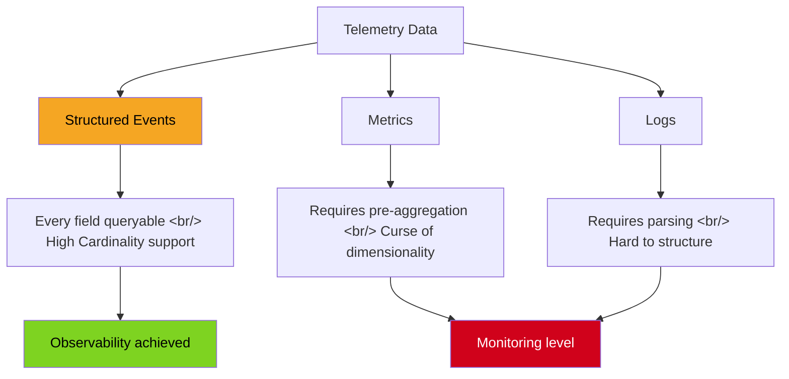
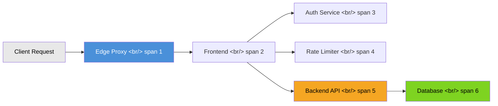

A previous post compared Observability vs Monitoring and the approaches of Honeycomb and Grafana. This post dives deeper into Honeycomb's official documentation to solidify the core concepts of observability, then compares self-hostable open source alternatives from a practical standpoint.

> [Previous post: Observability vs Monitoring — Honeycomb vs Grafana](/posts/2026-02-25-observability-honeycomb-vs-grafana/)

<!--more-->

## Core Observability Concepts

The definition Honeycomb's documentation emphasizes most is this:

> **Observability is about being able to ask arbitrary questions about your environment without having to know ahead of time what you wanted to ask.**

Monitoring means setting thresholds for problems you already know about and receiving alerts. Observability means being able to ask **unexpected questions**. In a microservices environment, the root cause of an incident can be an infinite combination of factors — predefined dashboards cannot diagnose a new type of problem you have never seen before.

Improving observability requires two things:

1. **Collecting telemetry data that contains rich runtime context**
2. **The ability to repeatedly query that data to discover insights**

## Structured Events vs Metrics vs Logs

The heart of Honeycomb's data model is the **structured event**. Understanding the difference between events, metrics, and logs is the starting point for observability.

### Structured Event

An event is a JSON object that completely describes a single unit of work. The full cycle of receiving an HTTP request, processing it, and returning a response becomes one event.

```json
{
  "service.name": "retriever",
  "duration_ms": 0.011668,
  "dataset_id": "46829",
  "global.env": "production",
  "global.instance_type": "m6gd.2xlarge",
  "global.memory_inuse": 671497992,
  "trace.trace_id": "845a4de7-...",
  "trace.span_id": "84c82b34..."
}
```

The key is that **every field is queryable**. Find slow requests by `duration_ms`, group by `instance_type`, and explore the correlation with `memory_inuse` — all in one go.

### The Limits of Pre-aggregated Metrics

The metrics approach pre-aggregates data before sending it:

```json
{
  "time": "4:03 pm",
  "total_hits": 500,
  "avg_duration": 113,
  "p95_duration": 236
}
```

What if you want to see "latency difference based on storage engine cache hit"? You would need to pre-create combinations like `avg_duration_cache_hit_true`, `p95_duration_cache_hit_true`. This is the **curse of dimensionality** — as dimensions increase, the number of required metrics grows exponentially.

### The Limits of Unstructured Logs

Logs are easy for humans to read but hard to query. To answer "which service takes the longest to start?" you need to parse and subtract multiple lines of timestamps. A structured event answers the same question instantly with a single `duration_ms` field.



## Distributed Tracing

Tracing ties together instrumentation from separate services to surface cross-service failures. If you run any user-facing software — even a proxy, an app, and a database — you are running a distributed system.

### How Traces Work

A **trace** tells the story of a complete unit of work. When a user loads a page, their request might pass through an edge proxy, a frontend service, authorization, rate limiting, backend services, and data stores. Each part of this story is told by a **span**.

A span represents a single unit of work from a single location in code. Each span contains:

- **serviceName** — which service the span is from
- **name** — the role of the span (function or method name)
- **timestamp** and **duration** — when it started and how long it took
- **traceID** — which trace the span belongs to
- **parentID** — the parent span that called this one



All spans sharing the same `traceID` form a complete picture of how a single request flowed through the entire system. By examining span durations, you can pinpoint exactly which service is the bottleneck — something impossible with traditional logs or metrics alone.

## Why High Cardinality Matters

Cardinality refers to the number of unique values a given field can hold. Fields like `user_id`, `trace_id`, and `request_id` can have millions of distinct values — this is **high cardinality**.

Traditional metrics tools (Prometheus, Graphite, etc.) handle high cardinality poorly. When label combinations explode, performance degrades sharply. But in observability, questions like "why is it slow for this specific user?" require tracking individual values — that is the entire point.

Honeycomb uses columnar storage to efficiently handle high cardinality data. Its **BubbleUp** feature automatically detects outliers and identifies which field combinations are correlated with the problem.

## Core Analysis Loop

Honeycomb's proposed debugging methodology is the **Core Analysis Loop**:

1. **Observe**: Visualize the overall state of the system
2. **Hypothesize**: When you spot an anomalous pattern, form a hypothesis about the cause
3. **Validate**: Slice the data with GROUP BY and WHERE to validate or disprove the hypothesis
4. **Iterate**: Return to new questions and repeat

This is fundamentally different from "look at dashboards and wait for alerts." The Query Builder lets you freely explore data by combining SELECT, WHERE, GROUP BY, ORDER BY, LIMIT, and HAVING clauses.

## Honeycomb Intelligence — AI-Powered Analysis

Honeycomb Intelligence is a suite of AI features that help engineers investigate faster. The key features include:

- **Canvas** — An interactive investigation surface where you can ask questions about your system in natural language. Canvas generates queries, visualizations, and explanations automatically, providing a conversational debugging experience
- **Query Assistant** — Auto-generates Honeycomb queries from natural language descriptions. Input like "show me the slowest endpoints grouped by service" becomes an executable query
- **Hosted MCP Service** — Honeycomb provides a Model Context Protocol (MCP) server, enabling AI agents and tools (Claude, Cursor, etc.) to query Honeycomb data directly

Honeycomb's AI principles commit to transparency about which features use AI, ensuring data is not used to train models, and making AI features optional. Customer data sent to third-party AI providers (like OpenAI or Anthropic) is processed under data processing agreements that prohibit training on customer data.

## Sending Data with OpenTelemetry

Honeycomb natively supports **OpenTelemetry**, the open-source standard for collecting telemetry data. If instrumenting code for the first time, Honeycomb recommends starting with OpenTelemetry.

### Key Integration Points

- **OTLP Protocol**: Honeycomb receives data via OpenTelemetry Protocol (OTLP) over gRPC, HTTP/protobuf, and HTTP/JSON
- **Direct export**: Send OTLP data directly to Honeycomb's endpoint — no collector required for simple setups
- **Collector support**: Use the OpenTelemetry Collector to convert legacy formats (OpenTracing, Zipkin, Jaeger) into OTLP

The minimum configuration requires two environment variables:

```bash
export OTEL_EXPORTER_OTLP_ENDPOINT="https://api.honeycomb.io:443"
export OTEL_EXPORTER_OTLP_HEADERS="x-honeycomb-team=YOUR_API_KEY"
```

OpenTelemetry SDKs are available for Go, Python, Java, .NET, Node.js, Ruby, and more. Each SDK provides auto-instrumentation for common frameworks, meaning you can get traces and metrics with minimal code changes.

### Migration from Legacy Systems

If already using Jaeger, Zipkin, or OpenTracing instrumentation, the OpenTelemetry Collector can act as a bridge — receiving data in legacy formats and exporting to Honeycomb in OTLP. This makes migration incremental rather than requiring a full re-instrumentation.

## eBPF and Observability

**eBPF (extended Berkeley Packet Filter)** is a technology that runs extended functionality inside the Linux kernel without modifying it. It matters for observability because it enables **telemetry collection without any code changes**.

### How It Works

- **JIT Compiler**: eBPF programs run through an in-kernel JIT compiler for high performance
- **Hook Points**: Connects to predefined hooks — system calls, function entry/exit, kernel tracepoints, network events
- **Kprobes / Uprobes**: Where predefined hooks do not exist, kernel probes (Kprobes) or user probes (Uprobes) can attach eBPF programs to almost any point

### Observability Applications

eBPF is especially valuable for languages without automatic instrumentation (C++, Rust, etc.). From outside the application, kernel probes can collect network activity, CPU and memory usage, and network interface metrics.

OpenTelemetry is currently developing **Go-based eBPF auto-instrumentation** supporting HTTP client/server, gRPC, and gorilla/mux routers. Support for C++ and Rust is planned.

## Open Source Alternatives

Honeycomb is powerful but SaaS lock-in and cost can be concerns. Here is a practical look at self-hostable open source alternatives.

### Jaeger

- **Creator**: Uber
- **Backend**: Cassandra / Elasticsearch
- **Strengths**: Core strength in span-level call timing and latency analysis. Compatible with Zipkin; native OpenTelemetry support
- **Deployment**: Kubernetes Helm chart, Jaeger Operator for easy deployment
- **UI**: Service-based duration queries and trace timeline visualization on port 16686

```bash
# All-in-one (for development/testing)
./jaeger-all-in-one --memory-max-table-size=100000

# EKS deployment
kubectl create namespace observability
kubectl apply -f jaeger-operator.yaml
```

### Zipkin

- **Creator**: Twitter
- **Backend**: Elasticsearch / MySQL
- **Strengths**: Lightweight, simple tracing server. Native integration with **Spring Cloud Sleuth**
- **Deployment**: Single Docker command

```bash
docker run -d -p 9411:9411 openzipkin/zipkin
```

Automatically generates service call graphs and dependency diagrams, useful for incident analysis. OpenTelemetry support is bridge-based rather than native, requiring more configuration.

### SigNoz

- **Strengths**: **OpenTelemetry-native** open source APM. Provides Honeycomb-style queries and dashboards for self-hosting
- **Backend**: ClickHouse (high-performance columnar DB)
- **Advantages**: Logs, metrics, and traces in **one unified platform**. The closest open source alternative to Honeycomb
- **Deployment**: AWS ECS CloudFormation templates, full Kubernetes stack support

SigNoz receives OTLP (OpenTelemetry Protocol) directly, so you can send data from the OpenTelemetry Collector without any transformation.

### Pinpoint

- **Creator**: Naver
- **Backend**: HBase
- **Strengths**: Optimized for **large-scale Java application** tracing. Bytecode instrumentation applies the agent without any code changes
- **Key Features**: Scatter/Timeline charts for detailed call flow and timing analysis. Battle-tested stability in large Korean enterprise environments

```bash
# Apply agent (JVM option)
java -javaagent:pinpoint-agent.jar \
  -Dpinpoint.agentId=myapp-01 \
  -Dpinpoint.applicationName=my-service \
  -jar my-application.jar
```

## Comparison Table

| Tool | Backend | OTel Support | K8s Deployment | Core Strength |
|------|--------|-----------|----------|-----------|
| **Honeycomb** | SaaS (AWS) | Native | N/A (SaaS) | High cardinality queries, BubbleUp, AI analysis |
| **Jaeger** | ES / Cassandra | Native | Helm / Operator | High-traffic span tracing |
| **Zipkin** | ES / MySQL | Bridge | Basic Deployment | Simple setup, Spring integration |
| **SigNoz** | ClickHouse | Native | Full stack | All-in-one observability (logs + metrics + traces) |
| **Pinpoint** | HBase | Partial | Supported | Large-scale Java APM, bytecode instrumentation |

## Honeycomb Pricing (2026)

| Plan | Monthly Cost | Event Limit | Retention | Target |
|------|---------|-------------|-----------|------|
| **Free** | Free | 20M/month | 60 days | Small teams, testing |
| **Pro** | $100+ | 1.5B/month | 60 days | Growing teams, SLO needed |
| **Enterprise** | Custom | Unlimited | Extended | Large scale, Private Cloud |

Annual contracts receive a 15-20% discount. The Free plan's 20M events is sufficient for validating a small service.

## Takeaways

**The essence of observability is a mindset shift, not a tool choice.** The core question is not "what dashboards should we build?" but "can we ask any question at all?" Honeycomb implements this philosophy through structured events and high cardinality queries.

The addition of **Honeycomb Intelligence** signals where the industry is heading — AI-assisted debugging that generates queries from natural language and provides investigation guidance through Canvas. The MCP integration means AI agents can now query production telemetry directly, further lowering the barrier to effective observability.

Practical selection criteria:

- **Fast start**: Build observability experience first with the Honeycomb Free plan (20M events/month)
- **Self-hosted all-in-one**: SigNoz is the closest open source alternative to Honeycomb — good ClickHouse query performance and OTel-native
- **Java-heavy legacy systems**: Pinpoint applies via bytecode instrumentation with no code changes
- **Already comfortable with Kubernetes**: Jaeger + OpenTelemetry Collector combination has the broadest ecosystem
- **Migration path**: OpenTelemetry Collector bridges legacy instrumentation (Jaeger/Zipkin format) to any modern backend, making incremental adoption practical

eBPF is still early-stage, but its promise of instrumentation without code changes will make it increasingly important in the Go, C++, and Rust ecosystems. When OpenTelemetry's eBPF-based auto-instrumentation matures, the cost of adopting observability will drop significantly.

## References

- [Honeycomb Docs: Introduction to Observability](https://docs.honeycomb.io/get-started/basics/observability/introduction)
- [Honeycomb Docs: Events, Metrics, and Logs](https://docs.honeycomb.io/get-started/basics/observability/concepts/events-metrics-logs)
- [Honeycomb Docs: Distributed Tracing](https://docs.honeycomb.io/get-started/basics/observability/concepts/distributed-tracing)
- [Honeycomb Docs: eBPF](https://docs.honeycomb.io/get-started/basics/observability/concepts/ebpf)
- [Honeycomb Docs: Build a Query](https://docs.honeycomb.io/investigate/query/build)
- [Honeycomb Docs: Send Data with OpenTelemetry](https://docs.honeycomb.io/send-data/opentelemetry)
- [Honeycomb Docs: Honeycomb Intelligence](https://docs.honeycomb.io/security-compliance/honeycomb-intelligence)
- [Jaeger - Distributed Tracing](https://www.jaegertracing.io/)
- [Zipkin](https://zipkin.io/)
- [SigNoz - Open Source APM](https://signoz.io/)
- [Pinpoint - Application Performance Management](https://pinpoint-apm.gitbook.io/)
