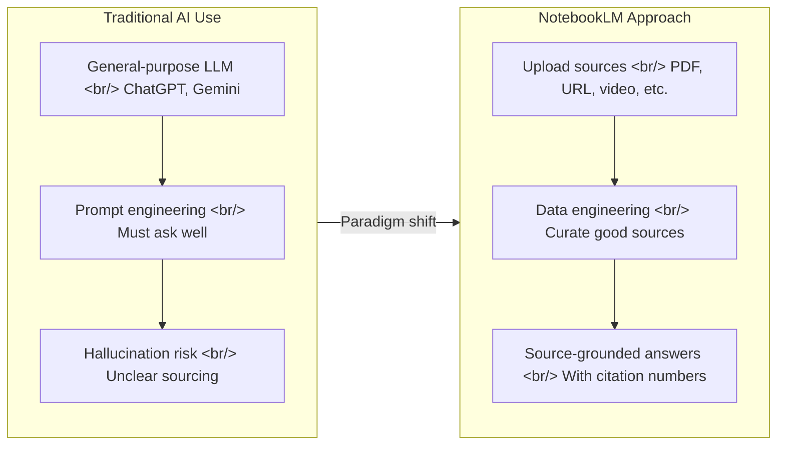

Google NotebookLM makes "no-code RAG" a practical reality. Upload your documents, videos, and URLs as sources, and you get a custom AI assistant that answers only from that data. Based on a hands-on tutorial from a creator with over a year of daily usage, this guide covers 12 practical applications and the data preparation techniques that make them work.

<!--more-->

## What Is NotebookLM?

### "No-Code RAG" — A Custom AI Built on Your Own Data

RAG (Retrieval-Augmented Generation) is a technique that grounds LLM responses by searching external data. Traditionally, implementing RAG meant chunking documents, generating embedding vectors, storing them in a vector database, and building a retrieval pipeline. NotebookLM reduces all of this to a single UI interaction. You upload sources; Google handles the RAG pipeline internally.

The core feature is that it **answers only from the data you provide**. Asking ChatGPT or Gemini a question generates a response from everything in its training data. NotebookLM answers only within the scope of the sources you have uploaded. This is a structural solution to the hallucination problem.

### ChatGPT Hallucination and Source-Grounded Answers

The classic example is asking ChatGPT about an event that never happened — it will produce a plausible-sounding narrative about a completely fabricated story. This is hallucination: an LLM confidently generating content that is not factually true by recombining patterns from its training data.

NotebookLM blocks this at the source level. If information is not in the sources, it says so. Every response includes source citation numbers so you can immediately verify the origin. For work where **accuracy matters** — business reports, academic paper reviews — this difference is decisive.

### From Prompt Engineering to Data Engineering

The previous paradigm of AI use was "how to ask well" — prompt engineering. NotebookLM changes the paradigm. **"What data to include"** now determines answer quality. Good sources matter more than a good prompt. This can be called **data engineering**, and it is the core skill for using NotebookLM effectively.

## Data Preparation Is Everything

### Supported Source Types

NotebookLM supports a variety of source formats:

- **Text documents**: Google Docs, copy-pasted text
- **PDF files**: Research papers, reports, contracts
- **URLs**: Web pages, blog posts
- **Video**: YouTube videos (analyzed via captions)
- **Images**: Screenshots, charts (OCR-based)
- **Audio**: Recorded files, podcasts

YouTube videos are especially powerful — NotebookLM automatically extracts captions for analysis. A one-hour lecture becomes a searchable source from just a URL.

### Auto-Collecting Sources with Deep Research

NotebookLM has **Deep Research** built in. For a given topic, it searches the web and automatically adds relevant sources to your notebook. Two modes are available:

- **Quick search**: Quickly finds related sources by keyword. Good for simple research.
- **Deep research mode**: Cross-analyzes multiple sources for in-depth investigation. Useful for complex topics like "2026 semiconductor industry outlook."

Auto-collected sources are added to the notebook automatically, saving you from hunting for URLs manually. That said, you should always cross-verify the reliability of auto-collected sources.

### Source Limits and Management

- **Free plan**: Up to **50 sources** per notebook
- **Pro plan**: Up to **300 sources** per notebook

50 sources is sufficient for most work purposes. The key is source **quality**, not quantity. Too many irrelevant sources actually degrades answer quality.

### Data Curation Process (Based on 1+ Year of Use)

The video presenter shares a data curation process developed through over a year of daily NotebookLM use:

1. **Define the topic clearly**: One notebook, one topic. Not "AI in general" but "2026 generative AI market outlook."
2. **Curate reliable sources**: Prioritize papers, official reports, and primary sources over blog posts.
3. **Remove duplicates**: If multiple sources cover the same content, keep the most comprehensive one.
4. **Use notes**: Summarizing key points from sources into notes enriches the context for subsequent queries.

## 12 Practical Applications

### 1. Custom AI Assistant (Handbook-Based)

Upload company handbooks, internal policies, and standard operating procedures (SOPs) to create an organization-specific AI assistant. A new employee who asks "what is the process for filing travel expenses?" gets an accurate step-by-step answer sourced from the policy document.

Previously this meant asking a colleague or searching the intranet. With NotebookLM and your manuals loaded, you have a 24/7 instant-answer internal helper. The impact is largest in teams that repeatedly answer the same questions (HR, IT helpdesk).

A practical tip: add a FAQ or collection of frequently asked questions alongside the manual. This covers edge cases that are not explicitly documented.

### 2. Deep Research Reports

For complex reports on topics like "2026 economic and industry outlook," use Deep Research to auto-collect sources, then request analysis. Load central bank reports, think tank publications, and major investment bank research — then ask "compare and analyze the top three risk factors." The result is a citation-backed breakdown from each source's perspective.

Report writing time shrinks from days to hours. The key point is that NotebookLM is not "writing the report for you" — it is giving you a **structural framework** for analysis. Final judgment and context remain human responsibilities.

### 3. Cross-Source Verification

Load 3-5 sources on a single claim and ask "compare each source's position on this argument." The result is a breakdown by agree/disagree/conditional agreement. For example, load a McKinsey report, an OECD paper, and academic studies on "will AI reduce jobs?" and instantly see where the perspectives diverge.

Particularly valuable for fact-checking and early-stage research. You can quickly determine whether all sources reach the same conclusion or whether there are conflicting interpretations, which deepens the quality of analysis.

### 4. Meeting Notes and Recording Analysis

Upload meeting recordings or auto-generated transcripts to extract not just summaries but **action items**, **decisions made**, and **unresolved issues**. Specific queries like "list the tasks the team lead committed to in this meeting" are supported.

Teams with heavy meeting schedules can accumulate weekly notes and track "what was decided in the past month that has not been completed yet." The value of the notebook compounds as meeting records accumulate.

### 5. Paper Review and Comparative Analysis

Upload several related papers and ask "compare the research methodology and conclusions of each paper." The result is a systematic comparison table. This dramatically reduces literature review time for graduate students and researchers.

A particularly useful feature is **citation tracking**. Ask "is the key argument in paper A corroborated in other sources?" and see cross-verification results with source numbers. Reading papers in the context of other related work improves comprehension.

### 6. Study Guides and Auto-Generated Quizzes

Upload a textbook or course materials and ask "create a 20-question quiz based on this content." The result includes multiple choice, short answer, and true/false questions. Each answer includes an explanation with a source citation showing where in the material it comes from.

Useful not just for exam prep but also for producing team training materials. Generate comprehension quizzes from new employee onboarding materials to significantly reduce the burden on whoever runs training. The study guide feature also works in summary mode: "extract the 10 core concepts from this material and explain each in one paragraph."

### 7. Audio Overview (Podcast Conversion)

One of NotebookLM's signature features. Upload sources and two AI hosts generate an **audio podcast where they discuss and explain the content**. Even a dense report becomes something you can absorb on your commute.

Available in multiple languages, and the conversational format makes it more accessible than dry formal writing. For long documents that the whole team needs to read, generating and sharing an audio overview increases the rate of actual consumption.

### 8. Contract and Legal Document Analysis

Upload a contract and ask "find clauses that disadvantage the first party" or "summarize the penalty clauses." Since NotebookLM answers only from the sources, it cannot fabricate clauses that do not exist.

Ideal as a first-pass filter for non-lawyers reviewing contracts. Of course, final legal review should go to a professional — but the time needed to figure out "where to focus attention" is substantially reduced. Uploading multiple contracts to compare terms side by side is also possible.

### 9. Competitive Analysis Matrix

Upload competitor IR materials, news articles, and industry reports, then ask "create a comparison matrix of competitors A, B, and C by revenue, core products, and market share." The result is a structured comparison table.

Useful for business planning and strategy meeting preparation. Uploading English-language competitor materials and receiving analysis in your preferred language eliminates translation overhead. Update sources quarterly and it doubles as a dashboard tracking competitive landscape changes.

### 10. Resume and Cover Letter Writing

Upload a job listing alongside your career history as sources, then ask "draft a cover letter tailored to this listing." Because it is source-based, NotebookLM will not fabricate experience — it reframes your actual history to match the posting's requirements.

Upload multiple job listings simultaneously and ask "what competencies do positions A and B both require?" for cross-analysis. Useful for identifying the overlap between existing experience and a new field when planning a career transition.

### 11. Blog and Content Planning

For content creators, NotebookLM acts as a research assistant. Load reference materials, competitive content, and keyword research results, then ask "suggest an outline for a blog post on this topic." You get a structured outline grounded in your collected sources.

The critical distinction from ChatGPT is that content planning comes from **the specific materials you gathered**, not generic knowledge — which means more differentiated perspectives. Add SEO analysis data and you can structure content around search intent.

### 12. Project Documentation

Collect a project's specifications, meeting notes, technical documents, and email threads as sources to create an AI that understands the full project context. Ask "summarize the major milestones and current status of this project" to get a unified view of scattered information.

Useful for generating handover documents during team transitions, organizing retrospective materials, and producing stakeholder-ready summaries. Development teams can load PRDs, technical specs, and API docs to keep project context centralized in one place.

## Free vs Pro

### Why Free Is Often Enough

NotebookLM's free plan is remarkably generous. The core features — source-based Q&A, audio overview, and note generation — are all available for free. The 50-source limit is sufficient for handling one project or topic. Individual users and small teams can execute all 12 applications above on the free plan.

### What Pro Adds

Included in Google One AI Premium or Workspace subscriptions:

| Feature | Free | Pro |
|------|------|-----|
| Sources per notebook | 50 | 300 |
| Audio overview | Basic | Custom instructions |
| Deep Research | Limited | Extended use |
| Response quality | Gemini base | Gemini advanced |
| Team sharing | Limited | Team collaboration |

### Real Scenario: Building a 2026 Economic Outlook Report

The flow demonstrated in the video:

1. Auto-collect sources on "2026 economic outlook" via Deep Research
2. Filter to only high-reliability sources (central bank, KDI, major investment banks)
3. Query: "compare and analyze the outlook by key economic indicator"
4. Request sector-specific analysis (semiconductors, automotive, biotech)
5. Generate audio overview in podcast format
6. Request final report draft

The entire process completes in **2-3 hours**. The same work done manually would take 2-3 days.

## A Developer's Perspective on NotebookLM

### Comparison with RAG: Same Effect Without Chunking/Embedding

To accurately appreciate NotebookLM's value from a developer's perspective, it helps to have built a RAG pipeline from scratch. A standard RAG implementation requires:

1. Document loading and preprocessing
2. Text chunking (with overlap)
3. Embedding model for vector conversion
4. Vector DB storage (Pinecone, Chroma, etc.)
5. Similarity search at query time
6. Combine retrieved chunks + original query → LLM prompt
7. Generate and post-process answer

NotebookLM compresses these 7 steps into 2: **upload source → ask question**. No thinking required about chunking strategy, embedding model selection, or vector DB operation. Google runs an optimized pipeline internally.

### NotebookLM Has Democratized RAG for Non-Developers

NotebookLM's real innovation is not technical brilliance — it is **accessibility**. Marketers, planners, researchers, and others without coding skills can now build RAG-quality AI from their own data. Previously, creating "a chatbot trained on our company's documents" required a request to the engineering team. Now anyone can do it in five minutes.

This parallels how spreadsheets democratized data analysis. Making expert-level tasks accessible to everyone — that is the position NotebookLM occupies in the AI ecosystem.

### Potential as a Project Documentation Hub

An interesting scenario for development teams is using NotebookLM as a project documentation hub. Load PRDs, technical specs, API docs, and Architecture Decision Records (ADRs) as sources. When a new team member asks "why did we choose Redis for this project?", it cites the relevant ADR in its answer.

There are limits, though. NotebookLM is not well-suited for source-loading raw code, and it does not sync in real time. The potential as a document-based project context management tool is real, but it plays a different role from codebase analysis tools like Cursor or Claude Code.

## Takeaways

The biggest shift I notice using NotebookLM is that the **model of interaction with AI itself changes**. We are moving from an era of studying "how to ask good questions" to one where **"how to curate good data"** is the core skill.

This shift has an important implication. Prompt engineering has a high barrier to entry — writing good prompts requires understanding how LLMs work. Data curation, by contrast, connects directly to the existing expertise of domain specialists. Accountants know which financial documents matter. Researchers know which papers are essential. NotebookLM converts that domain knowledge directly into AI productivity.

One more thing worth noting from a developer's perspective: what NotebookLM demonstrates is **not the final form of RAG, but a starting point**. Today you upload sources manually. The evolution toward real-time data source integration, API-based automatic updates, and team-level knowledge graph construction is plausible. Google is positioning NotebookLM as a core touchpoint in the Gemini ecosystem, so it is worth tracking how this tool continues to evolve.

---

> **Source**: [직장인이라면 지금 당장 써야 할 무료 AI | 노트북LM 실전 활용법 12가지 (최신 가이드)](https://www.youtube.com/watch?v=eeJz8HAyTk0) — 오빠두엑셀
