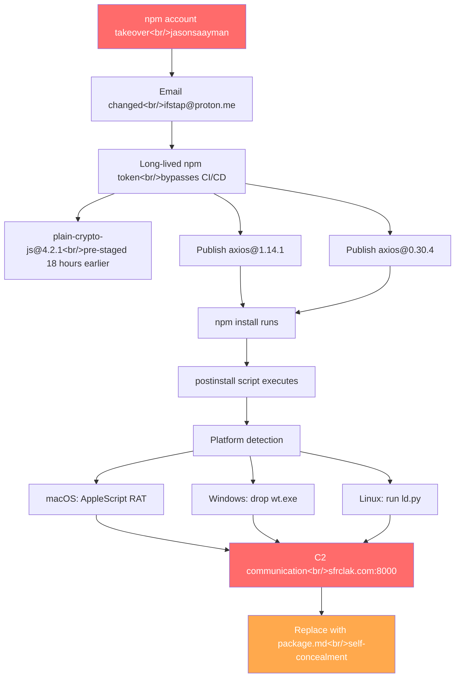

In the last week of March 2026, the open source ecosystem was hit by a cascade of supply chain attacks. axios — with weekly downloads over 100 million — was compromised on npm. LiteLLM — with 97 million monthly downloads — was breached on PyPI. And Claude Code's source code was exposed through npm `.map` files. This post covers the technical details of each incident, the common patterns they share, and what you can do about it.

<!--more-->

## 1. The axios Supply Chain Attack (2026-03-31)

### How It Happened

The npm account of axios lead maintainer **jasonsaayman** was taken over. The attacker changed the account email to a ProtonMail address (`ifstap@proton.me`), then used a **long-lived npm token** to bypass GitHub Actions CI/CD entirely and publish directly via the npm CLI.

Both release branches (1.x and 0.x) were compromised within **39 minutes**:

| Infected version | Safe version |
|-----------|-----------|
| `axios@1.14.1` | `axios@1.14.0` |
| `axios@0.30.4` | `axios@0.30.3` |

The malicious dependency `plain-crypto-js@4.2.1` had been pre-staged on npm **18 hours before the attack** under account `nrwise` (`nrwise@proton.me`). Pre-built payloads for three operating systems made this a highly premeditated operation.

### What the Malware Did

The infected axios versions inject a fake dependency called `plain-crypto-js@4.2.1`. This package is not imported anywhere in the axios source — its sole purpose is to deploy a **cross-platform RAT** (Remote Access Trojan) via the `postinstall` script.

#### Platform-Specific Payloads

| OS | Behavior | Artifact file |
|----|------|-----------|
| macOS | Downloads trojan from C2 via AppleScript | `/Library/Caches/com.apple.act.mond` |
| Windows | Drops executable in ProgramData | `%PROGRAMDATA%\wt.exe` |
| Linux | Executes Python script | `/tmp/ld.py` |

#### Self-Concealment Mechanism

After execution, the malware deletes itself and replaces `package.json` with a clean version pre-prepared as `package.md`, evading forensic detection. Even opening `node_modules` after infection would show everything as normal.

### Attack Flow



### Indicators of Compromise (IOC)

| Item | Value |
|------|-----|
| C2 domain | `sfrclak.com` |
| C2 IP | `142.11.206.73` |
| C2 port | `8000` |
| Malicious npm account | `nrwise` (`nrwise@proton.me`) |
| Malicious package | `plain-crypto-js@4.2.1` |
| Compromised account email | `ifstap@proton.me` |

### Additional Infected Packages

Additional packages distributing the same malware were identified:

- `@shadanai/openclaw` (versions 2026.3.28-2, 2026.3.28-3, 2026.3.31-1, 2026.3.31-2)
- `@qqbrowser/openclaw-qbot@0.0.130` (contains a tampered `axios@1.14.1` in `node_modules`)

### Incident Response Timeline

The situation was shared in real time in GitHub issue [axios/axios#10604](https://github.com/axios/axios/issues/10604). Collaborator DigitalBrainJS was unable to act directly because jasonsaayman held higher permissions. The situation was only resolved after requesting the npm team to revoke all tokens.

---

## 2. The LiteLLM Supply Chain Attack (2026-03-24)

### Background: The TeamPCP Campaign

This incident was part of a chained supply chain attack campaign by the **TeamPCP** hacking group, which started with security scanner **Trivy**.

| Date | Target |
|------|------|
| 2026-02-28 | Initial Trivy repository compromise |
| 2026-03-19 | 76 Trivy GitHub Actions tags tampered |
| 2026-03-20 | 28+ npm packages taken over |
| 2026-03-21 | Checkmarx KICS GitHub Action compromised |
| **2026-03-24** | **LiteLLM PyPI package compromised** |

LiteLLM was using Trivy in CI/CD security scanning **without version pinning**. When the tampered Trivy ran, PyPI publish tokens were transferred to the attacker.

### Attack Method

The attacker uploaded `litellm` v1.82.7 (10:39 UTC) and v1.82.8 (10:52 UTC) directly using the stolen PyPI token.

The core attack vector was a `.pth` file. Python's `.pth` files, when placed in `site-packages`, **execute automatically when the Python interpreter starts** — meaning any Python execution in that environment triggers the malicious code, even without `import litellm`.

```python
# litellm_init.pth (34,628 bytes) — one-liner
import os, subprocess, sys; subprocess.Popen([sys.executable, "-c", "import base64; exec(base64.b64decode('...'))"])
```

The decoded payload was a **332-line credential harvesting script** that collected:

- SSH keys (RSA, Ed25519, ECDSA, DSA, and all other types)
- Cloud credentials — AWS/GCP/Azure (including instance metadata)
- Kubernetes service account tokens and secrets
- PostgreSQL, MySQL, Redis, MongoDB config files
- Cryptocurrency wallets — Bitcoin, Ethereum, Solana, and others
- Shell history — `.bash_history`, `.zsh_history`, etc.

Collected data was double-encrypted (AES-256-CBC + RSA-4096) and sent to `https://models.litellm.cloud/` — a typosquatting domain registered one day before the attack.

### Scale of Impact

- **Monthly downloads**: ~97 million (~3.4 million/day)
- **PyPI exposure window**: ~3 hours
- **Cloud environment prevalence**: ~36% (Wiz Research analysis)
- Affected downstream projects: DSPy (Stanford), CrewAI, Google ADK, browser-use, and others

### How It Was Caught

Ironically, the attacker's own bug triggered the discovery. The `.pth` file spawned a child process on every Python startup, and each child would also re-execute the `.pth`, creating a **fork bomb** — memory would rapidly exhaust. FutureSearch.ai's Callum McMahon noticed the anomaly and filed an issue, but the attacker deployed a botnet of 73 accounts to flood the issue with 88 spam comments in 102 seconds trying to bury it.

Andrej Karpathy called this incident **"software horror."**

### How to Check for LiteLLM Infection

```bash
# Check installed version — 1.82.7 or 1.82.8 means infected
pip show litellm | grep Version

# Check for .pth file
find / -name "litellm_init.pth" 2>/dev/null

# Check for backdoor
ls ~/.config/sysmon/sysmon.py 2>/dev/null
ls ~/.config/systemd/user/sysmon.service 2>/dev/null

# Kubernetes environment
kubectl get pods -n kube-system | grep node-setup
```

---

## 3. Claude Code Source Code Exposure

Around the same time, another npm security incident was reported. The source code of Anthropic's **Claude Code CLI** was found to be **fully recoverable** through `.map` files (source maps) included in the npm package.

This was not a malicious attack, but it illustrates that including `.map` files in an npm package publish exposes the original source behind any obfuscated or bundled code. It is a reminder of the importance of configuring `.npmignore` or the `files` field properly.

---

## 4. Common Lessons and Defenses

### The Pattern Across All Three Incidents

All three incidents abused **trust in package registries (npm/PyPI)**:

| Pattern | axios | LiteLLM | Claude Code |
|------|-------|---------|-------------|
| Attack vector | npm account takeover | PyPI token theft (via Trivy) | Source map not excluded |
| Registry | npm | PyPI | npm |
| CI/CD bypass | Direct publish | Direct publish | N/A |
| Malicious behavior | postinstall RAT | .pth auto-execution | Source exposure |
| Concealment attempt | Replace with package.md | Botnet spam | None |

### Immediate Response Checklist

#### npm (axios)

```bash
# 1. Check for infected version
npm ls axios

# 2. Pin to safe version
npm install axios@1.14.0

# 3. Commit lockfile
git add package-lock.json && git commit -m "fix: pin axios to safe version"

# 4. Security audit
npm audit

# 5. Check for IOC network connections
# Look for outbound connections to sfrclak.com or 142.11.206.73
```

#### PyPI (LiteLLM)

```bash
# 1. Pin to safe version
pip install "litellm<=1.82.6"

# 2. If infected, rotate all secrets
# SSH keys, AWS/GCP/Azure credentials, DB passwords, API keys — replace everything
```

### Long-Term Defenses

1. **Pin versions**: Use exact versions instead of `^` or `~`. Always commit lockfiles.
2. **Block postinstall scripts**: Consider `npm install --ignore-scripts` in CI/CD.
3. **Require MFA**: Enable TOTP-based 2FA on npm/PyPI maintainer accounts.
4. **Manage token lifetimes**: Use OIDC-based short-lived tokens instead of long-lived ones. Rotate regularly.
5. **Pin CI/CD tool versions**: LiteLLM's unversioned Trivy use was the root cause. Security scanners are not exempt.
6. **Remove source maps**: Audit whether `.map` files are included in production npm packages.
7. **Monitor dependencies**: Continuously watch your supply chain with Socket, Snyk, or `npm audit`.

---

## Takeaways

The simultaneous npm and PyPI incidents in a single week reveal some uncomfortable truths.

**First, maintainers are a single point of failure.** In the axios case, one compromised account infected two release branches in 39 minutes, and other collaborators lacked the permissions to do anything. In a world where OIDC-based publishing is not yet widely adopted, long-lived tokens are ticking time bombs.

**Second, security tools themselves become attack vectors.** In the LiteLLM incident, security scanner Trivy became the entry point for the attack. Installing tools without version pins — like `apt-get install -y trivy` — is trading convenience for security.

**Third, attackers are becoming more sophisticated.** Pre-staging payloads 18 hours ahead, self-concealment mechanisms, deploying a 73-account botnet to bury GitHub issues, using AI agents for vulnerability scanning — supply chain attacks are industrializing.

**The bottom line**: when you run `npm install` or `pip install`, you are extending trust to thousands of maintainers. Basic hygiene measures — committing lockfiles, pinning versions, `--ignore-scripts`, and rotating tokens — have never mattered more.
