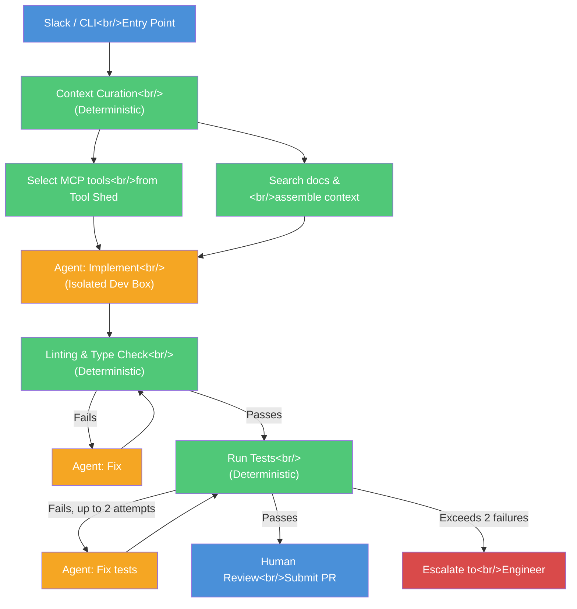
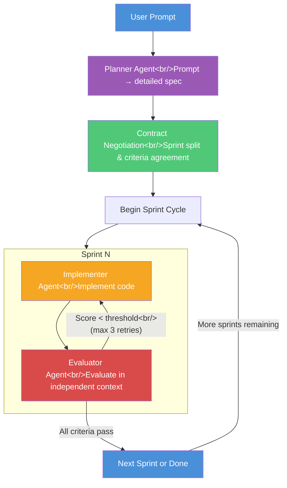

Stripe has disclosed that it merges over 1,300 AI-authored PRs per week. Engineers write no code themselves — they only review. At the same time, an **adversarial development** technique inspired by Anthropic research is dramatically improving coding agent reliability. This post analyzes the internal architecture of Stripe Minions and the adversarial development pattern, then looks at how to build something similar yourself.

<!--more-->

## Stripe Minions — Behind 1,300+ Weekly PRs

### Why Stripe

Stripe is one of the most demanding environments to run coding agents in.

- **Ruby backend** — an uncommon stack that is less familiar to LLMs
- **Massive proprietary libraries** — a homegrown, non-open-source codebase
- **Over $1T in annual payment volume** — a single code error can be catastrophic

The fact that AI-written PRs are being merged at 1,300+ per week in this environment means the workflow reliability is proportionally high. Among Stripe's 3,400+ engineers filing roughly 8,000 PRs per week, the AI-authored share is growing quickly.

### The Core Principle: System Controls the Agent

The key insight of Stripe Minions is that the **system controls the agent, not the other way around**.

In a typical AI coding workflow, the agent handles planning, implementation, and verification. The problem is there is no guarantee the agent performs the verification we actually want. Stripe addresses this by building blueprint-based workflows that combine **deterministic nodes** and **agent nodes**.

> "In our experience, writing code to deterministically accomplish small decisions we can anticipate — like we always want to lint changes at the end of a run — is far more reliable than asking an agent to do it."

**Green = Deterministic Node**, **Orange = Agent Node** — agents operate only in certain parts of the workflow.

### Context Curation — From 500 MCP Tools, Pick the Right Ones

Stripe runs a single internal MCP server called **Tool Shed** that connects internal systems and SaaS platforms. Around 500 MCP tools are registered, but giving all of them to the agent causes confusion rather than helping.

The first deterministic node in the workflow analyzes the request, then:

1. Searches relevant documentation and tickets to assemble context
2. **Selects only the relevant subset** of MCP tools to hand to the agent

The key is that this selection happens in code, not by the agent.

### Isolated Dev Box — Cattle, Not Pets

Every Minion run happens in an **isolated AWS EC2 instance** pre-loaded with the Stripe codebase and lint cache for fast startup, then discarded when the run ends.

- Superior **permission management and scalability** compared to worktrees or local containers
- An engineer can run multiple Minions in parallel simultaneously
- From over 3 million tests, only the **relevant subset** is selected and run

When tests fail, the agent attempts fixes up to 2 times, then escalates to a human if the tests still do not pass. **Infinite loop prevention** is built into the design.

## What Other Companies Are Doing

Stripe is not alone. Major tech companies are building similar structured workflow engines.

| Company | Tool | Notes |
|------|------|------|
| **Shopify** | Roast | Released as open source structured AI workflow engine |
| **Airbnb** | Internal tool | Specialized for test migration |
| **AWS** | Internal tool | Partially disclosed via blog posts |

The common thread: none of them delegate everything to agents. All **clearly separate deterministic steps from agent steps**.

## Adversarial Development — When Agents Argue

### The Sycophancy Problem — Gets Worse as Models Get Stronger

One of AI's biggest problems is **sycophancy**. LLMs tend to agree with users and to over-evaluate their own output. The troubling part is that this phenomenon gets **worse as models become more powerful**.

In coding agents, this is fatal:

- When an agent evaluates its own code → **"a student grading their own homework"**
- It points out a few minor issues while making the review look like it passed
- Real, serious problems remain hidden

### The Solution: A Separate Sparring Partner

This approach is inspired by GANs (Generative Adversarial Networks). Just as a GAN has a Generator that creates images and a Discriminator that judges their authenticity, a coding agent can split into an **Implementer** and an **Evaluator**.

The critical point is that the Evaluator operates in a **completely separate context session**. Without the bias accumulated during implementation, it can produce genuinely objective evaluations.

### Architecture Details

**Phase 1: Planner Agent**
- Takes the user's brief prompt and expands it into a detailed Product Specification
- Defines tech stack, feature requirements, and structure

**Phase 2: Contract Negotiation**
- Implementer and Evaluator **agree in advance**
- Spec is split into multiple Sprints
- Evaluation criteria and threshold (1–10 score) set per Sprint
- "Adversarial but fair" rules are established first

**Phase 3: Sprint Cycle**
- **Implementer**: Implements the features for the agreed Sprint
- **Evaluator**: Scores each criterion 1–10 in an independent context
- If below threshold, feedback is sent to Implementer for retry (max 3 times)
- All criteria pass → advance to next Sprint

### Cross-Model Evaluation

An interesting option is using **different models** for Implementer and Evaluator.

- Claude implements → Codex evaluates
- Codex implements → Claude evaluates

Because different models have different biases, cross-evaluation is more effective at addressing single-model sycophancy. This approach is directly inspired by Anthropic's multi-agent evaluation research.

## Building Your Own Structured Workflow

The core principles apply at any scale, not just Stripe's.

### Design Principles

1. **Predictable tasks must be deterministic** — enforce linting, type checking, and test execution in code
2. **Agents only for creative tasks** — implementation, bug fixes, and judgment-requiring work
3. **Cap retry counts** — set a maximum and escalate when exceeded, to prevent infinite loops
4. **Curate context up front** — do not hand the agent every available tool; provide only the subset needed for the task
5. **Isolated execution environment** — run in a sandbox that cannot affect production code

### Considerations for Adopting Adversarial Development

| Benefit | Cost |
|------|------|
| Far higher reliability than single-agent | Increased token usage (2-3x) |
| Resolves sycophancy problem | Longer execution time |
| Good results possible with cheaper models | Initial harness construction cost |
| Reduced human review burden | Contract negotiation overhead |

The core is a **reliability vs cost tradeoff**. In environments like Stripe where stability is critical, this overhead is fully justified. Even applied to PoC or prototype work, adversarial development delivers substantially higher completeness than a single agent.

## Takeaways

1. **The "system controls the agent" paradigm shift** — the era of delegating everything to agents is ending. Stripe, Shopify, Airbnb, and AWS have all adopted the model of inserting agents into specific parts of a larger workflow. The paradox is that reducing agent autonomy actually increases reliability.

2. **Sycophancy is a technical problem that requires a technical solution** — if stronger models do not reduce sycophancy, the architecture level must address it. Adversarial development is not a trick — it applies to coding agents a principle validated by GANs.

3. **Context curation is a competitive advantage** — selecting the right subset from Stripe's 500 MCP tools, running the relevant subset of 3 million tests — the accuracy of that "selection" determines the performance of the entire workflow.

4. **The potential of cross-model evaluation** — combining Claude and Codex (or similar) lets different models compensate for each other's blind spots. The question of model selection will shift from "which model is best?" to "which combination is optimal?"

---

> **Source videos**: [Stripe's Coding Agents Ship 1,300 PRs EVERY Week](https://www.youtube.com/watch?v=NMWgXvm--to) / [Coding Agent Reliability EXPLODES When They Argue](https://www.youtube.com/watch?v=HAkSUBdsd6M) — Cole Medin
