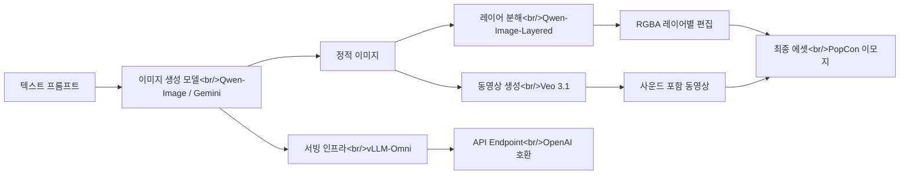

## Overview

The AI image generation space is evolving rapidly. Beyond simple text-to-image, the entire stack is being reorganized — from **layer decomposition** and **real-time editing** to **video generation** and **multimodal serving**. This post analyzes four notable recent projects.

- **Qwen-Image-Layered** — Decomposes images into RGBA layers, building editability in from the start
- **Nano Banana 2** — Based on Gemini 3.1 Flash, delivering Pro-level quality at Flash speed
- **Veo 3.1** — Video generation with sound, reference image-based style guidance
- **vLLM-Omni** — Unifying text/image/audio/video into a single serving framework

How these technologies combine in the PopCon project is covered in [PopCon Dev Log #1](/posts/2026-04-02-popcon-dev1/).

<!--more-->

## AI Image Pipeline Architecture

The current AI image generation ecosystem can be organized into a single pipeline as follows.



The key point is that a clear three-stage structure of **generation -> decomposition/editing -> serving** is emerging. Let's look at the tools at each stage.

---

## Qwen-Image-Layered — Building Editability Through Layer Decomposition

| Item | Details |
|------|------|
| GitHub | [QwenLM/Qwen-Image-Layered](https://github.com/QwenLM/Qwen-Image-Layered) |
| Stars | 1,741 |
| Language | Python |
| License | Apache 2.0 |
| Paper | [arXiv:2512.15603](https://arxiv.org/abs/2512.15603) |

### Core Idea

Traditional image editing has been dominated by mask-based inpainting. Qwen-Image-Layered takes a different approach by **decomposing images into multiple RGBA layers** from the start. It's essentially AI performing Photoshop's layer concept automatically.

### Architecture Analysis

- **Base model**: Diffusion model fine-tuned on top of Qwen2.5-VL
- **Pipeline**: `QwenImageLayeredPipeline` (HuggingFace diffusers integration)
- **Output format**: RGBA PNG layers + PSD/PPTX export support
- **Inference settings**: `num_inference_steps=50`, `true_cfg_scale=4.0`, 640 resolution recommended

```python
from diffusers import QwenImageLayeredPipeline
import torch

pipeline = QwenImageLayeredPipeline.from_pretrained("Qwen/Qwen-Image-Layered")
pipeline = pipeline.to("cuda", torch.bfloat16)

inputs = {
    "image": image,
    "layers": 4,           # Number of layers to decompose into (variable)
    "resolution": 640,
    "cfg_normalize": True,
}
output = pipeline(**inputs)
```

### Notable Design Patterns

1. **Variable layer count**: Decompose into as many layers as desired — 3, 8, or more. Recursive decomposition is also supported, enabling "infinite decomposition" where a single layer is further decomposed.
2. **Separated editing pipeline**: After decomposition, individual layers are edited with Qwen-Image-Edit and recombined with `combine_layers.py`. Clean separation of concerns.
3. **PSD export**: Uses the `psd-tools` library to connect directly with designer workflows.

### PopCon Application

When creating animated emoji, decomposing characters/backgrounds/props into layers enables independent animation of each element. For example, only the character moves while the background stays fixed.

---

## Qwen-Image Ecosystem — 20B MMDiT Foundation Model

To understand Qwen-Image-Layered, you need to look at the parent project [Qwen-Image](https://github.com/QwenLM/Qwen-Image) as well.

| Item | Details |
|------|------|
| GitHub | [QwenLM/Qwen-Image](https://github.com/QwenLM/Qwen-Image) |
| Stars | 7,694 |
| Model Size | 20B MMDiT |
| Latest Version | Qwen-Image-2.0 (2026.02) |

Qwen-Image is a foundation model with strengths in **text rendering** (especially Chinese) and **precise image editing**. Qwen-Image-2.0, released in February 2026, improved the following:

- **Professional typography rendering** — Direct generation of infographics like PPTs, posters, and comics
- **Native 2K resolution** — Fine detail in people, nature, and architecture
- **Unified understanding + generation** — Integrating image generation and editing into a single mode
- **Lightweight architecture** — Smaller model size, faster inference speed

It ranked **#1 among open-source image models** in AI Arena blind testing with over 10,000 evaluations.

---

## Nano Banana 2 — Image Generation at Gemini Flash Speed

### Google's Official Announcement

**Nano Banana 2** (officially Gemini 3.1 Flash Image), released by Google in February 2026, delivers Nano Banana Pro quality at Flash speed.

Key features:

- **Advanced world knowledge**: Accurate rendering leveraging Gemini's real-time web search information
- **Precise text rendering and translation**: Accurate text generation for marketing mockups and infographics
- **Subject consistency**: Maintaining consistency across up to 5 characters and 14 objects
- **Production specs**: 512px to 4K, supporting various aspect ratios
- **SynthID + C2PA**: Built-in AI-generated image provenance tracking technology

### nano-banana-2-skill CLI Analysis

| Item | Details |
|------|------|
| GitHub | [kingbootoshi/nano-banana-2-skill](https://github.com/kingbootoshi/nano-banana-2-skill) |
| Stars | 299 |
| Language | TypeScript (Bun runtime) |
| License | MIT |

This project wraps Nano Banana 2 as a CLI tool, and the design is quite clever.

### Architecture Features

1. **Multi-model support**: Easy model switching with `--model flash` (default), `--model pro`, etc.
2. **Green Screen pipeline**: A single `-t` flag generates transparent background assets
   - AI generates on green screen -> FFmpeg `colorkey` + `despill` -> ImageMagick `trim`
   - Auto-detects key color from corner pixels (since AI uses approximations like `#05F904` instead of exact `#00FF00`)
3. **Cost tracking**: Records every generation in `~/.nano-banana/costs.json`
4. **Claude Code Skill**: Also works as a Claude Code plugin, enabling image generation through natural language commands like "generate an image of..."

### Cost Structure

| Resolution | Flash Cost | Pro Cost |
|---------|-----------|----------|
| 512x512 | ~$0.045 | N/A |
| 1K | ~$0.067 | ~$0.134 |
| 2K | ~$0.101 | ~$0.201 |
| 4K | ~$0.151 | ~$0.302 |

At $0.15 per 4K image, this is very affordable. A realistic price point for bulk asset generation.

### PopCon Application

When bulk-generating PopCon emoji assets, Nano Banana 2's `-t` (transparent background) mode is immediately usable. The workflow is to generate character assets on a green screen and automatically remove the background through the FFmpeg pipeline.

---

## Veo 3.1 — AI Video Generation with Sound

Google's Veo 3.1 is a model that generates **videos with sound** from text prompts.

### Key Features

- **Native audio generation**: Sound is included in the video without separate TTS/sound models
- **Reference image-based style guide**: Upload multiple images to specify character/scene style
- **Portrait video support**: Uploading portrait images generates social media-ready vertical videos
- **8-second duration**: Currently supports up to 8-second video generation

### Pricing Tiers

| Model | Plan | Features |
|------|--------|------|
| Veo 3.1 Fast | AI Pro | High quality + speed optimized |
| Veo 3.1 | AI Ultra | Best-in-class video quality |

### PopCon Application

Going beyond static emoji, Veo 3.1 can add short animations and sound effects to emoji. Suitable for scenarios like "a smiling character waving for 2 seconds + sound effect."

---

## vLLM-Omni — Multimodal Serving Framework

| Item | Details |
|------|------|
| GitHub | [vllm-project/vllm-omni](https://github.com/vllm-project/vllm-omni) |
| Stars | 4,094 |
| Language | Python |
| Latest Release | v0.18.0 (2026.03) |
| Paper | [arXiv:2602.02204](https://arxiv.org/abs/2602.02204) |

### Why It Matters

All the models above (Qwen-Image, Qwen-Image-Layered, etc.) are great, but serving them in production is a separate problem. vLLM-Omni fills this gap.

### Architecture Highlights

The original vLLM only supported text-based autoregressive generation. vLLM-Omni extends it in three ways:

1. **Omni-modality**: Processing text, image, video, and audio data
2. **Non-autoregressive architecture**: Supporting parallel generation models like Diffusion Transformers (DiT)
3. **Heterogeneous output**: From text generation to multimodal output

### Performance Optimizations

- **KV cache management**: Leverages vLLM's efficient KV cache as-is
- **Pipeline stage overlapping**: High throughput
- **OmniConnector-based full decoupling**: Dynamic resource allocation between stages
- **Distributed inference**: Full support for tensor, pipeline, data, and expert parallelism

### Supported Models (as of March 2026)

Major models supported in v0.18.0:

- **Qwen3-Omni / Qwen3-TTS**: Unified text + image + audio
- **Qwen-Image / Qwen-Image-Edit / Qwen-Image-Layered**: Image generation/editing/decomposition
- **Bagel, MiMo-Audio, GLM-Image**: Other multimodal models
- **Diffusion (DiT) stack**: Image/video generation

### Day-0 Support Pattern

A notable aspect of vLLM-Omni is the "Day-0 support" pattern that **provides serving support simultaneously with new model releases**. vLLM-Omni support was available on the same day Qwen-Image-2512 launched, and the same was true for Qwen-Image-Layered. This demonstrates close collaboration between model development teams and serving infrastructure teams.

### PopCon Application

When building the emoji generation API for the PopCon service, using vLLM-Omni as the serving layer allows the entire pipeline — generating images with Qwen-Image and decomposing them with Qwen-Image-Layered — to be hidden behind a single OpenAI-compatible API.

---

## Quick Links

- [Qwen-Image-Layered GitHub](https://github.com/QwenLM/Qwen-Image-Layered) — Image layer decomposition model
- [Qwen-Image GitHub](https://github.com/QwenLM/Qwen-Image) — 20B image foundation model
- [Qwen-Image-Layered Paper](https://arxiv.org/abs/2512.15603)
- [nano-banana-2-skill GitHub](https://github.com/kingbootoshi/nano-banana-2-skill) — Gemini-based image generation CLI
- [Nano Banana 2 Official Blog](https://blog.google/innovation-and-ai/technology/ai/nano-banana-2/) — Google official announcement
- [Veo 3.1 Introduction Page](https://gemini.google/kr/overview/video-generation/?hl=ko) — Video generation with sound
- [vLLM-Omni GitHub](https://github.com/vllm-project/vllm-omni) — Multimodal serving framework
- [vLLM-Omni Paper](https://arxiv.org/abs/2602.02204)

---

## Insights

**The ecosystem is vertically integrating.** The Qwen team covers the entire stack from foundation model (Qwen-Image) to specialized models (Layered, Edit) to serving (vLLM-Omni Day-0 support). Google has bundled generation with Nano Banana 2, video with Veo 3.1, and provenance tracking with SynthID/C2PA. We've entered a stage where **the completeness of the entire pipeline** rather than individual model performance determines competitiveness.

**Editability is the new differentiator.** The competitive axis is shifting from "generating good images" to "how easily can you modify the generated images." Qwen-Image-Layered's layer decomposition is a prime example of this direction. When separated at the layer level, basic operations like recolor, resize, and reposition **physically cannot affect other content**.

**Serving infrastructure is the bottleneck.** No matter how good a model is, it's meaningless if you can't serve it in production. vLLM-Omni extending the text-only vLLM to cover Diffusion Transformers is an attempt to resolve this bottleneck. In particular, optimizations like long sequence parallelism and cache acceleration are bringing the serving costs of image generation models down to realistic levels.

**The toolchain determines developer experience.** There's a reason a CLI wrapper like nano-banana-2-skill earned 299 stars. The experience of getting a transparent background asset with a single line like `nano-banana "robot mascot" -t -o mascot` is fundamentally different from reading API docs and writing code. Since it also works as a Claude Code skill, you can generate images directly from your AI coding assistant.
