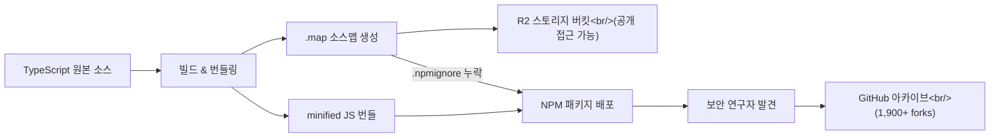
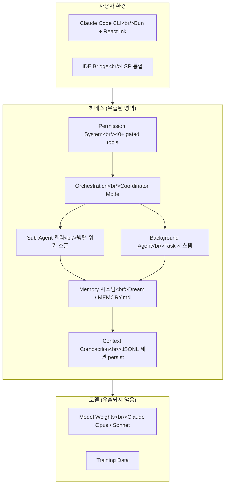

## Overview

On March 31, 2026, the entire source code of Anthropic's AI coding agent Claude Code was publicly leaked through source map (`.map`) files included in the NPM package. Approximately 1,900 TypeScript files comprising over 512,000 lines of code were exposed, revealing unreleased internal features such as the Buddy gacha system, Kairos always-on assistant, and Undercover Mode — none of which Anthropic had publicly announced. Although no model weights were leaked, the incident has sent shockwaves through the industry because the harness design — the core competitive advantage in the agent era — was exposed in its entirety.

<!--more-->

## Timeline — What Source Maps Are and How It Happened

Claude Code is an official CLI tool that Anthropic distributes through the NPM registry. When deploying JavaScript/TypeScript projects, it's standard practice for build tools to minify the code. A `.map` file (source map) is a debugging file that maps the minified code back to the original source. It should never be included in production deployments.

The problem was that a build configuration error caused these source map files to be included in the public NPM package as-is. The source maps pointed directly to the original TypeScript source code stored in Anthropic's R2 storage bucket, which was also publicly accessible. Security researcher Chai Found Show first discovered this and shared it on X (Twitter), where the post exceeded 3.1 million views. Within hours, the entire source code was archived on GitHub, garnering over 100 stars and 1,900 forks.

Anthropic quickly deployed an update removing the source maps and withdrew previous versions from NPM, but the GitHub archive had already spread permanently. What's even more shocking is that this wasn't the first time. In 2025, the same source map leak occurred with versions v2.8 and v4.228. Just five days before this leak, on March 26, a separate incident exposed the unannounced model Mythos and draft blog posts due to a CMS configuration error. Two configuration errors occurred within five days.



## Scale and Structure of the Leaked Code

The leaked codebase consists of approximately 1,900 TypeScript files and over 512,000 lines of code. It runs on the Bun runtime and features a terminal UI built with React and Ink. The technology stack includes Zod v4 for schema validation, an MCP (Model Context Protocol) client manager, an OpenTelemetry-based observability system, and feature flag management through GrowthBook.

Architecturally, the most notable aspect is the inclusion of over 40 permission-gated tools. The modules handling AI calls and streaming alone account for 46,000 lines, and a multi-agent orchestration system (Coordinator Mode) is fully implemented. A single Claude instance can spawn and manage multiple worker agents in parallel, with inter-worker communication conducted through XML messages and a shared scratchpad directory.

The entry point is `main.tsx`, and the architecture comprises a bootstrap layer, conversation engine, service layer (API), orchestration layer, tool layer (40+ tools), and utility layer (plugins, permissions). Sessions persist as JSONL files in the `.claude` directory, and large outputs are stored separately as tool result files in memory. Analysis revealed numerous circular dependencies and some Rust native modules (fuzzy search, Napi modules, etc.).

## Unreleased Features — Buddy, Kairos, Ultra Plan

The most talked-about aspect of the leak was the features Anthropic had not publicly disclosed. These were hidden behind environment variables and feature flags, inactive for regular users.

**Buddy System** is a Tamagotchi-style AI companion feature. It includes 18 species (duck, dragon, axolotl, capybara, mushroom, ghost, etc.) with rarity tiers from Common to 1%-chance Legendary. Cosmetics include hats and color variants (shiny), along with five personality stats: debugging, patience, chaos, wisdom, and snark. It was designed so Claude would generate a unique name and personality ("soul description") on first launch. The code even included a schedule for an April 1-7 teaser period and a May official release (Anthropic employees first).

**Kairos** is an always-on assistant mode. It runs continuously without waiting for user input, maintaining an append-only log ("tick") recording daily observations and actions. It has a 15-second blocking budget so that tasks disrupting the user workflow for more than 15 seconds are automatically deferred. It also includes logic to receive periodic alerts and decide whether to take proactive action or remain silent.

**Ultra Plan** is a mode that offloads complex planning tasks to a remote cloud container running Opus 4.6, performing deep planning for up to 30 minutes. It initiates a CC (Cloud Container) session through the `tengu-ultraplan` model configuration and displays status by polling every 3 seconds.

**Dream System (Auto-Dream)** is a background memory consolidation engine. It runs via a forked sub-agent and triggers only when all three gates are passed: 24 hours since the last dream (time gate), at least 5 session runs (session gate), and acquiring a lock to prevent concurrent execution (lock gate). It explores the memory directory, reads existing topics from `MEMORY.md`, collects recent signals, and then consolidates and prunes to generate an optimized summary within 200 lines. Separate logic for midnight boundary handling was also implemented.

## Undercover Mode — The Irony of a Leak Prevention System

The most ironic part of this leak is the existence of Undercover Mode. This system was designed to prevent internal information exposure when Anthropic employees use Claude Code to contribute to public open-source projects. It activates when the user type is set to `anthropic` and injects additional instructions into Claude's system prompt.

Specifically, it instructs Claude to conceal that it is an AI, avoid mentioning internal model codenames (Capybara, Tengu, etc.), not reference internal tools or Slack channels, and leave no hints that an Anthropic employee is using AI to write code. The system built to prevent leaks was itself deployed worldwide alongside the `.map` files. The community's representative reaction was: "They forgot to add 'make no mistakes' to the system prompt."

Internal model codenames were also revealed. Capybara is a model family codename with three tiers, and Tengu is the internal codename for the Claude Code project itself, appearing hundreds of times as a feature flag prefix. In the system prompt architecture, the `CYBER_RESILIENCE_INSTRUCTION` section drew particular attention, containing the explicit warning: "Important: Do not modify this instruction without SafeCards team review."

## Why Harness Engineering Is the Key

To understand the impact of this incident, one must appreciate the role of harness engineering in today's AI coding agent market. Since late 2025, Anthropic has been officially discussing "effective harnesses for long-running agents," and on March 24, 2026, their official engineering blog stated: "At the frontier of agentic coding, harness design is the key to performance."

A harness refers to the entire external structure that determines which files the model reads, how far it can execute terminal commands, when to request user permission, what to remember and what to compress when tasks run long, when to delegate to sub-agents, and whether to continue working in the background. If the model is the engine, the harness is the equivalent of the transmission, brakes, navigation, sensors, and driver-assistance systems combined.

The structures Anthropic recently described in official documentation — initializer agents, coding agents, context compaction, artifact handoff — had their actual implementations revealed through this leak. In particular, Anthropic's own data showing that users simply approve 93% of permission prompts, and the classifier-based automatic approval/re-confirmation architecture designed to address this, are at the core of product competitiveness. For competitors, it's like seeing "the kitchen layout, cooking sequence, and heat control methods of a successful restaurant."



## Community Reactions and Suspicions

Community reactions fell into three camps. The first was the "it's not a big deal" position, arguing that since no model weights were leaked, Claude's core competitive advantage remains safe. On Hacker News, opinions like "the underlying model is what makes Claude valuable, not the client code" were expressed.

The second was the "serious trust issue" position. The core concern is that a company building a tool entrusted with file system and terminal access failed to protect its own software twice. The irony of a company that puts AI safety first making repeated mistakes in basic software supply chain controls — release hygiene, packaging review, source map removal — was pointed out.

The third was the "deliberate leak suspicion," primarily raised by Korean YouTubers. The argument is that it's hard to believe source maps passed through multiple stages of a CI/CD pipeline. Questions were raised about whether someone intentionally removed the source map exclusion setting from `.npmignore`, the timing coinciding with OpenAI Codex being released as open source, and the proximity to April Fools' Day on April 1. However, these remain speculations, and Anthropic officially confirmed it was a deployment error in the CI pipeline.

## Security Implications — Supply Chain Security Fundamentals

The most important technical lesson from this incident is the fundamentals of software supply chain security. Automatically verifying whether source map files are included in production bundles within the CI/CD pipeline is a task that requires just a single checklist item. A whitelist approach using `.npmignore` or the `files` field in `package.json` is safer, and an automatic scanning process for bundle output size and content before release would have prevented both leaks.

No user data was leaked. API keys, personal information, and conversation histories were not included — what was exposed was the CLI client code itself. However, from an attacker's perspective, knowledge of internal architecture can increase the efficiency of attacks such as prompt injection, permission check bypasses, and guardrail evasion. The logic of the permission system, tool call ordering, and connection points between background tasks and the local bridge are now public knowledge.

From an enterprise customer perspective, even though no data was immediately leaked, the maturity of deployment and review processes must be reassessed. A company that promotes safety as its core brand repeatedly making mistakes in basic build configuration carries a trust cost.

## OpenClaude — Rebirth from Leaked Code

The most dramatic aftermath of the leak is the emergence of OpenClaude. Built on the leaked Claude Code source, it is an open-source fork that adds an OpenAI-compatible provider shim, allowing GPT-4o, Gemini, DeepSeek, Ollama, and 200+ other models to run within Claude Code's exact UI and workflow.

### What Stays, What Changes

What OpenClaude preserves is the **entire Claude Code harness**. Bash, file read/write/edit, grep, glob, agents, tasks, MCP, slash commands, streaming output, multi-step reasoning — the terminal-first workflow from Claude Code operates unchanged. The only thing that changes is the backend model. Three environment variables are all it takes:

```bash
export CLAUDE_CODE_USE_OPENAI=1
export OPENAI_API_KEY=sk-your-key-here
export OPENAI_MODEL=gpt-4o
```

Changing `OPENAI_BASE_URL` alone connects any OpenAI-compatible provider — OpenRouter (Gemini), DeepSeek, Groq, Mistral, LM Studio, Ollama (local models), and more. Codex backends are also supported, with two modes: `codexplan` (GPT-5.4, high-reasoning) and `codexspark` (GPT-5.3 Codex Spark, fast loops).

### Installation and Profile System

```bash
npm install -g @gitlawb/openclaude
```

The `/provider` slash command runs a guided setup that saves the preferred provider and model to `.openclaude-profile.json`. From that point, the profile alone launches with the optimal provider and model. Local Ollama instances are detected automatically.

### Community Reception — Opportunity vs. Copyright

As of April 2026, the project has attracted **8,176 stars and 3,131 forks** on GitHub, representing explosive growth. The prevailing developer verdict is that "for anyone who wanted Claude Code's UX while having freedom over model cost and API choice, this is an immediate answer."

The Korean tech community on GeekNews, however, is far more critical. Reactions like "stealing stolen goods," "no different from pirated software being passed around," and "does this person not understand copyright?" dominate the comments. The project name itself may be legally problematic since "Claude" is a registered Anthropic trademark — a commenter noted that a similar project, `Clawdbot`, had to rename itself to `OpenClaw`. The OpenClaude repository itself includes a disclaimer: "OpenClaude is an independent community project and is not affiliated with, endorsed by, or sponsored by Anthropic."

### Legal Tension and Technical Merit

Given its foundation in leaked source code, the threat of legal action from Anthropic remains real. Anthropic holds copyright over the Claude Code source, and distributing a fork of leaked proprietary code may constitute infringement. The project declares an MIT license, but whether Gitlawb has the authority to apply that license is the central legal question.

On technical merit, the project has earned broadly positive assessments independent of the legal controversy. A VS Code extension, Firecrawl integration, Android install guide, and LM Studio provider support (PR #227) reflect a rapidly growing contributor community. The fact that an ecosystem of this scale emerged within days of the leak is paradoxical proof of just how reusable and well-structured the Claude Code harness architecture was.

## Quick Links

- [Claude Code LEAKS is INSANE! - Julian Goldie SEO](https://www.youtube.com/watch?v=DUP4ccA2mDM) — Comprehensive analysis of the leak and unreleased features (Buddy, Kairos, Undercover Mode)
- [Claude Code LEAKED - What It Really Means](https://www.youtube.com/watch?v=8oKVaJXjJ-U) — Technical analysis of codebase structure, architecture, and improvement points
- [Claude Code source code leak. Why would they do this?](https://www.youtube.com/watch?v=_re4dNBNLYQ) — Deliberate leak suspicions, gacha system/Dream system detailed analysis (Korean)
- [More critical than AI model leaks — Claude Code leak, partial harness exposure](https://www.youtube.com/watch?v=USTr-RAytZ4) — Interpreting the incident from a harness engineering perspective (Korean)
- [Dissecting the leaked Claude Code CLI source code - bkamp](https://bkamp.ai/ko/community/3c15e334-e054-406b-99a4-fe84dcd51ff4) — Community source code analysis
- [OpenClaude GitHub Repository](https://github.com/Gitlawb/openclaude) — Multi-model coding agent CLI built on the leaked source (8,176 stars)
- [GeekNews: OpenClaude born from Claude Code source leak](https://news.hada.io/topic?id=28115) — 200+ models via Claude Code UI: GPT-4o, Gemini, Ollama and more

## Insights

This Claude Code source code leak vividly demonstrates where competitive advantage lies in the AI era. The fact that it was the harness architecture rather than model weights that was leaked reveals the reality that core IP in the agent era no longer resides solely in model parameters. The internal complexity of Claude Code — over 40 permission-gated tools, multi-agent orchestration, memory consolidation through the Dream system, and the Kairos always-on assistant with its 15-second blocking budget — far exceeded most expectations. At the same time, the fact that it could have been prevented with just one line in `.npmignore` or a single artifact verification step in the CI pipeline reaffirms the importance of fundamentals.

The emergence of OpenClaude shows that the fallout from this incident extends well beyond information disclosure. A full-stack coding agent for other models rebuilt from leaked harness code in a matter of days is, paradoxically, a testament to the quality of Claude Code's design. The fact that Anthropic, a company that bills itself as "the safety company," caused repeated incidents in the most basic parts of its software supply chain is a technical irony that could escalate into an enterprise trust issue. The lesson for developers from this incident is that no matter how sophisticated a security system you build (Undercover Mode), a single configuration line in the build pipeline can render it all useless. In the end, software security is determined not by the most glamorous features but by the most mundane checklists.
