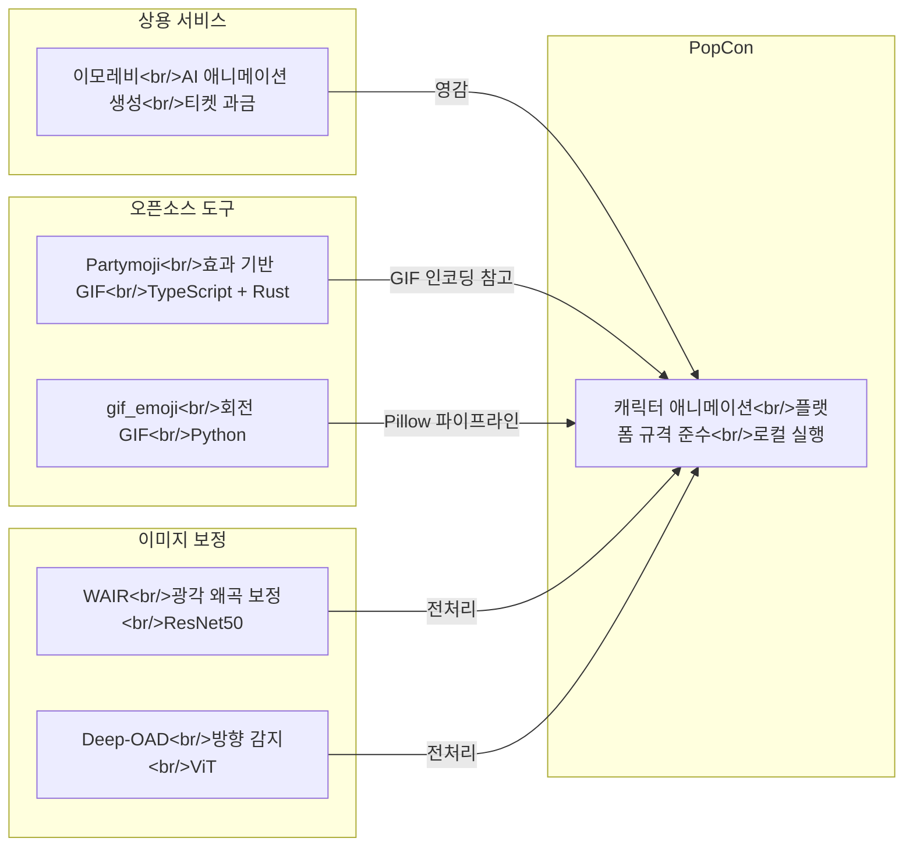

## Overview

Animated emoji and stickers are a core revenue source and user expression medium in the mobile messaging ecosystem. The KakaoTalk emoticon market is worth hundreds of billions of won annually, and LINE Creators Market is an open platform where creators worldwide participate. This post surveys platform-specific technical specs, existing creation tools, open-source alternatives, and image correction techniques to analyze what niche the PopCon project can target.

How PopCon is implemented in this market is covered in [PopCon Dev Log #1](/posts/2026-04-02-popcon-dev1/).

<!--more-->

## Market Status

### KakaoTalk Emoticons

The KakaoTalk Emoticon Store is the largest digital sticker market in South Korea. Key characteristics:

- **Review-based registration**: Creators submit and go through KakaoTalk's review process before launch
- **Animated emoticons**: 24-frame animations in APNG or GIF format
- **Revenue sharing**: Creators receive 35% (platform fees are relatively high)
- **Intensifying competition**: Thousands of new emoticon sets are submitted monthly, with a low approval rate

### LINE Creators Market

LINE operates a market open to global creators. It has two categories — animated stickers and emoji — each with different specifications.

**Animated Sticker Specs:**

| Item | Specification |
|------|------|
| Image size | Max 320 x 270px (minimum 270px on one side) |
| Frame count | 5-20 frames (APNG) |
| Play duration | Max 4 seconds |
| Loop count | 1-4 loops |
| File size | Max 1MB per sticker, max 60MB total ZIP |
| File format | APNG (.png extension) |
| Set composition | Choose from 8, 16, or 24 stickers |
| Background | Transparent required |
| Color space | RGB |

**Emoji Specs:**

| Item | Specification |
|------|------|
| Image size | 180 x 180px |
| Set composition | 8-40 (standard), up to 305 with text emoji |
| File size | Max 1MB per emoji, ZIP under 20MB |
| Resolution | Min 72dpi, RGB |
| Design guideline | Bold, dark outlines, simple shapes |

A particularly notable point in LINE's review guidelines is that **emoji are displayed large like stickers when sent alone**. Therefore, designs need to be identifiable at small sizes while also looking good at large sizes.

## Existing Creation Tool Analysis

### Emorevi

[Emorevi](https://tokti.ai/emorevi) is an AI-powered animated emoticon creation SaaS.

**Core Features:**
- **AI Generation**: Automatic animation generation from a single image
- **Smart Interpolation**: Natural interpolation algorithms between frames
- **Platform Optimized**: Presets for KakaoTalk, LINE, Discord, and other platforms
- **Multi-format support**: Export to MP4, GIF, APNG, WebP
- **Style Transfer**: Animation style customization
- **Real-time Preview**: Live preview during editing

**Pricing:**
| Plan | Price | Tickets | Per-ticket cost |
|------|------|---------|-----------|
| Basic | $9.99 | 1,000 | $0.01 |
| Standard | $29.99 | 3,600 (+600 bonus) | $0.008 |
| Premium | $99.99 | 14,000 (+4,000 bonus) | $0.007 |

Emorevi offers a "from one image to animation" workflow, but its ticket-based billing model means costs accumulate with bulk production. Quality control over generated outputs is also limited.

## Open-Source Solutions

### Partymoji

[Partymoji](https://github.com/MikeyBurkman/partymoji) is a web-based animated GIF generator built with TypeScript + Rust.

- **Stack**: TypeScript (219K LoC), Rust (GIF encoder), runs in web browser
- **Features**: Applies party effects (rainbow, rotation, sparkle, etc.) to images to create animated GIFs
- **Live demo**: https://mikeyburkman.github.io/partymoji/
- **Highlights**: IndexedDB-based project saving, Bezier curve animation control
- **Limitations**: No output features tailored to emoticon/sticker platform specs; effect-focused (not original character animation)

### gif_emoji

[gif_emoji](https://github.com/tomarrell/gif_emoji) is a minimal Python (Pillow) tool that converts images into rotating GIFs.

- **Output**: 32x32 GIF, 36 frames (rotating 10 degrees each)
- **Use case**: Slack custom emoji (compliant with 60KB limit)
- **Code size**: 1,655 lines of Python — very concise
- **Limitations**: Only rotation animation, hardcoded size/frame count

Both projects take an "apply effects to images" approach. This is fundamentally different from making the character itself move (expression changes, hand waving, etc.).

## Image Correction Techniques

In the animated emoji production pipeline, input image quality directly impacts the final output. Let's look at two related technologies.

### WAIR — Wide-angle Image Rectification

[WAIR](https://github.com/loong8888/WAIR) is a deep learning model for correcting wide-angle/fisheye lens distortion.

- **Architecture**: ResNet50-based, ImageNet pretrained
- **Distortion models**: Supports FOV, Division Model, and Equidistant
- **Performance**: PSNR 26.43 / SSIM 0.85 on ADE20k dataset (FOV model)
- **Practicality**: Distortion parameters estimated from 256x256 input can be applied to 1024x1024 originals (warping in 5.3ms)
- **Emoji relevance**: Useful for distortion correction when users use photos from smartphone wide-angle cameras as emoji source material

### Deep-OAD — Image Orientation Angle Detection

[Deep-OAD](https://github.com/pidahbus/deep-image-orientation-angle-detection) is a model that detects and automatically corrects image rotation angles.

- **V2 update**: Achieved SOTA with ViT (Vision Transformer)
- **Accuracy**: Test MAE of 6.5 degrees across the 0-359 degree range
- **Training data**: Trained on most MS COCO images
- **Application**: Automatically detecting orientation of user-uploaded images for correction in the preprocessing stage

These two technologies can be integrated into a preprocessing pipeline that "automatically normalizes the source images provided by users."

## Tool Comparison

## Differentiation from PopCon

Summarizing the limitations of existing tools reveals the position PopCon can occupy:

| Aspect | Existing Tools | PopCon |
|------|-----------|--------|
| **Animation method** | Effect application (rotation, party) or AI black box | Intentional movement via character rigging |
| **Platform specs** | Generic GIF output | LINE/KakaoTalk spec presets built in |
| **Cost** | SaaS billing (Emorevi) | Local execution, free |
| **Control level** | Limited parameters | Fine-grained frame-by-frame control |
| **Image preprocessing** | None | Distortion correction + orientation detection pipeline integration |
| **Output format** | Primarily GIF | APNG, GIF, WebP multi-format |

The key differentiators boil down to three points:

1. **Automated spec compliance** — Providing presets for LINE animated sticker constraints like 320x270px, 5-20 frames, and 4-second limits to reduce submission trial and error
2. **Character-centric animation** — Instead of "applying" effects, generating animation where the character "moves"
3. **Preprocessing pipeline** — Integrating correction models like WAIR and Deep-OAD to normalize input images of varying quality

## Quick Links

- [Emorevi — AI Animated Emoticon Creation](https://tokti.ai/emorevi)
- [LINE Creators Market Animated Sticker Guidelines](https://creator.line.me/ko/guideline/animationsticker/)
- [LINE Creators Market Emoji Guidelines](https://creator.line.me/ko/guideline/emoji/)
- [Partymoji — Web-based Animated GIF Generator](https://github.com/MikeyBurkman/partymoji)
- [gif_emoji — Python Rotating GIF Generator](https://github.com/tomarrell/gif_emoji)
- [WAIR — Wide-angle Image Distortion Correction](https://github.com/loong8888/WAIR)
- [Deep-OAD — Automatic Image Orientation Detection](https://github.com/pidahbus/deep-image-orientation-angle-detection)

## Insights

- **The market entry barrier is in "review"** — It's harder to consistently produce quality that passes KakaoTalk/LINE review than to technically create animations. Having automation tools strictly follow specs is the first challenge.
- **The open-source gap is large** — partymoji and gif_emoji are at the "toy" level. There are virtually no open-source tools that generate character animations while complying with platform specs.
- **Emorevi's limitations are an opportunity** — The SaaS model accumulates costs with bulk production, and fine control over AI-generated output is difficult. There's demand for a locally-run tool with frame-by-frame control.
- **Preprocessing automation determines UX** — If a user's uploaded photo is tilted or has wide-angle distortion, the result looks awkward no matter how good the animation engine is. Integrating preprocessing with models like WAIR + Deep-OAD can significantly improve perceived quality.
- **APNG is the essential format** — Both LINE and KakaoTalk officially support APNG. It has richer color representation than GIF (alpha channel support) and better file size efficiency. PopCon's default output format should be APNG.
