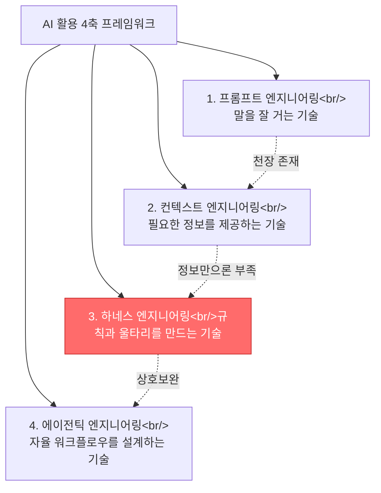
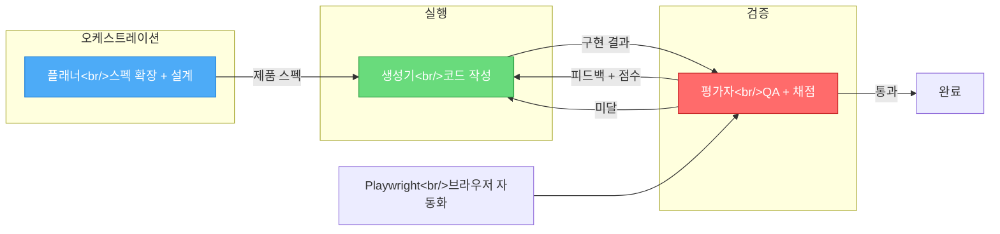

## Overview

Previous posts covered the basic concepts of harnesses (the three elements of guardrails/monitoring/feedback loops), checkpointing and state management for long-running agents, and plugin ecosystems. This post covers **two perspectives not previously addressed**. First, the **prompt -> context -> harness -> agentic 4-axis framework** from SilbeDeveloper's YouTube video and the core philosophy that "prompts are requests, harnesses are physical barriers." Second, the **planner-generator-evaluator trio architecture** and sprint contract pattern from a TILNOTE article analyzing Anthropic's harness design documentation. Related posts: [Long-Running Agents and Harness Engineering](/posts/2026-03-30-long-running-agents/), [HarnessKit Dev Log #3](/posts/2026-03-25-harnesskit-dev3/)

<!--more-->

---

## The 4-Axis Framework — From Prompt to Agentic

In the video [Prompt Engineering Is Over: The Era of 'Harness' Has Arrived](https://www.youtube.com/watch?v=6gvnDSAcZww), SilbeDeveloper organizes AI utilization methodologies into four axes. These axes are not graduated sequentially — they are **all simultaneously necessary and complementary**.

### The Ceiling of Prompts

Prompt engineering is the skill of "talking to AI effectively." Specifying "an engineering calculator with sin/cos support and a GUI" instead of just "make me a calculator" yields different results. But there's a ceiling. No matter how sophisticated the prompt, you can't get good code without knowledge of the project's tech stack, code structure, and DB schema.

### Why Context Alone Isn't Enough

Context engineering provides project structure, existing code, API documentation, and design guidelines together. Anthropic's definition: "The skill of appropriately selecting and providing the information AI needs to do its work." The key is not providing a lot, but providing **exactly what's needed right now**.

But there are problems that context engineering can't solve no matter how well designed. Cases where **the AI has all the information but does something unexpected**. You assign it to a payment system and it changes the DB schema on its own, or prints credit card numbers to the log. This isn't an information problem — it's a problem of **rules and boundaries**.

### Harness vs Agentic — Reins vs Horse Training

Previous posts covered the basic concepts of harnesses but didn't clearly articulate the relationship with agentic engineering. The video's summary is clean:

| Perspective | Agentic Engineering | Harness Engineering |
|------|-------------------|-----------------|
| Analogy | The skill of training the horse | The skill of making the reins |
| Focus | **How** the AI thinks | **What** the AI can and cannot do |
| Failure Response | Prompt changes, reasoning loop adjustments | Automatically adding rules/tests |
| Human Role | Delegator, supervisor | Designer, boundary setter |

The key in one line: **No matter how well-trained the horse, it cannot plow a field without reins.**

---

## Structural Non-Repeatability — The Core Philosophy of Harnesses

Previous posts covered guardrails and feedback loops, but the **most important statement** from the video deserves separate discussion:

> When an agent violates a rule, you don't fix the prompt by saying "try harder." **You fix the harness so that failure becomes structurally impossible to repeat.**

### Request vs Physical Barrier

Suppose an AI agent directly called the DB from frontend code.

- **Prompt approach**: Add "Don't call the DB directly" to the prompt -> It makes the same mistake next time. **Because a prompt is a request, not enforcement.**
- **Harness approach**: Add an architecture test so that the moment the frontend folder imports DB, **the build fails**. It becomes structurally impossible.

This distinction matters because previous posts addressed "guardrails" at a conceptual level. The framing of "prompts are requests, tooling boundaries are physical barriers" provides a criterion for judging what level of constraint to apply in practice.

---

## The 4 Pillars of Harness — Beyond the Original 3 Elements

Previous posts covered the guardrails/monitoring/feedback loop triad. The video introduces Martin Fowler's 4-pillar structure, which overlaps with the original three elements but includes **two notable additions**.

### New Pillar 1: Tool Boundaries

Physically limiting what tools an AI agent can use and what it can access:

- **File system**: `src/` folder is read/write, `config/` folder is read-only
- **API**: Internal API calls allowed, external service calls blocked
- **Database**: SELECT allowed, DROP TABLE absolutely forbidden
- **Terminal**: Only whitelisted commands can be executed

While the previous posts' "guardrails" defined "what shouldn't be done," tool boundaries are a physical layer that **systemically blocks access itself**.

### New Pillar 2: Garbage Collection (Automated Code Quality Cleanup)

Named by Martin Fowler, this concept wasn't covered in previous posts. AI references existing code to write new code, and **if the existing code has bad patterns, it copies them**. This is an automated cleanup system to prevent bad patterns from snowballing:

- Automatic detection of coding rule violations
- Automatic discovery of duplicate code and auto-generation of refactoring PRs
- Automatic removal of dead code
- Periodic checking of architectural anti-patterns

The key: **Every time an agent makes a mistake, that mistake becomes a new rule.** Adding linter rules, adding tests, adding constraints — the harness grows increasingly sophisticated through this evolutionary characteristic.

---

## Planner-Generator-Evaluator Architecture

From here, the content comes from the article [Anthropic's Harness Design: Planner-Generator-Evaluator Architecture](https://tilnote.io/pages/69cde2f8516a33dd7927c5c8). This is an **entirely new architecture pattern** not covered in previous posts.

### Why a Single Agent Breaks Down

There are two causes of collapse in long-duration tasks:

1. **Context instability**: As the context window fills up, earlier decisions become entangled, and when the model "senses" it's approaching its limits, it tends to rush to finish
2. **Lenient self-evaluation**: When you ask an agent to evaluate its own output, it tends to conclude "it's fine" even when the actual quality has defects

Checkpointing/state management covered in previous posts addressed the first problem. The solution to the second problem is **role separation** — the generator-evaluator loop borrowed from GANs.

### From GAN Intuition to Engineering

Just as a generator and discriminator compete in a GAN (Generative Adversarial Network) to improve quality:

- **Generator**: Creates the output
- **Evaluator**: Scores and critiques according to criteria
- **Generator**: Takes the feedback and creates the next version

What repeats is not "vague improvement" but **"improvement that satisfies specific criteria."** The more independent the evaluator, the less "leniency" there is. However, since the evaluator is also an LLM, its default tendency is lenient — scoring habits must be calibrated with few-shot examples and score decomposition.

### The Role of the Planner

In the trio, the planner expands 1-4 sentence requests into a "sufficiently large" product spec. Core principles:

- **Don't include premature implementation details** — wrong decisions propagate downstream
- Write around product context and high-level design, leaving room for implementation
- Actively look for opportunities to integrate AI features into the product

---

## Sprint Contracts — Contractualizing the Definition of Done

Previous posts covered checkpoints but didn't address **how to define "what counts as done."** In Anthropic's harness, the device that fills this gap is the sprint contract.

### The Contract Process

Before each sprint begins, the generator and evaluator negotiate:

1. **Generator proposes**: Presents an implementation plan and verification methods
2. **Evaluator reviews**: Checks alignment with the spec and testability
3. **Execute after agreement**: Code writing only begins after consensus

The key pattern is **fixing inter-agent communication as file-based artifacts**. One side writes files, the other reads, modifies, and adds. Even when context wobbles, the work state remains explicit, which is advantageous for long-running tasks.

### Cost vs Quality

| Approach | Time | Result |
|------|------|------|
| Single agent | 20 min | Looks plausible on the surface but core features are broken |
| Planner-generator-evaluator harness | 6 hours | More features, actually working quality |

The decisive factors that made the difference: the evaluator's **real interaction-based QA** and **contract-based definition of done**.

---

## The Evaluator Operates, Not Just Screenshots

If the evaluator judges from a single still image, it misses quality issues that emerge in interactions, layout, and state transitions. Anthropic's solution:

- Give the evaluator **browser automation tools like Playwright**
- The evaluator clicks, navigates, and observes screens on its own
- It writes scores and detailed critiques per criterion

Even subjective design quality is made scorable. Four axes:

1. **Overall design polish** — consistent mood/identity
2. **Originality** — escaping the template/default component feel
3. **Craftsmanship** — fundamentals like typography, spacing, contrast
4. **Functionality** — usability

Since models tend to achieve functionality and fundamentals comfortably, **greater weight should be placed on polish and originality** to push beyond the comfort zone.

---

## When Models Improve, Lighten the Harness

An important insight not covered in previous posts: **each component of the harness is an assumption about "what the model can't do alone."** As models advance, those assumptions shift.

### Sprint Removal Example

With stronger models:
- Consistent builds lasting over 2 hours became possible without sprint decomposition
- The sprint structure was removed, and evaluation was reduced to "once at the end"
- This prevented unnecessary mechanisms from merely increasing costs

However, evaluators don't become entirely unnecessary. When the task falls outside the model's reliability boundary — for example, when core interactions keep getting left as stubs — the evaluator remains valuable insurance.

**Practical principle**: Stress-test the harness with each new model release and redesign by removing parts that have become dead weight.

---

## Quick Links

- [Prompt Engineering Is Over: The Era of 'Harness' Has Arrived (YouTube)](https://www.youtube.com/watch?v=6gvnDSAcZww) — SilbeDeveloper, 4-axis framework and harness 4-pillar structure
- [Anthropic's Harness Design: Planner-Generator-Evaluator Architecture (TILNOTE)](https://tilnote.io/pages/69cde2f8516a33dd7927c5c8) — Analysis of Anthropic's harness design documentation
- [Harness design for long-running application development (Anthropic)](https://docs.anthropic.com/en/docs/build-with-claude/prompt-engineering) — Original reference
- [Long-Running Agents and Harness Engineering](/posts/2026-03-30-long-running-agents/) — Previous post: checkpoints, state management, 3 elements
- [HarnessKit Dev Log #3](/posts/2026-03-25-harnesskit-dev3/) — Previous post: plugin triggers, marketplace

---

## Insights

While previous posts focused on the **"what"** of harnesses (guardrails, monitoring, feedback loops), these two sources complement the **"why" and "how."**

On the "why" side, the 4-axis framework clarifies how harnesses relate to prompts and context. The distinction that prompts are requests while harnesses are physical barriers provides a practical criterion for deciding "should this rule go in CLAUDE.md or be enforced as a linter rule?"

On the "how" side, the planner-generator-evaluator architecture presents concrete implementation patterns for harnesses. In particular, the patterns of contractualizing the definition of done through sprint contracts and performing real interaction-based QA by equipping the evaluator with Playwright are immediately applicable. And the insight "when models improve, lighten the harness" reframes harnesses not as permanent, immutable infrastructure but as **a collection of assumptions about model capabilities**. In HarnessKit development as well, a process for re-evaluating the necessity of each skill with every new model release would be needed.
