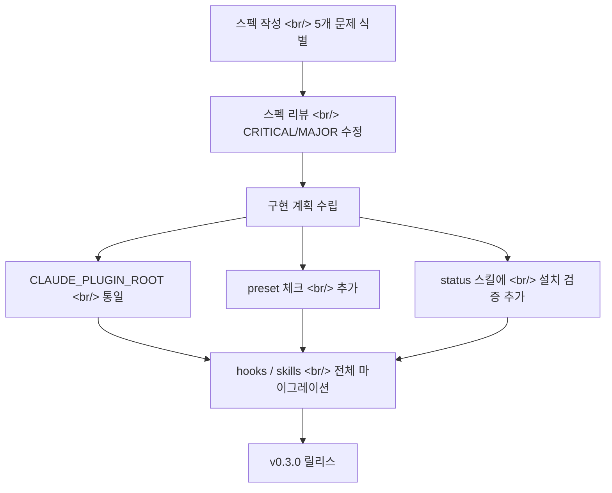

## 개요

[이전 글: #3 — 플러그인 트리거 수정과 마켓플레이스 추천 시스템](/posts/2026-03-25-harnesskit-dev3/)

이번 #4에서는 17개 커밋에 걸쳐 마켓플레이스 설치 인프라를 안정화하고 v0.3.0을 릴리스했다. `marketplace.json` 도입으로 `claude plugin add` 설치 경로를 확보하고, README를 영어/한국어로 분리했으며, 플러그인 트리거 전면 검토를 통해 `CLAUDE_PLUGIN_ROOT` 통일, preset 체크, 설치 검증까지 완료했다. 마켓플레이스 추천도 사전 검증 기반으로 재설계했다.

<!--more-->

---

## marketplace.json — 플러그인 설치의 시작점

### 문제

Claude Code 마켓플레이스에서 플러그인을 설치하려면 `.claude-plugin/marketplace.json`이 필요하다. 이 파일이 없으면 `claude plugin add` 명령으로 설치할 수 없어, 사용자가 수동으로 클론해야 했다.

### 해결

`marketplace.json`을 추가하고, `source` 경로를 `./` 상대 경로로 수정해 마켓플레이스 설치를 가능하게 했다. 이것이 v0.3.0의 출발점이다.


---

## README 이중화 — 영어와 한국어 분리

마켓플레이스에 올라가면 영어 사용자도 README를 읽게 된다. 하나의 README에 두 언어를 섞으면 양쪽 모두 불편하다. `README.md`를 영어 전용으로 다시 작성하고, `README.ko.md`를 새로 추가해 한국어 버전을 분리했다.

---

## 플러그인 트리거 전면 검토와 수정

### 스펙 기반 접근

단순히 버그를 고치는 것이 아니라, 먼저 스펙 문서를 작성해 5개 트리거링 문제를 분류했다. CRITICAL, MAJOR, MINOR로 우선순위를 나누고, 스펙 리뷰를 거쳐 수정 계획을 확정한 뒤 구현에 들어갔다.



### CLAUDE_PLUGIN_ROOT 통일

`claude plugin path`, 하드코딩된 절대 경로, 상대 경로가 혼재하던 것을 `CLAUDE_PLUGIN_ROOT` 환경 변수 하나로 통일했다. `guardrails.sh`, `pre-commit-test.sh` 등 hooks와 `init`, `setup` 스킬 모두 동일한 패턴으로 마이그레이션했다.

```bash
# 통일된 패턴: 환경 변수 + dirname fallback
PLUGIN_DIR="${CLAUDE_PLUGIN_ROOT:-$(cd "$(dirname "$0")/.." && pwd)}"
```

### preset 체크 추가

`post-edit-lint.sh`와 `post-edit-typecheck.sh`가 preset 설정 전에도 실행되면서 오류가 발생했다. preset 파일 존재 여부를 먼저 확인하고, 없으면 조기 종료하도록 수정했다.

### 설치 검증 기능

`/harnesskit:status` 스킬에 플러그인 설치 상태를 검증하는 기능을 추가했다. 스킬 파일 존재 여부, hooks 실행 권한, 설정 파일 무결성을 한눈에 확인할 수 있다.

---

## 마켓플레이스 검증 추천 시스템

실시간 마켓플레이스 검색에 의존하던 추천을 사전 검증된 `marketplace-recommendations.json`으로 교체했다.

- `update-recommendations.sh` 스크립트가 마켓플레이스를 크롤링해 목록을 갱신한다
- `/harnesskit:init`이 이 목록에서 프로젝트에 맞는 플러그인을 추천한다
- `/harnesskit:insights`도 같은 목록을 참조해 일관된 추천을 보장한다

---

## 3단계 슬라이딩 윈도우 도구 시퀀스

`session-end.sh`의 도구 사용 패턴 분석을 업그레이드했다. 단순 카운트 대신 3단계 슬라이딩 윈도우로 도구 시퀀스를 추적하고, `tool:summary` 형식으로 기록한다. 반복 패턴을 감지해 자동화 제안의 정밀도를 높였다.

---

## v0.3.0 릴리스

모든 수정이 반영된 후 `plugin.json`의 버전을 0.3.0으로 올렸다. 마켓플레이스 플러그인 캐시가 버전 변경을 감지해 갱신하므로, 설치된 사용자에게도 변경 사항이 전파된다.

---

## 커밋 로그

| 메시지 | 변경 |
|--------|------|
| feat: add marketplace.json for plugin installation | marketplace |
| fix: use ./ relative path in marketplace.json source | marketplace |
| docs: split README into English and Korean versions | docs |
| docs: add Korean README | docs |
| docs: add spec for plugin trigger review — 5 fixes | docs |
| docs: address spec review — fix CRITICAL and MAJOR issues | docs |
| docs: add implementation plan for plugin trigger fixes | docs |
| fix: add preset check to post-edit hooks + CLAUDE_PLUGIN_ROOT fallback | hooks |
| refactor: unify PLUGIN_DIR to CLAUDE_PLUGIN_ROOT with fallback | hooks |
| refactor: migrate skills from 'claude plugin path' to CLAUDE_PLUGIN_ROOT | skills |
| feat: add verified marketplace-recommendations.json | templates |
| feat: add update-recommendations.sh for marketplace crawling | scripts |
| feat: rewrite init marketplace discovery with verified recs | skills |
| feat: add recommendations.json reference to insights | skills |
| feat: upgrade tool sequence to 3-step sliding window | hooks |
| feat: add plugin installation verification to status | skills |
| chore: bump version to 0.3.0 for plugin cache refresh | plugin |

---

## 인사이트

마켓플레이스에 올린다는 것은 "내 환경에서 동작하는 도구"를 "누구의 환경에서든 동작하는 제품"으로 전환하는 일이다. `marketplace.json` 하나 추가하는 것은 간단하지만, 그 뒤로 경로 참조 통일, 환경 변수 fallback, preset 미설정 대응, 설치 상태 검증까지 연쇄적으로 필요해진다. 스펙 문서를 먼저 작성하고 리뷰한 후 구현에 들어간 것이 효과적이었다 — 5개 문제를 한 번에 파악하고 우선순위를 정한 덕분에 흩어진 수정 대신 체계적인 마이그레이션을 할 수 있었다. "코드를 고치기 전에 문서를 고쳐라"는 원칙이 다시 한번 유효했다.
