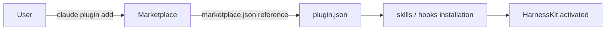
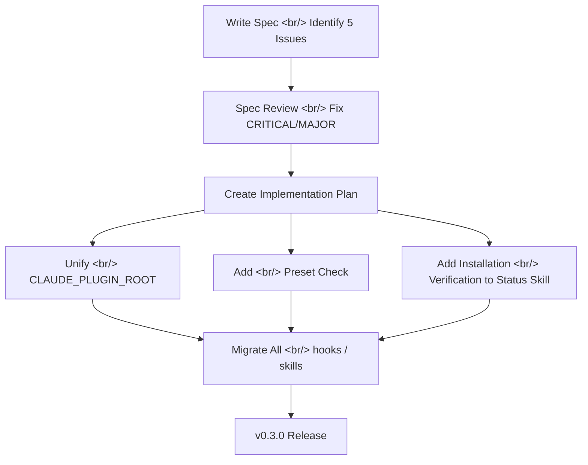

## Overview

[Previous Post: #3 — Plugin Trigger Fixes and Marketplace Recommendation System](/posts/2026-03-25-harnesskit-dev3/)

In this #4 installment, the marketplace installation infrastructure was stabilized across 17 commits and v0.3.0 was released. The introduction of `marketplace.json` secured the `claude plugin add` installation path, READMEs were split into English and Korean, and a comprehensive plugin trigger review was completed — unifying `CLAUDE_PLUGIN_ROOT`, adding preset checks, and implementing installation verification. Marketplace recommendations were also redesigned with a pre-verification approach.

<!--more-->

---

## marketplace.json — The Starting Point for Plugin Installation

### Problem

Installing a plugin from the Claude Code marketplace requires `.claude-plugin/marketplace.json`. Without this file, the `claude plugin add` command cannot be used, forcing users to manually clone the repository.

### Solution

`marketplace.json` was added and the `source` path was changed to a `./` relative path to enable marketplace installation. This was the starting point for v0.3.0.



---

## README Split — Separating English and Korean

Once listed on the marketplace, English-speaking users will also read the README. Mixing two languages in a single README is inconvenient for both audiences. `README.md` was rewritten as English-only, and `README.ko.md` was added as a separate Korean version.

---

## Comprehensive Plugin Trigger Review and Fixes

### Spec-Based Approach

Rather than simply fixing bugs, a spec document was written first to classify 5 triggering issues. They were prioritized as CRITICAL, MAJOR, and MINOR, and after a spec review, the fix plan was finalized before implementation began.



### CLAUDE_PLUGIN_ROOT Unification

A mix of `claude plugin path`, hardcoded absolute paths, and relative paths was unified under the single `CLAUDE_PLUGIN_ROOT` environment variable. All hooks including `guardrails.sh` and `pre-commit-test.sh`, as well as `init` and `setup` skills, were migrated to the same pattern.

```bash
# Unified pattern: environment variable + dirname fallback
PLUGIN_DIR="${CLAUDE_PLUGIN_ROOT:-$(cd "$(dirname "$0")/.." && pwd)}"
```

### Preset Check Added

`post-edit-lint.sh` and `post-edit-typecheck.sh` were running before the preset was configured, causing errors. A check for the preset file's existence was added to exit early if it is missing.

### Installation Verification Feature

A feature to verify plugin installation status was added to the `/harnesskit:status` skill. It provides an at-a-glance view of skill file existence, hooks execution permissions, and configuration file integrity.

---

## Marketplace Verified Recommendation System

Real-time marketplace search-based recommendations were replaced with a pre-verified `marketplace-recommendations.json`.

- The `update-recommendations.sh` script crawls the marketplace to refresh the list
- `/harnesskit:init` recommends plugins from this list that match the project
- `/harnesskit:insights` also references the same list to ensure consistent recommendations

---

## 3-Step Sliding Window Tool Sequence

The tool usage pattern analysis in `session-end.sh` was upgraded. Instead of simple counts, tool sequences are tracked using a 3-step sliding window and recorded in `tool:summary` format. Detecting repeated patterns improves the precision of automation suggestions.

---

## v0.3.0 Release

After all fixes were applied, the version in `plugin.json` was bumped to 0.3.0. Since the marketplace plugin cache detects version changes and refreshes, the changes are propagated to installed users as well.

---

## Commit Log

| Message | Changes |
|---------|---------|
| feat: add marketplace.json for plugin installation | marketplace |
| fix: use ./ relative path in marketplace.json source | marketplace |
| docs: split README into English and Korean versions | docs |
| docs: add Korean README | docs |
| docs: add spec for plugin trigger review — 5 fixes | docs |
| docs: address spec review — fix CRITICAL and MAJOR issues | docs |
| docs: add implementation plan for plugin trigger fixes | docs |
| fix: add preset check to post-edit hooks + CLAUDE_PLUGIN_ROOT fallback | hooks |
| refactor: unify PLUGIN_DIR to CLAUDE_PLUGIN_ROOT with fallback | hooks |
| refactor: migrate skills from 'claude plugin path' to CLAUDE_PLUGIN_ROOT | skills |
| feat: add verified marketplace-recommendations.json | templates |
| feat: add update-recommendations.sh for marketplace crawling | scripts |
| feat: rewrite init marketplace discovery with verified recs | skills |
| feat: add recommendations.json reference to insights | skills |
| feat: upgrade tool sequence to 3-step sliding window | hooks |
| feat: add plugin installation verification to status | skills |
| chore: bump version to 0.3.0 for plugin cache refresh | plugin |

---

## Insights

Listing on a marketplace means transforming "a tool that works in my environment" into "a product that works in anyone's environment." Adding a single `marketplace.json` is simple, but it cascades into path reference unification, environment variable fallbacks, handling unconfigured presets, and installation status verification. Writing and reviewing the spec document before implementation was effective — identifying all 5 issues at once and prioritizing them enabled a systematic migration instead of scattered fixes. The principle of "fix the docs before fixing the code" proved valid once again.
