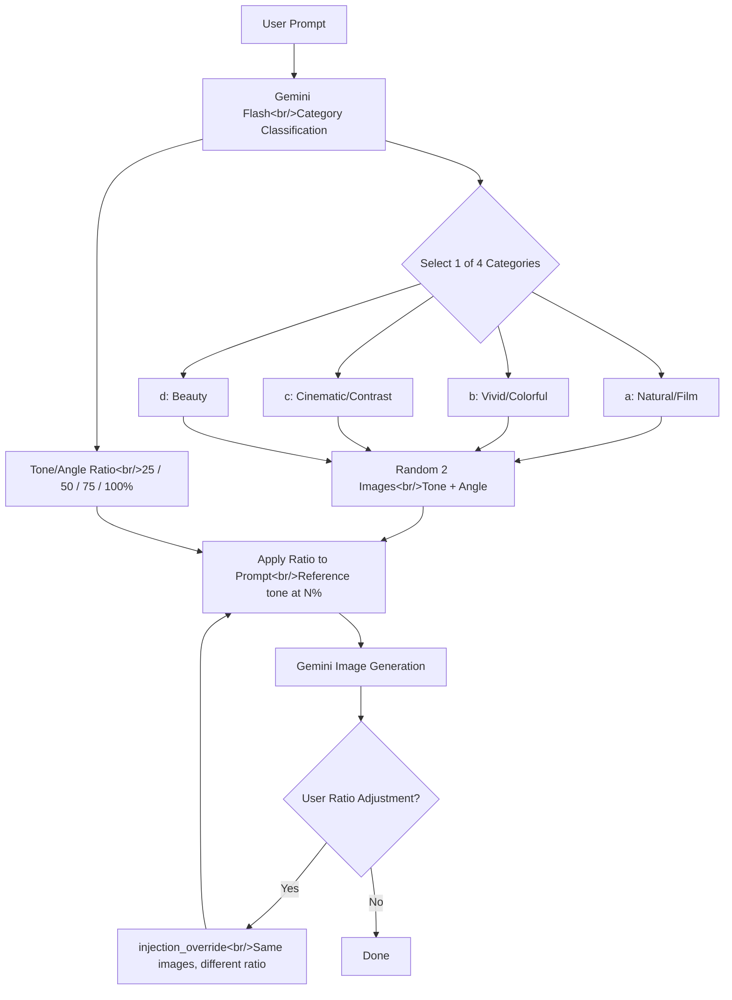

## Overview

[Previous Post: #6 — S3 Image Storage Migration and Branding](/posts/2026-03-30-hybrid-search-dev6/)

In this #7 installment, three key tasks were carried out across 7 commits. First, the existing search-score-based tone/angle image injection logic was completely replaced with a Gemini Flash LLM category classification approach. Second, the broken download button after S3 migration was fixed via a backend proxy. Third, a feature was added allowing users to adjust tone/angle ratios and regenerate images. Additionally, large image data was removed from the repo and package management was migrated to `pyproject.toml`.

<!--more-->



---

## Full Replacement of Tone/Angle Injection with LLM Category Classification

### Background

The previous tone/angle auto-injection system used the hybrid search pipeline to find candidate images and scored them using `tone_score`/`angle_score` from `images.json`, selecting from the top 20%. This approach had two problems:

1. Tone/angle images were mixed in with the regular search image pool, leading to potentially inappropriate selections
2. Selection based solely on search scores regardless of the prompt's mood resulted in inconsistency

The new approach categorizes 299 dedicated tone/angle reference images into 4 categories managed separately, and lets the LLM analyze the prompt to determine both the category and the application ratio.

| Category | Description | Image Count |
|---|---|---|
| `a(natural,film)` | Natural, film-like feel with warm tones | 129 |
| `b(vivid,colorful)` | Vibrant and colorful, high saturation | 39 |
| `c(cinematic,contrast)` | Cinematic mood, strong contrast | 80 |
| `d(beauty)` | Beauty/portrait style, soft lighting | 51 |

### Implementation

**Full rewrite of `injection.py`:**

All existing search+score logic (`_search_candidates_for_injection`, `_select_best_category_ref`) was removed and replaced with a lightweight classification call using Gemini Flash. The LLM analyzes the prompt and returns a category and tone/angle ratio (25/50/75/100%) as JSON.

```python
CLASSIFICATION_PROMPT = """\
You are an expert who analyzes image generation prompts to select the most suitable
tone/angle category and determine the application ratio for tone and angle.

## Ratio Guide
- 25%: The prompt already specifies a very specific style/tone → reference minimally
- 50%: Some style direction exists but needs reinforcement
- 75%: Topic-focused with weak style specification, needs heavy reference
- 100%: No style-related mentions at all, rely entirely on reference

## Response Format (output JSON only)
{{"category": "...", "tone_ratio": N, "angle_ratio": N}}
"""
```

Based on the classification result, tone and angle images are randomly selected from the corresponding category folder. Both are chosen from the same category but use different images.

**Schema changes:**

`score: float` was removed from `InjectedReference` and replaced with `category: str` + `ratio: int`. A `category` field was also added to `InjectionInfo` so the frontend can display which category was selected.

```python
class InjectedReference(BaseModel):
    filename: str
    category: str = ""
    ratio: int = 100
```

**Prompt construction changes:**

`build_generation_prompt()` was updated to directly incorporate ratio information into the prompt:

```
Tone/color reference. Only reference the color, tone, and mood of this image.
Reference the tone at only {N}%.
Do NOT incorporate any non-color elements such as composition, subject, shape, or background from this image.
```

**S3 integration:**

The 299 tone/angle reference images were uploaded to S3, and 4 category subdirectories were registered in `ref_dirs` to be served the same way as existing `image_ref_1~4`. The S3 key structure is `refs/tone_angle_image_ref/{category}/{filename}`, mirroring the local directory structure.

### Troubleshooting

During the initial S3 upload, the key structure was flat as `refs/a(natural,film)/...`, mixing with existing `image_ref_1~4` images at the same level. Based on user feedback, a parent folder was added to create `refs/tone_angle_image_ref/a(natural,film)/...` to match the repo structure, and `build_ref_key_cache` was updated to use `Path.relative_to("data")` for correct caching of nested directories.

```python
# Before: only used p.name → "a(natural,film)"
# After: relative path from data/ → "tone_angle_image_ref/a(natural,film)"
try:
    ref_subdir = str(p.relative_to("data"))
except ValueError:
    ref_subdir = p.name
```

---

## S3 Image Download Button Fix

### Background

After migrating to S3 in #6, the download button was found to be non-functional. Clicking the button would open the image in a new tab or just zoom in on screen, but would not save it as a file.

### Root Cause Analysis

The HTML `<a download>` attribute only works with **same-origin URLs**. Before the S3 migration, images were served from `/images/filename` on the same domain, so there was no issue. After migration, URLs changed to `https://<bucket>.s3.<region>.amazonaws.com/...` cross-origin format, causing browsers to ignore the `download` attribute.

Additionally, newly generated images used data URIs (`data:image/png;base64,...`) where `fetch()` worked fine, but history images used presigned S3 URLs which were blocked by CORS policy, preventing `fetch()` as well.

### Implementation

The fix was done in two stages:

**Stage 1 -- Frontend `downloadImage` helper:**

Replaced `<a href download>` tags with `<button>` elements, using JavaScript to fetch a blob and trigger a programmatic download.

```typescript
export const downloadImage = async (filename: string): Promise<void> => {
  const downloadUrl = `/images/${encodeURIComponent(filename)}/download`;
  const response = await fetch(downloadUrl, { credentials: 'include' });
  if (!response.ok) throw new Error(`Download failed: ${response.status}`);
  const blob = await response.blob();
  const blobUrl = URL.createObjectURL(blob);
  const a = document.createElement('a');
  a.href = blobUrl;
  a.download = filename;
  document.body.appendChild(a);
  a.click();
  document.body.removeChild(a);
  URL.revokeObjectURL(blobUrl);
};
```

**Stage 2 -- Backend download proxy endpoint:**

A `GET /images/{filename}/download` endpoint was added to stream image bytes directly from S3 and return them with a `Content-Disposition: attachment` header. The existing `/images/{filename}` used a 302 redirect approach which couldn't resolve the CORS issue, so a separate proxy was necessary.

Ownership verification (`check_file_ownership`) and `Content-Disposition` header injection defense (quote removal) were also included.

---

## User Ratio Adjustment Regeneration

### Background

The tone/angle ratio determined by the LLM may not match the user's intent. For example, the LLM might decide on 75% tone, but the user wants to lower it to 25%. While the first generation uses the AI's judgment, users should be able to click on a generated image, go to the detail view, change the ratio, and regenerate.

### Implementation

**`InjectionOverride` schema added:**

An `InjectionOverride` model was added to the backend, along with an optional `injection_override` field in `GenerateImageRequest`. When this field is present, LLM classification is skipped and generation proceeds directly with the user-specified ratio and the same image files.

```python
class InjectionOverride(BaseModel):
    tone_filename: str
    angle_filename: str
    category: str
    tone_ratio: int = Field(ge=25, le=100)
    angle_ratio: int = Field(ge=25, le=100)
```

**Frontend ratio adjustment UI:**

An interaction was added to the `GeneratedImageDetail` component where clicking the tone/angle ratio badges cycles through 25 -> 50 -> 75 -> 100 -> 25. When the ratio differs from the original, a "Regenerate with changed ratio" button appears, which sends a generation request including `injection_override`.

```typescript
const RATIO_STEPS = [25, 50, 75, 100] as const;
const nextRatio = (current: number) => {
    const idx = RATIO_STEPS.indexOf(current as typeof RATIO_STEPS[number]);
    return RATIO_STEPS[(idx + 1) % RATIO_STEPS.length];
};
```

---

## Repo Cleanup and Package Management Migration

With all images now on S3, the large image reference data (split zip files) remaining in the repo was removed, and reference image directories and zip files were added to `.gitignore`. Additionally, dependency management was migrated from `requirements.txt` to `pyproject.toml`, adopting the standard Python package management approach.

---

## Commit Log

| Order | Type | Message | Files Changed |
|:---:|:---:|---|:---:|
| 1 | chore | ignore ref image dirs and zip files from repo | 1 |
| 2 | chore | migrate to pyproject.toml for package management | 3 |
| 3 | feat | replace score-based injection with LLM category classification | 11 |
| 4 | fix | use tone_angle_image_ref parent folder in S3 key structure | 2 |
| 5 | remove | get rid of all the image reference data from the repo | 20 |
| 6 | fix | download button now works for S3-hosted images | 4 |
| 7 | feat | allow user to adjust tone/angle ratios and regenerate | 5 |

---

## Insights

**Using an LLM as a classifier is far more flexible than keyword mapping.** Initially, I tried to map categories using keywords, but prompts often use indirect expressions like "emotional cafe interior," making it clear that keyword-based mapping would fail for most prompts. Using Gemini Flash as a lightweight classifier can determine both category and ratio in a single call, and fixing the response format to JSON makes parsing straightforward.

**The hidden cost of S3 migration is CORS.** Switching from local file serving to S3 is relatively simple, but features that implicitly assumed same-origin break one by one. The fact that the `<a download>` attribute is ignored for cross-origin URLs is specified in the HTML spec, but it's easy to overlook until you actually encounter it. A backend proxy endpoint can completely bypass CORS, but since traffic routes through the server, a separate CDN setup may be needed for large volumes of files.

**User overrides should be included in the design from the start.** If you consider an interface where users can adjust AI-determined values from the beginning, you won't need major schema changes when adding features later. In this case, the `injection_override` field was added all at once, but if ratio parameters had been separated in the initial design, the extension would have been more natural.
