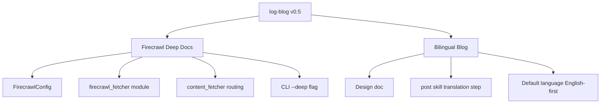

## Overview

[Previous Post: #4 — Preparing for Official Marketplace Registration](/posts/2026-03-25-log-blog-dev4/)

In this #5 installment, two major features were added. First, **Deep Docs** crawling using the Firecrawl API — going beyond existing Playwright-based single-page scraping to structurally collect entire documentation sites. Second, **bilingual (Korean/English) blog** support — when a post is written, a translation is automatically generated and deployed according to Hugo's multilingual structure. Across 15 commits, work progressed from design document creation through implementation to SDK type fixes.

<!--more-->



---

## Firecrawl Deep Docs Integration

### Background

The existing log-blog content collection was Playwright-based. It rendered single pages in a headless browser and extracted text, but this had limitations with **documentation sites** (Honeycomb Docs, MDN, etc.). It would only fetch the overview of a single page, missing the detailed content of related subpages.

Firecrawl solves this problem. Given a URL, it crawls the site's subpages and returns structured markdown. It also supports JavaScript rendering, so SPA-based documentation sites can be processed as well.

### Implementation

**Step 1: Design document** — The scope and interfaces for Firecrawl integration were defined first. The structure adds a Firecrawl route to the existing URL type routing in `content_fetcher.py`.

**Step 2: Config system extension** — A `FirecrawlConfig` dataclass was added to `config.py`.

```python
@dataclass
class FirecrawlConfig:
    api_key: str = ""
    max_pages: int = 10
    timeout: int = 30
```

A firecrawl section was also added to `config.example.yaml` to document the API key configuration method.

**Step 3: firecrawl_fetcher module** — A dedicated fetcher using the `firecrawl-py` SDK was implemented. The key point is that routing to Firecrawl only happens when the URL type is `DOCS_PAGE` and the `--deep` flag is active.

**Step 4: content_fetcher routing** — A Firecrawl route was added to the URL type branching in `content_fetcher.py`. It follows the same pattern as existing YouTube, GitHub, and Playwright branches: `DOCS_PAGE` -> `firecrawl_fetcher`.

**Step 5: CLI --deep flag** — A `--deep` option was added to the `fetch` command so users can explicitly activate Deep Docs mode.

### Troubleshooting

In the initial implementation, the Firecrawl SDK return type was accessed as a `dict`, but it actually returned **typed objects**. `result['content']` needed to be `result.content` instead. This type mismatch was fixed in the final commit.

---

## Bilingual Blog Pipeline

### Background

As the blog grew, an English readership became necessary. Hugo supports multilingual content with `content/ko/posts/` and `content/en/posts/` structures, but manually translating every post is impractical.

### Implementation

**Design document** — Hugo's multilingual structure, translation workflow, and default language switching strategy were documented.

**Post skill translation step** — A translation stage was added to the post generation skill. Posts written in Korean are automatically translated to English (or vice versa) and deployed to both language directories.

**Default language English-first** — Since browsing history is predominantly in English, the default writing language was switched to English. Automatically generating Korean translations improves overall pipeline efficiency.

**Skill updates** — The deep docs workflow for Steps 3-5 was reflected in the skill, and a Firecrawl API key prompt was added to the setup skill.

---

## Commit Log

| Message | Changes |
|---------|---------|
| docs: add design spec for Firecrawl deep docs integration | +85 -0 |
| docs: add implementation plan for Firecrawl deep docs integration | +120 -0 |
| feat: add firecrawl-py dependency for deep docs fetching | +2 -1 |
| docs: bilingual blog design spec | +95 -0 |
| feat: add FirecrawlConfig to config system | +15 -2 |
| feat: add firecrawl_fetcher module for deep docs crawling | +78 -0 |
| feat: route deep DOCS_PAGE URLs to Firecrawl in content_fetcher | +25 -3 |
| feat: add --deep flag to fetch command for Firecrawl deep docs | +12 -1 |
| docs: add firecrawl config section to example config | +8 -0 |
| feat: add Firecrawl API key prompt to setup skill | +5 -0 |
| feat: update skill for deep docs workflow in Steps 3-5 | +45 -12 |
| docs: bilingual blog implementation plan | +110 -0 |
| feat: add bilingual translation step to post skill | +35 -8 |
| feat: flip default language to English-first in post skill | +6 -6 |
| fix: use Firecrawl SDK typed objects instead of dict access | +8 -8 |

---

## Insights

The biggest lesson from this development was **the value of writing design documents first**. For both Firecrawl integration and bilingual support, design documents (design spec + implementation plan) were written before implementation began. This made it possible to clearly identify integration points with existing code and add features cleanly without unnecessary refactoring. Even when unexpected issues like the Firecrawl SDK typed object problem arose during implementation, the scope of fixes remained localized because the overall architecture was already established. Having 5 out of 15 commits be documentation may seem inefficient, but in practice it was an investment that increased the accuracy of implementation commits.
