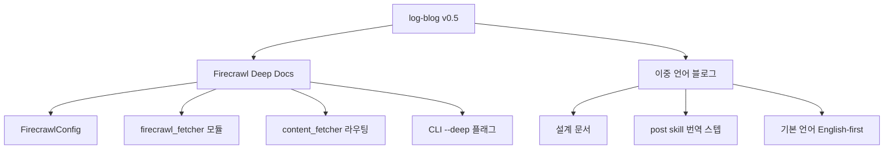

## 개요

[이전 글: #4 — 공식 마켓플레이스 등록 준비](/posts/2026-03-25-log-blog-dev4/)

이번 #5에서는 두 가지 대형 기능을 추가했다. 첫째, Firecrawl API를 활용한 **Deep Docs** 크롤링 — 기존 Playwright 기반 단일 페이지 스크래핑을 넘어서 문서 사이트 전체를 구조적으로 수집하는 기능이다. 둘째, **이중 언어(한국어/영어) 블로그** 지원 — 포스트를 작성하면 자동으로 번역본을 생성하여 Hugo의 다국어 구조에 맞게 배포한다. 15개 커밋에 걸쳐 설계 문서 작성부터 구현, SDK 타입 수정까지 진행했다.

<!--more-->



---

## Firecrawl Deep Docs 통합

### 배경

기존 log-blog의 콘텐츠 수집은 Playwright 기반이었다. 단일 페이지를 헤드리스 브라우저로 렌더링하고 텍스트를 추출하는 방식인데, **문서 사이트**(Honeycomb Docs, MDN 등)에서는 한계가 있었다. 한 페이지의 개요만 가져올 뿐, 관련 하위 페이지의 상세 내용은 놓치게 된다.

Firecrawl은 이 문제를 해결한다. URL을 주면 해당 사이트의 하위 페이지까지 크롤링하여 구조화된 마크다운으로 반환한다. JavaScript 렌더링도 지원하므로 SPA 기반 문서 사이트도 처리할 수 있다.

### 구현

**1단계: 설계 문서 작성** — Firecrawl 통합의 범위와 인터페이스를 먼저 정의했다. 기존 `content_fetcher.py`의 URL 타입 라우팅에 Firecrawl 경로를 추가하는 구조다.

**2단계: 설정 시스템 확장** — `config.py`에 `FirecrawlConfig` dataclass를 추가했다.

```python
@dataclass
class FirecrawlConfig:
    api_key: str = ""
    max_pages: int = 10
    timeout: int = 30
```

`config.example.yaml`에도 firecrawl 섹션을 추가하여 API 키 설정 방법을 문서화했다.

**3단계: firecrawl_fetcher 모듈** — `firecrawl-py` SDK를 사용하는 전용 fetcher를 구현했다. 핵심은 URL 타입이 `DOCS_PAGE`이고 `--deep` 플래그가 활성화된 경우에만 Firecrawl로 라우팅하는 것이다.

**4단계: content_fetcher 라우팅** — `content_fetcher.py`에서 URL 타입별 분기에 Firecrawl 경로를 추가했다. 기존 YouTube, GitHub, Playwright 분기와 동일한 패턴으로 `DOCS_PAGE` → `firecrawl_fetcher`를 연결한다.

**5단계: CLI --deep 플래그** — `fetch` 커맨드에 `--deep` 옵션을 추가하여 사용자가 Deep Docs 모드를 명시적으로 활성화할 수 있게 했다.

### 문제 해결

초기 구현에서 Firecrawl SDK의 반환 타입을 `dict`로 접근했는데, 실제로는 **typed object**를 반환했다. `result['content']` 대신 `result.content`로 접근해야 했다. 마지막 커밋에서 이 타입 불일치를 수정했다.

---

## 이중 언어 블로그 파이프라인

### 배경

블로그가 성장하면서 영어 독자층도 필요해졌다. Hugo는 `content/ko/posts/`와 `content/en/posts/` 구조로 다국어를 지원하지만, 매번 수동으로 번역하는 것은 비현실적이다.

### 구현

**설계 문서** — Hugo의 다국어 구조, 번역 워크플로우, 기본 언어 전환 전략을 정리했다.

**post skill 번역 스텝** — 포스트 생성 skill에 번역 단계를 추가했다. 한국어로 작성된 포스트를 영어로(또는 그 반대로) 자동 번역하여 양쪽 언어 디렉터리에 배포한다.

**기본 언어 English-first** — 브라우징 히스토리가 주로 영어인 경우가 많아, 기본 작성 언어를 영어로 전환했다. 한국어 번역본을 자동 생성하는 방식이 전체 파이프라인의 효율성을 높인다.

**skill 업데이트** — Steps 3-5의 deep docs 워크플로우를 skill에 반영하고, setup skill에 Firecrawl API 키 프롬프트를 추가했다.

---

## 커밋 로그

| 메시지 | 변경 |
|--------|------|
| docs: add design spec for Firecrawl deep docs integration | +85 -0 |
| docs: add implementation plan for Firecrawl deep docs integration | +120 -0 |
| feat: add firecrawl-py dependency for deep docs fetching | +2 -1 |
| docs: bilingual blog design spec | +95 -0 |
| feat: add FirecrawlConfig to config system | +15 -2 |
| feat: add firecrawl_fetcher module for deep docs crawling | +78 -0 |
| feat: route deep DOCS_PAGE URLs to Firecrawl in content_fetcher | +25 -3 |
| feat: add --deep flag to fetch command for Firecrawl deep docs | +12 -1 |
| docs: add firecrawl config section to example config | +8 -0 |
| feat: add Firecrawl API key prompt to setup skill | +5 -0 |
| feat: update skill for deep docs workflow in Steps 3-5 | +45 -12 |
| docs: bilingual blog implementation plan | +110 -0 |
| feat: add bilingual translation step to post skill | +35 -8 |
| feat: flip default language to English-first in post skill | +6 -6 |
| fix: use Firecrawl SDK typed objects instead of dict access | +8 -8 |

---

## 인사이트

이번 개발에서 가장 큰 교훈은 **설계 문서를 먼저 쓰는 습관**의 가치다. Firecrawl 통합과 이중 언어 지원 모두 설계 문서(design spec + implementation plan)를 먼저 작성하고 구현에 들어갔다. 덕분에 기존 코드와의 통합 지점을 명확히 파악하고, 불필요한 리팩터링 없이 깔끔하게 기능을 추가할 수 있었다. Firecrawl SDK의 typed object 이슈처럼 실제 구현에서 예상치 못한 문제가 발생하더라도, 전체 아키텍처가 확립된 상태에서는 수정 범위가 국소적이다. 15개 커밋 중 문서가 5개를 차지하는 것이 비효율적으로 보일 수 있지만, 실제로는 구현 커밋의 정확도를 높이는 투자였다.
