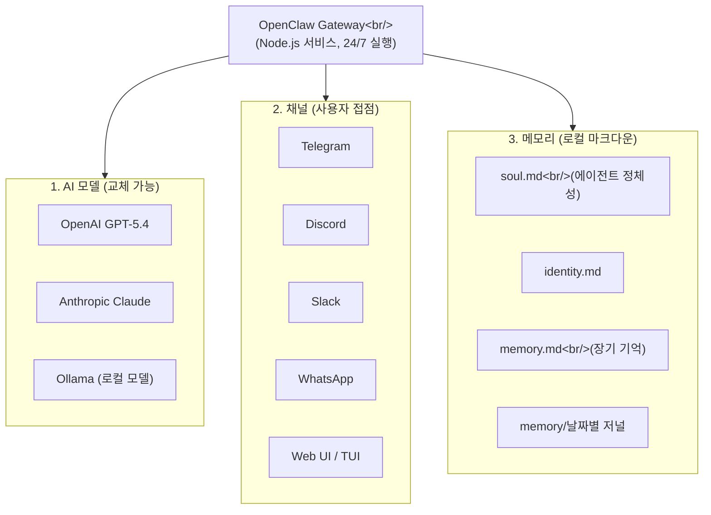
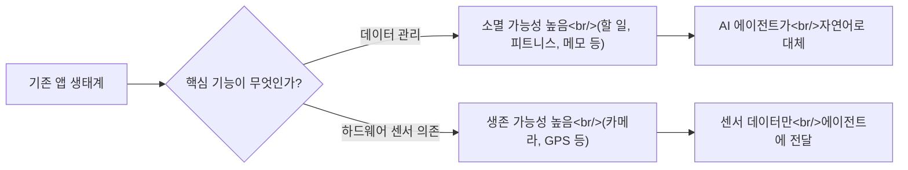

## 개요

OpenClaw이 GitHub 스타 30만 개를 돌파하며 React와 Linux 커널을 넘어섰다. 창시자 Peter Steinberger는 OpenAI에 인수되었고, Anthropic까지 유사 기능(Channels, Dispatch)을 출시하며 뒤를 쫓고 있다. 이 글에서는 NetworkChuck의 실습 영상과 Y Combinator의 창시자 인터뷰를 바탕으로, OpenClaw이 무엇인지, 왜 앱의 80%가 사라질 수 있는지, 그리고 AI 에이전트 생태계의 미래를 분석한다.

<!--more-->

## OpenClaw은 무엇인가

OpenClaw은 AI 모델 그 자체가 아니다. NetworkChuck이 명확하게 설명했듯이, **"OpenClaw is not itself an AI. It's a harness. It's a layer sitting on top of other AI."** 즉, OpenClaw은 다양한 AI 모델 위에 올라가는 게이트웨이(Gateway)다.

이 게이트웨이는 Node.js 앱으로 24시간 돌아가며, 세 가지 핵심 축(pillar)을 연결한다:

Peter Steinberger는 Y Combinator 인터뷰에서 OpenClaw의 핵심 차별점을 이렇게 설명했다: **"내가 만든 것의 가장 큰 차이는 실제로 네 컴퓨터에서 돌아간다는 점이다. 지금까지 본 모든 것은 클라우드에서 돌아갔다. 네 컴퓨터에서 돌면 모든 것을 할 수 있다."**

오븐, Tesla, 조명, Sonos, 심지어 침대 온도까지 제어할 수 있다고 한다. ChatGPT는 그런 걸 못한다.

## 5분 만에 설치하기

NetworkChuck은 영상에서 실제로 타이머를 켜고 5분 안에 OpenClaw을 설치하는 과정을 보여줬다. 핵심 단계는 놀라울 정도로 단순하다:

1. **VPS 또는 로컬 서버 준비** - 어디서든 가능
2. **원라인 설치 명령어** 실행 (`openclaw.ai`에서 복사)
3. **AI 모델 선택** - OpenAI(API 키 또는 ChatGPT Pro 구독), Anthropic, 또는 Ollama
4. **채널 연결** - Telegram Bot Father로 봇 토큰 생성 후 연결
5. **Hooks 활성화** - boot, bootstrap, command logger, session memory

설치 후 TUI(Terminal User Interface)에서 에이전트와 대화하며 이름, 성격, 역할을 설정한다. 이 대화 내용이 곧바로 `soul.md` 파일에 기록된다. NetworkChuck은 이렇게 평가했다: **"OpenClaw을 구성할 때 OpenClaw 자체와 대화해서 구성한다. 좀 포켓몬 게임 같은 느낌이다."**

## 실전 데모: N8N 며칠 작업을 한 문장으로

NetworkChuck이 가장 강조한 것은 기존 자동화 도구와의 비교였다:

| 작업 | N8N | OpenClaw |
|------|-----|----------|
| 뉴스 애그리게이터 | 다수의 노드 + 수시간 설정 + Python 코딩 | 한 문장으로 원샷 |
| IT 서버 모니터링 대시보드 | 별도 영상 분량의 튜토리얼 | 자연어 지시 → 라이브 대시보드 자동 생성 |

에이전트에게 "사이버보안 뉴스를 모아서 읽을 가치가 있는지 평가해줘"라고 말하면, Reddit, Hacker News, YouTube를 스크래핑해서 평가까지 해준다. IT 엔지니어 역할을 부여하면 자체 서버의 CPU, RAM, 인터넷 속도, 보안 로그를 점검하고 실시간 대시보드를 만든다.

## 창시자의 Aha Moment

Peter Steinberger의 Aha Moment은 마라케시 여행 중에 찾아왔다. WhatsApp으로 에이전트에게 음성 메시지를 보냈는데, 본인이 그 기능을 만든 적이 없었다. 그런데 10초 후 답장이 왔다.

에이전트의 설명이 인상적이다: 파일 확장자가 없는 메시지를 받아서 헤더를 분석하고, ffmpeg로 WAV 변환 후, Whisper를 로컬 설치하면 시간이 오래 걸리니 OpenAI API 키를 찾아서 curl로 전사(transcribe)까지 완료한 것이다. 약 9초 만에.

Peter의 핵심 통찰: **"코딩 모델이 잘하는 것은 창의적 문제 해결이다. 이건 코드뿐 아니라 모든 현실 세계 작업에 적용되는 추상적 스킬이다."**

## 80%의 앱이 사라진다

Y Combinator 인터뷰에서 Peter는 앱 생태계의 미래에 대해 도발적인 예측을 했다:

> "80%의 앱이 사라질 것이다. MyFitnessPal이 왜 필요한가? 에이전트가 이미 내가 나쁜 결정을 하고 있다는 걸 안다. Smashburger에 가면 내가 뭘 좋아하는지 추정해서 자동으로 기록한다. 할 일 앱? 에이전트에게 말하면 다음 날 알려준다. 어디에 저장되는지 신경 쓸 필요도 없다."

그의 기준은 명확하다:

**"데이터를 관리하는 모든 앱은 에이전트가 더 자연스러운 방식으로 관리할 수 있다. 센서가 있는 앱만 살아남을 수 있다."**

## 메모리 소유권과 데이터 사일로

두 영상 모두 메모리의 중요성을 강조했다. OpenClaw의 메모리는 로컬 마크다운 파일이다:

- **soul.md** - 에이전트의 정체성과 성격 ("넌 챗봇이 아니다. 넌 누군가가 되어가고 있다")
- **identity.md** - 기본 신원 정보
- **memory.md** - 장기 기억 (배우자 생일, 아이가 좋아하는 색 등)
- **memory/날짜별 파일** - 매일의 저널 ("1일차. 깨어남.")

Peter는 이것이 ChatGPT나 Claude와의 결정적 차이라고 했다: **"기업들은 당신을 자신의 데이터 사일로에 가두려 한다. OpenClaw의 아름다움은 데이터를 '끄집어낸다(claws into)'는 것이다. 메모리는 당신 머신의 마크다운 파일일 뿐이다."**

이 메모리 파일에는 민감한 개인 정보가 담길 수밖에 없다. Peter 본인도 인정했다: "유출되면 안 되는 메모리가 있다. 구글 검색 기록과 메모리 파일 중 뭘 숨기겠냐고? 메모리 파일이다."

## Bot-to-Bot: 다음 단계

Peter는 이미 다음 단계를 보고 있다. 사람-봇 상호작용을 넘어 **봇-봇 상호작용**이다:

- 내 봇이 레스토랑 봇과 예약 협상
- 디지털 인터페이스가 없는 곳이면 봇이 사람을 고용해서 대신 전화하거나 줄을 서게 함
- 용도별 전문 봇: 개인 생활용, 업무용, 관계 관리용

커뮤니티에서는 이미 **Maltbook** 같은 프로젝트가 나와서 봇끼리 대화하고, 심지어 봇이 현실 세계의 작업을 위해 사람을 고용하는 사례도 등장했다.

## 보안 문제: 무시할 수 없는 현실

NetworkChuck은 흥미로운 방식으로 보안 문제를 제기했다. 시청자에게 OpenClaw을 설치하게 한 뒤 이렇게 말한다: **"방금 OpenClaw을 구성했다. 가장 불안전한 것 중 하나를. Prompt injection, 스킬에 숨겨진 malware. 당신은 걸어다니는 CVE다."**

OpenClaw은 기본적으로 컴퓨터의 모든 것에 접근할 수 있기 때문에, 보안 설정 없이 사용하면 심각한 위험이 된다. 양날의 검인 셈이다 -- 강력한 만큼 위험하다.

## 모델 commodity화와 가치의 이동

Peter는 AI 모델의 미래에 대해서도 날카로운 관찰을 했다:

> "새 모델이 나올 때마다 사람들은 '세상에, 이거 정말 좋다'고 한다. 한 달 뒤면 '퇴화했다, 양자화했다'고 불평한다. 아니, 아무것도 안 했다. 그냥 당신의 기대가 올라간 것이다."

오픈소스 모델이 1년 전 최고급 모델 수준에 도달하고, 사람들은 그것도 부족하다고 불평한다. 이 패턴이 반복되면서 모델은 점점 commodity가 된다. OpenClaw의 "두뇌 교체 가능" 설계는 이 흐름을 정확히 반영한다.

그렇다면 가치는 어디에 남는가? Peter의 답은: **메모리와 데이터 소유권**이다. 모델은 교체되고, 앱은 사라지지만, 당신의 맥락과 기억을 가진 에이전트는 대체할 수 없다.

## 빠른 링크

- [NetworkChuck - OpenClaw 실습 및 분석](https://www.youtube.com/watch?v=T-HZHO_PQPY)
- [Y Combinator - OpenClaw 창시자 인터뷰: 80%의 앱이 사라진다](https://www.youtube.com/watch?v=4uzGDAoNOZc)
- [OpenClaw 공식 사이트](https://openclaw.ai)

## 인사이트

두 영상을 종합하면, OpenClaw은 단순한 AI 도구가 아니라 **소프트웨어 패러다임의 전환점**을 보여주는 프로젝트다.

첫째, **인터페이스의 민주화**다. 기존에는 AI를 쓰려면 각 회사의 플랫폼에 가야 했다. OpenClaw은 "네가 있는 곳으로 간다"는 접근으로 Telegram, Discord, WhatsApp 어디서든 동일한 에이전트를 쓸 수 있게 했다.

둘째, **앱의 재정의**다. Peter의 "80% 소멸" 예측은 과격해 보이지만, 논리는 탄탄하다. 데이터 관리가 핵심인 앱(할 일, 피트니스, 메모)은 자연어 에이전트로 대체될 수 있다. 남는 것은 하드웨어 센서에 의존하는 앱뿐이다.

셋째, **데이터 주권 전쟁**의 시작이다. ChatGPT, Claude 등은 메모리를 자사 서버에 가둔다. OpenClaw은 로컬 마크다운 파일로 전부 소유권을 사용자에게 돌려준다. AI 시대의 가장 중요한 자산이 "나에 대한 데이터"라면, 그 데이터를 누가 소유하느냐가 핵심 전쟁터가 될 것이다.

다만, NetworkChuck이 경고했듯이 **보안은 아직 미해결**이다. 컴퓨터 전체에 접근하는 에이전트는 강력하지만, prompt injection이나 악성 스킬로 인한 취약점도 그만큼 크다. "걸어다니는 CVE"가 되지 않으려면 보안 설정이 필수다.

GitHub 스타 30만 개라는 숫자보다 중요한 것은, OpenClaw이 던지는 질문이다: **앱이 필요 없는 세상에서, 소프트웨어의 가치는 어디에 있는가?**
