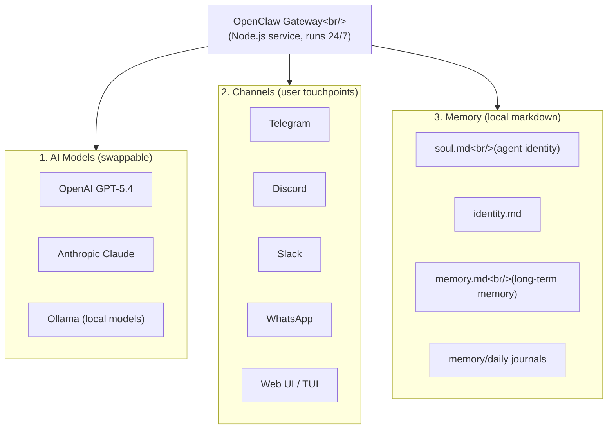
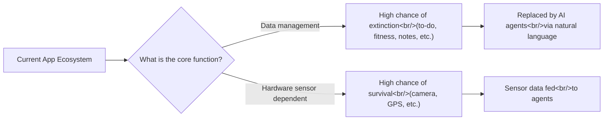

## Overview

OpenClaw has surpassed 300K GitHub stars, overtaking both React and the Linux kernel. Creator Peter Steinberger was acquired by OpenAI, and Anthropic is following suit with similar features (Channels, Dispatch). This post analyzes what OpenClaw is, why 80% of apps could disappear, and the future of the AI agent ecosystem, drawing from NetworkChuck's hands-on video and a Y Combinator founder interview.

<!--more-->

## What Is OpenClaw

OpenClaw is not an AI model itself. As NetworkChuck clearly explained, **"OpenClaw is not itself an AI. It's a harness. It's a layer sitting on top of other AI."** In other words, OpenClaw is a gateway that sits on top of various AI models.

This gateway runs as a Node.js app 24/7, connecting three core pillars:

In the Y Combinator interview, Peter Steinberger described OpenClaw's key differentiator: **"The biggest difference about what I built is that it actually runs on your computer. Everything I've seen so far runs in the cloud. When it runs on your computer, it can do everything."**

He says it can control ovens, Teslas, lights, Sonos speakers, and even bed temperature. ChatGPT can't do any of that.

## Install in 5 Minutes

In the video, NetworkChuck actually started a timer and demonstrated installing OpenClaw in under 5 minutes. The key steps are surprisingly simple:

1. **Prepare a VPS or local server** - works anywhere
2. **Run the one-line install command** (copy from `openclaw.ai`)
3. **Choose an AI model** - OpenAI (API key or ChatGPT Pro subscription), Anthropic, or Ollama
4. **Connect a channel** - create a bot token via Telegram Bot Father and connect it
5. **Enable Hooks** - boot, bootstrap, command logger, session memory

After installation, you chat with the agent in a TUI (Terminal User Interface) to set its name, personality, and role. This conversation is immediately written to the `soul.md` file. NetworkChuck put it this way: **"When you configure OpenClaw, you configure it by talking to OpenClaw itself. It's kind of like a Pokemon game vibe."**

## Live Demo: Days of N8N Work in One Sentence

What NetworkChuck emphasized most was the comparison with existing automation tools:

| Task | N8N | OpenClaw |
|------|-----|----------|
| News aggregator | Multiple nodes + hours of setup + Python coding | One sentence, one shot |
| IT server monitoring dashboard | Tutorial-length separate video | Natural language instruction -> live dashboard auto-generated |

Tell the agent "Aggregate cybersecurity news and evaluate whether it's worth reading," and it scrapes Reddit, Hacker News, and YouTube, then evaluates everything. Assign it an IT engineer role, and it inspects the server's CPU, RAM, internet speed, and security logs, then creates a real-time dashboard.

## The Creator's Aha Moment

Peter Steinberger's Aha Moment came during a trip to Marrakech. He sent a voice message to his agent via WhatsApp, even though he had never built that feature. Ten seconds later, he got a reply.

The agent's explanation was impressive: it received a message without a file extension, analyzed the header, converted it to WAV with ffmpeg, decided that locally installing Whisper would take too long, found an OpenAI API key, and completed transcription via curl. All in about 9 seconds.

Peter's key insight: **"What coding models are good at is creative problem solving. This is an abstract skill that applies not just to code but to all real-world tasks."**

## 80% of Apps Will Disappear

In the Y Combinator interview, Peter made a provocative prediction about the future of the app ecosystem:

> "80% of apps will disappear. Why do you need MyFitnessPal? The agent already knows I'm making bad decisions. If I go to Smashburger, it guesses what I like and logs it automatically. To-do apps? Tell the agent and it reminds you the next day. You don't even need to care where it's stored."

His criteria are clear:

**"Every app that manages data can be managed more naturally by an agent. Only apps with sensors will survive."**

## Memory Ownership and Data Silos

Both videos emphasized the importance of memory. OpenClaw's memory consists of local markdown files:

- **soul.md** - The agent's identity and personality ("You're not a chatbot. You're becoming someone")
- **identity.md** - Basic identity information
- **memory.md** - Long-term memory (spouse's birthday, child's favorite color, etc.)
- **memory/daily files** - Daily journals ("Day 1. Awakened.")

Peter said this is the decisive difference from ChatGPT or Claude: **"Companies want to lock you into their data silos. The beauty of OpenClaw is that it 'claws into' the data. Memory is just markdown files on your machine."**

These memory files inevitably contain sensitive personal information. Peter himself admitted: "There are memories that shouldn't leak. If you had to choose between hiding your Google search history or your memory file - it's the memory file."

## Bot-to-Bot: The Next Step

Peter is already looking at the next stage. Beyond human-bot interaction, it's **bot-to-bot interaction**:

- Your bot negotiates restaurant reservations with the restaurant's bot
- If there's no digital interface, the bot hires a human to make a phone call or stand in line
- Specialized bots by purpose: personal life, work, relationship management

The community has already produced projects like **Maltbook**, where bots talk to each other, and there are even cases of bots hiring humans for real-world tasks.

## Security Concerns: An Unavoidable Reality

NetworkChuck raised security concerns in an interesting way. After having viewers install OpenClaw, he says: **"You just configured OpenClaw. One of the most insecure things ever. Prompt injection, malware hidden in skills. You are a walking CVE."**

Since OpenClaw has access to everything on your computer by default, using it without security settings poses serious risks. It's a double-edged sword -- as powerful as it is dangerous.

## Model Commoditization and the Shift in Value

Peter also made sharp observations about the future of AI models:

> "Every time a new model comes out, people say 'Oh my God, this is so good.' A month later they complain 'It's degraded, they quantized it.' No, nothing happened. Your expectations just went up."

Open-source models are reaching the level of top-tier models from a year ago, and people complain that even those aren't good enough. As this pattern repeats, models increasingly become commodities. OpenClaw's "swappable brain" design perfectly reflects this trend.

So where does value remain? Peter's answer: **memory and data ownership**. Models get swapped, apps disappear, but an agent that holds your context and memories is irreplaceable.

## Quick Links

- [NetworkChuck - OpenClaw Hands-on and Analysis](https://www.youtube.com/watch?v=T-HZHO_PQPY)
- [Y Combinator - OpenClaw Creator Interview: 80% of Apps Will Disappear](https://www.youtube.com/watch?v=4uzGDAoNOZc)
- [OpenClaw Official Site](https://openclaw.ai)

## Insights

Synthesizing both videos, OpenClaw is not just another AI tool but a project that represents a **paradigm shift in software**.

First, **the democratization of interfaces**. Previously, using AI meant going to each company's platform. OpenClaw takes the approach of "coming to where you are," letting you use the same agent across Telegram, Discord, WhatsApp, and more.

Second, **the redefinition of apps**. Peter's "80% extinction" prediction seems radical, but the logic is solid. Apps whose core function is data management (to-do, fitness, notes) can be replaced by natural language agents. Only apps that depend on hardware sensors will remain.

Third, the beginning of the **data sovereignty war**. ChatGPT, Claude, and others lock memory in their own servers. OpenClaw returns full ownership to users via local markdown files. If the most important asset of the AI era is "data about me," then who owns that data will become the central battleground.

However, as NetworkChuck warned, **security remains unresolved**. An agent with access to your entire computer is powerful, but vulnerabilities from prompt injection or malicious skills are equally significant. Proper security configuration is essential to avoid becoming "a walking CVE."

More important than the number 300K GitHub stars is the question OpenClaw poses: **In a world where apps are unnecessary, where does the value of software lie?**
