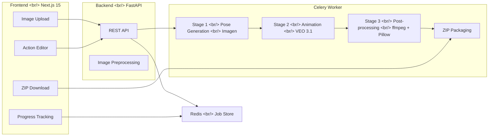

## Overview

PopCon (Pop + Icon) is a web application that takes a **single** character image as input and automatically generates **animated emoji sets** that meet LINE specifications. It uses Google's Imagen (Nano Banana 2) for pose generation, VEO 3.1 for animation, and ffmpeg + Pillow for post-processing -- a 3-stage AI pipeline built from scratch in a single day.

This post pairs well with the preliminary research posts:
- [AI Image Generation Ecosystem](/posts/2026-04-02-ai-image-gen-ecosystem/) -- Technical survey
- [Animated Emoji Market Research](/posts/2026-04-02-emoji-market-research/) -- Market analysis

<!--more-->

---

## Project Structure and Pipeline

### Background

LINE animated emojis have strict specifications: 180x180px APNG format, 8-40 per set, under 300KB per file. The goal is to automate what would otherwise take days of manual work per character using AI.

### Architecture

The entire system consists of 4 services:



Docker Compose manages all services:

```yaml
services:
  redis:
    image: redis:7-alpine
  backend:
    build: ./backend
    ports: ["8000:8000"]
    environment:
      - POPCON_GOOGLE_API_KEY=${POPCON_GOOGLE_API_KEY}
      - POPCON_REDIS_URL=redis://redis:6379/0
    volumes:
      - /tmp/popcon:/tmp/popcon
  worker:
    build: ./backend
    command: celery -A worker.celery_app worker --loglevel=info --concurrency=2
  frontend:
    build: ./frontend
    ports: ["3000:3000"]
```

---

## Migrating from In-Memory State to Redis

### Background

The initial implementation managed `JOB_STORE` as a Python dict. Jobs were created in the FastAPI process and status was updated in the Celery worker, but there was a problem -- in Docker Compose, backend and worker are **separate processes**. Even if they use the same image, memory is not shared.

### Troubleshooting

When the worker called `update_job`, the backend's `/api/job/{job_id}/status` endpoint still showed `queued` status. The frontend's polling was stuck at "Generating..." indefinitely.

The solution was using Redis as the state store:

```python
# job_store.py — Redis-backed job store
def save_job(status: JobStatus) -> None:
    """Persist a JobStatus to Redis."""
    r = _get_redis()
    r.set(_key(status.job_id), status.model_dump_json(), ex=86400)

def get_job(job_id: str) -> JobStatus | None:
    """Load a JobStatus from Redis."""
    r = _get_redis()
    data = r.get(_key(job_id))
    if data is None:
        return None
    return JobStatus.model_validate_json(data)
```

Serialization/deserialization was handled with Pydantic's `model_dump_json()` and `model_validate_json()`, with a 24-hour TTL for automatic cleanup. Replacing all `JOB_STORE[job_id]` accesses with `get_job()` / `save_job()` calls resulted in 175 lines added and 58 lines deleted across 5 files.

---

## Wrestling with the VEO 3.1 API

### Background

VEO 3.1 is an Image-to-Video (I2V) generation model that takes a starting image and motion prompt to generate video. The original plan was to use dual-frame I2V with both start and end frames.

### Four Consecutive Fix Commits

Four issues arose in succession during VEO API integration:

**1. Model ID Error** -- The model name from the documentation was rejected by the actual API. `veo-3.1-generate-preview` was the correct ID.

**2. Minimum Duration** -- VEO 3.1's minimum video length is 4 seconds, and LINE emoji maximum is also 4 seconds. They happened to match exactly, but initially setting it to 2 seconds caused an API error.

**3. Dual-frame Not Supported** -- The `last_frame` parameter was not yet supported in VEO 3.1 preview. The workaround was using start frame + strong motion prompt:

```python
# NOTE: last_frame (dual-frame I2V) is not yet supported on VEO 3.1 preview.
# We rely on the start frame + strong motion prompt instead.
async def animate(self, start_image, end_image, action, output_dir):
    full_motion = (
        f"{action.motion_prompt} "
        f"The character transitions to: {action.end_prompt}"
    )
    prompt = build_motion_prompt(full_motion)
    video_bytes = await self._generate_video(prompt, start_image, end_image)
```

**4. video_bytes Was None** -- VEO returned videos as download URIs instead of inline bytes. A branch was added to download from `video.video.uri` via `httpx.get`, with redirect following enabled:

```python
for video in operation.result.generated_videos:
    if video.video.video_bytes:
        return video.video.video_bytes
    if video.video.uri:
        resp = await asyncio.to_thread(
            httpx.get,
            video.video.uri,
            headers={"x-goog-api-key": self.api_key},
            timeout=120,
            follow_redirects=True,
        )
        resp.raise_for_status()
        return resp.content
```

---

## APNG Compression Strategy

### Background

LINE emojis have a 300KB per-file limit. Extracting 12 frames from VEO-generated video easily pushes 180x180 APNG files past 300KB.

### Implementation

An iterative compression strategy was implemented. It progressively reduces frame count and color count until the file falls under 300KB:

```python
strategies = [
    (total_frames, None),   # All frames, full color
    (10, None),             # 10 frames, full color
    (10, 128),              # 10 frames, 128 colors
    (8, 64),                # 8 frames, 64 colors
    (5, 32),                # 5 frames, 32 colors
]

for frame_count, colors in strategies:
    n = min(frame_count, total_frames)
    # Select frames at even intervals
    indices = [round(i * (total_frames - 1) / (n - 1)) for i in range(n)]
    selected = [frame_paths[i] for i in indices]
    
    # Proportionally adjust delay to match frame count
    adjusted_delay_ms = max(1, round(original_duration_ms / n))
    
    if colors is not None:
        _quantize_frames(copies, colors)
    
    build_apng(copies, output_path, delay_ms=adjusted_delay_ms)
    if output_path.stat().st_size <= max_size:
        return output_path
```

When reducing frames, evenly spaced frames are selected and the delay is proportionally increased to maintain the total playback duration.

---

## Background Removal Failure and Strategy Pivot

### Background

The initial design planned to use rembg for background removal to create transparent APNGs. The pipeline extracted frames from VEO video, then removed backgrounds with rembg (`u2net`).

### Troubleshooting

Multiple problems cascaded during quality inspection of the actual output:

**Phase 1 -- Background Artifacts**: rembg couldn't fully remove floor/shadow from VEO videos, leaving gray smudges. The motion prompt was updated with `"Plain solid white background. No shadows, no ground, no floor"`, and the rembg model was changed to `isnet-general-use`.

**Phase 2 -- Cloud Effect**: The isnet model removed backgrounds more aggressively, also stripping parts of the character. A custom alpha mask combining rembg confidence and pixel brightness was attempted, but it produced a mosaic-pattern side effect.

**Phase 3 -- Strategy Pivot**: The decision was made to completely remove rembg. Instead:
- Pose generation prompts explicitly specified `"Plain solid white (#FFFFFF) background. NOT transparent, NOT checkerboard pattern"`
- VEO motion prompts included the same background instructions
- Switched from background removal to brightness-based content cropping

```python
def resize_frame(input_path, output_path, size=None, padding_ratio=0.05):
    """Crop to content via brightness detection, scale to fill."""
    img = Image.open(input_path).convert("RGB")
    arr = np.array(img)

    # Detect content pixels that aren't white or black
    brightness = arr.astype(float).mean(axis=2)
    content_mask = (brightness > 10) & (brightness < 245)

    rows = np.any(content_mask, axis=1)
    cols = np.any(content_mask, axis=0)

    if rows.any() and cols.any():
        y_min, y_max = np.where(rows)[0][[0, -1]]
        x_min, x_max = np.where(cols)[0][[0, -1]]
        img = img.crop((x_min, y_min, x_max + 1, y_max + 1))

    # Fill canvas (5% padding)
    pad = int(min(size) * padding_ratio)
    target_w = size[0] - pad * 2
    target_h = size[1] - pad * 2
    scale = min(target_w / img.width, target_h / img.height)
    img = img.resize((int(img.width * scale), int(img.height * scale)), Image.LANCZOS)
```

Ultimately, removing the rembg dependency (including `onnxruntime`) significantly reduced Docker image size and processing time.

---

## LINE Spec Validation and File Naming Fix

### Background

The LINE Creators Market guidelines were scraped with Firecrawl and compared against the current config.

### Implementation

Most specs matched, but two discrepancies were found:

| Item | LINE Official | Previous Implementation | Status |
|------|--------------|------------------------|--------|
| File naming | `001.png` ~ `040.png` | `00_happy.png` | Mismatch |
| Minimum set size | 8 | 1 (for testing) | Mismatch |

The packager was updated to convert filenames to LINE specifications:

```python
with zipfile.ZipFile(zip_path, "w", compression=zipfile.ZIP_DEFLATED) as zf:
    zf.write(tab_path, "tab.png")
    for i, emoji_path in enumerate(emoji_paths):
        line_name = f"{i + 1:03d}.png"  # 001.png, 002.png, ...
        zf.write(emoji_path, line_name)
```

The strategy is to keep descriptive names like `00_happy.png` for internal working files, converting to LINE spec names only when adding to the ZIP archive.

---

## Image Preprocessing Pipeline

### Background

User-uploaded or AI-generated character images were sometimes not square or had excessive whitespace. Imagen occasionally generated images that weren't 1:1 ratio, and once the character was duplicated at the top of the image.

### Implementation

Two-pronged fixes were made:

**1. Upload Image Preprocessing** -- numpy-based content detection to crop whitespace, apply square padding, and resize to 512x512:

```python
def preprocess_character_image(image_path: Path) -> None:
    img = Image.open(image_path).convert("RGB")
    arr = np.array(img)
    
    brightness = arr.astype(float).mean(axis=2)
    content_mask = (brightness > 10) & (brightness < 245)
    
    # ... bounding box detection and crop ...
    
    max_side = max(img.width, img.height)
    pad = int(max_side * 0.05)
    canvas_size = max_side + pad * 2
    canvas = Image.new("RGB", (canvas_size, canvas_size), (255, 255, 255))
    canvas = canvas.resize((512, 512), Image.LANCZOS)
    canvas.save(image_path)
```

**2. Force 1:1 Ratio from Imagen** -- Using the API's `aspect_ratio` parameter:

```python
config=types.GenerateContentConfig(
    response_modalities=["IMAGE"],
    image_config=types.ImageConfig(aspect_ratio="1:1"),
)
```

**3. Prevent Character Duplication** -- Adding explicit instructions to the prompt:

```
"Draw exactly ONE character, centered and filling the frame.
 Do NOT create multiple copies, sticker sheets, or sprite sheets."
```

---

## Frontend Progress UX Improvements

### Background

Generating 24 emojis takes several minutes, but the existing UI showed status only through a simple progress bar and small gray dots. There was no way to tell which emoji was at which stage.

### Implementation

The backend was already providing data that the UI wasn't utilizing:
- `EmojiResult`'s per-emoji `status` (`generating_pose`, `animating`, `processing`, `done`, `failed`)
- `EmojiResult`'s `action` name (happy, laugh, cry...)

The `ProgressTracker` component was completely rewritten:

1. **Stage pipeline** -- A 3-stage (Poses / Animation / Processing) mini stepper visualizing the current position
2. **Emoji grid** -- Each emoji displayed with name + status icon + colored border. Active emojis have a pulse animation
3. **Elapsed time** -- Real-time timer in the upper right
4. **Localized stage labels** -- "Generating character poses" instead of `generating_poses`

---

## Docker Environment Issues

### Background

Docker-related issues came up repeatedly during development.

### Troubleshooting

**Favicon Not Showing** -- I didn't know that Next.js App Router's `app/favicon.ico` takes priority over `public/favicon.ico`. Even after replacing `app/favicon.ico`, the Docker container was using the previous build so the change wasn't reflected.

```bash
# Container rebuild required
docker compose build frontend && docker compose up -d frontend
```

**API Key Contamination** -- The `POPCON_GOOGLE_API_KEY` value in the `.env` file had ` venv` appended to the end. This was a copy-paste mistake, but since the error message only said `400 INVALID_ARGUMENT: API key not valid`, it took time to identify the root cause.

**Worker Restart Oversight** -- `docker compose restart` doesn't detect image changes. Since the worker uses the same image as the backend, building only the backend means the worker should also use the new image, but compose may not detect this. The `--force-recreate` flag was needed.

---

## Edge Artifacts in VEO Videos

### Background

Black lines appeared at the left and right edges of generated emojis. VEO 3.1 appeared to be leaving artifacts at video boundaries during generation.

### Implementation

An ffmpeg crop filter was added to trim 2% from the video edges:

```python
# Before
"-vf", f"fps={fps}",

# After — 2% edge crop before frame extraction
"-vf", f"crop=in_w*0.96:in_h*0.96:in_w*0.02:in_h*0.02,fps={fps}",
```

---

## Commit Log

| Message | Changes |
|---------|---------|
| docs: add design spec and implementation plan | New |
| feat: project scaffolding with config and LINE emoji constants | +186 |
| feat: add Pydantic models for job status, emoji results, and action presets | +109 |
| feat: add 24 default emoji action presets with prompt templates | +219 |
| feat: add frame processor for resize, bg removal, and frame extraction | +204 |
| fix: use rembg[cpu] for onnxruntime backend | +1 -1 |
| feat: add APNG builder with iterative compression strategy | +195 |
| feat: add ZIP packager with tab image generation | +96 |
| feat: add Nano Banana 2 pose generator with subject consistency | +107 |
| feat: add VEO 3.1 animator with dual-frame I2V support | +98 |
| feat: add Celery worker with 3-stage emoji generation pipeline | +251 |
| feat: add FastAPI routes for emoji generation, status, preview, and download | +186 |
| feat: add Docker Compose setup for backend, worker, and Redis | +34 |
| feat: scaffold Next.js frontend with PopCon brand colors | +6890 |
| feat: add frontend components, editor flow, and landing page | +887 -58 |
| docs: add bilingual English/Korean README | +307 |
| fix: align frontend API URLs with backend routes | +23 -11 |
| fix: replace in-memory JOB_STORE with Redis-backed job store | +175 -58 |
| fix: correct character image URL double-prefixing and align status types | +11 -2 |
| fix: use config.last_frame instead of end_image for VEO 3.1 dual-frame API | +16 -8 |
| fix: use correct VEO model ID veo-3.1-generate-preview | +1 -1 |
| fix: set VEO duration to 4s (API minimum), trim in post-processing | +1 -1 |
| fix: disable last_frame (unsupported on VEO 3.1 preview), use start frame + strong prompt | +9 -5 |
| chore: temporarily allow 1 emoji per set for testing | +2 -2 |
| fix: download VEO video from URI when video_bytes is None | +15 -1 |
| fix: follow redirects when downloading VEO video from URI | +1 |
| fix: serve emoji files via API endpoint, convert file paths to URLs | +22 -2 |

---

## Insights

**Don't trust AI API docs -- test them yourself.** VEO 3.1 differed from its documentation on four fronts: model ID, minimum duration, dual-frame support, and response format. Each required a separate fix commit.

**Overlooking process isolation costs more time than it saves.** Even though backend and worker in Docker Compose use the same image, they don't share memory. Realizing this took time. Using Redis as the job store from the start would have avoided a 5-file refactoring.

**Sometimes it's better to boldly abandon background removal.** After trying three rembg variations (`u2net` -> `isnet-general-use` -> custom alpha mask), the cleanest approach turned out to be not removing backgrounds at all and instead generating white background images. This also reduced dependencies (onnxruntime) and processing time.

**Negative instructions are key in prompt engineering.** "Solid white background" alone sometimes led AI models to generate checkerboard patterns or gradients. Explicit negations like `"NOT transparent, NOT checkerboard pattern"` and `"Do NOT create multiple copies"` were far more effective.

**LINE specs check down to the filename level.** I thought matching the API response format and image size would suffice, but there are detailed specs like ZIP internal filenames needing to be `001.png` through `040.png`. Reading the official guidelines thoroughly before submission is essential.
