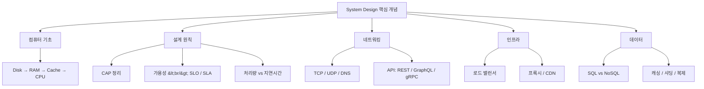
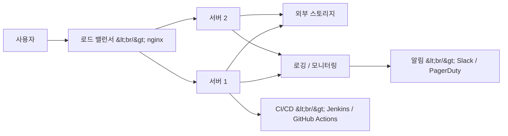
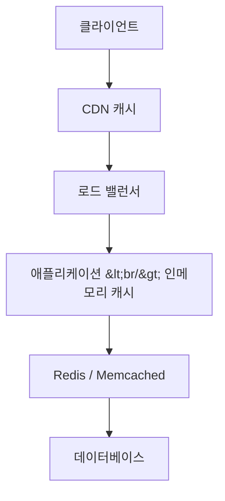

## 개요

freeCodeCamp의 [System Design Concepts Course and Interview Prep](https://www.youtube.com/watch?v=F2FmTdLtb_4) 강의를 기반으로, 시스템 설계 면접과 실무에서 반드시 알아야 할 핵심 개념을 정리했다. 컴퓨터의 물리적 계층 구조부터 CAP 정리, 네트워킹, 로드 밸런싱, 캐싱, 데이터베이스 전략까지 — 분산 시스템을 설계할 때 필요한 기본기를 한 편에 담았다.

<!--more-->

---

## 컴퓨터 하드웨어의 계층 구조

시스템 설계의 출발점은 개별 컴퓨터의 동작 원리다. 데이터 저장과 접근 속도의 계층 구조를 이해해야 병목을 예측할 수 있다.

**Disk Storage** — 비휘발성 저장소. HDD(80~160 MB/s)와 SSD(500~3,500 MB/s)로 나뉜다. OS, 애플리케이션, 사용자 파일이 여기 저장된다.

**RAM** — 휘발성 메모리. 현재 실행 중인 프로그램의 변수, 중간 계산값, 런타임 스택을 보관한다. 읽기/쓰기 속도 5,000+ MB/s로 SSD보다 빠르다.

**Cache (L1/L2/L3)** — 메가바이트 단위의 초고속 메모리. L1 캐시의 접근 시간은 수 나노초 수준이다. CPU는 L1 → L2 → L3 → RAM 순서로 데이터를 찾는다.

**CPU** — 컴퓨터의 두뇌. 고급 언어로 작성된 코드를 컴파일러가 기계어로 변환하면, CPU가 이를 fetch → decode → execute 한다.

이 계층 구조는 시스템 설계에서 캐싱 전략의 근거가 된다. 자주 접근하는 데이터를 상위 계층에 두면 평균 접근 시간이 극적으로 줄어든다.

---

## 프로덕션 아키텍처의 전체 그림

프로덕션 환경의 핵심 구성 요소:

- **CI/CD 파이프라인** — Jenkins, GitHub Actions으로 코드가 레포에서 테스트를 거쳐 프로덕션 서버까지 자동 배포된다.
- **로드 밸런서 / 리버스 프록시** — nginx 같은 도구가 사용자 요청을 여러 서버에 균등 분배한다.
- **외부 스토리지** — 데이터베이스는 프로덕션 서버와 분리된 별도 서버에서 네트워크로 연결된다.
- **로깅 / 모니터링** — 백엔드는 PM2, 프론트엔드는 Sentry 같은 도구로 실시간 에러를 캡처한다. Slack 채널에 알림을 통합하면 즉각 대응이 가능하다.

디버깅의 황금률: **프로덕션 환경에서 직접 디버깅하지 말 것.** 스테이징 환경에서 재현 → 수정 → 핫픽스 롤아웃 순서를 지킨다.

---

## CAP 정리와 설계 트레이드오프

분산 시스템 설계에서 가장 중요한 이론적 기반인 CAP 정리(Brewer's Theorem)는 세 가지 속성 중 두 가지만 동시에 달성할 수 있다고 말한다.

| 속성 | 의미 | 비유 |
|------|------|------|
| **Consistency** | 모든 노드가 동일한 데이터를 가짐 | Google Docs — 한 사람이 편집하면 모두에게 즉시 반영 |
| **Availability** | 항상 응답 가능한 상태 | 24시간 영업하는 온라인 쇼핑몰 |
| **Partition Tolerance** | 네트워크 단절에도 시스템 동작 | 그룹 채팅에서 한 명이 연결 끊겨도 나머지는 계속 대화 |

**은행 시스템**은 CP(Consistency + Partition Tolerance)를 선택한다. 금융 정확성을 위해 일시적으로 가용성을 희생할 수 있다. 반면 **SNS 피드**는 AP(Availability + Partition Tolerance)를 선택해 약간의 데이터 불일치를 허용하더라도 항상 응답한다.

핵심은 "완벽한 솔루션"이 아니라 "우리 유스케이스에 최적인 솔루션"을 찾는 것이다.

---

## 가용성과 SLO/SLA

가용성(Availability)은 시스템의 운영 성능과 신뢰성의 척도다. "Five 9's" (99.999%)를 목표로 하면 연간 다운타임이 약 5분에 불과하다.

| 가용성 | 연간 허용 다운타임 |
|--------|-------------------|
| 99.9% | 약 8.76시간 |
| 99.99% | 약 52분 |
| 99.999% | 약 5.26분 |

**SLO (Service Level Objective)** — 내부 성능 목표. "웹 서비스의 99.9% 요청이 300ms 이내에 응답해야 한다."

**SLA (Service Level Agreement)** — 고객과의 공식 계약. SLA 위반 시 환불이나 보상을 제공해야 한다.

**복원력(Resilience) 구축 전략:**
- **Redundancy** — 백업 시스템을 항상 대기시킨다
- **Fault Tolerance** — 예상치 못한 장애나 공격에 대비한다
- **Graceful Degradation** — 일부 기능이 불가해도 핵심 기능은 유지한다

---

## 처리량 vs 지연시간

| 메트릭 | 단위 | 의미 |
|--------|------|------|
| Server Throughput | RPS (Requests/sec) | 서버가 초당 처리하는 요청 수 |
| Database Throughput | QPS (Queries/sec) | DB가 초당 처리하는 쿼리 수 |
| Data Throughput | Bytes/sec | 네트워크 또는 시스템의 데이터 전송 속도 |
| Latency | ms | 단일 요청의 응답 시간 |

처리량과 지연시간은 트레이드오프 관계다. 배치 처리(batch)로 처리량을 늘리면 개별 요청의 지연시간이 증가할 수 있다. 시스템 설계에서는 유스케이스에 맞는 균형점을 찾아야 한다.

---

## 네트워킹 기초 — IP, TCP, UDP, DNS

### IP 주소와 패킷

모든 네트워크 통신의 기본은 IP 주소다. IPv4는 32비트(약 40억 개)로 부족해지면서 IPv6(128비트)로 전환 중이다. 데이터 패킷의 IP 헤더에 송수신자 주소가 담기며, 애플리케이션 레이어에서 HTTP 같은 프로토콜로 데이터를 해석한다.

### TCP vs UDP

**TCP (Transmission Control Protocol)** — 연결 지향, 순서 보장, 재전송 지원. 웹 브라우징, 파일 전송, 이메일에 적합. Three-way handshake(SYN → SYN-ACK → ACK)로 연결을 설정한다.

**UDP (User Datagram Protocol)** — 비연결, 순서 비보장, 빠름. 실시간 스트리밍, 게임, VoIP에 적합. 약간의 패킷 손실을 허용하는 대신 속도를 얻는다.

### DNS (Domain Name System)

사람이 읽을 수 있는 도메인(google.com)을 IP 주소로 변환하는 인터넷의 전화번호부. 브라우저 캐시 → OS 캐시 → 재귀 리졸버 → 루트 서버 → TLD 서버 → 권한 서버 순서로 해석한다.

---

## API 설계 — REST, GraphQL, gRPC

### REST (Representational State Transfer)

가장 보편적인 API 스타일. HTTP 메서드(GET, POST, PUT, DELETE)와 URL 경로로 리소스를 조작한다. 무상태(stateless) 원칙으로 각 요청이 독립적이다.

### GraphQL

클라이언트가 필요한 데이터만 정확히 요청할 수 있다. Over-fetching과 Under-fetching 문제를 해결하지만, 서버 구현이 복잡해지고 캐싱이 어렵다.

### gRPC (Google Remote Procedure Call)

Protocol Buffers를 사용하는 바이너리 프로토콜. HTTP/2 기반으로 양방향 스트리밍을 지원한다. 마이크로서비스 간 통신에서 REST보다 높은 성능을 보인다.

| 특성 | REST | GraphQL | gRPC |
|------|------|---------|------|
| 데이터 포맷 | JSON | JSON | Protobuf (바이너리) |
| 프로토콜 | HTTP/1.1 | HTTP | HTTP/2 |
| 유스케이스 | 공개 API | 복잡한 쿼리 | 서비스 간 통신 |
| 스트리밍 | 제한적 | Subscription | 양방향 |

---

## 로드 밸런싱과 프록시

### 로드 밸런싱 전략

여러 서버에 트래픽을 분배하여 단일 서버의 과부하를 방지한다.

- **Round Robin** — 순차적으로 요청을 분배. 가장 단순하다.
- **Least Connections** — 현재 연결 수가 가장 적은 서버에 분배.
- **IP Hash** — 클라이언트 IP를 해싱하여 항상 같은 서버로 라우팅. 세션 유지에 유용하다.
- **Weighted** — 서버 성능에 따라 가중치를 부여.

### Forward Proxy vs Reverse Proxy

**Forward Proxy** — 클라이언트 측에서 동작. 사용자의 IP를 숨기고, 콘텐츠 필터링이나 캐싱에 사용한다. (예: VPN)

**Reverse Proxy** — 서버 측에서 동작. 실제 서버의 IP를 숨기고, 로드 밸런싱, SSL 종료, 캐싱을 담당한다. (예: nginx, HAProxy)

---

## 캐싱 전략

캐싱은 시스템의 모든 계층에서 적용될 수 있다:

- **브라우저 캐시** — 정적 자산(CSS, JS, 이미지)을 클라이언트에 저장
- **CDN** — 지리적으로 분산된 서버에 콘텐츠를 캐싱하여 지연시간을 줄임
- **애플리케이션 캐시** — Redis, Memcached로 빈번한 DB 쿼리 결과를 메모리에 보관
- **DB 쿼리 캐시** — 동일 쿼리 결과를 DB 레벨에서 캐싱

**캐시 무효화(Cache Invalidation)** 전략이 핵심이다:
- **Write-Through** — 쓰기 시 캐시와 DB를 동시에 업데이트. 일관성 높지만 쓰기 지연.
- **Write-Back** — 캐시만 먼저 업데이트, DB는 나중에 배치로. 빠르지만 데이터 손실 위험.
- **Write-Around** — DB에만 쓰고 캐시는 읽기 시 갱신. 자주 안 읽는 데이터에 적합.

---

## 데이터베이스 — SQL vs NoSQL, 샤딩, 복제

### SQL vs NoSQL

| 특성 | SQL (PostgreSQL, MySQL) | NoSQL (MongoDB, Cassandra) |
|------|------------------------|---------------------------|
| 스키마 | 고정 스키마, 테이블 기반 | 유연한 스키마, 문서/KV/그래프 |
| 확장 | 수직 확장(Scale Up) | 수평 확장(Scale Out) |
| 트랜잭션 | ACID 보장 | BASE (최종 일관성) |
| 적합 유스케이스 | 관계형 데이터, 복잡한 조인 | 대용량 비정형 데이터, 빠른 쓰기 |

### 샤딩 (Sharding)

데이터를 여러 DB 인스턴스에 분할 저장하는 수평 분할 전략이다. 샤딩 키 선택이 핵심 — 불균등한 분배(hot spot)가 발생하면 특정 샤드에 부하가 집중된다.

### 복제 (Replication)

데이터를 여러 노드에 복사하여 읽기 성능과 내결함성을 높인다.
- **Leader-Follower** — 리더가 쓰기를 담당하고 팔로워가 읽기를 처리
- **Leader-Leader** — 모든 노드가 읽기/쓰기 가능하지만 충돌 해결이 복잡

---

## 빠른 링크

- [System Design Concepts Course and Interview Prep](https://www.youtube.com/watch?v=F2FmTdLtb_4) — freeCodeCamp 전체 강의

---

## 인사이트

시스템 설계의 본질은 "트레이드오프"다. CAP 정리에서 두 가지만 선택할 수 있듯, 모든 설계 결정은 무엇을 얻고 무엇을 포기할지의 문제다. 처리량을 높이면 지연시간이 늘고, 일관성을 강화하면 가용성이 떨어진다. 좋은 시스템 설계자는 정답을 암기하는 것이 아니라 유스케이스에 맞는 최적의 타협점을 찾는 능력을 갖춘다. 이 강의가 다루는 범위는 넓지만, 각 개념이 독립적이지 않고 서로 맞물려 있다는 점이 가장 큰 교훈이다. CDN은 캐싱의 확장이고, 샤딩은 CAP 정리의 실전 적용이며, 로드 밸런싱은 가용성과 확장성의 교차점이다.
