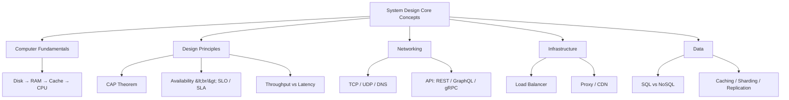
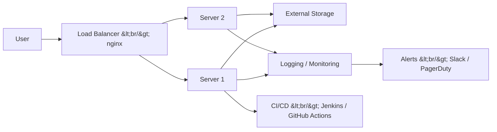
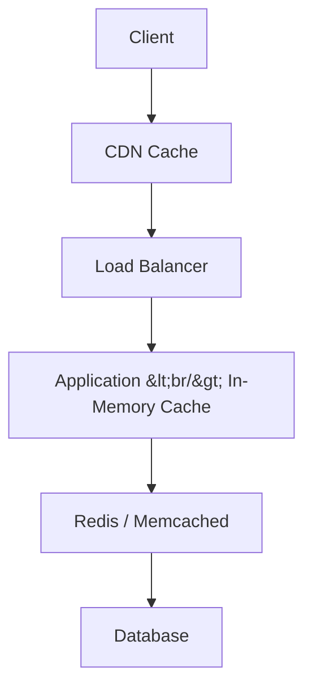

## Overview

Based on freeCodeCamp's [System Design Concepts Course and Interview Prep](https://www.youtube.com/watch?v=F2FmTdLtb_4), this post covers the essential concepts you need to know for system design interviews and real-world practice. From the physical layer hierarchy of computers to CAP theorem, networking, load balancing, caching, and database strategies -- all the fundamentals needed for designing distributed systems in one place.

<!--more-->

---

## Computer Hardware Layer Hierarchy

The starting point of system design is understanding how individual computers work. You need to understand the hierarchy of data storage and access speeds to predict bottlenecks.

**Disk Storage** -- Non-volatile storage. Split into HDDs (80-160 MB/s) and SSDs (500-3,500 MB/s). The OS, applications, and user files are stored here.

**RAM** -- Volatile memory. Holds variables, intermediate calculations, and runtime stacks for currently running programs. Read/write speeds of 5,000+ MB/s, faster than SSDs.

**Cache (L1/L2/L3)** -- Megabyte-scale ultra-fast memory. L1 cache access time is on the order of nanoseconds. The CPU looks for data in L1 -> L2 -> L3 -> RAM order.

**CPU** -- The brain of the computer. Compilers convert high-level language code into machine code, which the CPU then fetches, decodes, and executes.

This hierarchy is the rationale behind caching strategies in system design. Placing frequently accessed data in higher layers dramatically reduces average access time.

---

## The Big Picture of Production Architecture

Key components of a production environment:

- **CI/CD Pipeline** -- Tools like Jenkins and GitHub Actions automatically deploy code from the repo through tests to production servers.
- **Load Balancer / Reverse Proxy** -- Tools like nginx distribute user requests evenly across multiple servers.
- **External Storage** -- Databases run on separate servers connected via network, isolated from production servers.
- **Logging / Monitoring** -- Tools like PM2 for backends and Sentry for frontends capture errors in real time. Integrating alerts into a Slack channel enables immediate response.

The golden rule of debugging: **Never debug directly in production.** Follow the sequence of reproducing in staging -> fixing -> hotfix rollout.

---

## CAP Theorem and Design Trade-offs

The CAP theorem (Brewer's Theorem), the most important theoretical foundation for distributed system design, states that only two of three properties can be achieved simultaneously.

| Property | Meaning | Analogy |
|----------|---------|---------|
| **Consistency** | All nodes have identical data | Google Docs -- one person edits and it's immediately reflected for everyone |
| **Availability** | The system is always responsive | A 24/7 online shopping mall |
| **Partition Tolerance** | The system operates despite network partitions | In a group chat, if one person disconnects, the rest continue chatting |

**Banking systems** choose CP (Consistency + Partition Tolerance). They can temporarily sacrifice availability for financial accuracy. In contrast, **social media feeds** choose AP (Availability + Partition Tolerance), allowing slight data inconsistencies to ensure the system always responds.

The key is finding not the "perfect solution" but the "optimal solution for our use case."

---

## Availability and SLO/SLA

Availability is a measure of a system's operational performance and reliability. Targeting "Five 9's" (99.999%) means annual downtime of only about 5 minutes.

| Availability | Annual Allowed Downtime |
|--------------|------------------------|
| 99.9% | ~8.76 hours |
| 99.99% | ~52 minutes |
| 99.999% | ~5.26 minutes |

**SLO (Service Level Objective)** -- Internal performance targets. "99.9% of web service requests must respond within 300ms."

**SLA (Service Level Agreement)** -- A formal contract with customers. Violating the SLA requires providing refunds or compensation.

**Resilience strategies:**
- **Redundancy** -- Keep backup systems on standby at all times
- **Fault Tolerance** -- Prepare for unexpected failures or attacks
- **Graceful Degradation** -- Maintain core functionality even when some features are unavailable

---

## Throughput vs Latency

| Metric | Unit | Meaning |
|--------|------|---------|
| Server Throughput | RPS (Requests/sec) | Number of requests a server processes per second |
| Database Throughput | QPS (Queries/sec) | Number of queries a DB processes per second |
| Data Throughput | Bytes/sec | Data transfer rate of a network or system |
| Latency | ms | Response time for a single request |

Throughput and latency have a trade-off relationship. Increasing throughput via batch processing can increase latency for individual requests. In system design, you need to find the right balance for your use case.

---

## Networking Fundamentals -- IP, TCP, UDP, DNS

### IP Addresses and Packets

The foundation of all network communication is IP addresses. IPv4's 32-bit address space (~4 billion addresses) is running out, driving the transition to IPv6 (128-bit). The IP header of a data packet contains sender and receiver addresses, and the application layer uses protocols like HTTP to interpret the data.

### TCP vs UDP

**TCP (Transmission Control Protocol)** -- Connection-oriented, guarantees order, supports retransmission. Suitable for web browsing, file transfers, and email. Establishes connections via a three-way handshake (SYN -> SYN-ACK -> ACK).

**UDP (User Datagram Protocol)** -- Connectionless, no order guarantee, fast. Suitable for real-time streaming, gaming, and VoIP. Trades some packet loss for speed.

### DNS (Domain Name System)

The internet's phone book that translates human-readable domains (google.com) into IP addresses. Resolution follows: browser cache -> OS cache -> recursive resolver -> root server -> TLD server -> authoritative server.

---

## API Design -- REST, GraphQL, gRPC

### REST (Representational State Transfer)

The most common API style. Manipulates resources using HTTP methods (GET, POST, PUT, DELETE) and URL paths. Each request is independent under the stateless principle.

### GraphQL

Allows clients to request exactly the data they need. Solves over-fetching and under-fetching problems, but increases server implementation complexity and makes caching difficult.

### gRPC (Google Remote Procedure Call)

A binary protocol using Protocol Buffers. Supports bidirectional streaming over HTTP/2. Offers higher performance than REST for inter-microservice communication.

| Feature | REST | GraphQL | gRPC |
|---------|------|---------|------|
| Data Format | JSON | JSON | Protobuf (binary) |
| Protocol | HTTP/1.1 | HTTP | HTTP/2 |
| Use Case | Public APIs | Complex queries | Service-to-service |
| Streaming | Limited | Subscription | Bidirectional |

---

## Load Balancing and Proxies

### Load Balancing Strategies

Distributes traffic across multiple servers to prevent overloading a single server.

- **Round Robin** -- Distributes requests sequentially. The simplest approach.
- **Least Connections** -- Routes to the server with the fewest current connections.
- **IP Hash** -- Hashes the client IP to always route to the same server. Useful for session persistence.
- **Weighted** -- Assigns weights based on server performance.

### Forward Proxy vs Reverse Proxy

**Forward Proxy** -- Operates on the client side. Hides the user's IP and is used for content filtering and caching. (e.g., VPN)

**Reverse Proxy** -- Operates on the server side. Hides the actual server's IP and handles load balancing, SSL termination, and caching. (e.g., nginx, HAProxy)

---

## Caching Strategies

Caching can be applied at every layer of the system:

- **Browser Cache** -- Stores static assets (CSS, JS, images) on the client
- **CDN** -- Caches content on geographically distributed servers to reduce latency
- **Application Cache** -- Keeps frequent DB query results in memory using Redis or Memcached
- **DB Query Cache** -- Caches identical query results at the database level

**Cache Invalidation** strategies are critical:
- **Write-Through** -- Updates cache and DB simultaneously on writes. High consistency but write latency.
- **Write-Back** -- Updates cache first, DB later in batches. Fast but risk of data loss.
- **Write-Around** -- Writes only to DB, cache is refreshed on reads. Suitable for infrequently read data.

---

## Databases -- SQL vs NoSQL, Sharding, Replication

### SQL vs NoSQL

| Feature | SQL (PostgreSQL, MySQL) | NoSQL (MongoDB, Cassandra) |
|---------|------------------------|---------------------------|
| Schema | Fixed schema, table-based | Flexible schema, document/KV/graph |
| Scaling | Vertical (Scale Up) | Horizontal (Scale Out) |
| Transactions | ACID guaranteed | BASE (eventual consistency) |
| Best For | Relational data, complex joins | High-volume unstructured data, fast writes |

### Sharding

A horizontal partitioning strategy that distributes data across multiple DB instances. Shard key selection is critical -- uneven distribution (hot spots) concentrates load on specific shards.

### Replication

Copies data across multiple nodes to improve read performance and fault tolerance.
- **Leader-Follower** -- The leader handles writes while followers handle reads
- **Leader-Leader** -- All nodes can read and write, but conflict resolution is complex

---

## Quick Links

- [System Design Concepts Course and Interview Prep](https://www.youtube.com/watch?v=F2FmTdLtb_4) -- Full freeCodeCamp course

---

## Insights

The essence of system design is "trade-offs." Just as the CAP theorem lets you choose only two, every design decision is about what you gain and what you give up. Increasing throughput raises latency; strengthening consistency reduces availability. Good system designers don't memorize correct answers -- they develop the ability to find the optimal compromise for their use case. While this course covers a broad range, the biggest lesson is that each concept doesn't stand alone but interlocks with the others. CDN is an extension of caching, sharding is a practical application of the CAP theorem, and load balancing sits at the intersection of availability and scalability.
