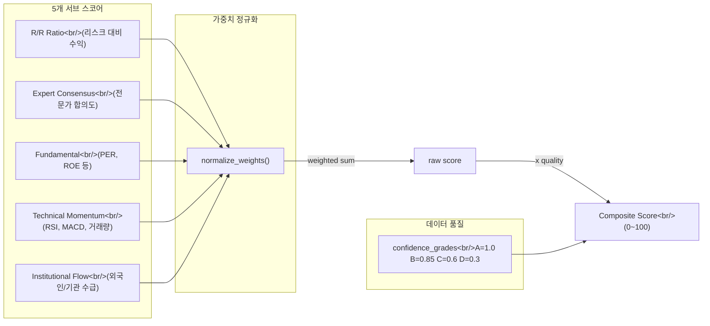

## 개요

[이전 글: Trading Agent 개발기 #7](/posts/2026-03-30-trading-agent-dev7/)에서는 에이전트 설정 UI와 시그널 카드 개선을 다뤘다. 이번 #8에서는 단일 `min_rr_score` 게이트를 **5개 팩터 합성 스코어(Composite Score)** 시스템으로 교체하고, 종목 리서치 페이지 신규 구축, 매도 검증 로직, 그리고 프로젝트 리브랜딩까지 41개 커밋에 걸친 대규모 개선을 정리한다.

<!--more-->

## 1. 종목 리서치 페이지 (Stock Info)

### 문제

시그널이 발생해도 해당 종목의 기본적 분석, 기술적 지표, 수급 동향 등을 한눈에 볼 수 있는 페이지가 없었다. 매번 외부 증권사 HTS를 열어야 했고, 이는 의사결정 지연의 원인이 됐다.

### 구현

백엔드에 `/api/research` 라우터를 추가하고 5개 엔드포인트(기본 정보, 재무, 기술적 지표, 수급, 뉴스/공시)를 구성했다. 프론트엔드는 9개 섹션 컴포넌트로 분리했다.

```typescript
// frontend/src/components/stockinfo/ 구조
DiscoverySidebar.tsx      // 종목 검색 사이드바
ResearchHeader.tsx        // 종목 기본 정보 헤더
PriceChartSection.tsx     // 캔들스틱 차트 + 기술적 지표
FundamentalsSection.tsx   // 재무제표 핵심 지표
ValuationSection.tsx      // 밸류에이션 비교
InvestorFlowSection.tsx   // 외국인/기관 수급
PeerSection.tsx           // 동종업계 비교
InsiderSection.tsx        // 내부자 거래
SignalHistorySection.tsx  // 과거 시그널 이력
```

차트는 기존 라인 차트에서 **캔들스틱 + 거래량 + 이동평균선(MA) + 볼린저 밴드(BB)** 오버레이로 업그레이드했으며, 기술적 지표는 RSI, MACD, 볼린저 밴드, 거래량 추세를 각각 미니 차트가 포함된 2x2 그리드 카드로 표시한다.

## 2. 시그널 파이프라인 개선 — 선형 신뢰도와 매도 검증

### Sigmoid에서 Linear 매핑으로

기존 sigmoid 기반 `compute_confidence`는 R/R 스코어가 0.5~1.5 구간에서 거의 동일한 신뢰도를 출력하는 "사각지대"가 있었다. 이를 선형 매핑으로 교체하고 `min_rr_score` 임계값을 0.3으로 낮춰 더 넓은 범위의 시그널을 포착하도록 했다.

### 매도(SELL) 검증 로직

보유하지 않은 종목에 대해 SELL 시그널이 발생하는 문제를 발견했다. 두 단계의 하드 게이트를 추가했다.

1. **Risk Manager**: 미보유 종목 SELL 거부 + 최소 보유 기간(min hold time) 검증
2. **Market Scanner**: 미보유 종목의 SELL을 HOLD로 강제 전환

전문가 패널 프롬프트에도 SELL/HOLD 방향 규칙을 명시적으로 추가하여, Chief Analyst가 보유 현황을 인지한 상태에서 의견을 내도록 개선했다.

## 3. 다중 팩터 합성 스코어 시스템

이번 시리즈의 핵심 변경이다. 단일 R/R 스코어에 의존하던 시그널 필터링을 **5개 독립 팩터의 가중합**으로 전면 교체했다.



### 서브 스코어 설계

각 팩터는 0~1 범위로 정규화되며, 데이터가 없으면 기본값 0.5(중립)를 반환한다.

```python
# backend/app/models/composite_score.py

def score_fundamental(
    per: float | None = None,
    roe: float | None = None,
    debt_ratio: float | None = None,
    operating_margin: float | None = None,
) -> float:
    """각 지표를 독립적으로 0~1로 정규화하고 평균을 반환한다.
    누락된 지표는 계산에서 제외."""
    components: list[float] = []
    if per is not None and per > 0:
        components.append(min(max(1.0 - per / 40.0, 0.0), 1.0))
    if roe is not None:
        components.append(min(max(roe / 30.0, 0.0), 1.0))
    # ... debt_ratio, operating_margin 동일 패턴
    return sum(components) / len(components) if components else 0.5
```

기관/외국인 수급 스코어는 sigmoid 정규화를 사용한다. 순매수 합계를 기준금액(기본 10억원)으로 나눠 -1~1 범위로 매핑한다.

```python
def score_institutional_flow(
    foreign_net: float = 0,
    institution_net: float = 0,
    scale: float = 1_000_000_000,  # 10억원
) -> float:
    combined = foreign_net + institution_net
    return 1.0 / (1.0 + math.exp(-combined / scale))
```

### 가중치 정규화와 합산

사용자가 설정한 가중치는 합이 1.0이 되도록 자동 정규화된다. 최종 점수는 가중합에 데이터 품질 멀티플라이어를 곱한 뒤 0~100 스케일로 변환한다.

```python
def compute_composite_score(
    rr_score: float,
    calibration_ceiling: float = 2.0,
    expert_analyses: list[dict] | None = None,
    dart_financials: dict | None = None,
    technicals: dict | None = None,
    investor_trend: dict | None = None,
    confidence_grades: dict[str, str] | None = None,
    weights: dict[str, float] | None = None,
) -> float:
    w = normalize_weights(weights) if weights else dict(DEFAULT_WEIGHTS)
    # ... 5개 서브 스코어 계산 ...
    raw = (
        w["rr_ratio"] * rr_sub
        + w["expert_consensus"] * expert_sub
        + w["fundamental"] * fundamental_sub
        + w["technical"] * technical_sub
        + w["institutional"] * institutional_sub
    )
    quality = compute_data_quality_multiplier(confidence_grades or {})
    return min(max(raw * quality * 100, 0.0), 100.0)
```

### 데이터 품질 멀티플라이어

전문가별로 데이터 신뢰도 등급(A/B/C/D)을 부여하고, 등급 평균을 멀티플라이어로 적용한다. 데이터 품질이 낮으면 합성 스코어가 자동으로 할인된다.

| 등급 | 멀티플라이어 |
|------|-------------|
| A    | 1.00        |
| B    | 0.85        |
| C    | 0.60        |
| D    | 0.30        |

## 4. UI 슬라이더와 DB 마이그레이션

### 가중치 조절 UI

Settings 페이지에 5개 팩터별 가중치 슬라이더를 추가했다. 사용자가 슬라이더를 움직이면 실시간으로 정규화된 비율이 표시된다. 기존 `min_rr_score` 슬라이더는 `min_composite_score`로 교체되었고, 기본 임계값은 15%로 설정했다.

### 전체 스택 마이그레이션

`min_rr_score`에서 `min_composite_score`로의 변경은 다음 레이어를 모두 수정해야 했다.

| 레이어 | 파일 | 변경 내용 |
|--------|------|-----------|
| 스코어링 모듈 | `composite_score.py` | 5개 서브 스코어 + 합산 함수 신규 |
| 스캐너 | `market_scanner.py` | `compute_confidence` 제거, composite score 연결 |
| 리스크 매니저 | `risk_manager.py` | 게이트 기준 변경 |
| API 라우터 | `agents.py` | 가중치 필드 추가, 필드명 변경 |
| 프론트엔드 타입 | `types.ts` | 가중치 필드 5개 추가 |
| 설정 UI | `SettingsView.tsx` | 슬라이더 5개 추가 |
| DB | `trading.db` | 컬럼 rename + 가중치 기본값 insert |

## 5. 기타 개선사항

### Alpha Pulse 리브랜딩

프로젝트명을 "KIS Trading"에서 **Alpha Pulse**로 변경했다. 파비콘, 매니페스트, 헤더바, 앱 타이틀 등 전체 브랜딩 에셋을 교체했다.

### 인프라 수정

- **APScheduler cron 요일 변환**: 표준 cron(0=Sun)과 APScheduler(0=Mon) 간 요일 인덱스 차이를 변환하여 스케줄 태스크가 정확한 요일에 실행되도록 수정
- **uvicorn WebSocket**: `websockets` 패키지의 DeprecationWarning을 해결하기 위해 `wsproto`로 구현체 변경
- **스케줄 정렬**: 스케줄 태스크 목록을 cron 시간(시:분) 기준 오름차순으로 정렬

### 전문가 패널 강화

각 전문가에게 투자자 수급 동향, DART 공시 요약, 전문 분야별 신뢰도 등급을 추가로 제공하여 분석 품질을 향상시켰다.

## 커밋 로그

| 날짜 | 설명 | 카테고리 |
|------|------|----------|
| 03-24 | 스케줄 태스크 cron 시간순 정렬 | UI |
| 03-25 | 에이전트 설정 구성 가능화 + 시그널 카드 UI 개선 | feat |
| 03-25 | CLAUDE.md 멀티 에이전트 시스템 문서 업데이트 | docs |
| 03-30 | uvicorn WebSocket을 wsproto로 전환 | fix |
| 03-30 | APScheduler cron 요일 변환 수정 | fix |
| 03-30 | Stock Info 페이지 설계 문서 + 구현 계획 | docs |
| 03-31 | technical_service 모듈 추가 (재사용 가능 지표 계산) | feat |
| 03-31 | research 타입 + API 함수 추가 | feat |
| 03-31 | /api/research 라우터 (5개 엔드포인트) | feat |
| 03-31 | stockinfo 섹션 컴포넌트 9개 + DiscoverySidebar | feat |
| 03-31 | InsiderSection, SignalHistorySection 컴포넌트 | feat |
| 03-31 | ResearchPanel, StockInfoView, CSS 완성 | feat |
| 03-31 | StockInfoView를 앱 내비게이션에 연결 | feat |
| 03-31 | lint 에러 해결 및 stockinfo 컴포넌트 완성 | fix |
| 03-31 | verbatimModuleSyntax 호환 import type 수정 | fix |
| 03-31 | 검색 결과 반환 + 종목 전환 시 stale state 방지 | fix |
| 03-31 | 시그널 파이프라인 수정 설계 문서 | docs |
| 03-31 | 캔들스틱 차트 + 거래량, MA, BB 오버레이 | feat |
| 03-31 | 기술적 지표 미니 차트 카드 분리 | feat |
| 03-31 | compute_confidence 선형 매핑 함수 추가 | feat |
| 03-31 | sigmoid를 linear confidence로 교체, min_rr_score 0.3 | feat |
| 03-31 | 기술적 지표 카드 2x2 그리드 레이아웃 | feat |
| 03-31 | SELL 검증 — 미보유 종목 거부 + 최소 보유 기간 | feat |
| 03-31 | 미보유 종목 SELL을 HOLD로 강제 전환 | feat |
| 03-31 | Chief Analyst 프롬프트에 SELL/HOLD 방향 규칙 추가 | feat |
| 03-31 | 전문가 데이터 강화 — 수급, DART, 신뢰도 등급 | feat |
| 03-31 | 가격/거래량 차트 영역 간격 조정 | fix |
| 03-31 | calibration ceiling 슬라이더, min hold time 입력 | feat |
| 03-31 | RSI 게이지 CSS 누락분 반영 | fix |
| 03-31 | 다중 팩터 합성 스코어 설계 문서 (Approach C) | docs |
| 03-31 | 다중 팩터 합성 스코어 구현 계획 | docs |
| 03-31 | KIS Trading에서 Alpha Pulse로 리브랜딩 | feat |
| 04-01 | 5개 서브 스코어 함수 + 데이터 품질 멀티플라이어 | feat |
| 04-01 | compute_composite_score + 가중치 정규화 | feat |
| 04-01 | 합성 스코어를 파이프라인에 연결, compute_confidence 제거 | feat |
| 04-01 | min_rr_score 게이트를 min_composite_score로 변경 (15%) | feat |
| 04-01 | API 라우터에 가중치 필드 추가 | feat |
| 04-01 | 프론트엔드 타입에 가중치 필드 추가 | feat |
| 04-01 | 가중치 슬라이더 UI, min_composite_score 교체 | feat |
| 04-01 | DB 마이그레이션 — 컬럼 rename + 가중치 기본값 | feat |

## 인사이트

**단일 지표의 한계**: `min_rr_score` 하나로 매매 신호를 필터링하면, R/R이 높지만 기본적 분석이 취약한 종목이나, 수급이 좋지만 기술적 지표가 부정적인 종목을 구분할 수 없다. 다중 팩터 시스템으로 전환하면서 각 차원을 독립적으로 평가하고 가중합으로 결합할 수 있게 됐다. 사용자가 슬라이더로 가중치를 조절할 수 있어 투자 성향(기본적 분석 중심 vs 모멘텀 중심)에 맞는 튜닝이 가능하다.

**데이터 품질을 점수에 반영하는 것의 가치**: 모든 팩터의 데이터가 동일한 품질은 아니다. DART 공시가 오래된 종목, 거래량이 적어 기술적 지표가 불안정한 종목 등에서는 높은 합성 스코어가 나오더라도 실제 신뢰도는 낮다. 데이터 품질 멀티플라이어를 도입하여 "좋은 데이터로 계산된 70점"과 "나쁜 데이터로 계산된 70점"을 구분할 수 있게 한 것이 이번 설계의 핵심이었다.

**전체 스택을 관통하는 필드명 변경의 비용**: `min_rr_score` 하나를 `min_composite_score`로 바꾸는 데 DB, 백엔드 모델, API 라우터, 프론트엔드 타입, UI 컴포넌트까지 7개 레이어를 수정해야 했다. 초기 설계 시 범용적인 네이밍을 사용했다면 이 비용을 줄일 수 있었을 것이다.
