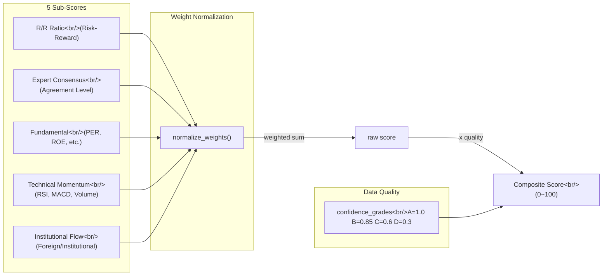

## Overview

[Previous Post: Trading Agent Dev Log #7](/posts/2026-03-30-trading-agent-dev7/) covered agent settings UI and signal card improvements. In this #8 installment, the single `min_rr_score` gate was replaced with a **5-factor Composite Score** system, along with building a new stock research page, sell validation logic, and project rebranding — a major overhaul spanning 41 commits.

<!--more-->

## 1. Stock Research Page (Stock Info)

### Problem

Even when a signal was generated, there was no page to view the stock's fundamental analysis, technical indicators, and institutional flow at a glance. Having to open an external brokerage HTS every time caused delays in decision-making.

### Implementation

A `/api/research` router was added to the backend with 5 endpoints (basic info, financials, technical indicators, institutional flow, news/disclosures). The frontend was split into 9 section components.

```typescript
// frontend/src/components/stockinfo/ structure
DiscoverySidebar.tsx      // Stock search sidebar
ResearchHeader.tsx        // Stock basic info header
PriceChartSection.tsx     // Candlestick chart + technical indicators
FundamentalsSection.tsx   // Key financial metrics
ValuationSection.tsx      // Valuation comparison
InvestorFlowSection.tsx   // Foreign/institutional flow
PeerSection.tsx           // Industry peer comparison
InsiderSection.tsx        // Insider trading
SignalHistorySection.tsx  // Past signal history
```

Charts were upgraded from simple line charts to **candlestick + volume + moving averages (MA) + Bollinger Bands (BB)** overlays, and technical indicators are displayed as mini-chart 2x2 grid cards for RSI, MACD, Bollinger Bands, and volume trends respectively.

## 2. Signal Pipeline Improvements — Linear Confidence and Sell Validation

### From Sigmoid to Linear Mapping

The existing sigmoid-based `compute_confidence` had a "dead zone" where R/R scores between 0.5 and 1.5 produced nearly identical confidence values. This was replaced with linear mapping and the `min_rr_score` threshold was lowered to 0.3 to capture a wider range of signals.

### Sell (SELL) Validation Logic

A problem was discovered where SELL signals were generated for stocks not held in the portfolio. Two hard gates were added:

1. **Risk Manager**: Reject SELL for unheld stocks + minimum hold time validation
2. **Market Scanner**: Force-convert SELL to HOLD for unheld stocks

SELL/HOLD direction rules were also explicitly added to the expert panel prompts so that the Chief Analyst gives opinions while being aware of the current holdings.

## 3. Multi-Factor Composite Score System

This is the core change of this installment. Signal filtering that relied on a single R/R score was completely replaced with a **weighted sum of 5 independent factors**.



### Sub-Score Design

Each factor is normalized to a 0-1 range, returning a default of 0.5 (neutral) when data is unavailable.

```python
# backend/app/models/composite_score.py

def score_fundamental(
    per: float | None = None,
    roe: float | None = None,
    debt_ratio: float | None = None,
    operating_margin: float | None = None,
) -> float:
    """Normalize each metric independently to 0-1 and return the average.
    Missing metrics are excluded from the calculation."""
    components: list[float] = []
    if per is not None and per > 0:
        components.append(min(max(1.0 - per / 40.0, 0.0), 1.0))
    if roe is not None:
        components.append(min(max(roe / 30.0, 0.0), 1.0))
    # ... debt_ratio, operating_margin follow the same pattern
    return sum(components) / len(components) if components else 0.5
```

The institutional/foreign flow score uses sigmoid normalization. The net purchase total is divided by a base amount (default 1 billion KRW) and mapped to the -1 to 1 range.

```python
def score_institutional_flow(
    foreign_net: float = 0,
    institution_net: float = 0,
    scale: float = 1_000_000_000,  # 1 billion KRW
) -> float:
    combined = foreign_net + institution_net
    return 1.0 / (1.0 + math.exp(-combined / scale))
```

### Weight Normalization and Aggregation

User-configured weights are automatically normalized to sum to 1.0. The final score is computed by multiplying the weighted sum by a data quality multiplier and converting to a 0-100 scale.

```python
def compute_composite_score(
    rr_score: float,
    calibration_ceiling: float = 2.0,
    expert_analyses: list[dict] | None = None,
    dart_financials: dict | None = None,
    technicals: dict | None = None,
    investor_trend: dict | None = None,
    confidence_grades: dict[str, str] | None = None,
    weights: dict[str, float] | None = None,
) -> float:
    w = normalize_weights(weights) if weights else dict(DEFAULT_WEIGHTS)
    # ... compute 5 sub-scores ...
    raw = (
        w["rr_ratio"] * rr_sub
        + w["expert_consensus"] * expert_sub
        + w["fundamental"] * fundamental_sub
        + w["technical"] * technical_sub
        + w["institutional"] * institutional_sub
    )
    quality = compute_data_quality_multiplier(confidence_grades or {})
    return min(max(raw * quality * 100, 0.0), 100.0)
```

### Data Quality Multiplier

Each expert is assigned a data reliability grade (A/B/C/D), and the average grade is applied as a multiplier. When data quality is low, the composite score is automatically discounted.

| Grade | Multiplier |
|-------|------------|
| A     | 1.00       |
| B     | 0.85       |
| C     | 0.60       |
| D     | 0.30       |

## 4. UI Sliders and DB Migration

### Weight Adjustment UI

Five per-factor weight sliders were added to the Settings page. As users move the sliders, the normalized proportions are displayed in real time. The existing `min_rr_score` slider was replaced with `min_composite_score`, with a default threshold of 15%.

### Full-Stack Migration

Changing from `min_rr_score` to `min_composite_score` required modifications across all of the following layers.

| Layer | File | Changes |
|-------|------|---------|
| Scoring module | `composite_score.py` | 5 sub-scores + aggregation functions (new) |
| Scanner | `market_scanner.py` | Remove `compute_confidence`, connect composite score |
| Risk manager | `risk_manager.py` | Change gate criteria |
| API router | `agents.py` | Add weight fields, rename fields |
| Frontend types | `types.ts` | Add 5 weight fields |
| Settings UI | `SettingsView.tsx` | Add 5 sliders |
| DB | `trading.db` | Column rename + weight default inserts |

## 5. Other Improvements

### Alpha Pulse Rebranding

The project was renamed from "KIS Trading" to **Alpha Pulse**. All branding assets including favicon, manifest, header bar, and app title were replaced.

### Infrastructure Fixes

- **APScheduler cron day-of-week conversion**: Fixed schedule tasks to run on the correct day by converting between standard cron (0=Sun) and APScheduler (0=Mon) day-of-week indices
- **uvicorn WebSocket**: Switched from `websockets` to `wsproto` implementation to resolve DeprecationWarning
- **Schedule sorting**: Sorted schedule task list in ascending order by cron time (hour:minute)

### Expert Panel Enhancements

Analysis quality was improved by providing each expert with additional data including investor flow trends, DART disclosure summaries, and specialty-specific confidence grades.

## Commit Log

| Date | Description | Category |
|------|-------------|----------|
| 03-24 | Sort schedule tasks by cron time | UI |
| 03-25 | Make agent settings configurable + signal card UI improvements | feat |
| 03-25 | Update CLAUDE.md multi-agent system documentation | docs |
| 03-30 | Switch uvicorn WebSocket to wsproto | fix |
| 03-30 | Fix APScheduler cron day-of-week conversion | fix |
| 03-30 | Stock Info page design doc + implementation plan | docs |
| 03-31 | Add technical_service module (reusable indicator calculations) | feat |
| 03-31 | Add research types + API functions | feat |
| 03-31 | /api/research router (5 endpoints) | feat |
| 03-31 | 9 stockinfo section components + DiscoverySidebar | feat |
| 03-31 | InsiderSection, SignalHistorySection components | feat |
| 03-31 | ResearchPanel, StockInfoView, CSS completion | feat |
| 03-31 | Connect StockInfoView to app navigation | feat |
| 03-31 | Resolve lint errors and complete stockinfo components | fix |
| 03-31 | Fix verbatimModuleSyntax compatible import type | fix |
| 03-31 | Return search results + prevent stale state on stock switch | fix |
| 03-31 | Signal pipeline fix design doc | docs |
| 03-31 | Candlestick chart + volume, MA, BB overlays | feat |
| 03-31 | Separate technical indicator mini chart cards | feat |
| 03-31 | Add compute_confidence linear mapping function | feat |
| 03-31 | Replace sigmoid with linear confidence, min_rr_score 0.3 | feat |
| 03-31 | Technical indicator cards 2x2 grid layout | feat |
| 03-31 | SELL validation — reject unheld stocks + minimum hold time | feat |
| 03-31 | Force-convert unheld stock SELL to HOLD | feat |
| 03-31 | Add SELL/HOLD direction rules to Chief Analyst prompt | feat |
| 03-31 | Enhance expert data — flow, DART, confidence grades | feat |
| 03-31 | Adjust price/volume chart area spacing | fix |
| 03-31 | Calibration ceiling slider, min hold time input | feat |
| 03-31 | Fix missing RSI gauge CSS | fix |
| 03-31 | Multi-factor composite score design doc (Approach C) | docs |
| 03-31 | Multi-factor composite score implementation plan | docs |
| 03-31 | Rebrand from KIS Trading to Alpha Pulse | feat |
| 04-01 | 5 sub-score functions + data quality multiplier | feat |
| 04-01 | compute_composite_score + weight normalization | feat |
| 04-01 | Connect composite score to pipeline, remove compute_confidence | feat |
| 04-01 | Change min_rr_score gate to min_composite_score (15%) | feat |
| 04-01 | Add weight fields to API router | feat |
| 04-01 | Add weight fields to frontend types | feat |
| 04-01 | Weight slider UI, replace min_composite_score | feat |
| 04-01 | DB migration — column rename + weight defaults | feat |

## Insights

**Limitations of a single metric**: Filtering trade signals with `min_rr_score` alone makes it impossible to distinguish stocks with high R/R but weak fundamentals, or stocks with good institutional flow but negative technical indicators. Transitioning to a multi-factor system allows evaluating each dimension independently and combining them via weighted sum. Users can adjust weights through sliders to tune according to their investment style (fundamental-focused vs. momentum-focused).

**The value of reflecting data quality in scores**: Not all factor data is of equal quality. For stocks with outdated DART disclosures, or stocks with low volume where technical indicators are unstable, a high composite score may not actually be reliable. Introducing a data quality multiplier to distinguish between "70 points calculated from good data" and "70 points calculated from poor data" was the core of this design.

**The cost of field name changes that cut across the entire stack**: Renaming a single `min_rr_score` to `min_composite_score` required modifications across 7 layers — DB, backend models, API router, frontend types, and UI components. Using more generic naming in the initial design could have reduced this cost.
