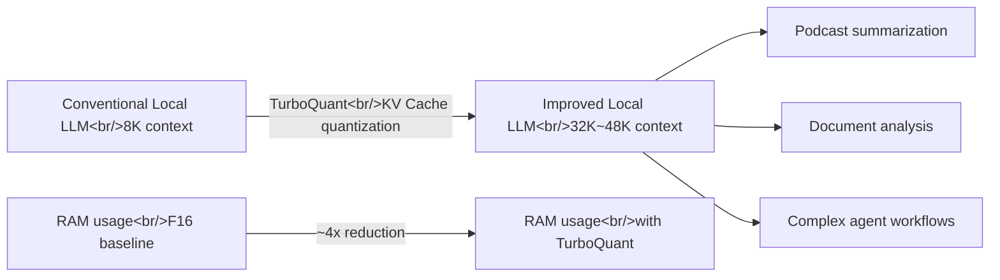
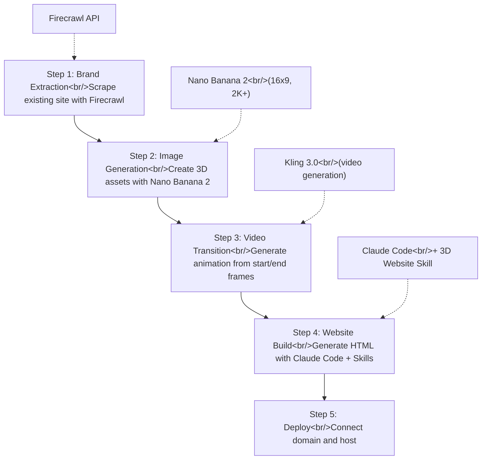

## Overview

Today we cover three interesting topics. First, Google's **TurboQuant** research, a KV Cache quantization technique that can expand local LLM context windows by up to 6x on the same hardware. Next, we look at the Korean AI character chat platform **Plit**, and finally, we analyze a workflow for rapidly building premium websites with 3D animations using the **Claude Code + Nano Banana 2** combination.

<!--more-->

## TurboQuant - A Game Changer for Local AI

### What Is the KV Cache Problem?

The biggest bottleneck when running LLMs locally is the **KV Cache** (Key-Value Cache). The KV Cache is the memory region that stores conversation history, and it consumes increasingly more GPU/NPU RAM as chats get longer. Since the model itself also occupies memory, context windows are realistically limited to 8K-16K tokens on consumer hardware (8-32GB RAM).

AnythingLLM founder Timothy Carabatsos explains the practical impact of this problem:

> With an 8K context window, you can't even summarize a single YouTube podcast. With 16K, you barely can, but other tasks on the system may stall. At 32K, these tasks become trivial.

### The Core of TurboQuant

Google's TurboQuant research quantizes the KV Cache to store **approximately 6x more tokens in the same memory space**. Benchmarks confirm that memory usage decreases by roughly 4x compared to F16 (the conventional approach).

### Practical Implications

Work is currently underway to merge TurboQuant into **llama.cpp**. Since llama.cpp is the de facto standard for local model execution, once this integration is complete, it will immediately benefit most local AI tools.

This is especially significant given the recent surge in DDR5 memory prices, making TurboQuant's ability to maximize existing hardware utilization all the more valuable. For a 7B model:

| Item | Before | After TurboQuant |
|------|--------|-----------------|
| Context window | 8K tokens | 32K+ tokens |
| KV Cache memory | 100% | ~25% |
| Podcast summarization | Not possible | Possible |
| Complex workflows | Limited | Practical |

Cloud models will still have the edge for million-token-scale tasks, but this could be a turning point where a significant portion of everyday AI tasks become feasible locally.

---

## Plit - AI Character Chat Platform

### Service Overview

**Plit** is an AI character chat platform developed by the Korean startup Pius. Currently in beta testing, it offers three core features:

- **Character Chat** -- 1:1 conversations with AI characters
- **Talk Rooms** -- Themed open conversation spaces
- **Stories** -- Branching interactive stories

Its positioning is similar to overseas services like Character.ai and Janitor AI, but its differentiation lies in being optimized for Korean. Under the slogan "Start chatting with your own AI character," it features a structure for exploring popular and new characters.

### Trends in the AI Character Chat Market

AI character chat platforms are a rapidly growing space worldwide. Following Character.ai's explosive growth, various competing services have emerged, and Plit can be seen as an entry targeting the Korean market. The branching story feature is noteworthy for attempting to expand beyond simple chat into interactive content.

---

## Claude Code + Nano Banana 2 - One-Shot Premium Website Creation

### Full Workflow Overview

This workflow, introduced by Jack Roberts who runs an AI automation business, centers on the idea that you can create a **mobile-responsive, SEO-optimized, premium website with 3D animations** even without coding experience.

### Detailed 5-Step Process

**Step 1 -- Brand Extraction**: Use Firecrawl's branding scraping feature to automatically extract colors, logos, and brand assets from the target website. Large-scale automation is also possible via the API.

**Step 2 -- 3D Asset Generation**: Generate images in Nano Banana 2 at 16x9 ratio, minimum 2K resolution. Key tips are specifying a **clean white background** and running at least 4 iterations to select the best results. 1K resolution is insufficient, so always use 2K or higher.

**Step 3 -- Scroll Animation Video**: Feed two images -- the assembled state (start frame) and the disassembled state (end frame) -- into a video generation tool like Kling 3.0 to create a transition video. Previously, you would have needed to manually create hundreds of frames, but now just two images are enough.

**Step 4 -- Build Website with Claude Code**: Use Claude Code's skill system (`/skillcreator`) to install 3D Website Builder and Asset Generation skills, then automatically generate an HTML website integrating the created assets. Activating "edit automatically" mode with the `shift` shortcut makes the process even faster.

**Step 5 -- Reference-Based Refinement**: Provide the HTML structure of an existing website as a reference to further refine the layout and design.

### Key Insights

The most notable aspect of this workflow is the **toolchain combination**. Individual tools (Firecrawl, Nano Banana, Claude Code) each serve specific roles, but when connected through the skill system, they become a single automation pipeline. Jack Roberts mentions he has been selling websites worth thousands of dollars using this approach.

---

## Quick Links

| Topic | Link |
|-------|------|
| TurboQuant Explainer (AnythingLLM) | [YouTube](https://www.youtube.com/watch?v=GY7q9ZqM8bw) |
| Plit Official Site | [plit.io](https://www.plit.io/) |
| Claude Code + Nano Banana 2 Website Creation | [YouTube](https://www.youtube.com/watch?v=TZUTe7s11-I) |
| AnythingLLM Official Site | [anythingllm.com](https://anythingllm.com/) |
| Firecrawl Developer Tools | [firecrawl.dev](https://firecrawl.dev/) |

---

## Insights

**Local AI is becoming practical at a rapid pace.** TurboQuant is not just academic research -- through llama.cpp integration, it will meaningfully expand the range of AI tasks possible on consumer hardware. The context expansion from 8K to 32K transforms local models from "good for a few exchanges" to "capable of document analysis and agent workflows."

**Localization is key in the AI character chat market.** Plit's strategic choice to start as a Korean-specialized service during its beta phase targets the gap where Character.ai's English-centric service cannot perfectly handle Korean nuances.

**The paradigm of website creation is shifting.** What the Nano Banana 2 workflow demonstrates is that the traditional flow of "code -> design -> deploy" can be replaced with "brand extraction -> asset generation -> AI build." Claude Code's skill system in particular opens up the possibility of automating repetitive website creation at scale. For freelancers and agencies, this could represent a qualitative transformation in productivity.
