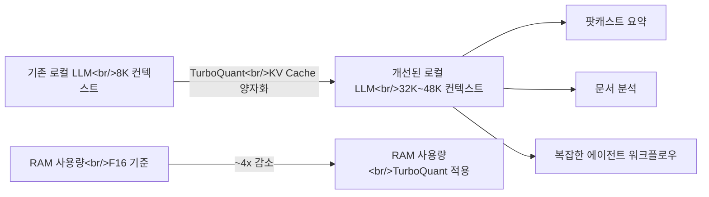
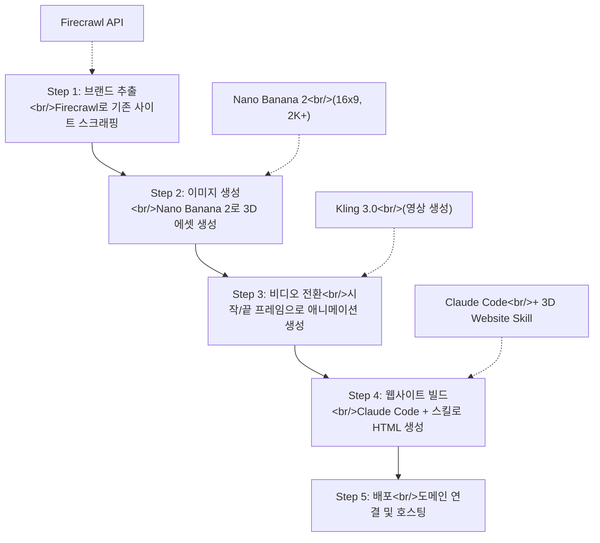

## 개요

오늘은 세 가지 흥미로운 주제를 다룹니다. 먼저 Google이 발표한 **TurboQuant** 연구로, 동일 하드웨어에서 로컬 LLM의 컨텍스트 윈도우를 6배까지 늘릴 수 있는 KV Cache 양자화 기술입니다. 다음으로 한국의 AI 캐릭터 대화 플랫폼 **플릿(Plit)**을 살펴보고, 마지막으로 **Claude Code + Nano Banana 2** 조합으로 3D 애니메이션이 포함된 프리미엄 웹사이트를 빠르게 제작하는 워크플로우를 분석합니다.

<!--more-->

## TurboQuant — 로컬 AI의 게임 체인저

### KV Cache 문제란?

로컬에서 LLM을 실행할 때 가장 큰 병목은 **KV Cache**(Key-Value Cache)입니다. KV Cache는 대화 히스토리를 저장하는 메모리 영역으로, 채팅이 길어질수록 GPU/NPU RAM을 점점 더 많이 소비합니다. 모델 자체도 메모리를 차지하기 때문에, 소비자급 하드웨어(8~32GB RAM)에서는 컨텍스트 윈도우가 8K~16K 토큰으로 제한되는 것이 현실입니다.

AnythingLLM의 창립자 Timothy Carabatsos는 이 문제의 실질적 영향을 이렇게 설명합니다:

> 8K 컨텍스트 윈도우로는 YouTube 팟캐스트 하나도 요약할 수 없습니다. 16K로는 겨우 가능하지만 시스템의 다른 작업이 멈출 수 있죠. 32K가 되면 이런 작업이 trivial해집니다.

### TurboQuant의 핵심

Google의 TurboQuant 연구는 KV Cache를 양자화하여 **동일 메모리 공간에 약 6배 더 많은 토큰**을 저장할 수 있게 합니다. 벤치마크에서는 F16(기존 방식) 대비 메모리 사용량이 약 4배 감소하는 것으로 확인되었습니다.

### 실질적 의미

현재 **llama.cpp**에 TurboQuant를 병합하려는 작업이 진행 중입니다. llama.cpp는 로컬 모델 실행의 사실상 표준이므로, 이 통합이 완료되면 대부분의 로컬 AI 도구에 즉각 반영될 것입니다.

특히 DDR5 메모리 가격이 최근 급등하고 있는 상황에서, 기존 하드웨어의 활용도를 극대화하는 TurboQuant의 가치는 더욱 두드러집니다. 7B 모델 기준으로:

| 항목 | 기존 | TurboQuant 적용 후 |
|------|------|-------------------|
| 컨텍스트 윈도우 | 8K 토큰 | 32K+ 토큰 |
| KV Cache 메모리 | 100% | ~25% |
| 팟캐스트 요약 | 불가능 | 가능 |
| 복잡한 워크플로우 | 제한적 | 실용적 |

클라우드 모델이 여전히 100만 토큰급 작업에서 우위를 가지겠지만, 일상적인 AI 작업의 상당 부분이 로컬에서 실행 가능해지는 전환점이 될 수 있습니다.

---

## 플릿(Plit) — AI 캐릭터 대화 플랫폼

### 서비스 개요

**플릿(Plit)**은 한국의 스타트업 파이어스(Pius)가 개발한 AI 캐릭터 대화 플랫폼입니다. 현재 베타 테스트 중이며, 세 가지 핵심 기능을 제공합니다:

- **캐릭터 챗** — AI 캐릭터와 1:1 대화
- **토크룸** — 테마별 자유 대화 공간
- **스토리** — 분기형 인터랙티브 스토리

Character.ai나 Janitor AI 같은 해외 서비스와 유사한 포지셔닝이지만, 한국어에 최적화된 서비스라는 점이 차별점입니다. "나만의 AI 캐릭터와 대화를 시작해보세요"라는 슬로건 아래, 인기 캐릭터와 새로운 캐릭터를 탐색할 수 있는 구조로 되어 있습니다.

### AI 캐릭터 대화 시장의 흐름

AI 캐릭터 대화 플랫폼은 전 세계적으로 빠르게 성장하는 영역입니다. Character.ai의 폭발적 성장 이후 다양한 경쟁 서비스가 등장하고 있으며, 플릿은 한국 시장을 타겟으로 한 진입으로 볼 수 있습니다. 분기형 스토리 기능은 단순 채팅을 넘어 인터랙티브 콘텐츠로의 확장을 시도한다는 점에서 주목할 만합니다.

---

## Claude Code + Nano Banana 2 — 프리미엄 웹사이트 원샷 제작

### 워크플로우 전체 흐름

AI 자동화 사업을 운영하는 Jack Roberts가 소개한 이 워크플로우는, 코딩 경험이 없어도 **모바일 반응형, SEO 최적화, 3D 애니메이션이 포함된 프리미엄 웹사이트**를 만들 수 있다는 것이 핵심입니다.

### 5단계 프로세스 상세

**Step 1 — 브랜드 추출**: Firecrawl의 branding 스크래핑 기능으로 대상 웹사이트의 색상, 로고, 브랜드 에셋을 자동 추출합니다. API를 통해 대규모 자동화도 가능합니다.

**Step 2 — 3D 에셋 생성**: Nano Banana 2에서 16x9 비율, 최소 2K 해상도로 이미지를 생성합니다. 핵심 팁은 **깨끗한 흰색 배경**을 지정하는 것과, 4회 이상 iteration을 돌려 최적의 결과물을 선택하는 것입니다. 1K 해상도는 품질이 부족하므로 반드시 2K 이상을 사용해야 합니다.

**Step 3 — 스크롤 애니메이션 비디오**: 조립된 상태(시작 프레임)와 분해된 상태(끝 프레임) 두 이미지를 Kling 3.0 같은 영상 생성 도구에 넣어 전환 영상을 만듭니다. 이전에는 수백 개 프레임을 수동으로 만들어야 했지만, 이제 두 장의 이미지만 있으면 됩니다.

**Step 4 — Claude Code로 웹사이트 빌드**: Claude Code의 스킬 시스템(`/skillcreator`)을 활용하여 3D Website Builder와 Asset Generation 스킬을 설치하고, 생성된 에셋을 통합한 HTML 웹사이트를 자동 생성합니다. `shift` 단축키로 "edit automatically" 모드를 활성화하면 더 빠르게 진행됩니다.

**Step 5 — 참조 기반 개선**: 기존 웹사이트의 HTML 구조를 참조(reference)로 제공하여, 레이아웃과 디자인을 더욱 정교하게 다듬을 수 있습니다.

### 핵심 인사이트

이 워크플로우에서 가장 주목할 점은 **도구 체인의 조합**입니다. 개별 도구(Firecrawl, Nano Banana, Claude Code)는 각각 특정 역할을 수행하지만, 스킬 시스템으로 연결하면 하나의 자동화 파이프라인이 됩니다. Jack Roberts는 이 방식으로 수천 달러 규모의 웹사이트를 실제로 판매해 왔다고 언급합니다.

---

## 빠른 링크

| 주제 | 링크 |
|------|------|
| TurboQuant 설명 영상 (AnythingLLM) | [YouTube](https://www.youtube.com/watch?v=GY7q9ZqM8bw) |
| 플릿(Plit) 공식 사이트 | [plit.io](https://www.plit.io/) |
| Claude Code + Nano Banana 2 웹사이트 제작 | [YouTube](https://www.youtube.com/watch?v=TZUTe7s11-I) |
| AnythingLLM 공식 사이트 | [anythingllm.com](https://anythingllm.com/) |
| Firecrawl 개발자 도구 | [firecrawl.dev](https://firecrawl.dev/) |

---

## 인사이트

**로컬 AI의 실용성이 급속도로 올라가고 있습니다.** TurboQuant는 단순한 학술 연구가 아니라, llama.cpp 통합을 통해 소비자급 하드웨어에서의 AI 활용 범위를 실질적으로 넓힐 기술입니다. 8K에서 32K로의 컨텍스트 확장은 "대화 몇 번 하면 끝"이던 로컬 모델이 "문서 분석과 에이전트 워크플로우가 가능한 도구"로 전환되는 것을 의미합니다.

**AI 캐릭터 대화 시장은 지역화가 핵심입니다.** 플릿이 베타 단계에서 한국어 특화로 시작한 것은 전략적 선택입니다. Character.ai의 영어 중심 서비스가 한국어 뉘앙스를 완벽히 처리하지 못하는 틈새를 공략하는 것이죠.

**웹사이트 제작의 패러다임이 바뀌고 있습니다.** Nano Banana 2 워크플로우가 보여주는 것은 "코딩 → 디자인 → 배포"의 전통적 흐름이 "브랜드 추출 → 에셋 생성 → AI 빌드"로 대체될 수 있다는 것입니다. 특히 Claude Code의 스킬 시스템은 반복적인 웹사이트 제작을 대규모로 자동화할 수 있는 가능성을 열어줍니다. 프리랜서나 에이전시에게는 생산성의 질적 변화가 될 수 있습니다.
