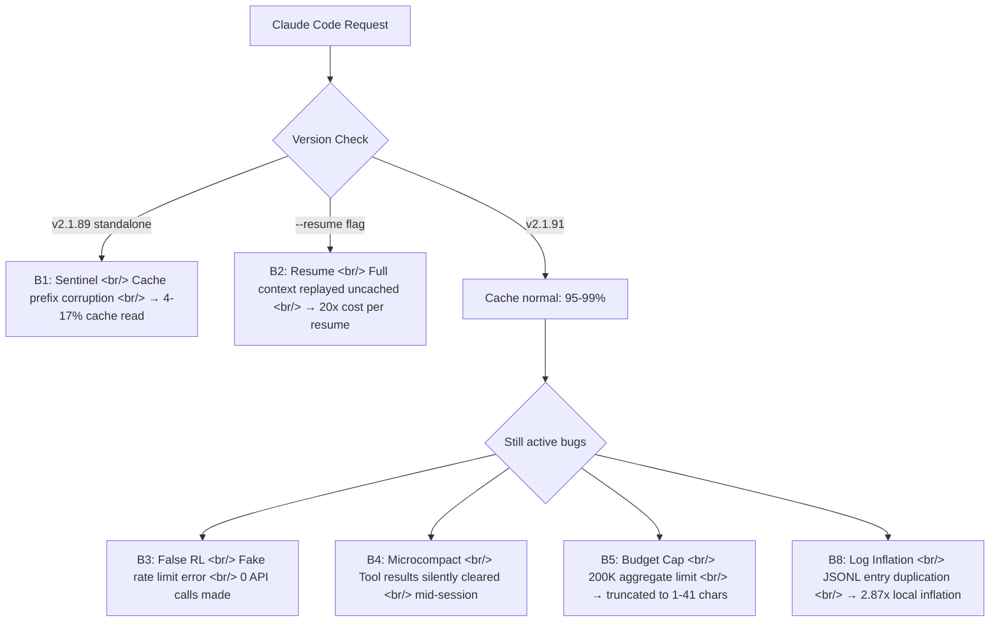

## Overview

On April 1, 2026, a developer using the Claude Code Max 20 plan ($200/month) burned through 100% of their usage in roughly 70 minutes during a normal coding session. JSONL log analysis revealed an average cache read ratio of 36.1% (minimum 21.1%) — far below the 90%+ that should be expected. Every token was billed at full price.

That incident gave rise to [ArkNill/claude-code-cache-analysis](https://github.com/ArkNill/claude-code-cache-analysis): a community-driven investigation that grew from personal debugging into a systematic, proxy-measured analysis confirming **7 bugs across 5 layers**.

<!--more-->

## Background: A Plan Drained in 70 Minutes

The immediate workaround was downgrading from v2.1.89 to v2.1.68 (npm). Cache read immediately recovered to **97.6% average** (119 entries), confirming the regression was v2.1.89-specific.

A transparent monitoring proxy (cc-relay) was then configured using the `ANTHROPIC_BASE_URL` environment variable to capture per-request data. Combined with reports from 91+ related GitHub issues and contributors including [@Sn3th](https://github.com/Sn3th), [@rwp65](https://github.com/rwp65), and a dozen others, the scattered findings were consolidated into structured, measured analysis.

## The 7 Confirmed Bugs (as of v2.1.91)



| Bug | What It Does | Impact | Status (v2.1.91) |
|-----|-------------|--------|------------------|
| **B1** Sentinel | Standalone binary corrupts cache prefix | 4-17% cache read (v2.1.89) | **Fixed** |
| **B2** Resume | `--resume` replays full context uncached | 20x cost per resume | **Fixed** |
| **B3** False RL | Client blocks API calls with fake error | Instant "Rate limit reached", 0 API calls | **Unfixed** |
| **B4** Microcompact | Tool results silently cleared mid-session | Context quality degrades | **Unfixed** |
| **B5** Budget Cap | 200K aggregate limit on tool results | Older results truncated to 1-41 chars | **Unfixed** (MCP override only) |
| **B8** Log Inflation | Extended thinking duplicates JSONL entries | 2.87x local token inflation | **Unfixed** |
| **Server** | Peak-hour limits tightened + 1M billing bug | Reduced effective quota | **By design** |

## Key Bug Deep Dives

### B1: Sentinel Bug (Fixed)

Claude Code ships in two forms. The standalone binary is a single ELF 64-bit executable (~228MB) with an embedded Bun runtime. It contained a Sentinel replacement mechanism (`cch=00000`) that corrupted cache prefixes — causing dramatically low cache read rates.

The npm package (`cli.js`, ~13MB, executed by Node.js) does not contain this logic and was immune to Bug 1.

In v2.1.91, routing `stripAnsi` through `Bun.stripANSI` appears to have closed the Sentinel gap. **Both npm and standalone now achieve identical 84.7% cold-start cache read.**

### B2: Resume Bug (Fixed)

Using `--resume` caused the entire conversation context to be sent as billable input with no cache benefit — up to 20x the expected cost per resume. Fixed in v2.1.91's transcript chain break patch, but **avoiding `--resume` and `--continue` entirely is still the recommended approach.**

### B3: False Rate Limiting (Unfixed)

The client generates "Rate limit reached" errors locally without ever making an API call. Measured across 151 entries / 65 sessions. The session appears throttled while the API has not been contacted at all.

### B4 & B5: Microcompact and Budget Cap (Unfixed)

Tool results are silently deleted mid-session (327 events detected), and a 200K aggregate limit causes older file read results to be truncated to 1-41 characters. **After approximately 15-20 tool uses, earlier context is effectively gone without any warning.**

### Cache TTL (Not a Bug)

Idle gaps of 13+ hours cause a full cache rebuild on resume. Cache write costs $3.75/M versus read at $0.30/M — a 12.5x difference. Shorter gaps (5-26 minutes) maintain 96%+ cache. This is by design (5-minute TTL), not a bug — but worth understanding.

## npm vs Standalone: v2.1.90 Benchmark

| Metric | npm | Standalone | Winner |
|--------|-----|-----------|--------|
| Overall cache read % | 86.4% | 86.2% | Tie |
| Stable session | 95-99.8% | 95-99.7% | Tie |
| Sub-agent cold start | 79-87% | 47-67% | npm |
| Sub-agent warmed (5+ req) | 87-94% | 94-99% | Tie |
| Usage for full test suite | 7% of Max 20 | 5% of Max 20 | Tie |

In v2.1.91, the sub-agent cold start gap is also closed. **Both achieve 84.7% cold-start cache read identically.**

## Anthropic's Official Position

Lydia Hallie from Anthropic posted on X (April 2):

> "Peak-hour limits are tighter and 1M-context sessions got bigger, that's most of what you're feeling. We fixed a few bugs along the way, but none were over-charging you."

She recommended using Sonnet as default, lowering effort level, starting fresh instead of resuming, and capping context with `CLAUDE_CODE_AUTO_COMPACT_WINDOW=200000`.

The analysis agrees that the cache bugs are fixed, but identifies five additional active mechanisms that Anthropic's statement does not address.

## What You Can Do Right Now

1. **Update to v2.1.91** — fixes the cache regression responsible for the worst drain
2. **npm and standalone are equivalent on v2.1.91** — either install method is fine
3. **Do not use `--resume` or `--continue`** — replays full context as billable input
4. **Start fresh sessions periodically** — the 200K tool result cap (B5) means older file reads silently truncate after ~15-20 tool uses
5. **Avoid `/dream` and `/insights`** — silent background API calls that consume quota

```jsonc
// ~/.claude/settings.json — disable auto-update
{
  "env": {
    "DISABLE_AUTOUPDATER": "1"
  }
}
```

## Closing Thoughts

This analysis is a strong example of community-driven debugging at its best. A simple transparent proxy via `ANTHROPIC_BASE_URL`, combined with systematic testing across v2.1.89 through v2.1.91, produced measured evidence behind phenomena reported across 91+ GitHub issues.

The cache bugs (B1, B2) are fixed in v2.1.91. The remaining five bugs are still active. For Max plan users, applying the practical mitigations above and pinning a validated version with `DISABLE_AUTOUPDATER` is the most reliable defensive posture until Anthropic addresses the remaining issues.

---

Source repository: [ArkNill/claude-code-cache-analysis](https://github.com/ArkNill/claude-code-cache-analysis)
