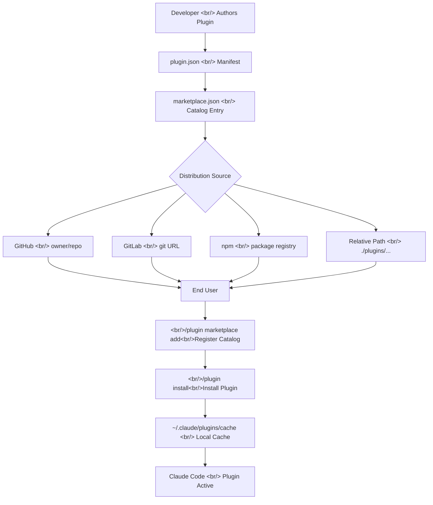

## Overview

Claude Code now ships a full plugin marketplace ecosystem. This is not just an extension installer — it is a complete distribution system with centralized discovery, version pinning, automatic updates, permission controls, and support for multiple source backends including GitHub, npm, GitLab, and local paths. This post breaks down every layer of the system from plugin authoring to marketplace distribution and permission management.

<!--more-->

## Marketplace Architecture

The plugin system is organized into three tiers: the marketplace catalog, individual plugin sources, and the local cache. The flow from developer to end user involves several distinct stages.



## Creating Plugins

### Plugin Directory Structure

Every plugin revolves around a `.claude-plugin/plugin.json` manifest. The most common mistake is placing functional directories inside `.claude-plugin/`. Only `plugin.json` belongs there — everything else lives at the plugin root.

```
my-plugin/
├── .claude-plugin/
│   └── plugin.json        ← manifest only
├── skills/
│   └── code-review/
│       └── SKILL.md
├── commands/
├── agents/
├── hooks/
│   └── hooks.json
├── .mcp.json              ← MCP server config
├── .lsp.json              ← LSP server config
├── bin/                   ← executables added to Bash PATH
└── settings.json          ← default settings on plugin enable
```

### The plugin.json Manifest

```json
{
  "name": "quality-review-plugin",
  "description": "Adds a /quality-review skill for quick code reviews",
  "version": "1.0.0",
  "author": {
    "name": "Your Name",
    "email": "you@example.com"
  },
  "homepage": "https://github.com/you/quality-review-plugin",
  "repository": "https://github.com/you/quality-review-plugin",
  "license": "MIT"
}
```

The `name` field defines the skill namespace. A plugin named `quality-review-plugin` exposes its `hello` skill as `/quality-review-plugin:hello`. This namespacing prevents conflicts when multiple plugins define skills with the same name. To change the prefix, update `name` in `plugin.json`.

### Adding Skills

Skills live under `skills/`, where the folder name becomes the skill name. Claude automatically invokes model-driven skills based on task context when a `description` is provided in the frontmatter.

```markdown
---
name: code-review
description: Reviews code for best practices and potential issues. Use when reviewing code, checking PRs, or analyzing code quality.
---

When reviewing code, check for:
1. Code organization and structure
2. Error handling
3. Security concerns
4. Test coverage
```

The `$ARGUMENTS` placeholder captures any text the user provides after the skill name, enabling dynamic input: `/my-plugin:hello Alex`.

### Adding LSP Servers

The official marketplace already provides LSP plugins for TypeScript, Python, Rust, Go, C/C++, Java, Kotlin, PHP, Lua, Swift, and C#. For unsupported languages, define a custom `.lsp.json` at the plugin root:

```json
{
  "go": {
    "command": "gopls",
    "args": ["serve"],
    "extensionToLanguage": {
      ".go": "go"
    }
  }
}
```

Once installed, Claude gains two capabilities automatically: **automatic diagnostics** after every file edit (type errors, missing imports, syntax issues) and **code navigation** (jump to definition, find references, call hierarchies).

### Default Settings

Plugins can ship a `settings.json` to configure defaults when the plugin is enabled. Currently only the `agent` key is supported, which activates one of the plugin's custom agents as the main thread:

```json
{
  "agent": "security-reviewer"
}
```

## The Marketplace Schema

### marketplace.json Structure

The marketplace catalog lives at `.claude-plugin/marketplace.json` in the repository root.

```json
{
  "name": "company-tools",
  "owner": {
    "name": "DevTools Team",
    "email": "devtools@example.com"
  },
  "metadata": {
    "description": "Internal developer tools marketplace",
    "version": "1.0.0",
    "pluginRoot": "./plugins"
  },
  "plugins": [
    {
      "name": "code-formatter",
      "source": "./plugins/formatter",
      "description": "Automatic code formatting on save",
      "version": "2.1.0",
      "author": { "name": "DevTools Team" }
    },
    {
      "name": "deployment-tools",
      "source": {
        "source": "github",
        "repo": "company/deploy-plugin"
      },
      "description": "Deployment automation tools"
    }
  ]
}
```

The `metadata.pluginRoot` field is a convenience shortcut: setting it to `"./plugins"` lets you write `"source": "formatter"` instead of `"source": "./plugins/formatter"` for each plugin entry.

**Reserved names**: The following are blocked for third-party use: `claude-code-marketplace`, `claude-code-plugins`, `claude-plugins-official`, `anthropic-marketplace`, `anthropic-plugins`, `agent-skills`, `knowledge-work-plugins`, `life-sciences`. Names that impersonate official marketplaces (like `official-claude-plugins`) are also blocked.

### Plugin Source Types

| Source | Format | Notes |
|--------|--------|-------|
| Relative path | `"./plugins/my-plugin"` | Git-based distribution only; fails with URL-based delivery |
| GitHub | `{"source": "github", "repo": "owner/repo"}` | Supports `ref` and `sha` pinning |
| Git URL | `{"source": "url", "url": "https://..."}` | Works with GitLab, Bitbucket, self-hosted |
| Git subdirectory | `{"source": "git-subdir", "url": "...", "path": "tools/plugin"}` | Sparse clone for monorepos |
| npm | `{"source": "npm", "package": "pkg-name"}` | Installed via `npm install` |

**Critical distinction**: The marketplace source (where to fetch `marketplace.json`) and plugin sources (where to fetch individual plugins) are independent concepts. The marketplace source supports `ref` only; plugin sources support both `ref` (branch/tag) and `sha` (exact commit).

### Version Pinning with sha

```json
{
  "name": "my-plugin",
  "source": {
    "source": "github",
    "repo": "owner/plugin-repo",
    "ref": "v2.0.0",
    "sha": "a1b2c3d4e5f6a7b8c9d0e1f2a3b4c5d6e7f8a9b0"
  }
}
```

Using `sha` pins to an exact commit, guaranteeing reproducible installs regardless of branch updates. This is the recommended approach for production environments.

### Strict Mode

The `strict` field (default: `true`) controls whether `plugin.json` is the authority for component definitions. When `strict: true`, the plugin manifest takes precedence. Set `strict: false` to allow marketplace-level overrides:

```json
{
  "name": "my-plugin",
  "source": "./plugins/my-plugin",
  "strict": false
}
```

## Distribution Strategies

### GitHub (Recommended)

Push your repository with a `.claude-plugin/marketplace.json` at the root. Users add it with:

```bash
/plugin marketplace add your-org/your-marketplace-repo
```

For specific branches or tags:

```bash
/plugin marketplace add https://gitlab.com/company/plugins.git#v1.0.0
```

### Team Auto-Configuration

Add marketplace configuration to `.claude/settings.json` in a shared repository. When team members trust the folder, Claude Code automatically registers the marketplace:

```json
{
  "extraKnownMarketplaces": [
    {
      "name": "company-tools",
      "source": "github",
      "repo": "myorg/claude-plugins"
    }
  ]
}
```

### Container Pre-Population

For CI/CD and containerized environments, `forcedPlugins` in managed settings installs plugins automatically without user interaction. This is the standard approach for enterprise deployments.

### Auto-Update Configuration

Official Anthropic marketplaces have auto-update enabled by default. Third-party marketplaces default to disabled. To keep plugin updates enabled while managing Claude Code updates manually:

```bash
export DISABLE_AUTOUPDATER=1
export FORCE_AUTOUPDATE_PLUGINS=1
```

## CLI Reference

| Command | Description |
|---------|-------------|
| `/plugin marketplace add <source>` | Register a marketplace |
| `/plugin marketplace list` | List registered marketplaces |
| `/plugin marketplace update <name>` | Fetch latest catalog |
| `/plugin marketplace remove <name>` | Remove marketplace and its plugins |
| `/plugin install <name>@<marketplace>` | Install a plugin |
| `/plugin disable <name>@<marketplace>` | Disable without uninstalling |
| `/plugin enable <name>@<marketplace>` | Re-enable a disabled plugin |
| `/plugin uninstall <name>@<marketplace>` | Remove a plugin |
| `/reload-plugins` | Reload all plugins without restarting |

Installation scopes:
- **User scope** (default): applies across all projects
- **Project scope**: shared with collaborators via `.claude/settings.json`
- **Local scope**: personal, current repository only

## Permission System Integration

### Rule Evaluation Order

Permissions follow a strict deny → ask → allow precedence. The first matching rule wins, so deny rules always take precedence over allow rules.

```json
{
  "permissions": {
    "allow": [
      "Bash(npm run *)",
      "Bash(git commit *)",
      "WebFetch(domain:github.com)"
    ],
    "deny": [
      "Bash(git push *)",
      "Read(~/.ssh/**)"
    ]
  }
}
```

### Permission Modes

| Mode | Behavior |
|------|----------|
| `default` | Prompts on first use of each tool |
| `acceptEdits` | Auto-accepts file edits for the session |
| `plan` | Analysis only; no file modification or command execution |
| `auto` | Background safety checks then auto-approve (research preview) |
| `dontAsk` | Denies all tools not pre-approved |
| `bypassPermissions` | Skips all prompts (isolated environments only) |

`bypassPermissions` still prompts for writes to `.git`, `.claude`, `.vscode`, `.idea`, and `.husky` to prevent accidental corruption.

### Fine-Grained Rule Syntax

```json
{
  "permissions": {
    "allow": [
      "Bash(npm run build)",
      "Bash(git * main)",
      "mcp__puppeteer__puppeteer_navigate",
      "Agent(Explore)",
      "Read(/src/**)"
    ],
    "deny": [
      "Agent(Plan)",
      "Edit(//etc/**)"
    ]
  }
}
```

Path pattern prefixes for Read/Edit rules:
- `//path` — absolute path from filesystem root
- `~/path` — relative to home directory
- `/path` — relative to project root
- `path` or `./path` — relative to current directory

### Extending Permissions with Hooks

`PreToolUse` hooks run before the permission prompt and can dynamically block or approve tool calls:

```json
{
  "hooks": {
    "PreToolUse": [
      {
        "matcher": "Bash",
        "hooks": [{ "type": "command", "command": "validate-command.sh" }]
      }
    ]
  }
}
```

A hook exiting with code 2 blocks the call even if an allow rule would otherwise permit it. A hook returning "allow" does not bypass deny rules — those still apply.

### Permissions vs Sandboxing

These are complementary, not interchangeable:

- **Permissions** control which tools Claude Code can use and which paths/domains it can access
- **Sandboxing** provides OS-level enforcement for Bash command filesystem and network access

A `Read(./.env)` deny rule blocks the `Read` tool, but does not prevent `cat .env` in Bash. For true OS-level file access control, enable sandboxing alongside permission rules.

## Official Marketplace Plugin Catalog

The official marketplace (`claude-plugins-official`) is automatically available in every Claude Code installation.

**Code Intelligence (LSP)**: clangd-lsp, csharp-lsp, gopls-lsp, jdtls-lsp, kotlin-lsp, lua-lsp, php-lsp, pyright-lsp, rust-analyzer-lsp, swift-lsp, typescript-lsp

**External Integrations**: github, gitlab, atlassian (Jira/Confluence), asana, linear, notion, figma, vercel, firebase, supabase, slack, sentry

**Development Workflows**: commit-commands, pr-review-toolkit, agent-sdk-dev, plugin-dev

**Output Styles**: explanatory-output-style, learning-output-style

To submit a plugin: [claude.ai/settings/plugins/submit](https://claude.ai/settings/plugins/submit) or [platform.claude.com/plugins/submit](https://platform.claude.com/plugins/submit)

## Quick Links

- [Create and distribute a plugin marketplace](https://code.claude.com/docs/en/plugin-marketplaces)
- [Create plugins guide](https://code.claude.com/docs/en/plugins)
- [Discover and install prebuilt plugins](https://code.claude.com/docs/en/discover-plugins)
- [Configure permissions](https://code.claude.com/docs/en/permissions)
- [Official plugin submission (Claude.ai)](https://claude.ai/settings/plugins/submit)
- [Official plugin submission (Console)](https://platform.claude.com/plugins/submit)
- [Plugin catalog browser](https://claude.com/plugins)

## Insights

**Plugin vs standalone configuration is a distribution decision, not a technical one.** Both approaches support the same set of features. The real question is: does this configuration need to be shared? Standalone `.claude/` is faster to iterate on; plugins are the right choice once you need versioned, shareable, marketplace-distributed functionality. The only functional trade-off is that plugin skills get namespaced (`/my-plugin:hello` instead of `/hello`).

**Marketplace source and plugin source independence is the key architectural insight.** A single marketplace catalog at `acme-corp/plugin-catalog` can reference plugins from a dozen different repositories, each pinned to different branches or commits. This separation lets you evolve the catalog and the plugins independently.

**Relative paths in marketplace.json are a subtle footgun.** They work only when users add the marketplace via Git (GitHub, GitLab, git URL). If you distribute your `marketplace.json` via a direct URL, relative paths silently fail to resolve. Always use GitHub, npm, or git URL sources when targeting URL-based distribution.

**Pin to `sha` in production.** Using `ref` (branch or tag) means a branch push or tag move can silently change what gets installed. SHA pinning guarantees reproducibility. Pair with release channels (separate `stable` and `beta` branches) for a proper versioning workflow.

**The `bypassPermissions` mode is for containers only.** It looks tempting for development speed, but it removes meaningful protection from prompt injection attacks. The `acceptEdits` mode offers a better balance: it auto-approves file edits while still prompting for Bash commands and web fetches. For fully automated pipelines, use `bypassPermissions` inside a sandboxed container where damage is bounded.
