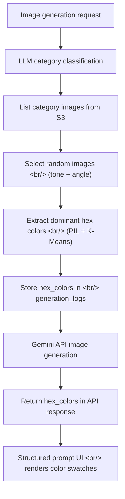

## Overview

In [the previous post (Dev Log #7)](/ko/posts/2026-04-02-hybrid-search-dev7/) I implemented LLM-based automatic tone/angle category injection. This sprint focused on making that implementation actually work in production.

Three major areas were addressed. First, the remaining local filesystem reads for category images were fully migrated to S3. Second, a CUDA dependency conflict that crashed the EC2 server on startup was resolved by pinning torch to a CPU-only index. Third, dominant hex colors are now extracted from tone reference images, stored in the database, and rendered as color swatches in the structured prompt UI.

<!--more-->

## Tone/Angle Category Images — Migrating to S3

The previous implementation left a subtle bug in `injection.py`: `_list_category_images()` was reading from `data/tone_angle_image_ref/{category}/` via local `os.listdir()`. Since EC2 instances don't have this directory, the function always returned an empty list, silently disabling the entire injection feature on production.

The fix was straightforward — thread an `S3Storage` instance through to `select_auto_injection()` and replace the directory walk with an `s3.list_objects(prefix)` call.

```python
# Before: reads local directory
def _list_category_images(category: str) -> list[str]:
    folder = TONE_ANGLE_IMAGE_DIR / category
    return [f.name for f in folder.iterdir() if ...]

# After: lists from S3 by prefix
def _list_category_images(category: str, s3: S3Storage) -> list[str]:
    prefix = f"refs/tone_angle_image_ref/{category}/"
    keys = s3.list_objects(prefix)
    return [basename(k) for k in keys if k.lower().endswith(IMAGE_EXTS)]
```

The S3 key cache (`build_ref_key_cache`) was also updated so that nested paths like `data/tone_angle_image_ref/a(natural,film)` are correctly mapped to `refs/tone_angle_image_ref/a(natural,film)/{filename}` by using `Path.relative_to("data")`.

## EC2 Deployment — Pinning CPU-Only torch

The production EC2 instance was failing to start with a missing `libcudnn.so.9` error when loading the embedding model. `sentence-transformers` pulls in `torch` as a dependency, and `uv` was resolving to a CUDA-enabled build that referenced GPU libraries not present on the instance.

The dev environment had both `nvidia-cudnn-cu12` and `nvidia-cudnn-cu13` installed, masking the issue. Production only had `cu13`, causing the crash.

The fix is to pin torch to a CPU-only build directly in `pyproject.toml`, bypassing the CUDA resolution path entirely.

```toml
# pyproject.toml — explicit CPU-only torch index
[[tool.uv.index]]
name = "pytorch-cpu"
url = "https://download.pytorch.org/whl/cpu"
explicit = true

[tool.uv.sources]
torch = [{ index = "pytorch-cpu" }]
```

With this in place, `uv sync` always installs the CPU build regardless of the host GPU configuration.

## Hex Color Extraction — Dominant Color Analysis

To give users a visual sense of what tone a reference image represents, dominant hex colors are now extracted at generation time and stored in the `generation_logs` table under a new `hex_colors` JSON column.

The pipeline looks like this:



Color extraction uses `scikit-learn`'s `KMeans` to cluster pixel values and returns the centroid of each cluster as a hex string.

```python
def extract_dominant_hex_colors(image_bytes: bytes, n_colors: int = 5) -> list[str]:
    img = Image.open(io.BytesIO(image_bytes)).convert("RGB")
    img = img.resize((100, 100))  # downscale for speed
    pixels = np.array(img).reshape(-1, 3)
    km = KMeans(n_clusters=n_colors, n_init=3)
    km.fit(pixels)
    centers = km.cluster_centers_.astype(int)
    return [f"#{r:02x}{g:02x}{b:02x}" for r, g, b in centers]
```

The extracted values are passed through `InjectedReference.hex_colors` in the API response and consumed by the frontend.

## Structured Prompt Display — with Hex Swatches

The image detail modal's "작업 프롬프트" section previously dumped the raw output of `getFullPrompt()` with `whitespace-pre-wrap`. That meant raw markdown-style headers (`###`), separator lines (`===`), and JSON hex arrays were all visible as plain text.

A new `renderStructuredPrompt()` function was added to render the same data in a readable form:

- `###` headings → styled section headers in amber/sky tones
- `===` separator → `<hr>` element
- `- 이미지 N:` lines → badge + description list items
- `hex_colors` array → colored circle + monospace hex code pill badge

The clipboard copy path still uses `fullPrompt` raw text, so copying is unaffected.

## No-Text Directive and Color Palette Removal

A "no-text" directive was added to injected reference prompts — explicitly instructing the model not to reproduce any text or watermarks from the reference images. Separately, the color palette dot visualization was removed from image card overlays and the detail modal. The structured hex swatches in the prompt section fill that role adequately, and the dots added visual clutter without much utility.

## Commit Log

| Message | Changed files |
|---|---|
| fix: list tone/angle category images from S3 instead of local filesystem | `injection.py`, `storage.py`, `generation.py` |
| fix: pin torch to CPU-only index to prevent broken CUDA deps on EC2 | `pyproject.toml` |
| fix: fix the injection prompt | `prompt.py`, `injection.py` |
| docs: update README to reflect recent changes | `README.md` |
| feat: extract dominant hex colors from tone reference images | `injection.py`, `schemas.py`, `api.ts`, DB migration |
| feat: structured prompt display with hex color swatches in image detail | `GeneratedImageDetail.tsx` |
| feat: add no-text directive for injected refs and remove color palettes | `prompt.py`, `App.tsx`, `GeneratedImageDetail.tsx` |
| get rid of the test folder | deleted `test/` |

## Insights

**Make the production/dev environment gap explicit in code.** After the S3 migration, the file listing code still referenced local paths. This type of bug silently passes in development and only surfaces after deployment. Using the storage abstraction (`S3Storage`) consistently across all callers is the right defense.

**Pin CUDA-sensitive dependencies explicitly.** `torch` can resolve to either CPU or CUDA builds depending on the environment. On a CPU-only EC2 instance, a CUDA build fails at import time. Pinning to a CPU-only index in `pyproject.toml` eliminates this entire class of problem — no per-instance manual intervention needed.

**Separate raw data serialization from UI rendering.** The pattern of deriving both a copy-friendly raw string and a richly structured visual representation from the same source data is clean and maintainable. Keeping `getFullPrompt()` intact while adding `renderStructuredPrompt()` alongside it is a good example of this principle.
