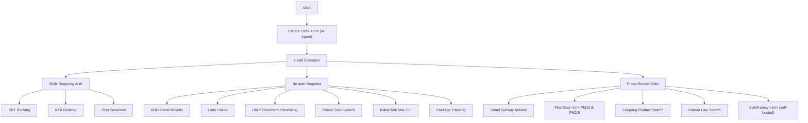

## Overview

[k-skill](https://github.com/NomaDamas/k-skill) is an open-source curated skill collection for Claude Code built specifically for Korean users, maintained by NomaDamas. With 1,371 GitHub stars and 113 forks, the project covers tasks that are deeply embedded in Korean daily life — booking SRT and KTX trains, checking KBO baseball scores, sending KakaoTalk messages, processing HWP documents, and looking up fine dust air quality.

It supports Claude Code, Codex, OpenCode, and OpenClaw/ClawHub. No additional client API layer is required: skills either run directly or route through the `k-skill-proxy` server with plain HTTP requests.

<!--more-->

## Architecture: How k-skill Integrates with Claude Code

The diagram below shows the full integration flow from user intent to skill execution.



## Complete Skill Inventory

k-skill currently ships 18 distinct skills across five domains.

### Transportation

| Skill | Description | Auth |
|---|---|---|
| **SRT Booking** | Search, reserve, confirm, cancel SRT trains | Required |
| **KTX Booking** | Full Korail booking with Dynapath anti-bot helper | Required |
| **Seoul Subway Arrivals** | Real-time arrival info per station via k-skill-proxy | Proxy URL |

### Daily Life

| Skill | Description | Auth |
|---|---|---|
| **Fine Dust** | PM10/PM2.5 by current location or region fallback | None |
| **Postal Code Search** | Official Korea Post zipcode lookup by address keyword | None |
| **Package Tracking** | CJ Logistics and Korea Post official tracking | None |
| **Blue Ribbon Restaurants** | Nearby Blue Ribbon Survey-rated restaurants | None |
| **Nearby Bars** | KakaoMap-based bar info with hours, menu, seats, phone | None |
| **Daiso Product Search** | In-store inventory check at specific Daiso branches | None |
| **Used Car Prices** | SK Rent-a-Car Tago BUY snapshot for purchase price and monthly lease | None |

### Sports and Entertainment

| Skill | Description | Auth |
|---|---|---|
| **KBO Game Results** | Schedule, scores, and team filters by date | None |
| **K League Results** | K League 1 and 2 results, standings | None |
| **Lotto Check** | Latest draw results and number matching | None |

### Work and Documents

| Skill | Description | Auth |
|---|---|---|
| **HWP Document Processing** | `.hwp` to JSON/Markdown/HTML, image extraction | None |
| **Korean Law Search** | Statutes, court decisions, official interpretations | Local only |
| **KakaoTalk Mac CLI** | Read, search, and send KakaoTalk messages on macOS | None |

### Shopping and Finance

| Skill | Description | Auth |
|---|---|---|
| **Coupang Product Search** | Rocket Delivery filter, deals, price range via coupang-mcp | None |
| **Toss Securities** | Account summary, portfolio, prices, orders via tossctl | Required |

## Deep Dive: KakaoTalk Mac CLI

The KakaoTalk skill stands out as a particularly creative integration. It wraps `kakaocli`, a macOS-only CLI tool, allowing Claude Code to read conversation history and send messages directly from the terminal.

### Prerequisites

```bash
brew install silver-flight-group/tap/kakaocli
```

The terminal application must have **Full Disk Access** and **Accessibility** permissions granted in System Settings. Without Full Disk Access, even read commands will fail. Without Accessibility, send and harvest automation will not work.

If KakaoTalk for Mac is not installed, `mas` handles that too:

```bash
brew install mas
mas account
mas install 869223134
```

### Key Commands

```bash
# Verify permissions and DB access first
kakaocli status
kakaocli auth

# List recent conversations
kakaocli chats --limit 10 --json

# Read recent messages from a specific chat
kakaocli messages --chat "Jisoo" --since 1d --json

# Search across all conversations
kakaocli search "meeting" --json

# Test send to yourself (safe)
kakaocli send --me _ "test message"

# Dry-run to preview without sending
kakaocli send --dry-run "Team Announcements" "Meeting at 3pm today"
```

The safety design is worth noting. The skill workflow mandates a `--dry-run` preview before sending to anyone other than yourself, and actual dispatch requires explicit user confirmation. This prevents the AI agent from autonomously firing off messages — a sound default for any messaging automation.

## Installation Flow

The standard setup follows three steps:

1. Follow `docs/install.md` to install all skills (Node.js and Python packages are both involved; global install is the default)
2. Run the `k-skill-setup` skill to verify credentials and environment variables
3. Read each feature doc to understand expected inputs, examples, and limitations

Skills that require authentication (SRT, KTX, Toss Securities) follow a documented credential resolution order defined in `docs/setup.md`. Secret storage rules and prohibited patterns are captured in `docs/security-and-secrets.md`, with standardized environment variable names to avoid conflicts.

The `k-skill-proxy` is a self-hostable proxy server for skills that need to reach public APIs (Seoul subway, fine dust, Coupang, Korean law). The proxy removes the need to configure API keys on the client side for those services.

## Why k-skill Matters

The core problem k-skill addresses is straightforward: Korea's internet ecosystem runs on a parallel set of platforms — KakaoTalk instead of iMessage or Slack, Korail and SRT instead of Amtrak, HWP files instead of Word or Google Docs, Coupang instead of Amazon. Global AI tooling is built around global services. None of these Korean platforms get first-class support out of the box.

k-skill fills that gap by packaging the knowledge of how to interact with each of these Korean-specific surfaces into reusable Claude Code skills. The approach is deliberately pragmatic: where a reliable MCP server exists (like `coupang-mcp` or `korean-law-mcp`), k-skill routes through it. Where it does not, the skill talks to official public interfaces directly or through a proxy.

The project itself is a solid piece of open-source engineering — multi-runtime (JavaScript + Python + Shell), versioned with npm Changesets, CI/CD on GitHub Actions, and a clear separation between skill logic and secret management. For Korean developers working with Claude Code, it is the most practical starting point for automating the parts of daily life that generic AI agents simply cannot reach.

---

- GitHub: [NomaDamas/k-skill](https://github.com/NomaDamas/k-skill)
- Stars: 1,371 | Forks: 113
- Primary language: JavaScript (Python and Shell also present)
