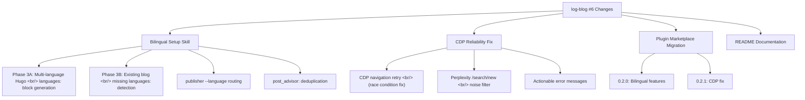

## Overview

[Previous post: Log-Blog Dev Log #5](/ko/posts/2026-04-02-log-blog-dev5/)

If #5 was about implementing Firecrawl deep docs and the bilingual publishing pipeline, #6 is about tying up the loose ends that followed. After restructuring the blog into `content/ko/posts/` and `content/en/posts/`, new users still couldn't create this structure from scratch — the **setup skill needed expanding**. In parallel, real-world usage revealed an **AI chat CDP navigation race condition** that needed a retry fix, a **Perplexity noise URL** slipping through the classifier, and the plugin itself needed migrating from global to **marketplace-based installation**. Version bumped from 0.2.0 to 0.2.1.

<!--more-->

---



---

## Bilingual Hugo Setup Skill Expansion

### Background

After #5 restructured the blog repo into `content/ko/posts/` and `content/en/posts/` and published 12 bilingual posts, there was a gap: `/logblog:setup` still only knew how to create a single-language `content/posts/` layout. New users installing the plugin couldn't bootstrap the bilingual workflow from scratch.

### Implementation — Phase 3A: New Blog Multilingual Setup

The setup skill's question flow was redesigned. During Hugo site generation, it now asks three things:

1. Blog name
2. Primary language (`en`/`ko`, default: `en`)
3. **Multi-language support?** — If yes, which languages (e.g., `en,ko`)

When multilingual is selected, the skill generates a proper Hugo `languages:` block in `hugo.yaml`:

```yaml
languages:
  en:
    languageName: English
    weight: 1
    contentDir: content/en
    menu:
      main: []
      social: []
  ko:
    languageName: 한국어
    weight: 2
    contentDir: content/ko
    menu:
      main: []
      social: []
```

It also creates per-language content directories and initial posts. Both `content/en/posts/hello-world.md` and `content/ko/posts/hello-world.md` are created with matching filenames — Hugo automatically links translations by filename.

### Implementation — Phase 3B: Existing Blog Migration Detection

A trickier case is when **language directories already exist but the Hugo config is missing the `languages:` block**. Without it, Hugo silently ignores the language-specific directories and the language switcher doesn't work.

Setup skill Step 2.5 now detects this:

```bash
ls -d "{path}/content/ko/posts" "{path}/content/en/posts" 2>/dev/null
grep -c "^languages:" "{path}/hugo.yaml" 2>/dev/null
```

If directories exist but `languages:` is absent, the skill warns the user and offers to add it — preserving all existing settings while injecting just the `languages:` section.

### Publisher and post_advisor Integration

Alongside the setup skill, `publisher.py` gained a `--language` parameter. When passed, it looks up the matching path in `config.yaml`'s `language_content_dirs` mapping:

```python
content_dir = config.blog.content_path_for(language)
```

`post_advisor.py` was also updated. Previously it only scanned the single `content_dir`. Now it scans all paths in `language_content_dirs`, deduplicating by filename. This fixes the `scan` command showing only one language's posts on a bilingual blog.

---

## AI Chat CDP Reliability Improvements

### Problem: CDP Navigation Race Condition

When running Chrome via `uv run log-blog chrome-cdp` with existing tabs open, Playwright intermittently hit a "navigation interrupted" error when opening a new page and navigating to a URL. The cause is a Chrome event race between existing tabs and the newly created page.

Before the fix, the code made a single attempt and returned `None` on failure:

```python
await page.goto(url, wait_until="domcontentloaded", timeout=timeout_ms)
```

### Fix: Retry Logic

Added a `_NAV_RETRIES = 2` constant and retry logic that only triggers on "interrupted" in the error message — not on timeouts or network errors:

```python
_NAV_RETRIES = 2  # retry count for CDP navigation race conditions

for attempt in range(_NAV_RETRIES + 1):
    try:
        await page.goto(url, wait_until="domcontentloaded", timeout=timeout_ms)
        last_err = None
        break
    except Exception as nav_err:
        last_err = nav_err
        if attempt < _NAV_RETRIES and "interrupted" in str(nav_err).lower():
            logger.debug("CDP navigation interrupted (attempt %d), retrying", attempt + 1)
            await page.wait_for_timeout(500)
        else:
            raise
```

The narrow condition (only "interrupted" triggers retry) is intentional — retrying on timeouts would double latency on slow networks.

### Perplexity Noise Filter

Perplexity browsing history included both real conversation URLs (`perplexity.ai/search/...`) and the new-search landing page (`perplexity.ai/search/new`). The landing page has no conversation content, but the old classifier tagged it as `ai_chat_perplexity` and triggered a CDP fetch attempt.

One line added to `_AI_NOISE_PATTERNS`:

```python
re.compile(r"perplexity\.ai/search/new(?:[?#]|$)"),  # "new search" landing page
```

### Improved Error Messages

CDP fetch failures previously logged a bare `"AI chat fetch failed for URL: error"` message — not actionable. Both `ai_chat_fetcher.py` and `content_fetcher.py` now surface the remedy:

```python
logger.warning(
    "AI chat fetch failed for %s (%s): %s. "
    "Ensure Chrome is running with: uv run log-blog chrome-cdp",
    url, service, e,
)
```

---

## Plugin Marketplace Migration

### Background: The Version-String Trap

Previously the plugin was installed directly at `~/.claude/plugins/logblog/`. The update mechanism compared `version` strings in `plugin.json`. If the version string isn't bumped, `/plugin` reports "already at the latest version" — even if 15 commits of new features landed.

That's exactly what happened after #5: Firecrawl, bilingual support, and skill updates were all deployed but the version stayed at `"0.1.0"`. After discovering this, the plugin was migrated to marketplace-based installation at `~/.claude/plugins/marketplaces/logblog/`, with explicit version management.

### Version Scheme: 0.2.0 then 0.2.1

**0.2.0** — Firecrawl deep docs, bilingual blog support, setup skill multilingual expansion, publisher `--language` routing. New features warrant a minor version bump.

**0.2.1** — CDP reliability fix and Perplexity noise filter. Bug fixes, so patch increment.

The `marketplace.json` plugin entry was updated to reflect the latest version info.

---

## README Documentation

The README received a substantial update documenting features that existed in code but not in writing:

- **Bilingual workflow**: End-to-end flow — write Korean post, translate to English, deploy both to `content/{lang}/posts/`
- **Firecrawl integration**: Using `--deep` flag for full documentation site crawling
- **Dev Log mode**: How to generate dev log posts from session data via the skill
- **AI chat fetching**: Running `chrome-cdp` to start Chrome with CDP, per-service `auth_profile` configuration in `config.yaml`

---

## Commit Log

| Message | Changes |
|---------|---------|
| docs: update README with bilingual workflow, Firecrawl, dev logs, and AI chat features | +31 -7 |
| chore: bump plugin version to 0.2.0 | +1 -1 |
| feat: add multi-language Hugo setup to setup skill and publisher | +226 -26 |
| chore: bump plugin version to 0.2.1 | +1 -1 |
| fix: improve AI chat CDP reliability and Perplexity noise filter | +30 -3 |

---

## Insights

This session was a classic "built the feature, infrastructure didn't keep up" pattern. #5 created a bilingual blog by manually restructuring the repo, but the setup skill still produced single-language blogs. Features and their corresponding onboarding experience need to stay synchronized.

The CDP race condition is the hardest kind of bug to catch — it's timing-dependent and doesn't reproduce consistently. The narrow retry trigger (only on "interrupted") turned out to be the right call. Retrying on all errors would mask real problems and add latency on slow networks for no benefit.

Plugin version management looks simple but directly determines whether users receive updates. Without a version bump, new features are invisible to existing installs. The marketplace migration makes this process more explicit and visible.

There's a pleasing meta quality to log-blog being documented by log-blog. The friction discovered while writing a post motivates the next commit, and that commit becomes the content for the next post.
