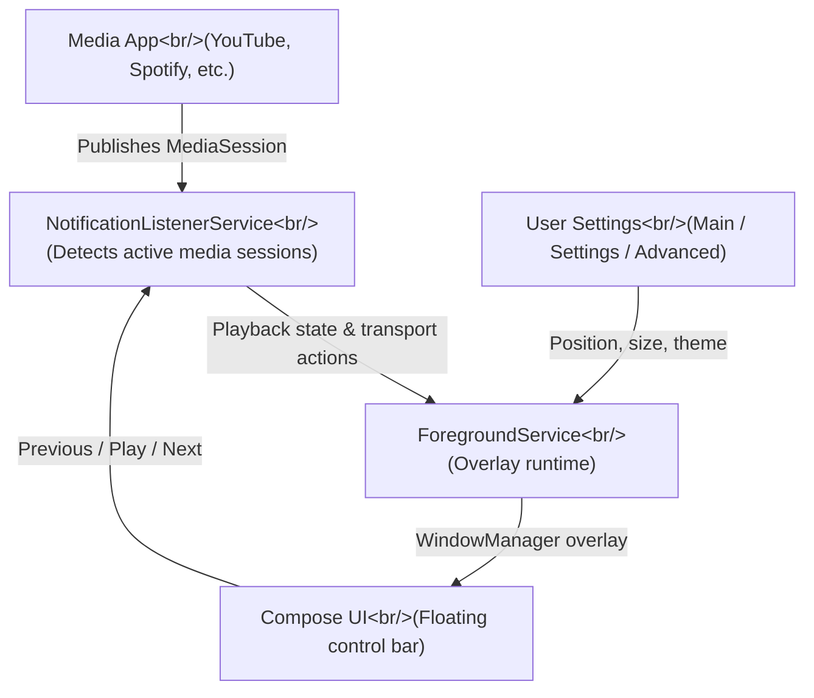
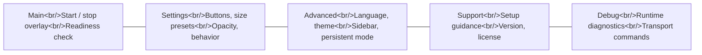

## Overview

Reaching for media controls on Android typically means pulling down the notification shade or switching apps entirely. **MediaFloat** takes a different approach: a compact, draggable overlay bar showing Previous, Play/Pause, and Next stays visible above every app, always within reach.

Built in Kotlin with Jetpack Compose, targeting Android 10+, and released under Apache License 2.0, MediaFloat is a focused single-purpose tool. The source lives at [Leuconoe/MediaFloat](https://github.com/Leuconoe/MediaFloat).

<!--more-->

---

## Core Architecture

MediaFloat combines three Android system capabilities to deliver its persistent overlay:



### The Three Permission Pillars

| Permission or Access | Role |
|---|---|
| `SYSTEM_ALERT_WINDOW` | Draws the floating bar above all other apps |
| `FOREGROUND_SERVICE` + `FOREGROUND_SERVICE_SPECIAL_USE` | Keeps the overlay runtime alive in the background |
| `POST_NOTIFICATIONS` | Required foreground-service notification (Android 13+) |
| Notification listener access | Reads active `MediaSession` state and transport actions |

---

## Android Overlay: How It Works

`SYSTEM_ALERT_WINDOW` — labeled "Display over other apps" in Android settings — lets an app insert views into the system window layer via `WindowManager.addView()`. This sits above the normal app window hierarchy, which is why the overlay remains visible regardless of what the user is doing.

MediaFloat pairs this with **Jetpack Compose**. Rather than inflating XML layouts into the overlay window, a `ComposeView` is embedded into the `WindowManager`-managed surface. This gives the floating bar the full expressive power of Material 3 Compose components while keeping it lightweight.

### Why a Foreground Service Is Non-Negotiable

Android aggressively kills background processes to preserve battery. Any UI component that must persist when the host app is backgrounded needs to run inside a **Foreground Service**:

- The service must post a user-visible notification — the cost of keeping the overlay alive
- Android 13+ requires `POST_NOTIFICATIONS` to show that notification
- The `FOREGROUND_SERVICE_SPECIAL_USE` type specifically covers non-standard foreground service use cases like screen overlays

### NotificationListenerService: The Media Session Bridge

Media apps publish playback state through Android's `MediaSession` API. `NotificationListenerService` gives MediaFloat a system-level subscription to those sessions. Once a session is detected, `MediaController` handles the transport commands — Previous, Play/Pause, Next — dispatched back to whatever media app is active.

This architecture means MediaFloat works identically with Spotify, YouTube, podcast apps, or any app that exposes a `MediaSession`. No app-specific integration required.

---

## App Structure: Single Module, Five Surfaces

MediaFloat deliberately stays as a single-module Android app. The README explicitly calls this out as a way to keep setup, runtime behavior, and recovery paths understandable.

### The Five App Surfaces



The **Debug** surface stands out: it exposes runtime readiness inspection, media session diagnostics, direct transport command sending, log clearing, and a recent events view. Shipping developer tooling inside the release build — behind an Advanced setting toggle — is a practical pattern for overlay apps where permission state and service lifecycle are inherently hard to observe from the outside.

---

## Readiness Checks and Fault Recovery

MediaFloat models its startup preconditions explicitly. Before the overlay can run, three conditions must hold:

1. Overlay access granted (`SYSTEM_ALERT_WINDOW`)
2. Notification listener access granted
3. Notification posting permitted (Android 13+)

If any condition is missing, the app surfaces shortcuts directly to the relevant Android settings screen rather than showing a generic error. This is the kind of detail that separates a polished overlay app from a frustrating one — Android's permission model is multi-step, and guiding the user through each gate matters.

---

## Automation Integration

MediaFloat exposes an exported intent action:

```text
sw2.io.mediafloat.action.SHOW_OVERLAY
```

This lets external automation tools — Tasker, MacroDroid, Android Shortcuts, Bixby Routines — trigger the overlay flow without opening the app UI. The launcher shortcut set also exposes both `Launch widget` and `Stop widget` as pinnable home-screen shortcuts via `ShortcutManager`.

If the readiness preconditions are not met when the action fires, the app falls back to the main UI so the user can complete setup.

---

## Multi-Language Support

v0.2.1 uses the `AppCompat` app-language API, which provides per-app locale selection on Android 13+ and graceful fallback on older supported versions. Shipped languages: System default, English, Korean, Chinese, Japanese, Spanish, and French.

The language picker lives in **Advanced**; the current active language is reflected in **Support**. This is the correct pattern for in-app language switching without requiring a system-level locale change.

---

## What v0.2.1 Intentionally Omits

The README is upfront about current constraints:

- No freeform resizing — only built-in size presets
- Single horizontal control family — no alternative button arrangements
- Button combinations limited to Previous / Play·Pause / Next layouts
- Overlay behavior depends on Android permission state and an active `MediaSession` being available

"Intentionally constrained" is the phrase used, reflecting a design philosophy that prioritizes stability and comprehensibility over feature breadth. Recent commits point toward v0.3.0 with thumbnail support and sidebar spacing refinements already merged.

---

## Tech Stack Summary

| Item | Detail |
|---|---|
| Language | Kotlin |
| UI Framework | Jetpack Compose + Material 3 |
| Target Platform | Android 10+ |
| Build System | Gradle |
| License | Apache License 2.0 |
| Key Android APIs | `SYSTEM_ALERT_WINDOW`, `ForegroundService`, `NotificationListenerService`, `MediaController`, `ShortcutManager` |

---

## Takeaways

MediaFloat is a clean reference implementation for the Android floating overlay pattern. The combination of `SYSTEM_ALERT_WINDOW` + Foreground Service + `NotificationListenerService` is the standard three-part recipe for any persistent, system-level UI that needs to respond to media state — and MediaFloat keeps each piece clearly separated.

A few implementation choices worth noting for anyone building similar apps:

- Using Jetpack Compose inside a `WindowManager` overlay surface is increasingly the right default over XML-inflated views
- The exported automation action (`SHOW_OVERLAY`) is a low-cost way to make a utility app composable in user workflows
- Shipping Debug tooling inside the app — gated behind an Advanced toggle — is the right call for anything involving Android permissions and service lifecycle, where external observability is limited

Build it yourself with `./gradlew installDebug` after cloning the repository. Release signing is documented in `keystore.properties.example`.
