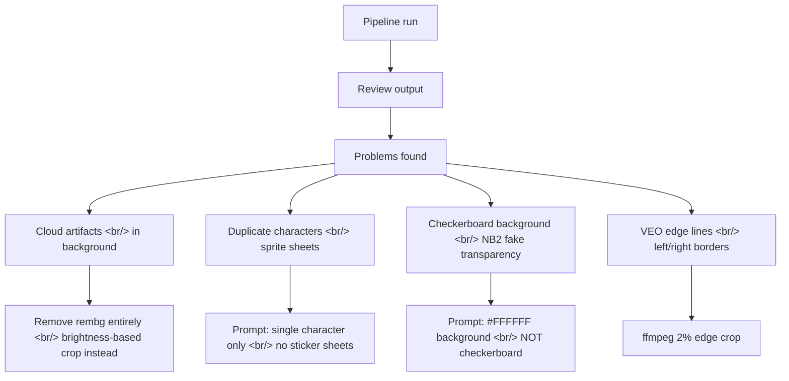

[Previous: PopCon Dev Log #1](/ko/posts/2026-04-02-popcon-dev1/)

## Overview

Today's session split between polishing the "outside" and hardening the "inside" of PopCon. The morning was branding — turning a Gemini-generated image into logo and favicon assets, then writing a GitHub-ready README. The afternoon turned into a Docker debugging session that led to pipeline quality improvements, finishing with retry logic and per-emoji error handling.

<!--more-->

## 1. Logo & Favicon — From Gemini Image to Brand Assets

The first task was converting a 2880×1440 Gemini-generated image into PopCon brand assets. The image was center-cropped to 1:1 then resized into multiple sizes.

| File | Size | Purpose |
|---|---|---|
| `logo.png` | 512×512 | Header logo |
| `favicon.ico` | 16/32/48 multi-size | Browser tab icon |
| `favicon-16x16.png` | 16×16 | Small favicon |
| `favicon-32x32.png` | 32×32 | Standard favicon |
| `apple-touch-icon.png` | 180×180 | iOS home screen |
| `icon-192.png` / `icon-512.png` | 192×192 / 512×512 | PWA icons |

### Why the Favicon Wasn't Showing in Docker

Two issues stacked on each other.

1. **Next.js App Router priority**: `app/favicon.ico` takes precedence over `public/favicon.ico`. A default favicon was already sitting in `app/` and needed to be replaced there.
2. **Docker image baking**: The Dockerfile uses `COPY . .` at build time. Changing files on disk has no effect until the container is rebuilt.

```bash
docker compose build frontend && docker compose up -d frontend
```

Confirmed with `curl -I localhost:3000/favicon.ico` returning HTTP 200.

---

## 2. Full Product README

Next came writing a README that reads like a product landing page rather than a bare technical doc.

The first version put both English and Korean in a single file. Feedback: "the two languages aren't distinguishable." Split them into separate files with language toggle links at the top of each.

- `README.md` — English, with `English | [한국어](README.ko.md)` at the top
- `README.ko.md` — Korean, with `[English](README.md) | 한국어` at the top

### README vs. Reality

After the first commit, reviewing the actual code revealed several discrepancies.

| Item | What the README said | What the code does |
|---|---|---|
| Image generation model | Google Imagen | Gemini Flash Image |
| VEO mode | Dual-frame I2V | Start frame + motion prompt only (API limitation) |
| Video duration | "under 4 seconds" | Exactly 4s (API minimum), trimmed in post-processing |
| Preprocessing step | Not mentioned | Crop → square pad → resize to 512×512 |
| Job persistence | Not mentioned | Redis with 24-hour TTL |
| Missing endpoint | Not listed | `/api/job/{job_id}/emoji/{filename}` |

Both README files updated and pushed.

---

## 3. Docker Debugging — Fighting the API Key

The afternoon session opened with Docker logs showing nothing working. The root cause was a trailing ` venv` appended to the API key in `.env`.

```
POPCON_GOOGLE_API_KEY=AIzaSy...-mAcuv venv
```

Likely copied from a terminal where the `venv` activation command ran next. Removed the trailing text, restarted — but the key itself turned out to be expired too. Generated a fresh one from Google AI Studio.

Running the pipeline for real surfaced a series of quality problems.

### Issues Found and Fixed



The biggest decision was removing `rembg` entirely. Every attempt at background removal made things worse — `isnet-general-use` left cloud artifacts, `u2net` wasn't better. Instead: prompt VEO to generate white backgrounds, then use brightness-based cropping to extract content.

```python
# processor.py — brightness-based content detection
brightness = arr.astype(float).mean(axis=2)
content_mask = (brightness > 10) & (brightness < 245)
```

Removing `rembg[cpu]>=2.0.0` from `pyproject.toml` and replacing it with `numpy>=1.26.0` also slimmed the Docker image.

### LINE File Naming Fix

Checking the LINE Creators Market guidelines: files must be named `001.png` through `040.png`. The code was saving them by action name.

```python
# packager.py
for i, emoji_path in enumerate(emoji_paths):
    line_name = f"{i + 1:03d}.png"
    zf.write(emoji_path, line_name)
```

---

## 4. Retry Logic and API Throttling

The final commit focused on resilience. Generating a full 24-emoji set means many API calls to VEO and Gemini — and they occasionally return 503 or 429. Previously, one failure killed the whole job.

### Per-Emoji Error Handling

The fix wraps each emoji's pipeline stages in a try/except, marks failures with `"error"` status, and continues with the rest.

```python
# worker.py — per-emoji error handling
failed_indices = set()
for i, action in enumerate(actions):
    try:
        # ... pose generation, animation, post-processing
    except Exception as e:
        logger.error(f"Emoji {i} ({action.name}) failed: {e}")
        failed_indices.add(i)
        status.results[i].status = "error"
        save_job(status)
```

A new `"done_with_errors"` job status means the ZIP is still available even if some emojis failed.

### API Retry with Exponential Backoff

Both the Gemini Image and VEO calls now retry up to three times on transient errors.

```python
# pose_generator.py — retry logic
async def _generate_image(self, prompt, reference_image_path=None, max_retries=3):
    for attempt in range(max_retries):
        try:
            response = await asyncio.to_thread(
                self.client.models.generate_content, ...
            )
            return ...
        except (ServerError, ClientError) as e:
            if attempt == max_retries - 1:
                raise
            wait = 2 ** attempt  # 1s, 2s, 4s
            logger.warning(f"Attempt {attempt+1} failed, retrying in {wait}s: {e}")
            await asyncio.sleep(wait)
```

### Type System Sync

Status types updated across backend and frontend.

| Layer | Change |
|---|---|
| `backend/models.py` | Added `"error"` to `EmojiStatus`, `"done_with_errors"` to `JobStatusType` |
| `frontend/lib/api.ts` | Mirrored the same status union types |
| `frontend/components/ProgressTracker.tsx` | Red card UI for `"error"` status emojis |
| `frontend/components/EmojiPreview.tsx` | Show ZIP download button on `"done_with_errors"` too |

---

## Summary

The four commits today in order:

| # | Work done |
|---|---|
| 1 | Logo/favicon assets, branding, full product README |
| 2 | Split README into English and Korean with language toggle |
| 3 | Updated READMEs to match actual pipeline behavior |
| 4 | Retry logic, per-emoji error handling, API throttling |

The Docker debugging session was unexpectedly productive — it forced a real pipeline run that surfaced quality issues, and the decision to remove `rembg` entirely turned out to be the right call. Less code, smaller Docker image, cleaner output.

Next up: final quality validation before submitting to LINE Creators Market.
