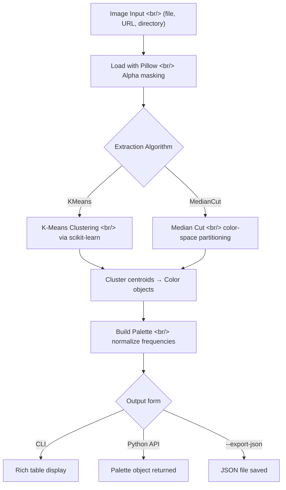

## Overview

[Pylette](https://github.com/qTipTip/Pylette) is a Python library that extracts representative color palettes from images. It supports two algorithms — K-Means clustering and Median Cut — and can be used via both a command-line interface and a Python API. With 164 stars and 16 forks it is a modest open-source project, but its design is clean and practical. This post analyzes the library architecture with a focus on the `color.py` source file and the Color class implementation.

<!--more-->

## Color Extraction Pipeline

Pylette's internal processing breaks down into three stages: image loading, algorithm application, and Color object construction.



## Color Class Deep Dive

`Pylette/src/color.py` is the core data structure for the entire library. In 106 lines it handles all color representation and conversion logic.

### Initialization and RGBA Handling

```python
class Color(object):
    def __init__(self, rgba: tuple[int, ...], frequency: float):
        assert len(rgba) == 4, "RGBA values must be a tuple of length 4"
        *rgb, alpha = rgba
        self.rgb = cast(tuple[int, int, int], rgb)
        self.rgba = rgba
        self.a = alpha
        self.freq: float = frequency
        self.weight = alpha / 255.0
```

Two things stand out here. First, `*rgb, alpha = rgba` unpacks the RGBA tuple in a single starred assignment — idiomatic Python. Second, `self.weight = alpha / 255.0` normalizes the alpha channel to the 0–1 range, which feeds into the `alpha_mask_threshold` filtering logic that excludes transparent pixels from the extraction.

### Color Space Conversion Properties

```python
@property
def hsv(self) -> tuple[float, float, float]:
    return colorsys.rgb_to_hsv(
        r=self.rgb[0] / 255,
        g=self.rgb[1] / 255,
        b=self.rgb[2] / 255
    )

@property
def hls(self) -> tuple[float, float, float]:
    return colorsys.rgb_to_hls(
        r=self.rgb[0] / 255,
        g=self.rgb[1] / 255,
        b=self.rgb[2] / 255
    )
```

HSV and HLS conversions delegate to Python's standard library `colorsys` module, keeping external dependencies minimal. Declaring them as `@property` means callers write `color.hsv` and `color.hls` as attribute accesses. Internally, RGB values are normalized to 0–1 before conversion.

### Luminance Calculation

```python
luminance_weights = np.array([0.2126, 0.7152, 0.0722])

@property
def luminance(self) -> float:
    return np.dot(luminance_weights, self.rgb)
```

The weights `[0.2126, 0.7152, 0.0722]` are the ITU-R BT.709 standard coefficients for sRGB luminance. They reflect the human visual system's sensitivity: the eye is most sensitive to green (0.7152) and least sensitive to blue (0.0722). The `--sort-by luminance` CLI option uses this value to order the extracted palette.

### Comparison Operator and Sorting

```python
def __lt__(self, other: "Color") -> bool:
    return self.freq < other.freq
```

Only `__lt__` is implemented — Python's `sorted()` and `list.sort()` only require this method to function. There is no need for `functools.total_ordering` when only frequency-based sorting matters. When `--sort-by luminance` is selected on the CLI, the palette is re-sorted using the `luminance` property instead.

### Color Space Dispatch Accessor

```python
def get_colors(
    self, colorspace: ColorSpace = ColorSpace.RGB
) -> tuple[int, ...] | tuple[float, ...]:
    colors = {
        ColorSpace.RGB: self.rgb,
        ColorSpace.HSV: self.hsv,
        ColorSpace.HLS: self.hls
    }
    return colors[colorspace]
```

This is the dictionary dispatch pattern. Instead of an `if/elif` chain, a dict maps each `ColorSpace` enum member to the corresponding property value. `ColorSpace` is defined as an enum in a separate `types.py`. The return type `tuple[int, ...] | tuple[float, ...]` reflects the fact that RGB returns integers while HSV and HLS return floats.

## Extraction Algorithm Comparison

| Criterion | K-Means | Median Cut |
|-----------|---------|------------|
| Approach | Iterative centroid search | Recursive color-space partitioning |
| Result | Statistically representative colors | Balanced color distribution |
| Speed | Requires iterative convergence | Deterministic, faster |
| Default | Yes | No |
| Best for | Complex gradients and photos | Simple block-color images |

K-Means converges iteratively but better reflects the actual distribution of colors in the image. Median Cut is deterministic — the same image always produces the same palette — which is useful when reproducibility matters.

## Usage Examples

### CLI

```bash
# Default: 5 colors, K-Means, RGB
pylette image.jpg

# 8 colors in HSV colorspace, export to JSON
pylette photo.png --n 8 --colorspace hsv --export-json --output colors.json

# Median Cut with transparent image handling
pylette logo.png --mode MedianCut --alpha-mask-threshold 128

# Batch process with parallel workers
pylette images/*.png --n 6 --num-threads 4
```

Sample output:
```
✓ Extracted 5 colors from sunset.jpg
┏━━━━━━━━━━┳━━━━━━━━━━━━━━━━━┳━━━━━━━━━━┓
┃ Hex      ┃ RGB             ┃ Frequency┃
┡━━━━━━━━━━╇━━━━━━━━━━━━━━━━━╇━━━━━━━━━━┩
│ #FF6B35  │ (255, 107, 53)  │    28.5% │
│ #F7931E  │ (247, 147, 30)  │    23.2% │
│ #FFD23F  │ (255, 210, 63)  │    18.7% │
│ #06FFA5  │ (6, 255, 165)   │    15.4% │
│ #4ECDC4  │ (78, 205, 196)  │    14.2% │
└──────────┴─────────────────┴──────────┘
```

### Python API

```python
from Pylette import extract_colors

palette = extract_colors(image='image.jpg', palette_size=8)

for color in palette.colors:
    print(f"RGB: {color.rgb}")
    print(f"Hex: {color.hex}")
    print(f"HSV: {color.hsv}")
    print(f"Luminance: {color.luminance:.2f}")
    print(f"Frequency: {color.freq:.2%}")

# Export to JSON
palette.to_json(filename='palette.json', colorspace='hsv')
```

### Batch Processing

```python
from Pylette import batch_extract_colors

results = batch_extract_colors(
    images=['image1.jpg', 'image2.png', 'image3.jpg'],
    palette_size=8,
    max_workers=4,
    mode='KMeans'
)

for result in results:
    if result.success and result.palette:
        print(f"✓ {result.source}: {len(result.palette.colors)} colors")
        result.palette.export(f"{result.source}_palette")
```

## Position in the Python Image Processing Ecosystem

Pylette composes Pillow (image loading), NumPy (array operations), and scikit-learn (K-Means) to solve the narrow problem of color extraction. Compared with similar tools:

- **colorgram.py**: The closest competitor. Simpler API but lacks color space conversion support and JSON export.
- **sklearn.cluster.KMeans directly**: More flexible, but you must build the entire image processing pipeline yourself.
- **PIL.Image.quantize**: Median Cut based, but produces no palette metadata — no frequency information, no color space conversion.

Pylette's strengths are its dual CLI/API interface, transparent image support, built-in color space conversion, and structured JSON export. Its weaknesses are lack of GPU acceleration and potential slowness on very large images.

## Design Lessons

Several Pythonic patterns in the Color class are worth noting:

1. **Lazy `@property` computation**: HSV, HLS, hex, and luminance are all computed only when accessed. There is no caching, but since Color objects are used immutably this is not a problem in practice.

2. **Dictionary dispatch in `get_colors()`**: Adding a new color space requires adding a single dict entry rather than modifying an `elif` chain.

3. **Standard library first**: Using `colorsys` for color space conversion avoids an external dependency entirely.

4. **Precise type hints**: The `tuple[int, ...] | tuple[float, ...]` return type accurately captures the difference between integer RGB and float HSV/HLS values, which is information a type checker can use.

## Summary

Pylette solves the well-defined problem of "extract representative colors from an image" with a clean interface. The Color class packs RGB, HSV, HLS, hex, luminance, and frequency into 106 lines as a self-contained data structure. It is a practical, ready-to-use library for real tasks such as design system color extraction, image classification, and visualization tooling.

---

- GitHub: [qTipTip/Pylette](https://github.com/qTipTip/Pylette)
- Docs: [qtiptip.github.io/Pylette](https://qtiptip.github.io/Pylette/)
- PyPI: `pip install Pylette`
