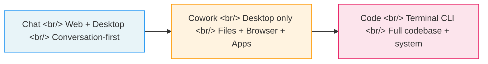
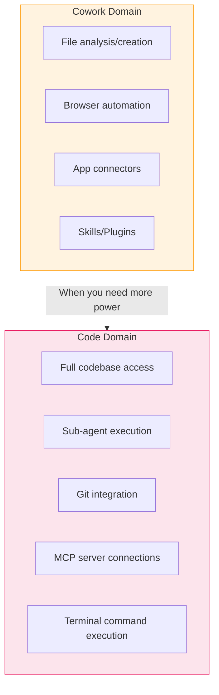
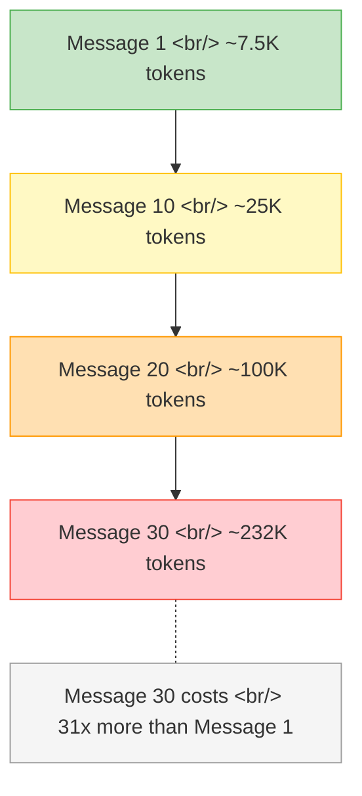

## Overview

Anthropic's Claude has evolved from a chatbot into an entire ecosystem. **Chat** is the conversational interface on web and desktop. **Cowork** is a desktop agent that controls your files, browser, and connected apps. **Code** is a terminal-based CLI that gives developers full access to codebases and system-level tools. This post breaks down how the three products differ, when to use each one, and why Claude Code's token costs grow geometrically — plus practical tips to keep them under control.

<!--more-->

## Chat, Cowork, Code — The Capability Spectrum

The three products sit on a spectrum of accessibility versus control.

### Chat — The Foundation

- **Platforms**: Web (claude.ai) + desktop app
- **Key features**: Projects (similar to GPTs), Google Docs integration, connectors, web search, Research mode
- **Best for**: Everyone — writing, summarization, Q&A, research

Claude Chat's edge is **long-document processing and writing quality**. Where ChatGPT leans creative and Gemini excels at multimodal + Google Workspace integration, Claude is built for handling large volumes of text with precision.

### Cowork — The Agent for Non-Developers

Cowork is essentially **"Claude Code for non-developers."** It runs exclusively on the Windows/Mac desktop app and is far easier to set up than Code.

**Five core capabilities:**

| Capability | What it does | Example |
|-----------|-------------|---------|
| File management | Analyze and create local files | Receipt photos → Excel spreadsheet |
| Browser control | AI clicks through Chrome directly | Automated web navigation and form filling |
| App connectors | Gmail, Calendar, Notion, Slack integration | Slack channel analysis, email automation |
| Skills | Bundled, repeatable workflows | Automated newsletter generation |
| Plugins | Connectors + Skills combined | LinkedIn posting automation |

### Code — The Developer's Terminal Companion

Claude Code is a CLI tool that runs in the terminal with access to your entire codebase.

**Key differences from Cowork:**

- **Cowork**: Day-to-day task automation — file analysis, browser control, app integration
- **Code**: Software development — custom code, advanced automation, system-level control

**Recommended path**: Start with Cowork, graduate to Code when you need the advanced capabilities.

### Pricing

| Plan | Monthly | Notes |
|------|---------|-------|
| Free | $0 | Basic chat only |
| Pro | $20 | Chat + Cowork + Code access |
| Max | $100/$200 | High-volume usage, higher token limits |

> Use the desktop app over the web. Cowork and Code features are limited in the browser.

## Claude Code Token Optimization — Understanding the Cost Curve

Using Claude Code carelessly causes token costs to grow **geometrically**. Understanding the underlying mechanism is essential.

### Why Costs Grow Geometrically

Claude Code re-reads the **entire conversation** with every message. As conversations grow longer, each subsequent message consumes more tokens than the last.

### Essential Tips for Beginners (19 of 52)

The source video covers 52 tips total. Here are the key beginner-level ones.

**Conversation management**
1. **Make `/clear` a habit** — Reset after each task. This zeroes out token accumulation.
2. **Scope your prompts** — "Fix line 10 of readme" beats "fix this file"
3. **Batch simple commands** — Combine easy tasks into a single message
4. **Paste only what's relevant** — Code snippets, not entire files
5. **Stay at the keyboard** — Unattended sessions risk infinite loops

**Model selection**
6. **Default to Sonnet** — Opus is expensive for routine work
7. **Match model to task**:
   - **Haiku**: Simple questions, file renames
   - **Sonnet**: General development (good default)
   - **Opus**: Architecture decisions, deep debugging

**Other settings and habits**
- Keep unnecessary files out of context
- Use `.claudeignore` to exclude large files and directories
- Keep task scope small
- Clean up conversations after verifying results

## Related Tools — Quick Links

| Tool | Description |
|------|------------|
| [Whispree](https://github.com/Arsture/whispree) | macOS menu bar STT app for Apple Silicon. Fully local, open-source. Whisper + LLM post-processing with Korean-English code-switching optimization. Voice-to-prompt is 3-5x faster than typing. |
| [OpenClaude](https://github.com/Gitlawb/openclaude) | Open-source coding agent CLI in the style of Claude Code. Supports OpenAI, Gemini, DeepSeek, Ollama, and 200+ models. Includes VS Code extension. |
| [WorkMux](https://workmux.raine.dev/) | Run multiple AI agents in parallel from your terminal. |

## Source Videos

- [Claude Cowork is easier and more powerful than Code for beginners](https://www.youtube.com/watch?v=mcJXTYb0Vt4) (Korean)
- [Understanding the differences between Claude Chat, Cowork, and Code](https://www.youtube.com/watch?v=_5sbWIeBQLk) (Korean)
- [Your Claude Code tokens are melting — Beginner tips, Part 1](https://www.youtube.com/watch?v=NJDioulY7BA) (Korean)

## Takeaway

The Claude ecosystem forms a clear spectrum: Chat for everyone, Cowork for business automation, Code for developers. Start with the tool that matches your skill level, but if you use Claude Code, understand the token structure first. When message 30 costs 31 times more than message 1, optimization is not optional — it is the price of admission.
