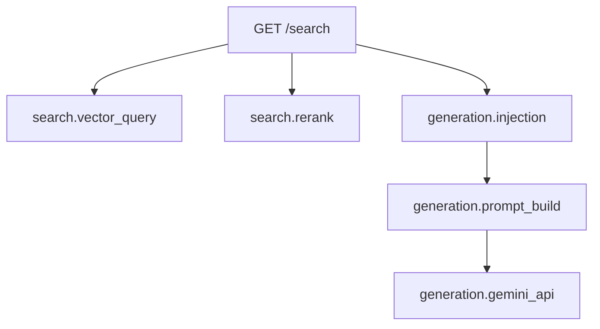

## Overview

I recently added distributed tracing to my `hybrid-image-search` FastAPI service using OpenTelemetry and Grafana Cloud. The goal was simple: see exactly where time is spent when a user searches for images — from the API request through vector search to Gemini API generation. What followed was a multi-day debugging journey through exporter protocols, tracer provider timing, and span processor choices. This post covers the full architecture, the working code, and every fix along the way.

<!--more-->

## Architecture

The observability pipeline has three layers: the FastAPI application emits traces via OpenTelemetry, Grafana Alloy running on the same EC2 instance receives and batches them, and Grafana Cloud Tempo stores them for querying.


The key design decision is using **OTLP HTTP** (port 4318) rather than gRPC. This turned out to matter a lot — more on that in the debugging section.

## Step 1: The Telemetry Module

The core of the setup is a single `telemetry.py` module that initializes OpenTelemetry at import time:

```python
# backend/src/telemetry.py
import logging, os
from contextlib import contextmanager
import psutil
from opentelemetry import trace
from opentelemetry.exporter.otlp.proto.http.trace_exporter import OTLPSpanExporter
from opentelemetry.instrumentation.sqlalchemy import SQLAlchemyInstrumentor
from opentelemetry.sdk.resources import Resource
from opentelemetry.sdk.trace import TracerProvider
from opentelemetry.sdk.trace.export import SimpleSpanProcessor

_endpoint = os.environ.get(
    "OTEL_EXPORTER_OTLP_ENDPOINT", "http://localhost:4318"
)
_environment = os.environ.get("DEPLOYMENT_ENV", "dev")

_resource = Resource.create({
    "service.name": "hybrid-image-search",
    "deployment.environment": _environment,
})

_provider = TracerProvider(resource=_resource)
_exporter = OTLPSpanExporter(endpoint=f"{_endpoint}/v1/traces")
_provider.add_span_processor(SimpleSpanProcessor(_exporter))
trace.set_tracer_provider(_provider)

tracer = trace.get_tracer("hybrid-image-search")
```

Three things to note:

1. **`TracerProvider` is set at module level**, not inside a function. This avoids a timing issue where `FastAPIInstrumentor` grabs a reference to the tracer provider at import time — if you set it later in a lifespan function, the instrumentor already has the no-op provider.

2. **`SimpleSpanProcessor`** instead of `BatchSpanProcessor`. The batch processor buffers spans and exports them on a background thread, which sounds better for performance. But when running under `uv run`, the process can exit before the background thread flushes. `SimpleSpanProcessor` exports each span synchronously, ensuring nothing is lost.

3. **OTLP HTTP exporter**, not gRPC. The gRPC exporter requires additional dependencies (`grpcio`) and had reliability issues in this setup. The HTTP exporter using `requests` just works.

## Step 2: The traced_span Helper

Beyond auto-instrumentation, I wanted custom spans that capture resource usage — how much memory a Gemini API call allocates, how much CPU time vector search takes:

```python
_process = psutil.Process(os.getpid())

@contextmanager
def traced_span(name, **attrs):
    """Create a span with automatic CPU/memory measurement."""
    mem_before = _process.memory_info().rss
    cpu_before = _process.cpu_times()
    with tracer.start_as_current_span(name) as span:
        for k, v in attrs.items():
            span.set_attribute(k, v)
        yield span
        mem_after = _process.memory_info().rss
        cpu_after = _process.cpu_times()
        span.set_attribute("process.memory_mb",
                           round(mem_after / 1024 / 1024, 1))
        span.set_attribute("process.memory_delta_kb",
                           round((mem_after - mem_before) / 1024, 1))
        span.set_attribute("process.cpu_user_ms",
                           round((cpu_after.user - cpu_before.user) * 1000, 1))
        span.set_attribute("process.cpu_system_ms",
                           round((cpu_after.system - cpu_before.system) * 1000, 1))
```

Usage in the generation route:

```python
with traced_span("generation.gemini_api", model=model_name):
    response = await model.generate_content_async(prompt)

with traced_span("generation.prompt_build", ref_count=len(references)):
    prompt = build_prompt(query, references)
```

In Grafana Tempo, these show up as child spans under the FastAPI root span, with memory and CPU attributes visible in the span details panel.

## Step 3: Wiring Into FastAPI

The application wiring happens in two places:

```python
# main.py — module level (after app creation)
from opentelemetry.instrumentation.fastapi import FastAPIInstrumentor
FastAPIInstrumentor.instrument_app(app)
```

```python
# main.py — lifespan function
from telemetry import init_telemetry

@asynccontextmanager
async def lifespan(app):
    try:
        init_telemetry(db_engine=db_engine)
    except Exception as e:
        logger.warning("Telemetry init failed: %s", e)
    yield
```

The `init_telemetry` function handles optional extras like SQLAlchemy instrumentation. The key insight: `FastAPIInstrumentor` must be at **module level**, not inside the lifespan. If you instrument inside lifespan, the instrumentor may capture the wrong tracer provider.

Error handling around `init_telemetry` is intentional — telemetry should never crash the application. If Alloy is down or the endpoint is misconfigured, the service still runs.

## Step 4: Grafana Alloy on EC2

Grafana Alloy acts as the local collector. It receives OTLP traces from the FastAPI app, batches them, and forwards to Grafana Cloud:

```hcl
otelcol.receiver.otlp "default" {
  grpc { endpoint = "127.0.0.1:4317" }
  http { endpoint = "127.0.0.1:4318" }
  output {
    traces = [otelcol.processor.batch.default.input]
  }
}

otelcol.processor.batch "default" {
  timeout = "5s"
  output {
    traces = [otelcol.exporter.otlphttp.grafana_cloud.input]
  }
}

otelcol.exporter.otlphttp "grafana_cloud" {
  client {
    endpoint = env("GRAFANA_OTLP_ENDPOINT")
    auth     = otelcol.auth.basic.grafana_cloud.handler
  }
}

otelcol.auth.basic "grafana_cloud" {
  username = env("GRAFANA_INSTANCE_ID")
  password = env("GRAFANA_API_TOKEN")
}
```

Alloy binds to `127.0.0.1` only — no external exposure. The authentication credentials come from environment variables, set via systemd unit file on the EC2 instance.

The 5-second batch timeout is a good balance: short enough for near-real-time visibility, but enough to bundle multiple spans per request.

## The Debugging Journey

Getting from "install packages" to "traces visible in Grafana" took about 12 iterations. Here is the sequence of issues and fixes:

| Step | Problem | Fix |
|------|---------|-----|
| 1 | No traces appearing at all | TracerProvider was set inside lifespan; FastAPIInstrumentor had already grabbed the no-op provider. Moved to module level. |
| 2 | Traces lost on process exit | `BatchSpanProcessor` background thread did not flush before `uv run` terminated. Switched to `SimpleSpanProcessor`. |
| 3 | gRPC connection failures | `grpcio` had intermittent issues on the EC2 instance. Switched to OTLP HTTP exporter. |
| 4 | App crashed when Alloy was down | No error handling around `init_telemetry`. Added try/except in lifespan. |
| 5 | FastAPI spans missing custom attributes | `FastAPIInstrumentor` was called before tracer provider was set. Ensured provider is set at import time, instrumentor at module level after `app` creation. |

The most subtle bug was issue 1. OpenTelemetry's global tracer provider is a singleton — once `FastAPIInstrumentor` reads it, it caches that reference. If the global provider is still the no-op default at that point, all auto-instrumented spans go nowhere, even if you set the real provider later.

## What Shows Up in Grafana

After everything is wired correctly, filtering by `service.name = hybrid-image-search` in Grafana Tempo shows the full request waterfall:



Each span carries:
- **Duration** — wall clock time
- **process.memory_mb** — RSS at span end
- **process.memory_delta_kb** — memory allocated during the span
- **process.cpu_user_ms / process.cpu_system_ms** — CPU time consumed

This makes it straightforward to identify that, for example, `generation.gemini_api` spans average 1.2 seconds and allocate ~8MB, while `search.vector_query` takes 200ms with negligible memory impact.

## Lessons Learned

1. **Set TracerProvider at import time.** Any instrumentor that runs at import or module level will capture whatever provider exists at that moment. Late initialization means silent no-ops.

2. **Use SimpleSpanProcessor in dev and short-lived processes.** BatchSpanProcessor is better for production throughput, but it relies on clean shutdown. If your process exits abruptly, spans are lost.

3. **OTLP HTTP is more portable than gRPC.** Fewer dependencies, simpler debugging (you can curl the endpoint), and no protobuf compilation issues.

4. **Alloy is a better local collector than direct-to-cloud export.** It decouples the app from Grafana Cloud auth, handles batching and retries, and means the app only needs to know about `localhost:4318`.

5. **Wrap telemetry init in error handling.** Observability should degrade gracefully. A misconfigured collector should never take down your application.

6. **Custom resource metrics via psutil are cheap and valuable.** The overhead of `memory_info()` and `cpu_times()` per span is negligible, but having memory/CPU data alongside timing data makes performance debugging much richer.
