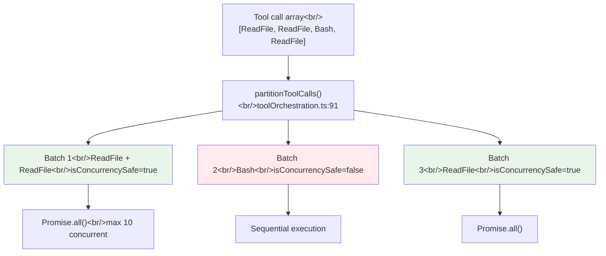
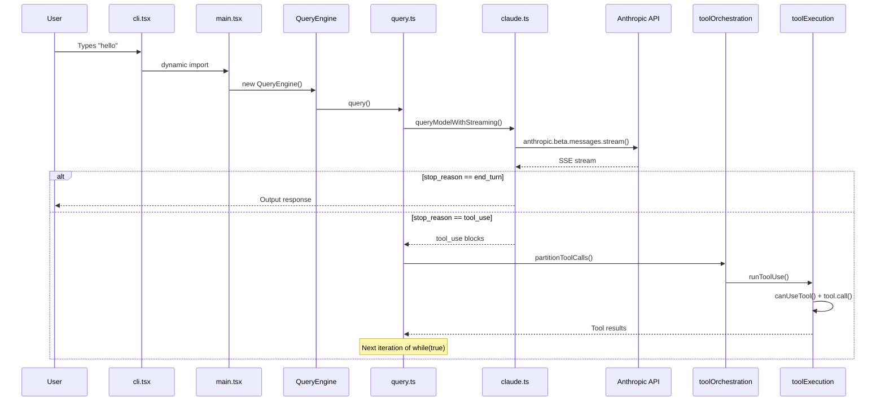

## Overview

This is the first post in a series that systematically dissects Claude Code's source structure across 27 sessions. In this post, we trace the **complete call stack across 11 TypeScript files** that a "hello" typed into the terminal traverses before a response appears on screen.

<!--more-->

## Analysis Target: 11 Core Files

| # | Path | Lines | Role |
|---|------|-------|------|
| 1 | `entrypoints/cli.tsx` | 302 | CLI bootstrap, argument parsing, mode routing |
| 2 | `main.tsx` | 4,683 | Main REPL component, Commander setup |
| 3 | `commands.ts` | 754 | Command registry |
| 4 | `context.ts` | 189 | System prompt assembly, CLAUDE.md injection |
| 5 | `QueryEngine.ts` | 1,295 | Session management, SDK interface |
| 6 | `query.ts` | 1,729 | **Core turn loop** — API + tool execution |
| 7 | `services/api/client.ts` | 389 | HTTP client, 4-provider routing |
| 8 | `services/api/claude.ts` | 3,419 | Messages API wrapper, SSE streaming, retries |
| 9 | `services/tools/toolOrchestration.ts` | 188 | Concurrency partitioning |
| 10 | `services/tools/StreamingToolExecutor.ts` | 530 | Tool execution during streaming |
| 11 | `services/tools/toolExecution.ts` | 1,745 | Tool dispatch, permission checks |

We trace a total of **15,223 lines**.

## 1. Entry and Bootstrap: cli.tsx -> main.tsx

`cli.tsx` is only 302 lines, yet it contains a surprising number of **fast-path** branches:

```
cli.tsx:37  --version        -> immediate output, 0 imports
cli.tsx:53  --dump-system    -> minimal imports
cli.tsx:100 --daemon-worker  -> worker-only path
cli.tsx:112 remote-control   -> bridge mode
cli.tsx:185 ps/logs/attach   -> background sessions
cli.tsx:293 default path     -> dynamic import of main.tsx
```

**Design intent**: Avoid loading `main.tsx`'s 4,683 lines just for `--version`. This optimization directly impacts the perceived responsiveness of the CLI tool.

The default path dynamically imports `main.tsx`:

```typescript
// cli.tsx:293-297
const { main: cliMain } = await import('../main.js');
await cliMain();
```

The reason `main.tsx` is 4,683 lines is that it includes all of the following:
1. **Side-effect imports** (lines 1-209): `profileCheckpoint`, `startMdmRawRead`, `startKeychainPrefetch` — parallel subprocesses launched at module evaluation time to hide the ~65ms macOS keychain read
2. **Commander setup** (line 585+): CLI argument parsing, 10+ mode-specific branches
3. **React/Ink REPL rendering**: Terminal UI mount
4. **Headless path** (`-p`/`--print`): Uses `QueryEngine` directly without UI

## 2. Prompt Assembly: context.ts's dual-memoize

`context.ts` is a small file at 189 lines, but it handles all dynamic parts of the system prompt. Two memoized functions are at its core:

- **`getSystemContext()`** (context.ts:116): Collects git state (branch, status, recent commits)
- **`getUserContext()`** (context.ts:155): Discovers and parses CLAUDE.md files

**Why the separation?** It's directly tied to the Anthropic Messages API's prompt caching strategy. Since the cache lifetimes of the system prompt and user context differ, `cache_control` must be applied differently to each. Wrapping them in `memoize` ensures each is computed only once per session.

The call to `setCachedClaudeMdContent()` at context.ts:170-176 is **a mechanism to break circular dependencies** — yoloClassifier needs CLAUDE.md content, but a direct import would create a permissions -> yoloClassifier -> claudemd -> permissions cycle.

## 3. AsyncGenerator Chain: The Architectural Spine

Claude Code's entire data flow is built on an `AsyncGenerator` chain:

```
QueryEngine.submitMessage()* -> query()* -> queryLoop()* -> queryModelWithStreaming()*
```

Every core function is an `async function*`. This isn't just an implementation choice — it's an **architectural decision**:

- **Backpressure**: When the consumer is slow, the producer waits
- **Cancellation**: Combined with AbortController for immediate cancellation
- **Composition**: `yield*` naturally chains generators together
- **State management**: Local variables within loops naturally maintain state across turns

Looking at the signature of `QueryEngine.submitMessage()` (QueryEngine.ts:209):

```typescript
async *submitMessage(
  prompt: string | ContentBlockParam[],
  options?: { uuid?: string; isMeta?: boolean },
): AsyncGenerator<SDKMessage, void, unknown>
```

In SDK mode, each message is **streamed via yield**, and Node.js backpressure is naturally implemented.

## 4. The Core Turn Loop: query.ts's while(true)

`queryLoop()` in `query.ts` (1,729 lines) is the actual API + tool loop:

```typescript
// query.ts:307
while (true) {
  // 1. Call queryModelWithStreaming() -> SSE stream
  // 2. Yield streaming events
  // 3. Detect tool calls -> runTools()/StreamingToolExecutor
  // 4. Append tool results to messages
  // 5. stop_reason == "end_turn" -> break
  //    stop_reason == "tool_use" -> continue
}
```

The `State` type (query.ts:204) is important. It manages loop state as an explicit record with fields like `messages`, `toolUseContext`, `autoCompactTracking`, and `maxOutputTokensRecoveryCount`, updating everything at once at continue sites.

## 5. API Communication: 4 Providers and Caching

`getAnthropicClient()` at `client.ts:88` supports 4 providers:

| Provider | SDK | Reason for Dynamic Import |
|----------|-----|--------------------------|
| Anthropic Direct | `Anthropic` | Default, loaded immediately |
| AWS Bedrock | `AnthropicBedrock` | AWS SDK is several MB |
| Azure Foundry | `AnthropicFoundry` | Azure Identity is several MB |
| GCP Vertex | `AnthropicVertex` | Google Auth is several MB |

The core function chain in `claude.ts` (3,419 lines):

```
queryModelWithStreaming() (claude.ts:752)
  -> queryModel()
    -> withRetry()
      -> anthropic.beta.messages.stream() (SDK call)
```

The caching strategy is determined by `getCacheControl()` (claude.ts:358), which decides the 1-hour TTL based on user type, feature flags, and query source.

## 6. Tool Orchestration: 3-Tier Concurrency



`StreamingToolExecutor` (530 lines) extends this batch partitioning into a **streaming context**. When it detects tool calls while the API response is still streaming, it immediately starts execution:

1. `addTool()` (StreamingToolExecutor.ts:76) — Add to queue
2. `processQueue()` (StreamingToolExecutor.ts:140) — Check concurrency, then execute immediately
3. `getRemainingResults()` (StreamingToolExecutor.ts:453) — Wait for all tools to complete

**Error propagation rules**: Only Bash errors cancel sibling tools (`siblingAbortController`). Read/WebFetch errors don't affect other tools. This reflects the implicit dependencies between Bash commands (if mkdir fails, subsequent commands are pointless).

## Full Data Flow



## Rust Gap Map Preview

Tracing the same request through the Rust port revealed **31 gaps**:

| Priority | Gap Count | Key Examples |
|----------|-----------|--------------|
| P0 (Critical) | 2 | Synchronous ApiClient, missing StreamingToolExecutor |
| P1 (High) | 6 | 3-tier concurrency, prompt caching, Agent tool |
| P2 (Medium) | 7 | Multi-provider, effort control, sandbox |
| Implemented | 11 | Auto-compaction, SSE parser, OAuth, config loading |

**Implementation coverage: 36% (11/31)**. The next post dives deep into the conversation loop at the heart of these gaps.

## Insights

1. **AsyncGenerator is the architectural spine** — It's not just an implementation technique but a design decision that simultaneously solves backpressure, cancellation, and composition. In Rust, the `Stream` trait is the counterpart, but the ergonomics of `yield*` composition differ significantly.

2. **main.tsx at 4,683 lines is technical debt** — Commander setup, React components, and state management are all mixed in a single file. This is the result of organic growth and represents an opportunity for module decomposition.

3. **Tool concurrency is non-trivial** — The 3-tier model (read batches, sequential writes, Bash sibling cancellation) rather than "all parallel" or "all sequential" is a core design element of production agent harnesses.

*Next post: [#2 — The Heart of the Conversation Loop: StreamingToolExecutor and 7 Continue Paths](/posts/2026-04-06-harness-anatomy-2/)*
