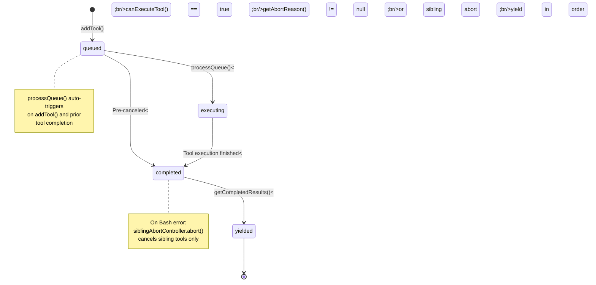
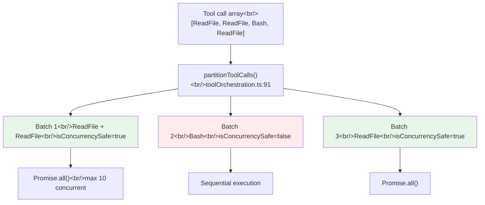
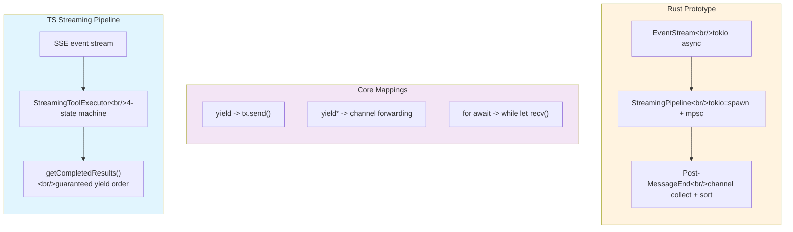

## Overview

In the first post of this series, we traced the journey of a single "hello" through 11 files. This post fully dissects the heart of that journey: the `while(true)` loop in `query.ts`'s 1,729 lines. We analyze the resilient execution model created by 7 `continue` paths, the 4-stage state machine of `StreamingToolExecutor`, and the 3-tier concurrency model of `partitionToolCalls()`, then compare how we reproduced these patterns in a Rust prototype.

<!--more-->

## Analysis Target: 10 Core Files

| # | Path | Lines | Role |
|---|------|-------|------|
| 1 | `query/config.ts` | 46 | Immutable runtime gate snapshot |
| 2 | `query/deps.ts` | 40 | Testable I/O boundary (DI) |
| 3 | `query/tokenBudget.ts` | 93 | Token budget management, auto-continue/stop decisions |
| 4 | `query/stopHooks.ts` | 473 | Stop/TaskCompleted/TeammateIdle hooks |
| 5 | `query.ts` | 1,729 | **Core** -- while(true) turn loop |
| 6 | `QueryEngine.ts` | 1,295 | Session wrapper, SDK interface |
| 7 | `toolOrchestration.ts` | 188 | Tool partitioning + concurrency control |
| 8 | `StreamingToolExecutor.ts` | 530 | SSE mid-stream tool pipelining |
| 9 | `toolExecution.ts` | 1,745 | Tool dispatch, permission checks |
| 10 | `toolHooks.ts` | 650 | Pre/PostToolUse hook pipeline |

We dissect a total of **6,789 lines** of core orchestration code.

## 1. queryLoop()'s 7 Continue Paths

The `queryLoop()` function in `query.ts` (query.ts:241) is not a simple API call loop. It's a **resilient executor** with 7 distinct `continue` reasons, each handling a unique failure scenario:

| Reason | Line | Description |
|--------|------|-------------|
| `collapse_drain_retry` | 1114 | Retry after context collapse drain |
| `reactive_compact_retry` | 1162 | Retry after reactive compaction (413 recovery) |
| `max_output_tokens_escalate` | 1219 | Token escalation from 8k -> 64k |
| `max_output_tokens_recovery` | 1248 | Inject "continue writing" nudge message |
| `stop_hook_blocking` | 1303 | Stop hook returned a blocking error |
| `token_budget_continuation` | 1337 | Continue due to remaining token budget |
| `next_turn` | 1725 | Next turn after tool execution completes |

**The State type is key** (query.ts:204-217). Loop state is managed as a record with 10 fields. Why a record instead of individual variables? There are 7 `continue` sites, each updating via `state = { ... }` all at once. Individually assigning 9 variables makes it easy to miss one. **Record updates let the type system catch omissions.**

### Full Flow of a Single Loop Iteration

```
1. Preprocessing (365-447): snip compaction, micro-compact, context collapse
2. Auto-compaction (454-543): on success, replace messages and continue
3. Blocking limit check (628-648): immediate termination if token threshold exceeded
4. API streaming (654-863): consume SSE events via for-await
5. No-tool exit paths (1062-1357): 413 recovery, max_output recovery, stop hooks
6. Tool continuation paths (1360-1728): execute remaining tools -> next_turn
```

## 2. StreamingToolExecutor's 4-Stage State Machine

`StreamingToolExecutor.ts` (530 lines) is the most sophisticated concurrency pattern in Claude Code. The core idea: **start executing completed tool calls while the API response is still streaming**.

When the model calls `[ReadFile("a.ts"), ReadFile("b.ts"), Bash("make test")]` at once, without pipelining, execution only begins after all three tool blocks have arrived. With pipelining, file reading starts the instant the `ReadFile("a.ts")` block completes.



### Concurrency Decision Logic (canExecuteTool, line 129)

```
Execution conditions:
  - No tools currently executing (executingTools.length === 0)
  - Or: this tool is concurrencySafe AND all executing tools are also concurrencySafe
```

Read-only tools can execute in parallel, but if even one write tool is present, the next tool waits until it finishes.

### siblingAbortController -- Hierarchical Cancellation

`siblingAbortController` (line 46-61) is a child of `toolUseContext.abortController`. When a Bash tool throws an error, it calls `siblingAbortController.abort('sibling_error')` to **cancel only sibling tools**. The parent controller is unaffected, so the overall query continues.

Why do only Bash errors cancel siblings? In `mkdir -p dir && cd dir && make`, if mkdir fails, subsequent commands are pointless. ReadFile or WebFetch failures are independent and shouldn't affect other tools.

## 3. partitionToolCalls -- 3-Tier Concurrency Model

`toolOrchestration.ts` (188 lines) defines the entire concurrency model for tool execution.



The rule is simple: consecutive `isConcurrencySafe` tools are grouped into a single batch, while non-safe tools each become independent batches. This decision comes **from the tool definition itself** — determined by calling `tool.isConcurrencySafe(parsedInput)`. The same tool may have different concurrency safety depending on its input.

### Context Modifiers and Race Conditions

**Why apply them in order after the batch completes?** Applying context modifiers immediately during parallel execution creates race conditions. If A completes first and modifies the context, B (still executing) started with the pre-modification context but would see the post-modification state. Applying them in original tool order after batch completion guarantees deterministic results (toolOrchestration.ts:54-62).

## 4. Tool Execution Pipeline and Hooks

`runToolUse()` in `toolExecution.ts` (1,745 lines, line 337) manages the complete lifecycle of each individual tool call:

```
runToolUse() entry point
  1. findToolByName() -- retry with deprecated aliases (345-356)
  2. abort check -- if already canceled, return CANCEL_MESSAGE (415)
  3. streamedCheckPermissionsAndCallTool() -- permissions + execution + hooks (455)
     -> checkPermissionsAndCallTool():
        a. Zod schema input validation (615)
        b. tool.validateInput() custom validation (683)
        c. Speculative classifier (Bash only, 740)
        d. runPreToolUseHooks() (800)
        e. resolveHookPermissionDecision() (921)
        f. tool.call() actual execution (1207)
        g. runPostToolUseHooks() result transformation
```

### The Core Invariant of resolveHookPermissionDecision

In `resolveHookPermissionDecision()` (toolHooks.ts:332), **a hook's `allow` does not bypass settings.json deny/ask rules** (toolHooks.ts:373). Even if a hook allows, it must still pass `checkRuleBasedPermissions()`. This reflects the design principle that "hooks are automation helpers, not security bypasses."

```
When hook result is allow:
  -> Call checkRuleBasedPermissions()
  -> null means pass (no rules)
  -> deny means rule overrides hook
  -> ask means user prompt required
```

## 5. Rust Comparison -- 152 Lines vs 1,729 Lines

Rust's `ConversationRuntime::run_turn()` consists of **152 lines in a single `loop {}`** (conversation.rs:183-272). Of the 7 TS continue paths, only `next_turn` (next turn after tool execution) exists in Rust.

| TS Continue Reason | Rust Status | Why |
|--------------------|-------------|-----|
| `collapse_drain_retry` | Not implemented | No context collapse |
| `reactive_compact_retry` | Not implemented | No 413 recovery |
| `max_output_tokens_escalate` | Not implemented | No 8k->64k escalation |
| `max_output_tokens_recovery` | Not implemented | No multi-turn nudge |
| `stop_hook_blocking` | Not implemented | No stop hooks |
| `token_budget_continuation` | Not implemented | No token budget system |
| `next_turn` | **Implemented** | Re-calls API after tool results |

### The Most Critical Gap: Synchronous API Consumption

The Rust `ApiClient` trait signature says it all:

```rust
fn stream(&mut self, request: ApiRequest) -> Result<Vec<AssistantEvent>, RuntimeError>;
```

The return type is `Vec<AssistantEvent>`. **It's not streaming.** It collects all SSE events and returns them as a vector. This means when the model calls 5 ReadFiles, TS can finish executing the first ReadFile while still streaming, but Rust must wait for all 5 to finish streaming before starting sequential execution. **The latency gap grows proportionally with the number of tools.**

## 6. Rust Prototype -- Bridging the Gap

In the S04 prototype, we implemented an orchestration layer that bridges 3 P0 gaps:



### 3 Key Implementations in the Prototype

**1. Async streaming**: Extended the `ApiClient` trait to an async stream. Since `MessageStream::next_event()` is already async, only the consumer side needed changes.

**2. Tool pipelining**: On receiving a `ToolUseEnd` event, assembles a `ToolCall` from accumulated input and immediately starts background execution via `tokio::spawn`. Collects results in completion order via `mpsc::unbounded_channel`, then sorts back to original order.

**3. 3-tier concurrency**: Partitions by `ToolCategory` enum (ReadOnly/Write/BashLike). ReadOnly batches use `Semaphore(10)` + `tokio::spawn` for up to 10 parallel tasks. BashLike runs sequentially with remaining tasks aborted on error.

### Prototype Coverage

| TS Feature | Prototype | Status |
|------------|-----------|--------|
| `partitionToolCalls()` 3-tier | `partition_into_runs()` + `ToolCategory` | Implemented |
| `runToolsConcurrently()` max 10 | `Semaphore(10)` + `tokio::spawn` | Implemented |
| `siblingAbortController` | `break` on BashLike error | Simplified |
| `StreamingToolExecutor.addTool()` | `tokio::spawn` on `ToolUseEnd` | Implemented |
| PreToolUse hook deny/allow | `HookDecision::Allow/Deny` | Implemented |
| PostToolUse output transform | `HookResult::transformed_output` | Implemented |
| 4-state machine (queued->yielded) | spawned/completed 2-state | Incomplete |
| 413 recovery / max_output escalation | -- | Not implemented |
| `preventContinuation` | -- | Not implemented |

## Stop Condition Comparison

| Condition | TS | Rust |
|-----------|-----|------|
| No tools (end_turn) | Execute `handleStopHooks()` then exit | Immediate `break` |
| Token budget exceeded | `checkTokenBudget()` with 3 decisions | None |
| max_output_tokens | Escalation + multi-turn recovery | None |
| 413 prompt-too-long | Context collapse + reactive compaction | Error propagation |
| maxTurns | `maxTurns` parameter (query.ts:1696) | `max_iterations` |
| Diminishing returns | 3+ turns with <500 token increase | None |

`checkTokenBudget()` in `tokenBudget.ts` (93 lines) controls **whether to continue responding, not prompt size**. `COMPLETION_THRESHOLD = 0.9` (continue if below 90% of total budget), `DIMINISHING_THRESHOLD = 500` (stop if 3+ consecutive turns each produce fewer than 500 tokens, indicating diminishing returns). The `nudgeMessage` explicitly instructs "do not summarize."

## The Core Design Decision -- Why AsyncGenerator

The entire pipeline is an `async function*` chain:

```
QueryEngine.submitMessage()* -> query()* -> queryLoop()* -> deps.callModel()*
runTools()* -> runToolUse()* -> handleStopHooks()* -> executeStopHooks()*
```

The key benefit of this choice: **implementing complex state machines without inversion of control**. At each of the 7 `continue` paths, you construct state explicitly with `state = { ... }` and `continue`. With a callback-based approach, state management would be scattered, making it difficult to guarantee consistency across 7 recovery paths.

In Rust, since the `yield` keyword isn't stabilized, `tokio::sync::mpsc` channels serve as the replacement. `yield` -> `tx.send()`, `yield*` -> channel forwarding, `for await...of` -> `while let Some(v) = rx.recv()`.

## Insights

1. **query.ts's 7 continue paths are not "error handling" but a "resilience engine"** -- It collapses context on 413 errors, escalates tokens on max_output, and feeds back errors to the model on stop hook blocking. This recovery pipeline ensures stability during long-running autonomous tasks. Reproducing this in Rust requires state management beyond a simple `loop {}`.

2. **StreamingToolExecutor is a UX decision, not a performance optimization** -- Executing 5 tools sequentially makes users wait for the sum of all execution times. Pipelining reduces not benchmark numbers but the perceived "waiting for a response" time. In the Rust prototype, we implemented this in under 20 lines using `tokio::spawn` + `mpsc` channels.

3. **The dual structure of static partitioning + runtime concurrency balances safety and performance** -- `partitionToolCalls()` divides batches at build time, while `canExecuteTool()` judges executability at runtime. Thanks to this dual structure, the non-streaming path (`runTools`) and the streaming path (`StreamingToolExecutor`) share identical concurrency semantics.

*Next post: [#3 -- The Design Philosophy of 42 Tools, from BashTool to AgentTool](/posts/2026-04-06-harness-anatomy-3/)*
