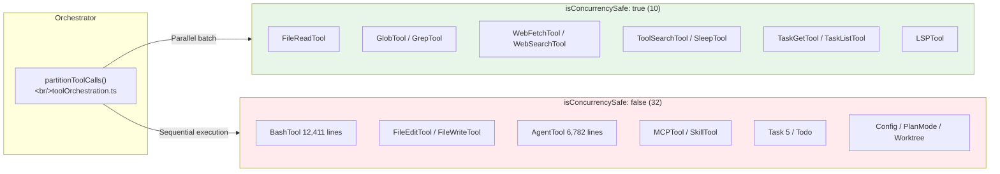
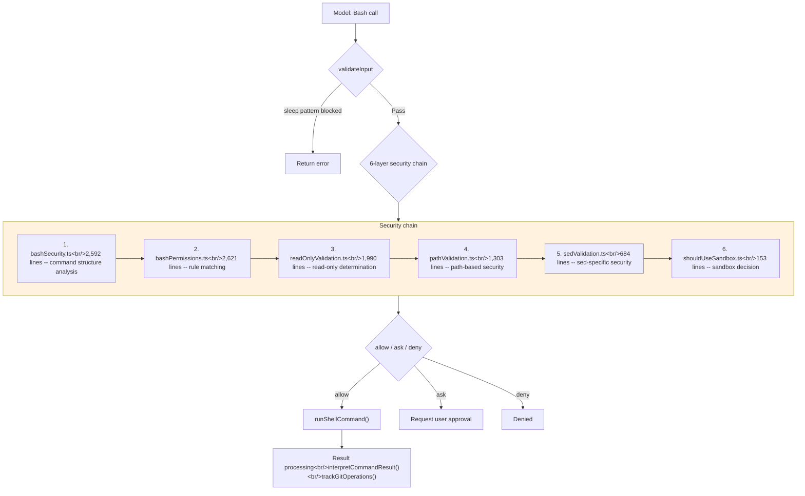

## Overview

Claude Code has 42 tools. This post dissects the "tools know themselves" pattern implemented by the 30+ member `Tool.ts` interface, classifies all 42 tools into 8 families, and deep-dives into the most complex ones: BashTool's 6-layer security chain (12,411 lines), AgentTool's 4 spawn modes (6,782 lines), FileEditTool's string matching strategy, MCPTool's empty-shell proxy pattern, and the Task state machine.

<!--more-->

## 1. Tool Interface -- "Tools Know Themselves"

`Tool.ts` (792 lines) is the contract for the tool system. The `Tool` type (Tool.ts:362-695) that every tool implements consists of **30+ members** across four domains:

| Domain | Key Members | Role |
|--------|-------------|------|
| Execution contract | `call()`, `inputSchema`, `validateInput()`, `checkPermissions()` | Core tool logic |
| Metadata | `name`, `aliases`, `searchHint`, `shouldDefer`, `maxResultSizeChars` | Search and display |
| Concurrency/Safety | `isConcurrencySafe()`, `isReadOnly()`, `isDestructive()`, `interruptBehavior()` | Orchestration decisions |
| UI rendering | `renderToolUseMessage()` + 10 more | Terminal display |

**Why so many members in one interface?** When the orchestrator (`toolExecution.ts`) calls a tool, it can read all metadata directly from the tool object without any external mapping tables. This is the foundation of a plugin architecture where adding a new tool is **self-contained within a single directory**.

### ToolUseContext -- 42 Fields of Execution Environment

`ToolUseContext` (Tool.ts:158-300) is the environment context injected during tool execution. Spanning 142 lines, it defines 42 fields:

- `abortController`: Cancellation propagation for the 3-tier concurrency model
- `getAppState()`/`setAppState()`: Global state access (permissions, todos, teams)
- `readFileState`: LRU cache-based change detection
- `contentReplacementState`: Save large results to disk, return summaries only

Tools are not isolated functions — they need access to the harness's entire state. FileReadTool uses the cache to detect changes, AgentTool registers sub-agent state, and BashTool can interrupt sibling processes.

### buildTool()'s fail-closed Defaults

`buildTool()` (Tool.ts:783) takes a `ToolDef` and returns a complete `Tool` with defaults filled in. The defaults follow a **fail-closed** principle (Tool.ts:757-768):

- `isConcurrencySafe` -> `false` (assume unsafe)
- `isReadOnly` -> `false` (assume writes)

If a new tool doesn't explicitly declare concurrency/read-only status, it takes the most conservative path (sequential execution, write permission required). **This structurally prevents the bug of accidentally running an unsafe tool in parallel.**

## 2. 42 Tools in 8 Families



| Family | Count | Representative Tool | Key Characteristic |
|--------|-------|--------------------|--------------------|
| Filesystem | 5 | FileReadTool (1,602 lines) | PDF/image/notebook support, token limits |
| Execution | 3 | BashTool (12,411 lines) | 6-layer security, command semantics |
| Agent/Team | 4 | AgentTool (6,782 lines) | 4 spawn modes, recursive harness |
| Task management | 7 | TaskUpdateTool (484 lines) | State machine, verification nudge |
| MCP/LSP | 5 | MCPTool (1,086 lines) | Empty-shell proxy |
| Web/External | 2 | WebFetchTool (1,131 lines) | Parallel safe |
| State/Config | 5 | ConfigTool (809 lines) | Session state changes |
| Infra/Utility | 11 | SkillTool (1,477 lines) | Command-to-tool bridge |

**Only 10 of 42 (24%) are parallel-safe, but these 10 are the most frequently called tools (Read, Glob, Grep, Web), so perceived parallelism is higher than the ratio suggests.**

## 3. BashTool -- 6-Layer Security Chain

BashTool is not a simple shell executor. Because **arbitrary code execution** is an inherent risk, more than half of its 12,411 lines are security layers.



Each layer handles a different threat:

1. **bashSecurity.ts** (2,592 lines): Blocks command substitution (`$()`, `` ` ``), Zsh module-based attacks. Key: **only metacharacters in unquoted contexts are classified as dangerous**
2. **bashPermissions.ts** (2,621 lines): Rule-based allow/deny/ask. `stripAllLeadingEnvVars()` + `stripSafeWrappers()` strip wrappers to extract the actual command
3. **readOnlyValidation.ts** (1,990 lines): If read-only, then `isConcurrencySafe: true` — parallel execution allowed
4. **pathValidation.ts** (1,303 lines): Per-command path extraction rules for path safety judgment
5. **sedValidation.ts** (684 lines): sed's `w` and `e` flags can write files/execute arbitrary code — blocked separately
6. **shouldUseSandbox.ts** (153 lines): Final isolation decision

**Command semantics** (`commandSemantics.ts`): `grep` and `diff` return exit code 1 as a normal result, not an error. The `COMMAND_SEMANTICS` Map defines per-command interpretation rules.

**Rust porting implications**: Either reproduce all 6 layers wholesale, or simplify to sandbox-only. Skipping intermediate layers creates security holes.

## 4. AgentTool -- 4 Spawn Modes

AgentTool is less of a "tool" and more of an **agent orchestrator**. The key: `runAgent()` recursively calls the harness's `query()` loop. Child agents receive the same tools, API access, and security checks as the parent.

| Mode | Trigger | Context Sharing | Background |
|------|---------|----------------|------------|
| Synchronous | Default | None (prompt only) | No |
| Async | `run_in_background: true` | None | Yes |
| Fork | `subagent_type` omitted | Full parent context | Yes |
| Remote | `isolation: "remote"` | None | Yes |

### Fork Sub-agents -- Byte-Identical Prefix

Forks **inherit the parent's full conversation context**. To share prompt cache, all fork children are designed to produce byte-identical API request prefixes:

- Tool use results replaced with placeholders
- `FORK_BOILERPLATE_TAG` prevents recursive forking
- Model kept identical (`model: 'inherit'`) — different models cause cache misses

### Memory System (agentMemory.ts)

Per-agent persistent memory is managed across 3 scopes:

- **user**: `~/.claude/agent-memory/<type>/` — user-global
- **project**: `.claude/agent-memory/<type>/` — project-shared (VCS)
- **local**: `.claude/agent-memory-local/<type>/` — local-only

## 5. FileEditTool -- Partial Replacement Pattern

FileEditTool (1,812 lines) performs **`old_string` -> `new_string` patches** rather than full file writes. The model doesn't need to output the entire file, saving tokens and enabling diff-based review.

Matching strategy:
1. **Exact string matching**: `fileContent.includes(searchString)`
2. **Quote normalization**: Convert curly quotes -> straight quotes and retry, with `preserveQuoteStyle()` preserving the original style
3. **Uniqueness validation**: Fails if `old_string` is not unique in the file (unless `replace_all`)

**Concurrency protection**: The `readFileState` Map stores per-file last-read timestamps. During editing, it compares against the on-disk modification time to detect external changes. This is why the "Read before Edit" rule is enforced in the prompt.

## 6. MCPTool -- Empty-Shell Proxy

MCPTool (1,086 lines) is where **a single tool definition represents hundreds of external tools**. At build time it's an empty shell; at runtime, `mcpClient.ts` clones and overrides it per server:

```typescript
// MCPTool.ts:27-51 -- core methods have "Overridden in mcpClient.ts" comments
name: 'mcp',           // replaced at runtime with 'mcp__serverName__toolName'
async call() { return { data: '' } },  // replaced at runtime with actual MCP call
```

The UI collapse classification (`classifyForCollapse.ts`, 604 lines) uses 139 SEARCH_TOOLS and 280+ READ_TOOLS names to determine whether an MCP tool is a read/search operation. Unknown tools are not collapsed (conservative approach).

## 7. Task State Machine -- Agent IPC

TaskUpdateTool (406 lines) state flow: `pending -> in_progress -> completed` or `deleted`.

Key behaviors:
- **Auto-assign owner**: Current agent name is automatically assigned on `in_progress` transition
- **Verification nudge**: After 3+ tasks completed without a verification step, recommends spawning a verification agent
- **Message routing** (SendMessageTool 917 lines): By name, `*` broadcast, `uds:path` Unix domain socket, `bridge:session` remote peer, agent ID resume

Task/SendMessage are not simple utilities but the **inter-process communication (IPC)** foundation of the multi-agent system.

## TS vs Rust Comparison

| Aspect | TS (42 tools) | Rust (10 tools) |
|--------|---------------|-----------------|
| Tool definition | `Tool` interface + `buildTool()` | `ToolSpec` struct + `mvp_tool_specs()` |
| Input schema | Zod v4 + `lazySchema()` | `serde_json::json!()` direct JSON Schema |
| Concurrency declaration | `isConcurrencySafe(parsedInput)` | None — sequential execution |
| Permission check | `checkPermissions()` -> `PermissionResult` | `PermissionMode` enum |
| UI rendering | 10+ render methods (React/Ink) | None |
| MCP integration | MCPTool + `inputJSONSchema` dual path | None |
| Size comparison | ~48,000 lines (tool code only) | ~1,300 lines (single lib.rs) |

**Key gap**: The Rust port only implements the execution contract (`call` equivalent); concurrency declarations, permission pipeline, UI rendering, and lazy-loading optimizations are all missing.

## Insights

1. **Security is a chain, not a single checkpoint** -- BashTool's 6 layers each handle different threats. bashSecurity handles command structure, bashPermissions handles rule matching, pathValidation handles path safety. If any link in this chain is missing, an attack surface opens. Combined with the fail-closed principle, the conservative strategy of "block when uncertain" permeates the entire system.

2. **Agents are recursive harness instances** -- The fact that AgentTool's `runAgent()` recursively calls the harness's `query()` loop means "agent" is not a separate system but **a different configuration of the same harness**. It swaps only the tool pool while reusing the same security, hooks, and orchestration.

3. **Only 10 of 42 tools are concurrency-safe, yet perceived parallelism is high** -- The 10 tools representing only 24% of the total (Read, Glob, Grep, Web, LSP) happen to be the most frequently called. This asymmetry demonstrates the practical value of the 3-tier concurrency model. `buildTool()`'s fail-closed default (`isConcurrencySafe: false`) forms the safety boundary, structurally preventing new tool developers from incorrectly declaring concurrency safety.

*Next post: [#4 -- Runtime Hooks: 26+ Events and CLAUDE.md 6-Stage Discovery](/posts/2026-04-06-harness-anatomy-4/)*
