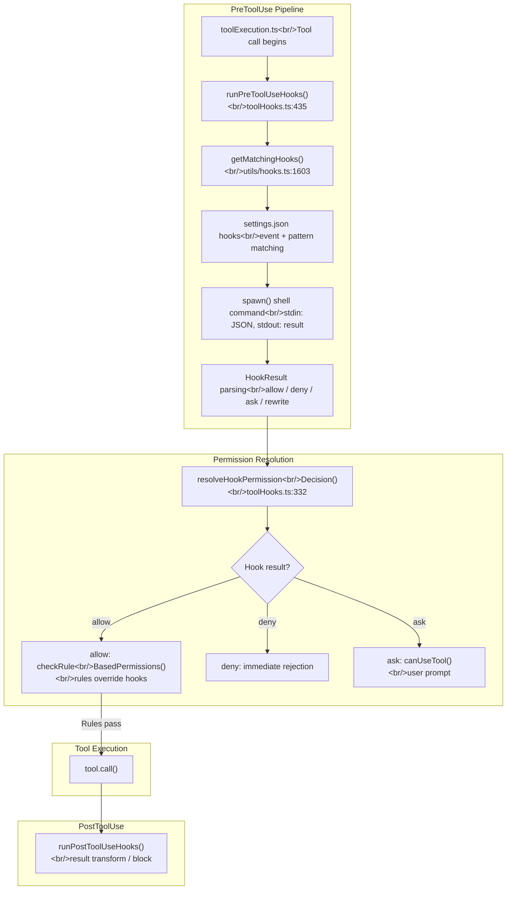
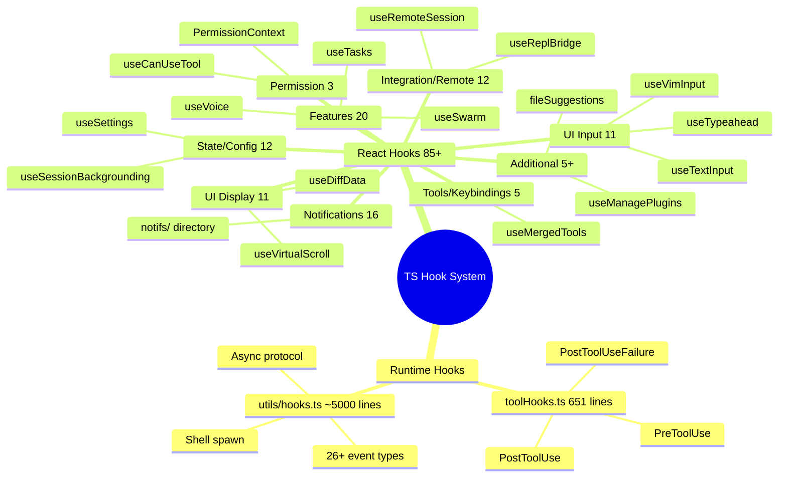

## Overview

In Claude Code, the word "hook" refers to **two completely different systems**. Runtime hooks (`toolHooks.ts` + `utils/hooks.ts`) are a security/extension pipeline that executes shell scripts before and after tool execution, while React hooks (`hooks/*.ts`, 85+) are state management code for the terminal UI. Missing this distinction leads to a 85x overestimation of the Rust reimplementation scope. This post analyzes the PreToolUse/PostToolUse pipeline of runtime hooks, the security invariant of `resolveHookPermissionDecision()`, the 9-category classification of 85 React hooks, and CLAUDE.md's 6-stage discovery with token budget management.

<!--more-->

## 1. Runtime Hooks vs React Hooks -- The Key Distinction

| Dimension | Runtime Hooks (toolHooks.ts + utils/hooks.ts) | React Hooks (hooks/*.ts) |
|-----------|----------------------------------------------|--------------------------|
| **Executor** | `child_process.spawn()` | React render cycle |
| **Configuration** | settings.json `hooks` field, shell commands | Source code `import` |
| **Execution timing** | Before/after tool use, session start, etc. (26+ events) | Component mount/update |
| **User-defined** | Yes — users register shell scripts | No — internal code |
| **Result format** | JSON stdout (allow/deny/ask/rewrite) | React state changes |
| **Rust reimplementation** | Required — core of tool execution pipeline | Not needed — TUI only |

## 2. PreToolUse Pipeline -- 7 Yield Variants

`runPreToolUseHooks()` (toolHooks.ts:435-650) is designed as an AsyncGenerator. Called before tool execution, it emits the following yield types:

1. **`message`**: Progress messages (hook start/error/cancel)
2. **`hookPermissionResult`**: allow/deny/ask decision
3. **`hookUpdatedInput`**: Input rewrite (changes input without a permission decision)
4. **`preventContinuation`**: Execution halt flag
5. **`stopReason`**: Halt reason string
6. **`additionalContext`**: Additional context to pass to the model
7. **`stop`**: Immediate halt

**Why AsyncGenerator?** Hooks execute sequentially, and each hook's result affects subsequent processing. Promise chaining returns only the final result, and event emitters lack type safety. AsyncGenerator is the only pattern that lets the caller consume each result and halt mid-stream.



### resolveHookPermissionDecision -- allow != bypass

The core invariant of `resolveHookPermissionDecision()` (toolHooks.ts:332-433): **a hook's `allow` does not bypass settings.json deny/ask rules** (toolHooks.ts:325-327).

The processing logic has 3 stages:

**Stage 1 -- allow handling** (toolHooks.ts:347-406):

```
hookResult.behavior === 'allow':
  -> Call checkRuleBasedPermissions()
  -> null -> no rules, hook allow passes
  -> deny -> rule overrides hook (security first!)
  -> ask -> user prompt required
```

**Why doesn't allow bypass?** This is a deliberate security decision. If an external shell script returning `{"decision":"allow"}` could override `settings.json` deny rules, a malicious hook could circumvent security policies. **Rules always take precedence over hooks.**

**Stage 2 -- deny** (toolHooks.ts:408-411): Immediate rejection, no further checks.

**Stage 3 -- ask/none** (toolHooks.ts:413-432): Calls `canUseTool()` for user prompt.

### 26+ Event Types

`getMatchingHooks()` (utils/hooks.ts:1603-1682) handles hook matching:

- **Tool events**: PreToolUse, PostToolUse, PostToolUseFailure, PermissionRequest, PermissionDenied
- **Session events**: SessionStart, SessionEnd, Setup
- **Agent events**: SubagentStart, SubagentStop, TeammateIdle
- **Task events**: TaskCreated, TaskCompleted
- **System events**: Notification, ConfigChange, FileChanged, InstructionsLoaded
- **Compact events**: PreCompact, PostCompact
- **Input events**: UserPromptSubmit, Elicitation, ElicitationResult
- **Stop events**: Stop, StopFailure

Matched hooks execute **sequentially**, and if one denies, subsequent hooks are not executed.

## 3. 85 React Hooks -- 9 Category Classification



| Category | Count | Rust Reimpl | Representative Hook |
|----------|-------|-------------|---------------------|
| Permission | 3 | Partial (bridge) | `useCanUseTool` (203 lines) |
| UI Input | 11 | Not needed | `useTextInput` (529 lines), `useVimInput` (316 lines) |
| UI Display | 11 | Not needed | `useVirtualScroll` (721 lines) |
| State/Config | 12 | Not needed | `useSessionBackgrounding` (158 lines) |
| Integration/Remote | 12 | Not needed | `useRemoteSession` (605 lines) |
| Features/Notifications | 20 | Not needed | `useVoice` (1,144 lines) |
| Notifications/Banners | 16 | Not needed | `notifs/` directory |
| Tools/Keybindings | 5 | Not needed | `useMergedTools` (44 lines) |
| Additional | 5+ | Not needed | `fileSuggestions` (811 lines) |

**Key takeaway**: What Rust needs to reimplement is only the runtime pipeline of `toolHooks.ts` (651 lines) + `utils/hooks.ts` (~5,000 lines). The 85 React hooks totaling 15,000+ lines are out of scope.

## 4. CLAUDE.md 6-Stage Discovery

`getMemoryFiles()` in `claudemd.ts` (1,479 lines, L790-1074) loads CLAUDE.md through a 6-stage hierarchy:

| Stage | Source | Path Example | Priority |
|-------|--------|-------------|----------|
| 1. Managed | Org policy | `/etc/claude-code/CLAUDE.md` | Lowest |
| 2. User | Personal habits | `~/.claude/CLAUDE.md`, `~/.claude/rules/*.md` | |
| 3. Project | Project rules | `CLAUDE.md` and `.claude/rules/*.md` from cwd to root | |
| 4. Local | Local overrides | `CLAUDE.local.md` (gitignored) | |
| 5. AutoMem | Auto memory | `MEMORY.md` entrypoint | |
| 6. TeamMem | Team memory | Cross-org sync | Highest |

**Why this order?** The file comment (L9) states explicitly: "Files are loaded in reverse order of priority." LLMs pay more attention to later parts of the prompt, so the most specific instructions (Local > Project > User > Managed) are **placed last**. This is not CSS specificity — it's a design that leverages **LLM attention bias**.

### Upward Directory Traversal and Deduplication

Starting from `originalCwd`, it walks up to the filesystem root, then calls `dirs.reverse()` to process **from root downward** (L851-857). In monorepos, the parent `CLAUDE.md` loads first and the child project's `CLAUDE.md` layers on top.

**Worktree deduplication** (L868-884): When a git worktree is nested inside the main repo, an `isNestedWorktree` check prevents the same `CLAUDE.md` from being loaded twice.

**@include directive** (L451-535): Lexes markdown tokens to ignore `@path` inside code blocks, recursively resolving only `@path` in text nodes. Maximum depth of 5.

## 5. System/User Context Separation -- dual-memoize Cache

`context.ts` (189 lines) separates the system prompt into **two independent contexts**:

1. **`getSystemContext()`** (L116): Git state, cache breaker
2. **`getUserContext()`** (L155): CLAUDE.md merged string, current date

**Why split into two?** Because of the Anthropic API's prompt caching strategy. Git state (session-fixed) and CLAUDE.md (invalidated only on file changes) have different cache lifetimes, so `cache_control` must be applied differently. Both functions are wrapped in `memoize` and execute only once per session.

### 3 Cache Invalidation Paths

1. `setSystemPromptInjection()` (context.ts:29): Clears both caches
2. `clearMemoryFileCaches()` (claudemd.ts:1119): Clears memory files only
3. `resetGetMemoryFilesCache()` (claudemd.ts:1124): Clears memory files + fires `InstructionsLoaded` hook

This separation distinguishes between worktree switches (no reload needed) and actual reloads (after compaction).

## 6. Token Budget -- Response Continuation Decisions

`checkTokenBudget()` in `tokenBudget.ts` (93 lines) controls **whether to continue responding, not prompt size**:

```
COMPLETION_THRESHOLD = 0.9  -- continue if below 90%
DIMINISHING_THRESHOLD = 500 -- 3+ consecutive turns, <500 tokens each -> diminishing returns

if (!isDiminishing && turnTokens < budget * 0.9) -> continue
if (isDiminishing || continuationCount > 0) -> stop with event
else -> stop without event
```

**Why 0.9?** Models tend to start summarizing near the budget limit. Stopping at 90% prevents "wrapping up" summaries and keeps the work going. The `nudgeMessage` explicitly instructs "do not summarize."

Diminishing returns detection prevents the model from falling into repetitive patterns. **Sub-agents stop immediately** (L51) — they don't have their own budgets.

## Rust Comparison

| Aspect | TS | Rust |
|--------|-----|------|
| Hook event types | 26+ | PreToolUse, PostToolUse (2 only) |
| Hook execution | Async AsyncGenerator | Synchronous `Command::output()` |
| Hook results | 7 yield variants + JSON | Allow/Deny/Warn (3 via exit code) |
| Input modification | `hookUpdatedInput` | Not possible |
| allow != bypass | Guaranteed | Not implemented (security vulnerability) |
| CLAUDE.md | 6-stage discovery | 4 candidates per dir |
| @include | Recursive, depth 5 | Not supported |
| Token budget | `checkTokenBudget()` with 3 decisions | None |
| Prompt cache | memoize + 3 invalidation paths | Rebuilt every time |

## Insights

1. **The dual meaning of "hook" is the biggest source of architectural confusion** -- The 85 React hooks are not in scope for Rust reimplementation. Only the runtime hooks (~5,600 lines) are porting targets. However, this runtime engine includes 26 event types, an async protocol (`{"async":true}` background switching), and prompt requests (bidirectional stdin/stdout). Precisely scoping the meaning of "hooks" is the starting point for accurate estimation.

2. **CLAUDE.md's "last is strongest" pattern is deliberate exploitation of LLM attention bias** -- In the 6-stage hierarchical loading (Managed -> User -> Project -> Local -> AutoMem -> TeamMem), the most specific instructions are placed at the end of the prompt for maximum influence. This design emerges at the intersection of **API prompt cache hit-rate optimization + LLM behavioral characteristics**, not from architectural tidiness.

3. **The "allow != bypass" invariant in `resolveHookPermissionDecision()` is the security cornerstone** -- The current Rust hooks.rs judges allow/deny solely by exit code. Without implementing JSON result parsing and the subsequent `checkRuleBasedPermissions` check, a malicious hook could bypass deny rules — a security vulnerability. Clearly delineating the boundary between automation convenience and security policy is the fundamental challenge of the hook system.

*Next post: [#5 -- MCP Services and the Plugin-Skill Extension Ecosystem](/posts/2026-04-06-harness-anatomy-5/)*
