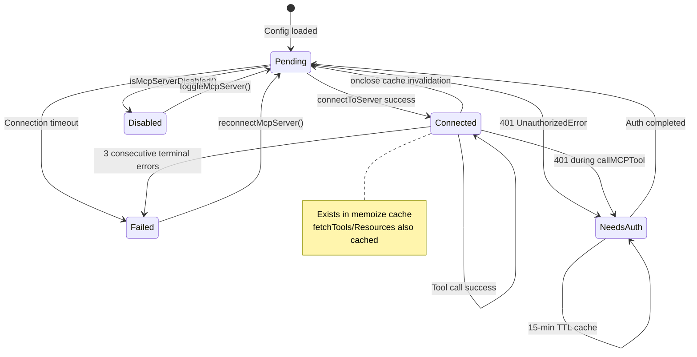
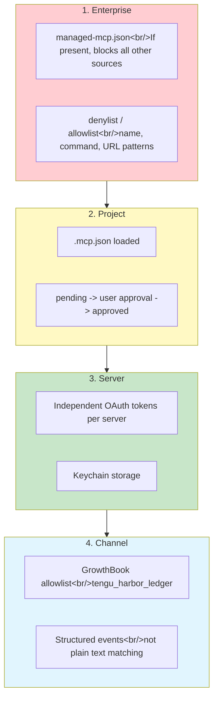
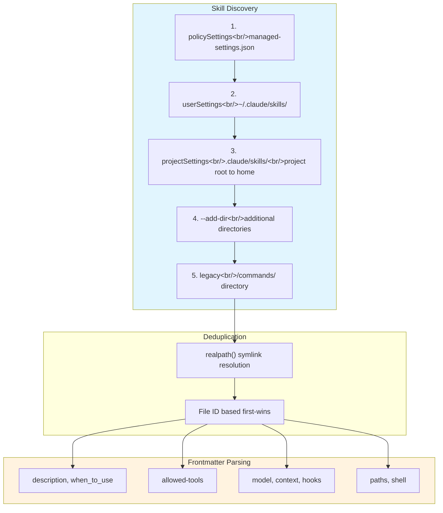

## Overview

Beyond its 42 built-in tools, Claude Code can extend with unlimited external tools via MCP (Model Context Protocol). This post analyzes the connection management architecture of `client.ts` (3,348 lines), the OAuth authentication system of `auth.ts` (2,465 lines), the 4-layer security model, and config deduplication. We then dissect the structural differences between plugins and skills, the 5-layer skill discovery engine, and the circular reference resolution pattern in `mcpSkillBuilders.ts`.

<!--more-->

## 1. MCP Client -- Connection Management Is Harder Than the Protocol

### Memoization-Based Connection Pool

`connectToServer` is wrapped with `lodash.memoize`. The cache key is `name + JSON(config)`. Since MCP servers are stateful (stdio processes, WebSocket connections), creating a new connection for every tool call would be catastrophically bad for performance.

- `onclose` handler invalidates the cache -> next call automatically reconnects
- `fetchToolsForClient` and `fetchResourcesForClient` each have their own LRU cache (20 entries)

### Tool Proxy Pattern

MCP tools are converted to native `Tool` interfaces:

- `name`: Format `mcp__<normalized_server>__<normalized_tool>`
- `call()`: `ensureConnectedClient` -> `callMCPToolWithUrlElicitationRetry` -> `callMCPTool`
- `checkPermissions()`: Always `passthrough` — MCP tools use a separate permission system
- `annotations`: Maps MCP annotations like `readOnlyHint`, `destructiveHint`

**URL Elicitation Retry**: OAuth-based MCP servers can require authentication mid-tool-call (error code -32042). A retry loop shows the user the URL, waits for authentication to complete, and retries.

### Connection State Machine and 3-Strike Terminal Error

**3-strike rule**: 3 consecutive terminal errors force a transition to `Failed` state. This prevents endlessly retrying against dead servers.

**15-minute needs-auth cache**: Retrying a server that returned 401 every time would cause 30+ connectors to fire simultaneous network requests. The TTL cache prevents unnecessary retries.

## 2. OAuth -- The Reality of 2,465 Lines

The reason `auth.ts` is 2,465 lines is that **real-world OAuth servers don't consistently implement the RFCs**:

| Component | Description |
|-----------|-------------|
| RFC 9728 + 8414 discovery | Server can run AS on a separate host -> discover AS URL via PRM |
| PKCE | Public client — code_verifier/code_challenge required |
| XAA (Cross-App Access) | Exchange IdP id_token for access_token at the MCP server's AS |
| Non-standard error normalization | Slack returns HTTP 200 with `{"error":"invalid_grant"}` |
| Keychain storage | macOS Keychain integration (`getSecureStorage()`) |

Rust porting implications: OAuth is not an SDK dependency but a **complex async state machine**. Discovery (2 stages) -> PKCE -> callback server -> token storage -> refresh -> revocation -> XAA. Porting the whole thing is impractical, so starting with stdio MCP + API key authentication is realistic.

## 3. 4-Layer Security Model

MCP security is not a single gate but a **composition of trust levels**:

Each layer operates independently, and **Enterprise takes highest priority**. Even if `.mcp.json` exists in the project, it's blocked if it hits the enterprise denylist.

### Config Sources and Deduplication (config.ts 1,578 lines)

Config source priority (higher wins):

1. Enterprise managed (`managed-mcp.json`)
2. Local (per-user project settings)
3. User (global `~/.claude.json`)
4. Project (`.mcp.json`)
5. Plugin (dynamic)
6. claude.ai connectors (lowest)

**Why is deduplication needed?** The same MCP server can exist in both `.mcp.json` and claude.ai connectors. `getMcpServerSignature` creates `stdio:[command|args]` or `url:<base>` signatures, unwrapping CCR proxy URLs to original vendor URLs before comparison.

Environment variable expansion: Supports `${VAR}` and `${VAR:-default}` syntax. Missing variables are reported as warnings rather than errors to prevent partial connection failures.

## 4. Plugins vs Skills -- Structural Differences

| Dimension | Skills | Plugins |
|-----------|--------|---------|
| **Essence** | Prompt extension (SKILL.md = text) | System extension (skills + hooks + MCP) |
| **Installation** | Drop a single file | Marketplace git clone |
| **Runtime code** | None (pure text) | Yes (MCP servers, hook scripts) |
| **Toggle** | Implicit (file existence) | Explicit (`/plugin` UI) |
| **ID scheme** | File path | `{name}@builtin` or `{name}@marketplace` |

Skills are the embodiment of the "file = extension" principle. A single `SKILL.md` works as an extension immediately without installation or building.

### Plugin Service Separation of Concerns

| File | Role | Side Effects |
|------|------|--------------|
| `pluginOperations.ts` | Pure library functions | None |
| `pluginCliCommands.ts` | CLI wrappers | `process.exit`, console output |
| `PluginInstallationManager.ts` | Background coordinator | AppState updates |

The pure functions in `pluginOperations` are reused by both CLI and interactive UI.

**Marketplace coordination**: `diffMarketplaces()` compares declared marketplaces against actual installations. New installs trigger auto-refresh; existing updates only set a `needsRefresh` flag. New installs need auto-refresh to prevent "plugin not found" errors, while updates let users choose when to apply.

## 5. 5-Layer Skill Discovery Engine

Loading source priority in `loadSkillsDir.ts` (1,086 lines):

### Frontmatter System

15+ fields are extracted from `SKILL.md`'s YAML frontmatter:

- `description`, `when_to_use`: Used by the model for skill selection
- `allowed-tools`: List of tools permitted during skill execution
- `model`: Force a specific model
- `context: fork`: Execute in a separate context
- `hooks`: Skill-specific hook configuration
- `paths`: Path-based activation filter
- `shell`: Inline shell command execution

### Lazy Disk Extraction of Bundled Skills

17 bundled skills compiled into the CLI binary (`skills/bundled/`) are **extracted to disk on first invocation** if they have a `files` field:

- `O_NOFOLLOW | O_EXCL` flags prevent symlink attacks
- `0o600` permissions restrict access
- `resolveSkillFilePath()` rejects `..` paths to prevent directory escape

**Why extract to disk?** So the model can read reference files using the `Read`/`Grep` tools. Keeping them only in memory would make them inaccessible to the model.

### mcpSkillBuilders -- A 44-Line Circular Reference Solution

`mcpSkillBuilders.ts` (44 lines) is small but architecturally significant.

**Problem**: `mcpSkills.ts` needs functions from `loadSkillsDir.ts`, but a direct import creates a circular reference (`client.ts -> mcpSkills.ts -> loadSkillsDir.ts -> ... -> client.ts`).

**Solution**: A write-once registry. `loadSkillsDir.ts` registers functions at module initialization time, and `mcpSkills.ts` retrieves them when needed. Dynamic imports fail in the Bun bundler, and literal dynamic imports trigger dependency-cruiser's circular dependency check, making **this approach the only viable solution**.

Leaf modules in the dependency graph import only types, and runtime registration happens exactly once at startup.

## Rust Comparison

| Area | TS (Complete) | Rust (Current) |
|------|---------------|----------------|
| Name normalization | `normalization.ts` | `mcp.rs` — same logic |
| Server signature | `getMcpServerSignature` | `mcp_server_signature` — includes CCR proxy unwrap |
| stdio JSON-RPC | SDK-dependent | `mcp_stdio.rs` — direct implementation (initialize, tools/list, tools/call) |
| OAuth | 2,465-line full implementation | None — types only |
| Connection management | memoize + onclose reconnection | None |
| Skill loading | 5-layer + 15-field frontmatter | 2 directories, SKILL.md only |
| Bundled skills | 17 built-in | None |
| Plugins | Built-in + marketplace | None |
| Security | 4-layer (Enterprise->Channel) | None |

**Key gap**: Rust has implemented bootstrap (config -> transport) and stdio JSON-RPC. The SDK-less JSON-RPC implementation in `mcp_stdio.rs` is meaningful progress. However, OAuth, connection lifecycle, channel security, and the full skill discovery system are all absent.

## Insights

1. **MCP is not a "protocol" but an "integration framework"** -- What `client.ts`'s 3,348 lines tell us is that the hard part is not JSON-RPC but **connection lifecycle management**. Memoization, auto-reconnect, session expiry detection, 401 retry, 3-strike terminal errors, needs-auth caching. External processes (stdio) and remote services (HTTP/SSE) die unpredictably, OAuth tokens expire, and networks drop. This is code that reflects the reality that "connect once and done" doesn't exist.

2. **Skills embody the "file = extension" principle** -- A single SKILL.md works as an extension immediately without installation or building. This simplicity, combined with incremental complexity via frontmatter (model specification, hooks, path filters), accommodates both beginners and power users. Plugins are the organizational layer above skills, packaging "skills + hooks + MCP servers" together.

3. **`mcpSkillBuilders.ts` is a 44-line architecture lesson** -- The only solution that simultaneously satisfies Bun bundler's dynamic import constraints and dependency-cruiser's circular dependency check was a "write-once registry." The pattern where leaf modules import only types and runtime registration happens once at startup is a broadly applicable approach to resolving circular references in complex module systems — worth remembering.

*Next post: [#6 -- Beyond Claude Code: A Retrospective on Building an Independent 7-Crate Harness](/posts/2026-04-06-harness-anatomy-6/)*
