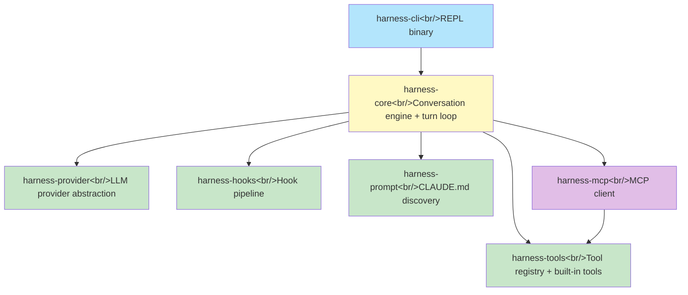
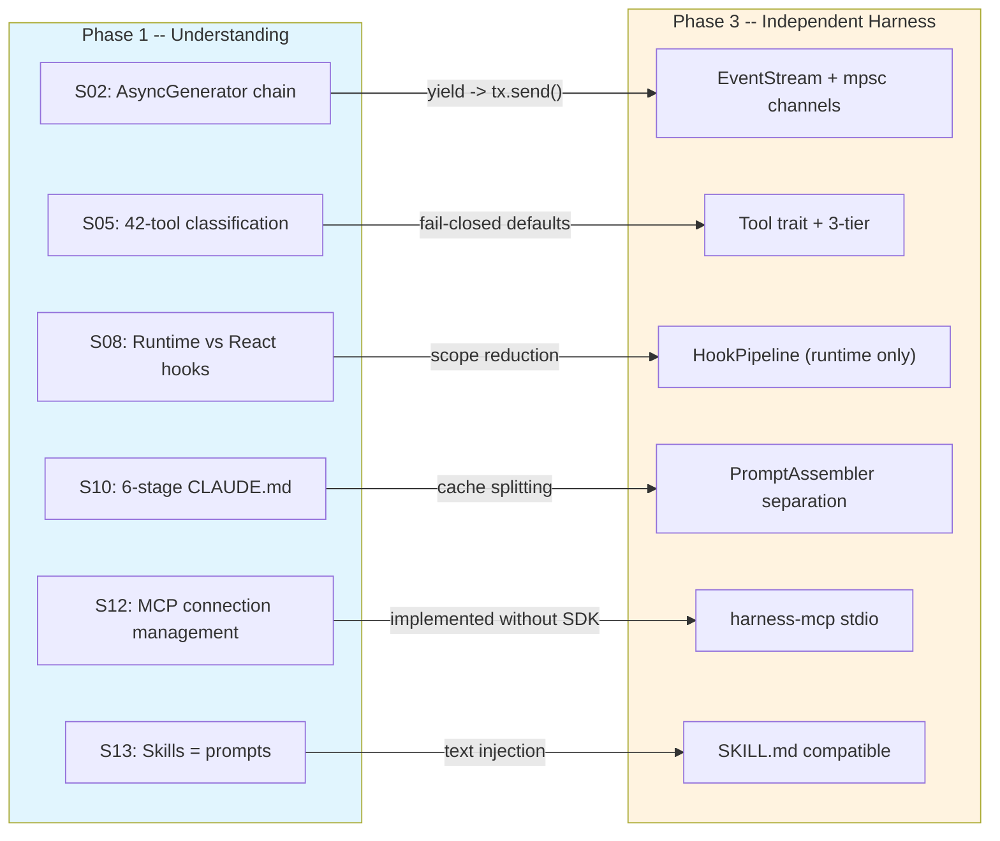

## Overview

This is the final post in the series that systematically dissected Claude Code's TypeScript source across 27 sessions. In Phase 1 we understood the architecture of 100k+ lines of TS code, in Phase 2 we reimplemented core patterns in Rust, and in Phase 3 we designed and built an independent agent harness that overcomes the 8 limitations we discovered. This post covers the limitation analysis, 5 design principles, 7-crate architecture, 61 tests, and a full retrospective of the journey.

<!--more-->

## 1. 8 Limitations of Claude Code's Architecture

From 27 sessions of analysis, we distinguished strengths from limitations. The strengths (AsyncGenerator pipeline, 3-tier concurrency, hook extensibility, CLAUDE.md discovery, MCP support, self-contained tool interface, 7-path error recovery) represent excellent design. However, the following 8 limitations motivated the independent harness:

| # | Limitation | Source Session | Impact |
|---|-----------|---------------|--------|
| 1 | React/Ink dependency — heavy TUI | S08 | Unnecessary dependency in headless mode |
| 2 | Single provider (effectively Anthropic-only) | S01 | Cannot use OpenAI or local models |
| 3 | main.tsx 4,683-line monolith | S01 | CLI/REPL/session mixed in one file |
| 4 | Synchronous tool execution (Rust port) | S03 | No streaming pipelining |
| 5 | TS ecosystem-locked plugins | S13 | No language-neutral extensions |
| 6 | 85 React hooks mixing UI/runtime | S08 | Dual meaning of "hook" |
| 7 | Implicit prompt caching dependencies | S10 | 3 cache invalidation paths are implicit |
| 8 | MCP OAuth 2,465-line complexity | S12 | RFC inconsistency is the root cause |

## 2. 5 Design Principles

We established 5 core principles to overcome these limitations:

**Principle 1 -- Multi-provider**: Support Anthropic, OpenAI, and local models (Ollama) through a single abstraction.

```rust
#[async_trait]
pub trait Provider: Send + Sync {
    async fn stream(&self, request: ProviderRequest)
        -> Result<EventStream, ProviderError>;
    fn available_models(&self) -> &[ModelInfo];
    fn name(&self) -> &str;
}
```

`ProviderRequest` is a provider-neutral struct that each implementation converts to its own API format.

**Principle 2 -- Native async**: Fully async based on tokio. `yield` -> `tx.send()`, `yield*` -> channel forwarding replaces the AsyncGenerator pattern.

**Principle 3 -- Module separation**: Conversation engine, tools, hooks, and prompts are each separate crates. No repeating the `main.tsx` monolith.

**Principle 4 -- Language-neutral extensions**: SKILL.md compatibility + MCP servers as plugin units.

**Principle 5 -- Full MCP utilization**: Leveraging not just tools but resources, prompts, and sampling across the full spec.

## 3. 7-Crate Architecture



**Core design**: Only `harness-core` depends on other crates. The rest are independent of each other (except `harness-mcp` -> `harness-tools`). This structure enables:

- Independent `cargo test` for each crate
- No `harness-core` changes needed when adding providers
- MCP tools implementing the same `Tool` trait as built-in tools

| Crate | Core Responsibility | Test Count |
|-------|-------------------|------------|
| `harness-provider` | LLM API calls, SSE parsing, retries | 11 |
| `harness-tools` | Tool registry, 3-tier concurrency | 12 |
| `harness-hooks` | Shell hook execution, deny short-circuit, rewrite chain | 9 |
| `harness-prompt` | 6-stage CLAUDE.md, SHA-256 deduplication | 9 |
| `harness-core` | Conversation engine, `StreamingToolExecutor` | 6 |
| `harness-mcp` | JSON-RPC, stdio transport | 14 |
| `harness-cli` | REPL binary | -- |

### Provider Trait -- Multi-Provider

The existing Rust port's `ApiClient` trait was Anthropic-specific (`ApiRequest` with Anthropic fields). The `Provider` trait accepts a provider-neutral `ProviderRequest` that each implementation converts to its own API format. `Box<dyn Provider>` enables runtime fallback chains.

### ConversationEngine -- Turn Loop

```rust
pub struct ConversationEngine {
    session: Session,
    provider: Box<dyn Provider>,
    tool_executor: StreamingToolExecutor,
    hook_pipeline: HookPipeline,
    prompt_builder: PromptBuilder,
    budget: TokenBudget,
}
```

Instead of the existing Rust port's `ConversationRuntime<C, T>` generic pattern, we use trait objects. The provider must be swappable at runtime (model fallback), and generics fix the type at compile time, lacking flexibility.

### Streaming Tool Execution (Pipelining)

We solved the biggest constraint of the existing Rust port — "collect all SSE events then execute tools":

1. When a `ContentBlockStop(ToolUse)` event arrives from `EventStream`, forward immediately
2. After `is_concurrency_safe()` check, parallel processing via `tokio::spawn`
3. Tool execution proceeds while the API is still streaming

## 4. Phase 2 Retrospective -- Extending the Existing Port

Before Phase 3's independent harness, we extended the existing `rust/` prototype in Phase 2:

| Sprint | Achievement | Core Pattern |
|--------|------------|--------------|
| S14-S15 | Orchestration module + 3-tier concurrency | `tokio::JoinSet`-based parallel execution |
| S16-S17 | Tool expansion (19 -> 26) | Added Task, PlanMode, AskUser |
| S18-S19 | Hook execution pipeline | stdin JSON, deny short-circuit |
| S20-S21 | Skill discovery | `.claude/skills/` scan, prompt injection |

Most of Phase 2's code was rewritten in Phase 3. However, the **questions discovered during prototyping** ("Why AsyncGenerator?", "Why should tools be unaware of the UI?") determined the final design.

## 5. 61 Tests and the MockProvider Pattern

All crates are independently testable. `MockProvider` enables verifying the conversation engine's full turn loop without actual API calls:

```
harness-provider: 11 tests (SSE parsing, retries, streams)
harness-tools:    12 tests (registry, concurrency, execution)
harness-hooks:     9 tests (deny short-circuit, rewrite chain, timeouts)
harness-prompt:    9 tests (6-stage discovery, hash deduplication)
harness-core:      6 tests (turn loop, tool calls, max iterations)
harness-mcp:      14 tests (JSON-RPC, initialization, tool listing)
```

## 6. How Phase 1-2 Lessons Shaped the Design



| Lesson | Source | Design Impact |
|--------|--------|--------------|
| `StreamingToolExecutor` 4-stage state machine | S03 | Async implementation in `harness-core` |
| `QueryDeps` callback DI's type safety limits | S03 | Trait object DI |
| 6-layer Bash security chain | S06 | `check_permissions()` + hook separation |
| Agent = recursive harness instance | S06 | `ConversationEngine` reuse |
| `ApiClient` sync trait blocks pipelining | S03 | `Provider` async trait |
| Deny short-circuit + Rewrite chaining | S09 | Identical pattern in `HookPipeline` |
| SHA-256 content hash outperforms path hash | S11 | Content hash in `harness-prompt` |

## 7. Top 10 Architecture Patterns Learned

Core architecture patterns extracted from 27 sessions:

1. **AsyncGenerator/Stream pipeline**: The core abstraction for streaming LLM responses
2. **3-tier tool concurrency**: ReadOnly/Write/Dangerous classification balances safety and performance
3. **ToolSpec + ToolResult duality**: Separating metadata (for LLM) from execution results
4. **Hook chain execution**: Deny short-circuit, rewrite chain, independent post-hook transforms
5. **6-stage prompt discovery**: Managed -> user -> project -> local overrides
6. **MCP adapter pattern**: Unifying external protocol tools into the internal Tool trait
7. **Provider abstraction**: Swapping Anthropic/OpenAI behind the same interface
8. **SSE incremental parsing**: Assembling network chunks into event frames
9. **MockProvider testing**: Verifying engine behavior with predefined event sequences
10. **Skills = prompts**: Text injection sufficient instead of complex plugin systems

## 8. Full Journey Retrospective

| Phase | Sessions | Key Deliverables |
|-------|----------|------------------|
| Phase 1 -- Understanding | S00-S13 | 14 analysis documents, Rust prototype |
| Phase 2 -- Reimplementation | S14-S21 | Orchestration, 26 tools, hooks, skills |
| Phase 3 -- Independent Harness | S22-S27 | 7-crate workspace, 61+ tests |

Claude Code is a **prompt engineering runtime**. The core loop assembles messages, the tool system grants the ability to interact with the world, and the permission system sets boundaries. CLAUDE.md injects context, MCP integrates external systems, hooks and agents enable automation/delegation, and plugins/skills transform it into a user extension platform.

### Future Directions

- True streaming: Processing SSE byte streams chunk by chunk
- Permission system: Per-tool user approval workflows
- MCP SSE transport: HTTP SSE support beyond stdio
- Token budget integration: Automatic context window budget management
- Multi-turn agent mode: Autonomous iteration + breakpoint system

## Insights

1. **Good abstractions emerge at boundaries** -- Provider trait, Tool trait, HookRunner trait. Every core abstraction is a trait defining module boundaries. The existing Rust port's `ConversationRuntime<C, T>` generics provide strong compile-time guarantees but had limitations for scenarios like swapping providers at runtime or dynamically registering MCP tools. `Box<dyn Provider>` + `Box<dyn Tool>` trait objects buy runtime flexibility at a minor vtable cost. Relative to LLM API latency (hundreds of ms to seconds), the vtable overhead is immeasurable.

2. **The value of prototypes lies in questions, not code** -- Most of Phase 1-2's prototype code was rewritten in Phase 3. But questions like "Why AsyncGenerator?", "Why should tools be unaware of UI?", and "Why doesn't allow bypass?" determined the final design. The act of reading 100k lines of code is not the answer itself — the **design intent (the why)** discovered during reading is the true deliverable.

3. **Most of the TS code's complexity is defensive lines** -- Permission layers, frontmatter parsing, deduplication, symlink prevention. These aren't features — they're defenses. Rust can guarantee some of this at compile time through its type system and ownership model, but runtime policies like filesystem security and user config precedence must be implemented explicitly. The 27 sessions were the process of mapping these defensive lines, and that map guided the independent harness's design.

*Series complete. The full analysis documents are available at the [claw-code repository](https://github.com/lsr/claw-code).*
