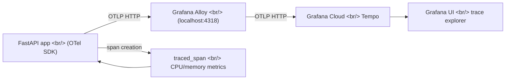

## Overview

In [the previous post (Dev Log #8)](/ko/posts/2026-04-03-hybrid-search-dev8/) I covered the S3 migration for tone/angle images, EC2 deployment fixes, and hex color extraction. This time I stepped back from feature work to focus on observability.

The goal was to instrument the FastAPI server with OpenTelemetry, trace every stage of the search and generation pipelines, and ship those traces to Grafana Cloud via Grafana Alloy running on EC2. The work spanned two days, and the contrast between them was stark: Day 1 was a clean implementation sprint; Day 2 was a wall of integration debugging.

<!--more-->

## Architecture — Trace Collection Path

Here's how traces flow from the application to Grafana Cloud.



Three components make this work. The OTel SDK inside the app creates spans. Grafana Alloy on EC2 receives OTLP and batches it. Grafana Cloud Tempo stores and serves the traces.

## Day 1 — Clean Initial Implementation

The first day went smoothly. I added the OpenTelemetry packages, created a telemetry module, wired it into the app lifespan, and inserted spans into both pipelines.

### Telemetry Module Structure

```python
# telemetry.py — Provider configured at import time
_resource = Resource.create({
    "service.name": "hybrid-image-search",
    "deployment.environment": _environment,
})
_provider = TracerProvider(resource=_resource)
_exporter = OTLPSpanExporter(endpoint=f"{_endpoint}/v1/traces")
_provider.add_span_processor(SimpleSpanProcessor(_exporter))
trace.set_tracer_provider(_provider)
tracer = trace.get_tracer("hybrid-image-search")
```

The provider is set at module level because uvicorn binds the ASGI app immediately after importing the module. If `FastAPIInstrumentor` doesn't find a valid provider at that point, it caches a no-op tracer and instrumentation silently does nothing.

### Pipeline Spans

The search pipeline got spans for embedding generation, vector search, and re-ranking. The generation pipeline got spans for reference injection (`generation.injection`), prompt building (`generation.prompt_build`), and the Gemini API call (`generation.gemini_api`).

I also added database indices preemptively, before they showed up as bottlenecks in the trace data.

## Day 2 — Reality Check

After installing Grafana Alloy on EC2 and configuring the Grafana Cloud connection, zero traces appeared. What followed was a chain of six consecutive fix commits.

### Issue 1: TracerProvider Initialization Timing

`TracerProvider` wasn't set before uvicorn loaded the app, so `FastAPIInstrumentor` latched onto the default no-op provider. Fix: configure the provider at import time, before any app code runs.

### Issue 2: BatchSpanProcessor Async Flush

Under `uv run`, the process exits quickly enough that `BatchSpanProcessor`'s background thread never gets a chance to flush. Fix: switch to `SimpleSpanProcessor` for synchronous export on span creation.

### Issue 3: Silent gRPC Exporter Failure

The gRPC exporter swallowed connection failures without logging. Fix: switch to the OTLP HTTP exporter. HTTP returns clear status codes and error messages, and it connects directly to Alloy's default port (4318).

### Issue 4: Telemetry Init Crashing the App

Any exception during OTel initialization took down the entire application. Fix: wrap init in `try/except` so telemetry failures degrade gracefully instead of preventing startup.

### Issue 5: FastAPIInstrumentor Missing the Provider

`FastAPIInstrumentor().instrument()` sometimes failed to discover the global provider. Fix: pass `tracer_provider` explicitly.

### Issue 6: Module Import Ordering

The `app = FastAPI()` call and the instrumentation call in `main.py` had ordering issues. Fix: move `FastAPIInstrumentor` to module level, immediately after app creation.

## Grafana Alloy Configuration

The Alloy config deployed to EC2 is minimal.

```
otelcol.receiver.otlp "default" {
  grpc { endpoint = "127.0.0.1:4317" }
  http { endpoint = "127.0.0.1:4318" }
  output { traces = [otelcol.processor.batch.default.input] }
}
otelcol.processor.batch "default" {
  timeout = "5s"
  output { traces = [otelcol.exporter.otlphttp.grafana_cloud.input] }
}
otelcol.exporter.otlphttp "grafana_cloud" {
  client {
    endpoint = env("GRAFANA_OTLP_ENDPOINT")
    auth     = otelcol.auth.basic.grafana_cloud.handler
  }
}
otelcol.auth.basic "grafana_cloud" {
  username = env("GRAFANA_INSTANCE_ID")
  password = env("GRAFANA_API_TOKEN")
}
```

The app sends OTLP HTTP to localhost:4318. Alloy batches spans every 5 seconds and forwards them to Grafana Cloud Tempo. All credentials are managed through environment variables.

## traced_span — Automatic CPU/Memory Metrics

The final piece was a `traced_span` context manager that automatically measures CPU time and memory consumption around each span.

```python
@contextmanager
def traced_span(name, **attrs):
    """Create a span with automatic CPU/memory measurement."""
    mem_before = _process.memory_info().rss
    cpu_before = _process.cpu_times()
    with tracer.start_as_current_span(name) as span:
        for k, v in attrs.items():
            span.set_attribute(k, v)
        yield span
        mem_after = _process.memory_info().rss
        cpu_after = _process.cpu_times()
        span.set_attribute("process.memory_mb",
            round(mem_after / 1024 / 1024, 1))
        span.set_attribute("process.memory_delta_kb",
            round((mem_after - mem_before) / 1024, 1))
        span.set_attribute("process.cpu_user_ms",
            round((cpu_after.user - cpu_before.user) * 1000, 1))
        span.set_attribute("process.cpu_system_ms",
            round((cpu_after.system - cpu_before.system) * 1000, 1))
```

It uses `psutil.Process` to capture RSS memory and CPU user/system time at span entry and exit. This makes it possible to see exactly how much each pipeline stage costs in Grafana. Both the search and generation pipelines were migrated to use `traced_span`.

## Commit Log

| Message | Changed files |
|---|---|
| feat: add no-text directive for injected refs and remove color palettes | `prompt.py`, `App.tsx`, `GeneratedImageDetail.tsx` |
| deps: add OpenTelemetry packages for observability | `requirements.txt` |
| feat: add telemetry module with OpenTelemetry init and tracer | `telemetry.py` |
| feat: wire OpenTelemetry init into app lifespan | `main.py` |
| feat: add OpenTelemetry spans to search pipeline stages | `search.py` |
| feat: add OpenTelemetry spans to generation pipeline | `generation.py` |
| add indices | DB migration |
| infra: add Grafana Alloy config and EC2 setup guide | `infra/alloy/config.alloy` |
| deps: move OpenTelemetry packages to pyproject.toml | `pyproject.toml` |
| fix: set OTel TracerProvider at import time | `telemetry.py` |
| fix: use SimpleSpanProcessor for reliable export under uv run | `telemetry.py` |
| fix: switch to OTLP HTTP exporter for reliable trace delivery | `telemetry.py` |
| fix: add error handling for telemetry init | `telemetry.py` |
| fix: pass tracer_provider explicitly to FastAPIInstrumentor | `main.py` |
| fix: move FastAPI instrumentation to module level in main.py | `main.py` |
| feat: add traced_span helper with CPU/memory resource metrics | `telemetry.py` |
| feat: use traced_span for CPU/memory metrics in search and generation pipelines | `search.py`, `generation.py` |

## Insights

**OTel provider setup must complete at import time.** ASGI servers like uvicorn bind routers and middleware immediately after importing the app module. If `FastAPIInstrumentor` doesn't find a valid `TracerProvider` at that moment, it caches a no-op tracer — and no amount of later configuration will fix it. Setting the provider at the top of the telemetry module prevents this entirely.

**BatchSpanProcessor is for long-lived processes only.** In short-lived contexts like `uv run` or test suites, the background flush thread never gets a chance to fire. `SimpleSpanProcessor` trades throughput for reliability, but the tradeoff is reasonable for development and small-scale production workloads.

**Start with HTTP, not gRPC.** The OTLP gRPC exporter silently absorbs connection failures, making debugging painful. The HTTP exporter returns explicit status codes and error bodies. When wiring up new infrastructure, getting HTTP working first and then switching to gRPC if needed is a more efficient debugging path.
