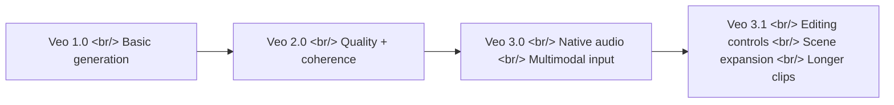
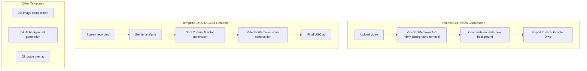

## Overview

Google's Veo model family has rapidly evolved from an experimental video generator to a full-featured production tool. Veo 3.1, released in October 2025, brings improved realism, native audio generation, and fine-grained editing controls through Vertex AI and the Flow App. Meanwhile, a practical ecosystem of background removal and composition tools has emerged around these AI-generated videos, with services like VideoBGRemover and n8n workflow templates making automated video pipelines accessible to creators and developers alike.

<!--more-->

## Veo Evolution: From 1.0 to 3.1

Google has iterated on Veo at a remarkable pace. Each version brought meaningful capability jumps rather than incremental polish.

### What Veo 3.1 Adds

- **Improved realism and physics** --- lighting, shadows, and object interactions look noticeably more natural
- **Scene coherence** --- characters and environments stay consistent across longer sequences
- **Longer clips** --- extended generation beyond previous limits
- **Scene expansion** --- extend existing footage with AI-generated continuations
- **Editing controls** --- object removal, lighting adjustments, and shadow manipulation directly in the pipeline
- **Audio upgrades** --- refined native audio generation that syncs with visual content
- **Flow App integration** --- "Ingredients to Video" and "Frames to Video" modes for different creative workflows

Veo 3.1 ships in two variants: **Standard** (higher quality, slower) and **Fast** (quicker turnaround). Both support 720p and 1080p output, and are accessible through the Vertex AI API.

## Object Removal in Vertex AI

One of the more practical features in Veo 3.1 is mask-based object removal, available through Vertex AI Studio. The workflow is straightforward:

| Step | What you do | Typical time |
|------|------------|--------------|
| Preparation | Upload video, identify objects to remove | 2--5 min |
| Masking | Draw masks over unwanted objects frame-by-frame or with tracking | 3--8 min |
| Generation | AI fills masked regions with context-appropriate background | 1--3 min |
| QA | Review output, iterate if artifacts appear | 3--6 min per pass |

Key tips for clean results:
- Mask slightly larger than the object to avoid edge artifacts
- Write explicit prompts describing what the background should look like after removal
- Google's Flow editor is gradually rolling out Add/Remove tools for a more visual workflow

## The Background Removal Ecosystem

While Veo handles generation and basic editing, dedicated background removal tools fill a specific niche: extracting subjects from video or images with alpha transparency.

### Commercial Services

**VideoBGRemover** is a cloud service focused on video:
- Per-second pricing ($4.80/min standard, down to $2.50/min at volume)
- Support for MP4, MOV, WEBM, and GIF formats
- 9 export formats including alpha-channel outputs
- Sub-5-minute processing for typical clips
- API access for programmatic integration

**withoutBG** offers an open-source background removal API with a Pro tier for higher-quality cloud processing.

### Open-Source Options

The open-source ecosystem is rich, particularly around Meta's SAM (Segment Anything Model):

- **[SAM-remove-background](https://github.com/MrSyee/SAM-remove-background)** --- extracts objects and removes backgrounds using SAM directly
- **[remback](https://github.com/duriantaco/remback)** --- fine-tunes SAM specifically for background removal tasks
- **[carvekit](https://github.com/cubantonystark/carvekit)** --- a full framework for automated high-quality background removal, wrapping multiple segmentation models
- **[remove-bg (WebGPU)](https://github.com/ducan-ne/remove-bg)** --- runs background removal directly in the browser using WebGPU, eliminating server costs entirely

The WebGPU approach is particularly interesting: it moves inference to the client GPU, meaning zero API costs and no data leaving the user's machine. For privacy-sensitive use cases or high-volume processing, this could be more practical than cloud APIs.

The RGBA output (RGB color channels plus an Alpha transparency channel) is what makes compositing possible --- you get a clean subject that can be layered over any background.

## n8n Workflow Templates for Video Automation

The most interesting development is the **videobgremover/videobgremover-n8n-templates** repository, which packages complete automation pipelines as n8n workflows:

### The UGC Ad Pipeline (Template 02)

Template 02 is particularly notable. It chains multiple AI services into a single automated flow:

1. **Input**: A screen recording of your product or app
2. **Gemini**: Analyzes the recording to understand what the product does
3. **Sora 2**: Generates a realistic AI actor presenting the product
4. **VideoBGRemover**: Removes the actor's background and composites them over the screen recording
5. **Output**: A ready-to-publish UGC-style advertisement

This is a concrete example of how orchestration tools like n8n turn individual AI capabilities into end-to-end production workflows.

## Veo vs. the Competition

Veo 3.1 competes primarily with OpenAI's Sora and other video generation models. The key differentiator is Google's integration depth --- Veo lives inside Vertex AI, which means it connects directly to other Google Cloud services, the Flow App provides a visual editing layer, and the API makes it embeddable in custom pipelines (including n8n workflows like the ones above).

Sora focuses on creative generation quality, while Veo is positioning itself as a more complete video production toolkit with editing, removal, and composition features built in.

## Quick Links

- [Veo 3.1 overview](https://www.aicloudit.com/blog/ai/google-veo-3-1-complete-guide-ai-video-model/) --- feature breakdown and comparison with other video AI models
- [Veo object removal guide](https://skywork.ai/blog/how-to-remove-objects-veo-3-1-clean-backgrounds/) --- step-by-step masking and prompt workflow in Vertex AI Studio
- [VideoBGRemover](https://videobgremover.com/ai-video/veo) --- commercial video background removal service with API
- [withoutBG](https://withoutbg.com/) --- open-source background removal with Pro API tier
- [n8n workflow templates](https://github.com/videobgremover/videobgremover-n8n-templates) --- automation templates for video composition pipelines
- [Best background removal tools 2026](https://claid.ai) --- comparison of cloud and local options
- [rembg vs Cloud API](https://ai-engine.net) --- decision guide for choosing background removal approach
- [carvekit과 rembg 비교 (Korean)](https://42morrow.tistory.com) --- Python background removal library comparison
- [RGBA explainer (Korean)](https://pyvisuall.tistory.com/87) --- brief intro to RGB vs RGBA and alpha transparency

## Takeaway

The video AI space is shifting from "generate a clip" to "produce a video." Veo 3.1 represents this with its editing controls and scene manipulation features. But the real story might be in the tooling layer --- n8n templates that chain Gemini + Sora + background removal into automated ad pipelines show where this is heading. Individual AI models are becoming components in larger production systems, and the orchestration layer is where the practical value compounds.
